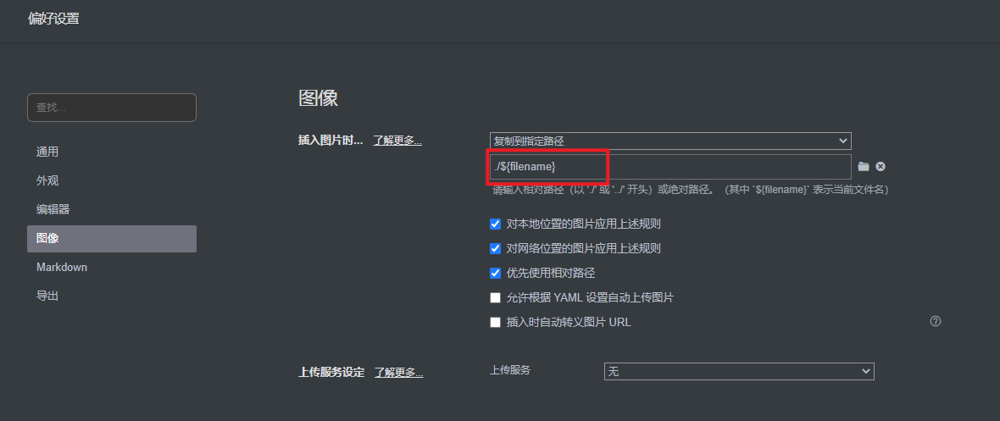

# 1. Typora设置



图片文件保存路径: `./${filename}` 即保存到与 当前正在编辑的文件名 相同的同级文件夹下。

# 2. 配置 Hexo 图片文件夹

在 Hexo 根目录打开配置文件 `_config.yml`

搜索 `post_asset_folder`，`false` 改为 `true`，并新增：

```yaml
marked:
  prependRoot: true
  postAsset: true
```

# 3. 安装插件

在Hexo 根目录下选择 `Git Bash Here`，输入 `npm install https://github.com/CodeFalling/hexo-asset-image`

# 4. 图片路径写法

在`a.md`的所在路径下有一同名文件夹`a`，里面存放一张图片`b`

## 1. 直接粘贴图片——本地显示，博客显示

``


## 2.常规 markdown 语法——本地不显示，博客不显示

``


## 3. 相对路径markdown 语法——本地显示，博客显示

``


## 4.相对路径——本地显示，博客显示

``


## 5. src相对路径——本地显示，博客显示

``


## 6. src图片——本地不显示，博客显示


## 7.插件——本地不显示，博客不显示


