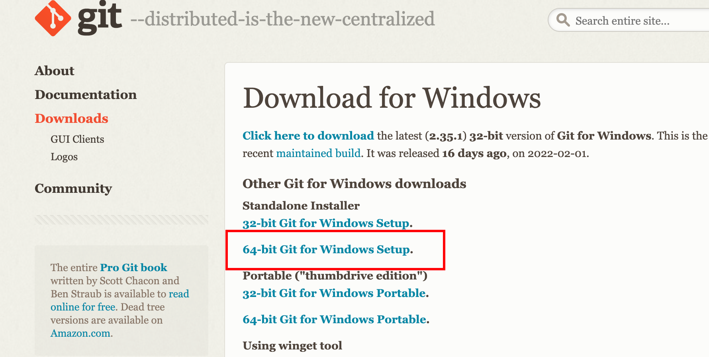
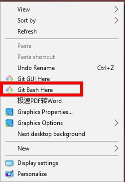
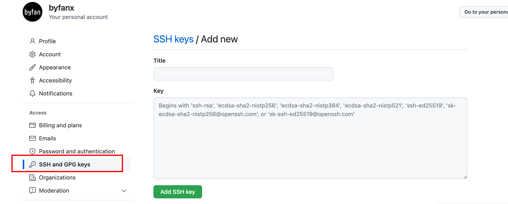
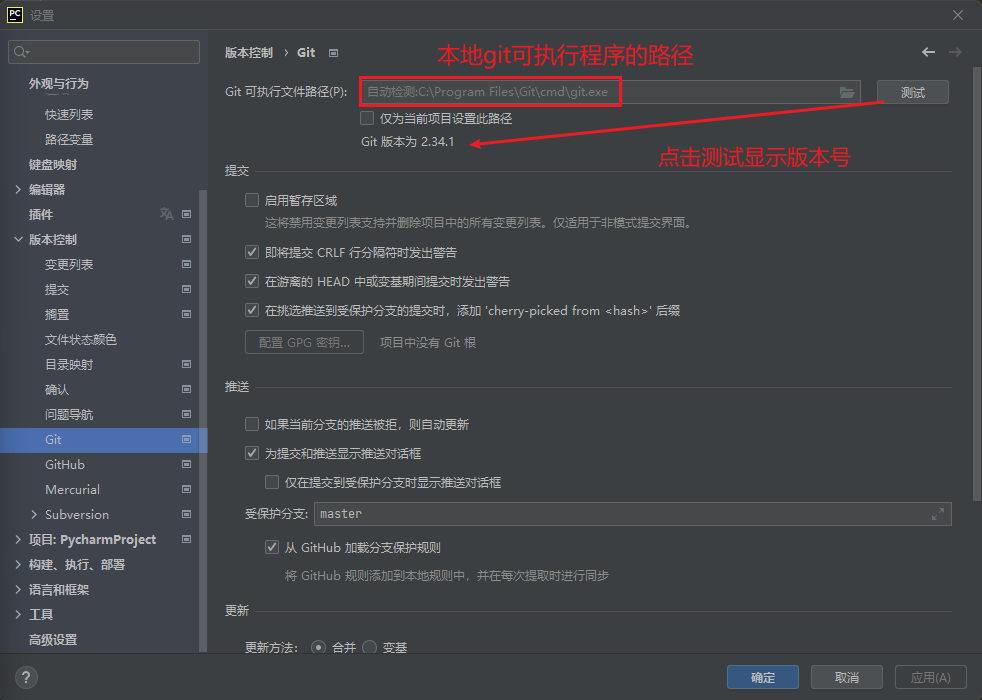

# Git安装

官网：https://git-scm.com/download/



Git环境验证

- windows：cmd中输入命令 `git --version`
- mac ：终端输入命令 `git –version`

# windows打开Git Bash



# Git 环境配置

```bash
git config --global user.name "你的GitHub⽤户名"
git config --global user.email "你的GitHub注册邮箱"

# 查看配置
git config --list
```

**⽣成ssh密钥⽂件：**

```bash
ssh-keygen -t rsa
```

直接⼀路三次回⻋，不⽤设置密码。然后在`C:/⽤户/⽤户名/.ssh` ⽬录下找到`id_rsa.pub` ⽂件，⽤⽂本⼯具打开
该⽂件，复制⾥⾯的内容备⽤。
接下来返回到Github，在⾸⻚右上⻆，点击`⽤户头像-->Settings-->SSH and GPG keys-->New SSH key` 。这
⾥⾯的`Title` 为标题可以随便填写， `Key` 填写刚刚复制的公钥⽂本内容，最后点击`Add SSH key` 。



**然后验证公钥**，打开终端，输⼊⼀下内容。第⼀次添加需要输⼊`yes` 来确定，完成之后即可看到输出的欢迎信息。

```bash
ssh -T git@github.com
```

# pycharm中配置Git


