> 默认已经安装成功`Git`，并将`Git`与`GitHub`帐号绑定。设置好`user.name`和`user.email`配置信息以及ssh密钥绑定。

# 1. 本地项目上传到Github仓库

## 1.1. 建立本地与github仓库的连接

```bash
git remote add origin git@github.com:yourName/yourRepo.git
```

> 把 `your name`换成你注册github时填写的名字，把`yourRepo` 换成在github建立的仓库的名字

## 1.2. 进入需要上传代码的文件夹，例如：

在git终端输入：

```bash
cd c:/zsybim
```

## 1.3. 上传文件

在git终端输入：

```bash
# 上传该文件夹下面的所有的文件
git add ./ 
```

上传单个文件要指定路径，如：

```bash
git add ./read.txt
```

## 1.4 提交文件

在git终端输入：

```bash
git commit -m"commit"
```

## 1.5. 本地仓库推送到服务器

在git终端输入：

```bash
git push origin master
```

## 1.6.最后查看文件是否上传成功

进入`github`界面找到对应的仓库，查看刚刚上传的文件是否存在

# 2. 从Github拉取代码到本地仓库

打开`Github`仓库，选择`code`，再选择`SSH`，复制链接。

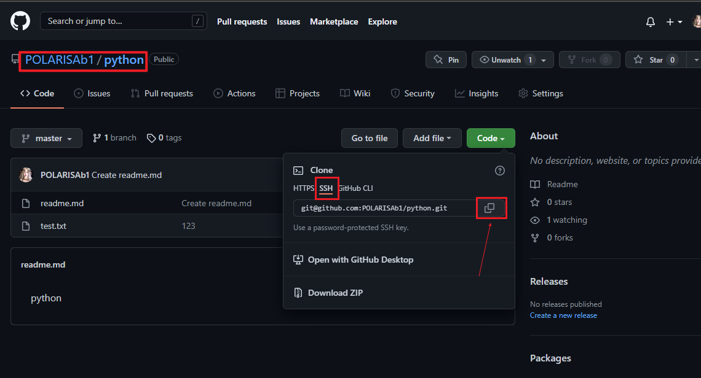

在本地根目录，使用终端，建立与仓库的连接以拉取代码。

```
git clone git@github.com:POLARISAb1/python.git
```

# 3. 在pycharm打开项目

打开后选择本地仓库文件夹，在pycharm中打开项目。

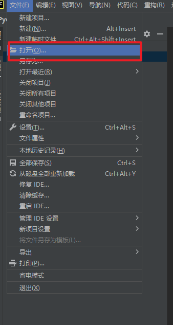

# 4. pycharm中配置Github

## 4.1 设置`Git`

本地有`Git`会自动识别到，点击“测试”，出现`Git`版本即为成功。

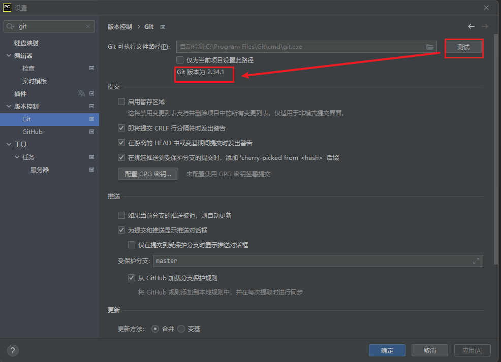

## 4.2 设置Github

### step1 选择新增`Github`，并通过**令牌登录**

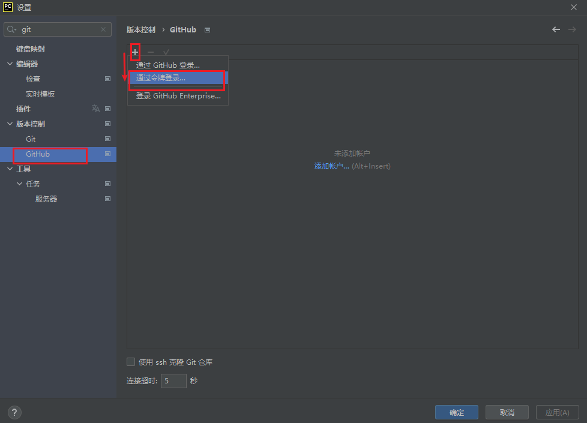

### step2 获取令牌

先点击Github的设置：


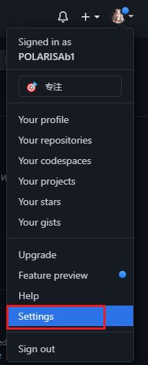

在设置中选择`Developer settings`，再选择`Personal sccess tokens`

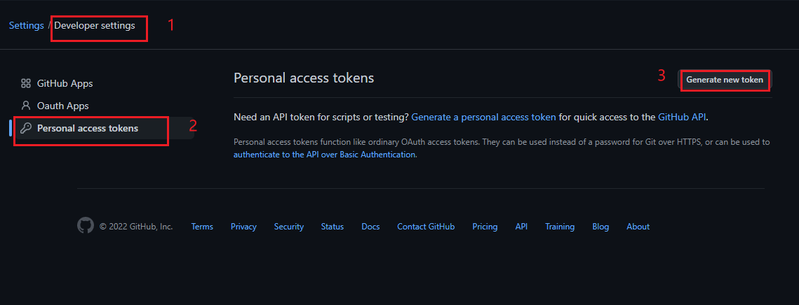

先起一个名字：

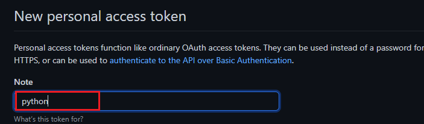

勾选所有的权限：

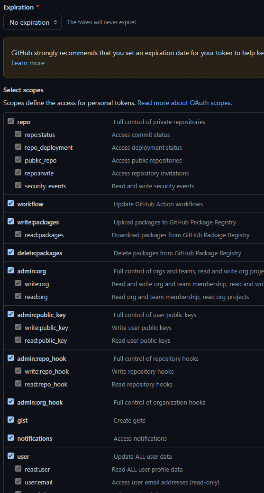

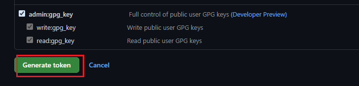

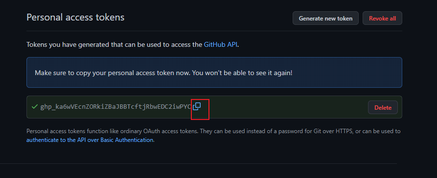

### step3 粘贴令牌到pycharm

并勾选“使用ssh克隆Git仓库”

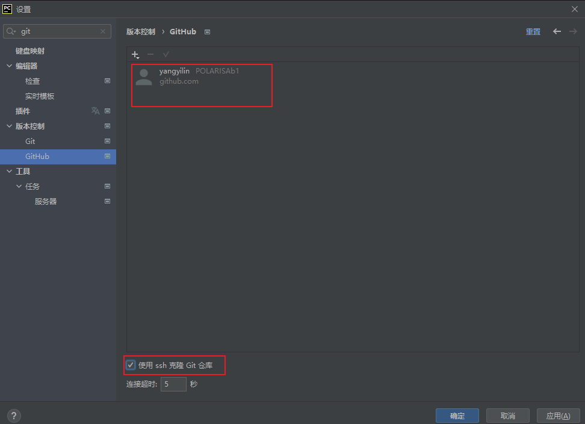

# 5. 推送代码

此时`pycharm`已经出现`Git`，点击**绿色对钩**

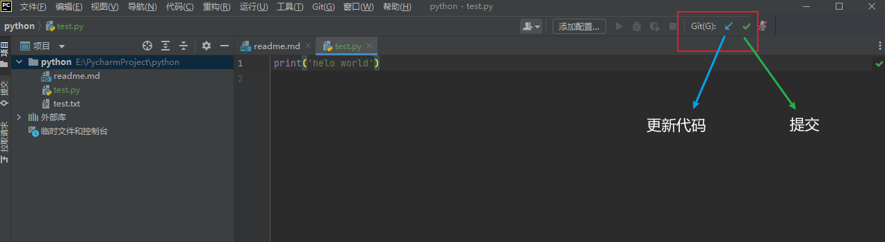

选择要推送的文件，并填写提交信息，选择“提交并推送”

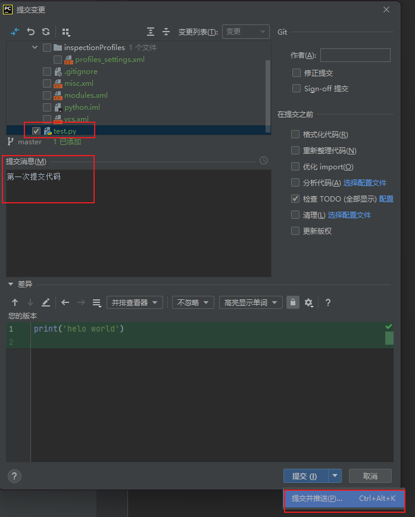

在Github可以看到提交的代码：

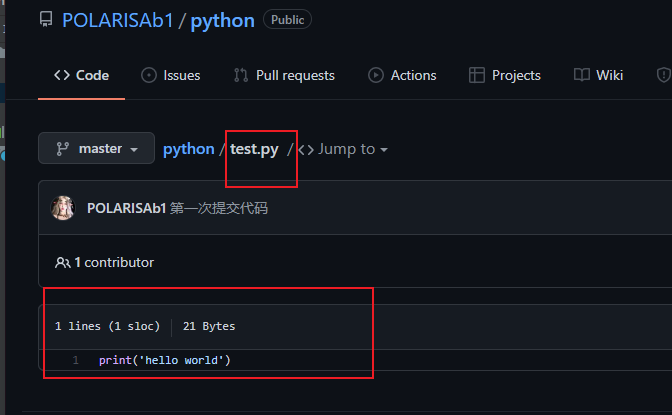

# 6. 拉取代码

## 方法一：

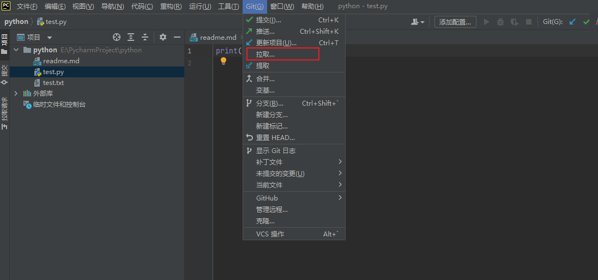

直接选择默认分支就可以

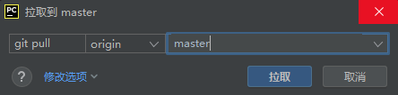

## 方法二：

在终端直接输入Git命令

```bash
git pull
```

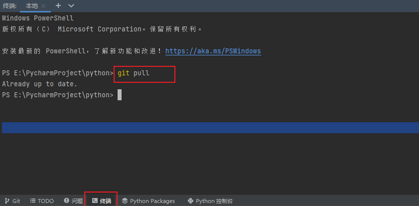

# 7.代码版本对比

选择“当前文件”，有多种对比方式。

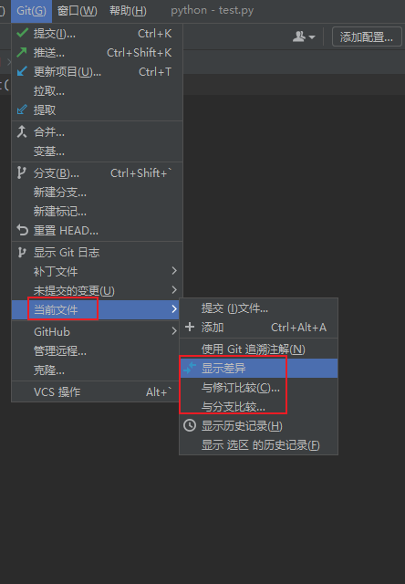

如：选择“显示差异”，可以看到本地和`Github`仓库的不同。

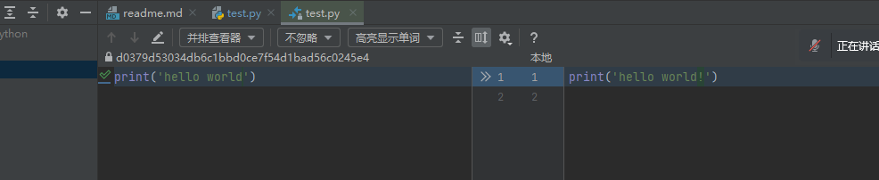
