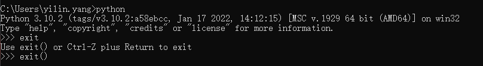

## Python环境安装

- 官网<https://www.python.org/downloads/macos/>

- 推荐版本：3.10.0

## Windows安装步骤

- <https://blog.csdn.net/nmjuzi/article/details/79075736>

- 查看安装是否完成

- 命令：python

    

- 查看安装版本：python \--version或者是python -V2
