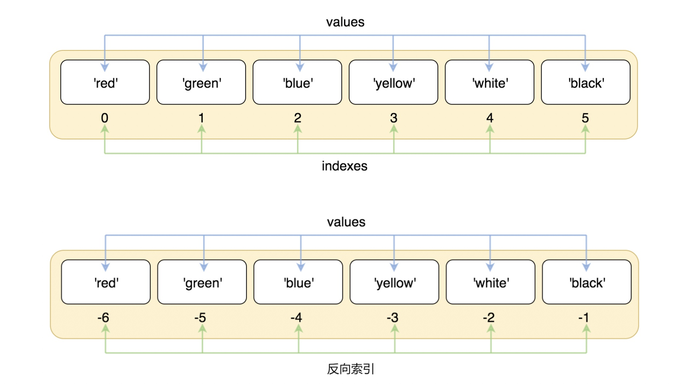

# 元组定义与使用

## 元组定义

- 元组是有序的**不可变**对象集合
- 元组使用小括号包围，各个对象之间使用逗号分隔
- 元组是**异构**的，可以包含多种数据类型

## 元组的使用

### 创建

- 创建

    - 使用逗号分隔

    - 通过小括号填充元素

    - 通过构造方法 tuple(iterable)

        ```python
        # 1、直接使用逗号分隔
        t5 = 1, 2, 3
        print(type(t5))  # 打印 <class 'tuple'>
        
        # 2、通过小括号填充元素
        t3 = (1, 2, 3)
        print(t3)  # 打印 (1, 2, 3)
        t4 = ('a', 'b', 'c')
        print(t4)  # 打印 ('a', 'b', 'c')
        
        # 3、通过构造函数tuple()
        t1 = tuple()
        print(type(t1))  # 打印 <class 'tuple'>
        t2 = tuple([1, 2, 3])
        print(type(t2), t2)  # 打印 <class 'tuple'> (1, 2, 3)
        t6 = tuple('yangyilin')
        print(t6)  # 打印 ('y', 'a', 'n', 'g', 'y', 'i', 'l', 'i', 'n')
        ```

**注意**

​	单元素元组，逗号不可或缺，否则会被认为是int型

```python
tup6 = 1,
print(type(tup6), tup6)  # 打印 <class 'tuple'> (1,)
tup4 = 1
print(type(tup4), tup4)  # 打印 <class 'int'> 1
```

### 索引



- 索引

- 可以通过索引值来访问对应的元素。

    - 正向索引，默认编号从 0 开始

        ```python
        t = tuple(range(1, 6))
        # 正向索引
        print(t[2])  # 打印 3
        ```

    - 反向索引，默认编号从-1 开始

        ```python
        # 反向索引
        print(t[-1])  # 打印 5
        ```

### 切片

- 切片 [start: stop: step]

    - 三个值都是可选的，非必填

    - start 值: 指示开始索引值，如果没有指定，则默认开始值为 0；

    - stop 值：指示到哪个索引值结束，但不包括这个结束索引值。如果没有指定，则取元组允许的最大索引值；

    - step 值：步长值指示每一步大小，如果没有指定，则默认步长值为 1。

        ```python
        t = (1, 2, 3, 4, 5, 6)
        
        print(t[:])
        print(t[:-2])
        print(t[2:4])
        print(t[2:5:2])
        
        # 特殊的切片写法：逆序
        print(t[::-1])
        ```

        结果：

        ```python
        (1, 2, 3, 4, 5, 6)
        (1, 2, 3, 4)
        (3, 4)
        (3, 5)
        (6, 5, 4, 3, 2, 1)
        ```

# 元组常用方法

## index()

- `index(item)`

- 返回与目标元素相匹配的首个元素的索引。

- 目标必须在元组中存在的，否则会报错

    ```python
    t = (1, 3, 2, 3, 2)
    print(t.index(3))	# 打印 1
    
    t = ('h', 'o', 'g', 'w', 'a', 'r', 't', 's', 'a')
    print(t.index('a'))	# 打印 4
    ```

## count()

- `count(item)`：返回某个元素出现的次数。

- 入参：对象 item

- 返回：次数

    ```python
    t = (1, 2, 2, 3, 3, 3, 3)
    print(t.count(3))	# 打印 4
    
    t = ('h', 'o', 'o', 'o', 'g', 'w', 'a', 'r', 't', 's')
    print(t.count('a'))	# 打印 1
    ```

## 元组解包

​	元组解包：把一个可迭代对象里的元素，一并赋值到由对应的变量组成的元组中

```python
t = (1, 2, 3)
a = t[0]
b = t[1]
c = t[2]
print(a, b, c)  # 打印 1 2 3

# 使用元组解包，一气呵成
a, b, c = (1, 2, 3)
print(a, b, c)  # 打印 1 2 3
```

# 元组与列表

- 相同点
    - 都是有序的
    - 都是异构的，能够包含不同类型的对象
    - 都支持索引和切片
- 区别
    - 声明方式不同，元组使用`()`，列表使用 `[]`
    - 列表是可变的，元组是不可变的
