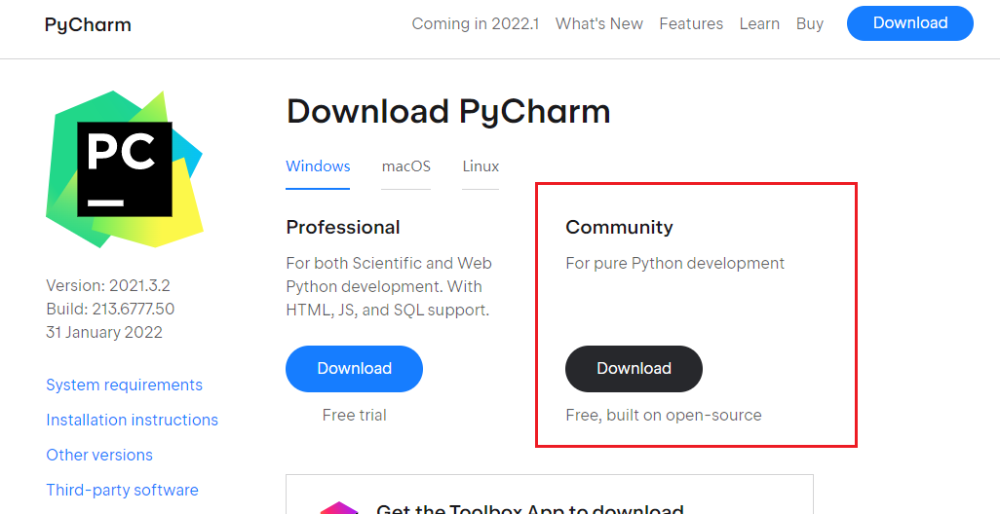
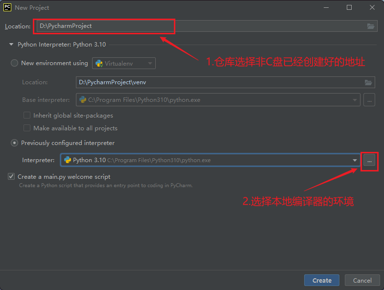
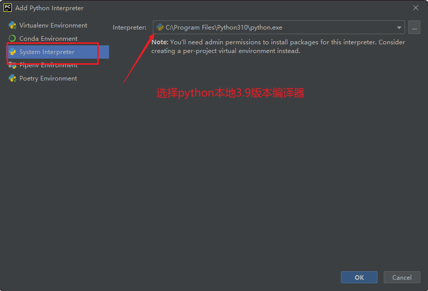
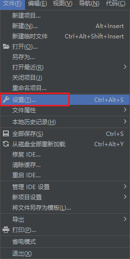
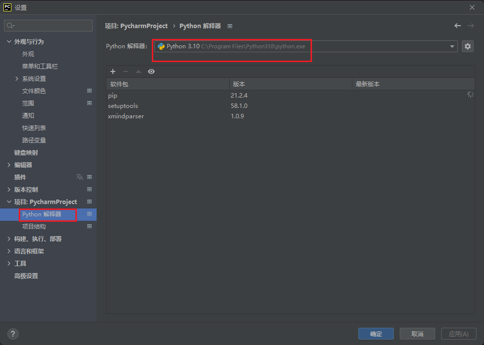
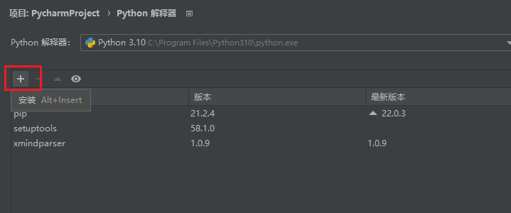
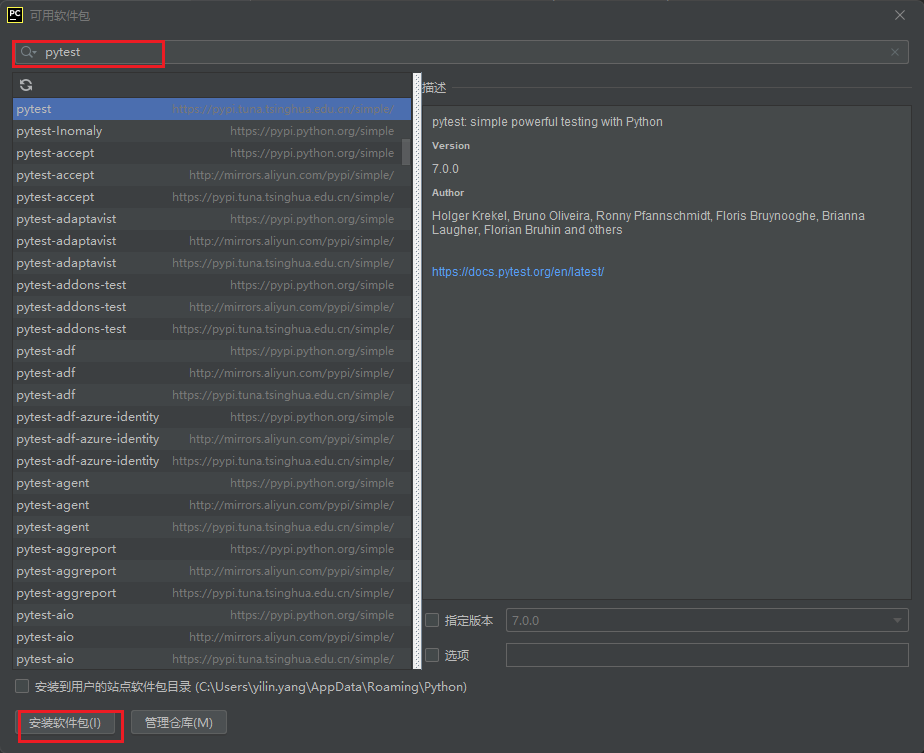

# 安装Pycharm

- 推荐版本：社区版

    

- 官方<https://www.jetbrains.com/pycharm/download/#section=windows>

- 安装时记得勾选"添加到系统路径"

# 新建项目

## 基础配置

## 系统设置

> 编译器在创建时就已经设置好，因此不用再设置了如需设置，采用python解释器后面的小齿轮进行添加等

- 如果需要新的库，安装，点击加号。如果没有其他库，则添加国内管理源即可。查找并安装包。

> https://blog.csdn.net/bananasssss/article/details/108369288?spm=1001.2101.3001.6650.1&utm_medium=distribute.pc_relevant.none-task-blog-2%7Edefault%7ECTRLIST%7ERate-1.pc_relevant_default&depth_1-utm_source=distribute.pc_relevant.none-task-blog-2%7Edefault%7ECTRLIST%7ERate-1.pc_relevant_default&utm_relevant_index=2
