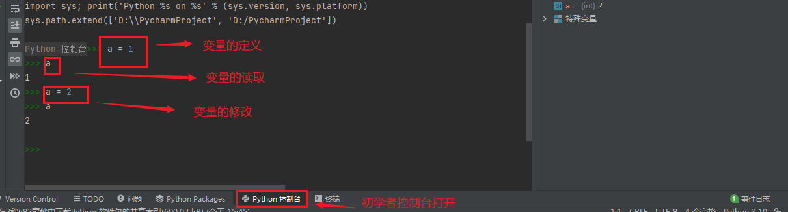
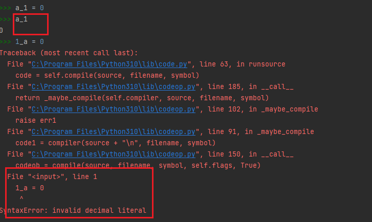
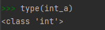
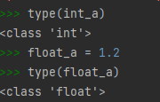
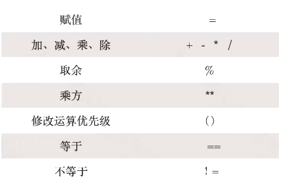
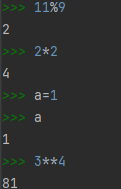
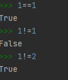
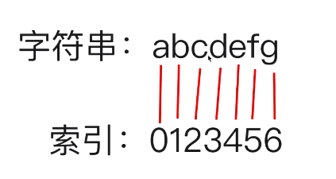
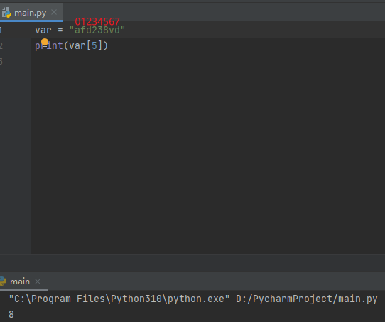

# 变量

- 变量是一种存储数据的载体。计算机中的变量是实际存在的数据或者说是存储器中存储数据的一块内存空间

- 变量的值可以被读取和修改

- pycharm中认识变量




- 命名规则
    - 变量名由字母（广义的Unicode字符，不包括特殊字符）、数字和下划线构成，数字不能开头。
    - 大小写敏感（大写的A和小写a的是两个不同的变量）。
    - 不要跟关键字（有特殊含义的单词）和系统保留字（如函数、模块等的名字）冲突。



# 数字

## 常用数字类型

#### int




#### float



### 常用运算符







# 字符串String "  "

```python
str_a = "abc"
print(str_a)
print(type(str_a))
```

结果：

```
abc
<class 'str'>
```

\\：转义符

```python
str_a = "abc\ndsgvrwg"
print(str_a)
print(type(str_a))
```

结果：

```
abc
dsgvrwg
<class 'str'>
```

> 不想让\\n生效就在\\前加\\

```python
str_a = "abc\\ndsgvrwg"
print(str_a)
print(type(str_a))
```

结果：

```
abc\ndsgvrwg
<class 'str'>
```

r：忽略转义符的作用

> 字符串引号前加r

```python
str_a = r"abc\ndsgvrwg"
print(str_a)
print(type(str_a))
```

结果：

```
abc\ndsgvrwg
<class 'str'>
```

+：多个字符串连接

```python
str_a = r"abc\ndsgvrwg"
str_b = 'waqpowxk2-4i0r-0 qw'
print(str_a+str_b)
```

结果：

```
abc\ndsgvrwgwaqpowxk2-4i0r-0 qw
```

索引



> 字符串位置，从左到右计数



切片

```python
var = "afd238vd"
#索引从开始打印到结束
print(var[0:])
#索引从第一位开始打印到第四位————第五位不打印“前闭后开“原则：1≤n<5
print(var[1:5])
#第三位数字代表“步长”，默认为1  start：stop:step
print(var[1:5:2])
```

结果：

```
afd238vd
fd23
f2
```

# 列表

```python
# 使用括号中包起来的元素就叫列表
var_list = [1, 2, 3, 4, 5, "a", "b", "c", True]
print(var_list)
# 拿到倒数第一位元素
print(var_list[-1])
# 拿到倒数第三位元素
print(var_list[-3])
# 拿到倒数第11位元素——超出会报错
# print(var_list[-11])
# 拿到正数第三位元素
print(var_list[2])
# 从第三元素开始，到倒数第二元素为止————前闭后开
print(var_list[2:-1])
# 从第三元素开始，到最后为止————前闭后开
print(var_list[2:])
# 从第三元素开始，到最后为止，步长为2
print(var_list[2::2])
```

结果：

```
[1, 2, 3, 4, 5, 'a', 'b', 'c', True]
True
b
3
[3, 4, 5, 'a', 'b', 'c']
[3, 4, 5, 'a', 'b', 'c', True]
[3, 5, 'b', True]
```

- 定义

- 索引

- 切片
