# 字符串操作的使用场景

```python
# 单行
str_a = 'this is a girl'
# 多行
str_b = """
132434r
fedwsefrg
"""
print(str_a)
print(str_b)
```

结果：

```
this is a girl

132434r
fedwsefrg
```

- 数据提取之后的通用格式
    - 日志

    - excel

- 第三方数据信息

# 字符串常用特殊字符

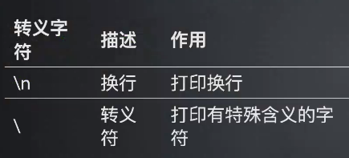

```python
print("test \n yyl")
print('test \\n yyl')
```

结果：

```
test 
 yyl
test \n yyl
```

# 字符串格式化

## 占位符(%)方式

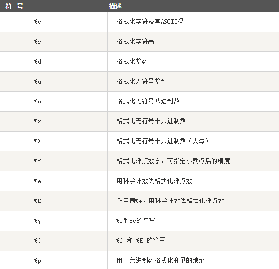

### %s

```python
# 用yyl代替%s的位置
print('test %s' % 'yyl')
```

结果：

```
test yyl
```

```python
# 用111代替%s的位置
print('test %s' % '111')
# 虽然是111但是是字符串并非是数字
```

结果：

```
test 111
```

### %d

```python
# 用ad代替%d的位置
print('test %d' % 'ad')
# %d只接受整数而不是字符串
```

结果：

```
Traceback (most recent call last):
  File "D:\PycharmProject\main.py", line 141, in <module>
    print('test %d' % 'ad')
TypeError: %d format: a number is required, not str
```

## format 格式化函数

Python2.6 开始，新增了一种格式化字符串的函数**\"str\".format( )**，它增强了字符串格式化的功能。基本语法是通过 { } 和 : 来代替以前的 % 。

**format函数**

### 位置映射

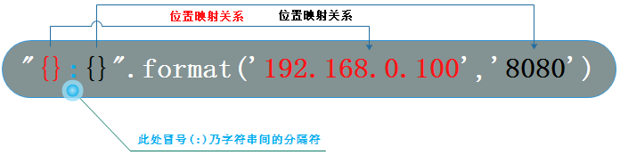

> 分隔符可以任意写

```python
print("{}:{}".format('yyl', 'girl'))
print("{}{}".format('yyl', 'girl'))
print("{},{}".format('yyl', 'girl'))
print("{} is a {}".format('yyl', 'girl'))
```

结果：

```
yyl:girl
yylgirl
yyl,girl
yyl is a girl
```

- 1 ： 不设置指定位置，按默认顺序 ； 2 & 3：设置指定位置

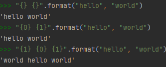

- 通过名称传递变量

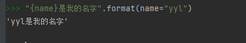

### 关键字映射

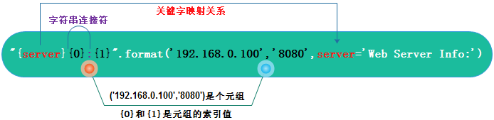

```python
print("{str}{0} {1}".format("lovely", 'girl', str='yyl is a '))
```

结果：

```
yyl is a lovely gir
```


### 元素访问

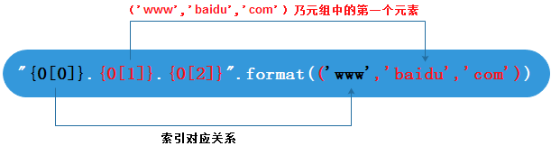

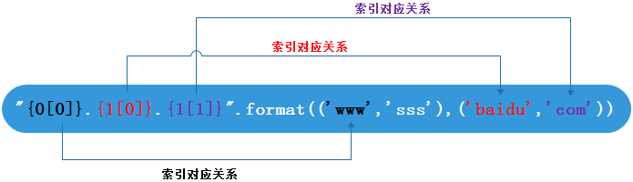

```python
print("{0[1]} {1[2]} {2[0]}".format(('1', '2'), ('a', 'b', 'c'), ('yyl', 'test')))
```

结果：

```
2 c yyl
```


### 填充对齐

> \^、\<、\>分别是居中、左对齐、右对齐

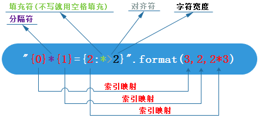

- 1

```python
print("{0}*{1}={2:@>2}".format(3, 2, 2 * 3))
print("{0}*{1}={2:@<2}".format(3, 2, 2 * 3))
print("{0}*{1}={2:@^2}".format(3, 2, 2 * 3))
```

结果：

```
3*2=@6
3*2=6@
3*2=6@
```

- 2

```python
print("{:*^30}".format('centered'))
print("{:*<30}".format('left'))
print("{:*>30}".format('right'))
```

结果：

```
***********centered***********
left**************************
*************************right
```

- 3

```python
for i in range(1, 10):
    a = 1
    while a <= i:
        print("{0}*{1}={2:0>2}".format(a, i, a * i), end="\t")
        a += 1
    print()
```

结果：

```
1*1=01	
1*2=02	2*2=04	
1*3=03	2*3=06	3*3=09	
1*4=04	2*4=08	3*4=12	4*4=16	
1*5=05	2*5=10	3*5=15	4*5=20	5*5=25	
1*6=06	2*6=12	3*6=18	4*6=24	5*6=30	6*6=36	
1*7=07	2*7=14	3*7=21	4*7=28	5*7=35	6*7=42	7*7=49	
1*8=08	2*8=16	3*8=24	4*8=32	5*8=40	6*8=48	7*8=56	8*8=64	
1*9=09	2*9=18	3*9=27	4*9=36	5*9=45	6*9=54	7*9=63	8*9=72	9*9=81	
```

- 4

```python
# test 是原始变量内容
test = "yyl is a {girl}"
# test_str是替换过后的变量内容
test_str = test.format(girl="king")
print(test)
print(test_str)
```

结果：

```
yyl is a {girl}
yyl is a king
```

精度设置

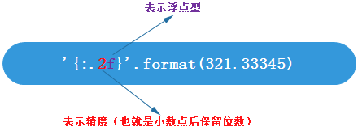

```python
# {:.2f} : 保留小数点后两位
print('{:.2f}'.format(3.12345423432))
```

结果：

```
3.12
```

**字面量格式化字符串 f-strings**

f-strings 就是在字符串的引号前面加上一个字母 f。字母大小写都可以，但是推荐使用小写。{ } 中除了可以使用变量外，还可以放入函数

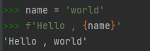

```python
name = " yyl "
age = 22
print(f'My name is {name}. I am {age} years old.')
```

结果：

```
My name is  yyl . I am 22 years old.
```

# 字符串常用API之join

join( ) 方法用于将序列中的元素以指定的字符连接生成一个新的字符串。

```python
a = ['a', 'p', 'p', 'l', 'e']
print('-'.join(a))
```

结果：

```
a-p-p-l-e
```

- 语法： \' sep \'.join(seq)
- sep：分隔符。可以为空

- seq：要连接的元素序列、字符串、元组、字典

- 返回值：返回一个以分隔符 sep 连接各个元素后生成的字符串

# 字符串常用API之split

**split( )** 通过指定分隔符对字符串进行切片，如果参数 num 有指定值，则分隔 num+1 个子字符串

```python
str = "Line1-abcdef \nLine2-abc \nLine4-abcd"
# # 以空格为分隔符,包含 \n---默认
print(str.split())
# 以空格为分隔符,分隔成两个
print(str.split(' ', 1))
```

结果：

```
['Line1-abcdef', 'Line2-abc', 'Line4-abcd']
['Line1-abcdef', '\nLine2-abc \nLine4-abcd']
```

- 语法：str.split(seq=\"\", num=string.count(str))
- seq ：分隔符（会被丢弃），默认为所有的空字符，包括空格、换行(\\n)、制表符(\\t)等。

- num ：分割次数。默认为 -1, 即分隔所有。

- 返回值：返回分割后的字符串列表。

# 字符串常用API之replace

```python
str_ = "this is string example....wow!!! this is really string"
print(str_.replace("is", "was"))
print(str_.replace("is", "was", 3))
```

结果：

```
thwas was string example....wow!!! thwas was really string
thwas was string example....wow!!! thwas is really string
```

- replace() 方法把字符串中的 old（旧字符串） 替换成 new(新字符串)，如果指定第三个参数max，则替换不超过 max 次。
- replace()方法语法：str . replace ( old , new , \[ max \])

- old \-- 将被替换的子字符串。

- new \-- 新字符串，用于替换old子字符串。

- max \-- 可选字符串, 替换不超过 max 次

- 返回值：返回字符串中的 old（旧字符串） 替换成 new(新字符串)后生成的新字符串，如果指定第三个参数max，则替换不超过 max 次。


**strip()方法**

```python
str = "00000003210Runoob01230000000";
print(str.strip('0'))
# 去除首尾字符 0
str2 = "   Runoob      "
# 去除首尾空格
print(str2.strip())
```

结果：

```
3210Runoob0123
Runoob
```

- strip() 方法用于移除字符串头尾指定的字符（默认为空格或换行符）或字符序列。
- **注意：该方法只能删除开头或是结尾的字符，不能删除中间部分的字符。**
- strip()方法语法：str.strip (\[ chars \])

- chars \-- 移除字符串头尾指定的字符序列。

- 返回值：返回移除字符串头尾指定的字符生成的新字符串。

