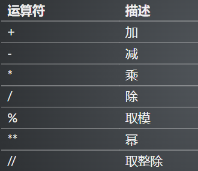
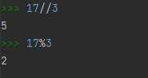
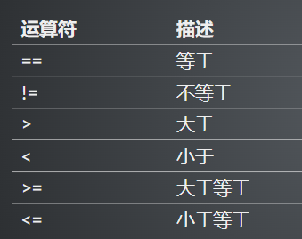
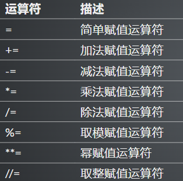
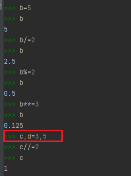
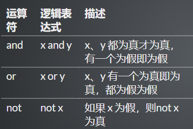
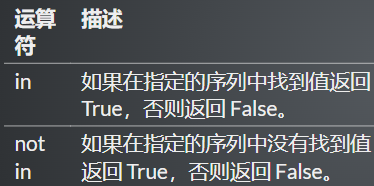
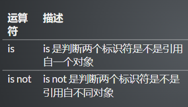
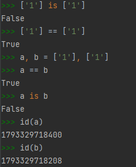

# 运算符的作用

- Python基础语法的内容
- 通常表示不同数据或变量之间的关系

# 算数运算符





# 比较运算符



- 输出布尔值

# 赋值运算符





# 逻辑运算符



```python
a, b = True, False
print(a and b)
print(a or b)
print(not b)
print(not a)
```

结果：

```
False
True
True
False
```


# 成员运算符



```python
list_a = {'a', 'b', 'c'}
str_a = 'rfedaergd'
str_b = 'gfdgarrfed'
print('a' in list_a)
print('a' not in list_a)
print('a' in str_a)
print('a' not in str_a)
print('a' not in str_b)
```

结果：

```
True
False
True
False
False
```

> in 右边一定是一个序列：字符串、数列、元组、列表······
>
> 返回值：布尔值

# 身份运算符





> a与b内存地址不同

- is是判断两个变量之间的**内存地址**是否相同——**是否是对同一个对象的引用**
- 可变的数据结构，即使看着一样，但是内存地址是不同的
- 不可变的数据类型，如果看着一样，那么他们的内存地址是相同的

> 在`python`中针对`NONE`比较时，建议使用`is`判断

**`is`与`==`区别**

- `is`用于判断**两个变量** **引用对象是否为同一个**
- `==`用于判断**引用变量的值**是否相等
