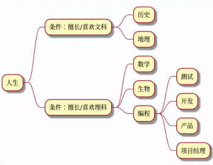
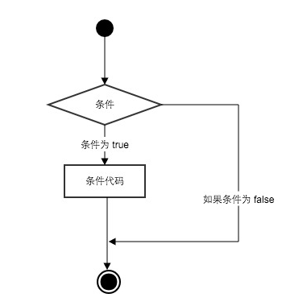

# 什么是分支判断



- 一条一条语句顺序执行叫做顺序结构

- 分支结构就是在某个判断条件后，选择一条分支去执行

# if 条件判断



```python
name1 = 'yyl'
name2 = "yll"
# if后面要有判断条件
if 'name1' != 'name2':
    # 执行语句需要注意缩进
    print('123')
```

结果：

```
123
```

> if后面要有判断条件，if后不加括号

**执行语句需要注意缩进**

# else判断语句

```python
name1 = 'yyl'
name2 = "yll"
# if后面要有判断条件
if 'name1' == 'name2':
    # 执行语句需要注意缩进
    print('123')
else:
    print('456')
```

结果：

```
456
```

# elif 多重条件

```python
num = 5
if num == 3:
    print('aaa')
elif num == 2:
    print('bbb')
elif num == 1:
    print('ccc')
else:
    print('ddd')
```

结果：

```
ddd
```

# 分支嵌套

```python
num = 5
if num == 3:
    if num != 0:
            print('yes')
    print('boss')
elif num == 2:
    print('user')
else:
    if num == 5:
        print("yyl")
    print('123')
```

结果：

```
yyl
123
```

如果判断需要多个条件需同时判断时，可以使用 or （或）：表示两个条件有一个成立时判断条件成功；使用 and （与）时，表示只有两个条件同时成立的情况下，判断条件才成功。

# 三目运算符

```python
a, b = 1, 2
name = 'yyl' if a > b else 'yll'
print(name)
```

结果：

```
yll
```

- 语法：exp1 if contion else exp2
- condition 是判断条件，exp1 和 exp2 是两个表达式。如果 condition 成立（结果为真），就执行 exp1，并把 exp1 的结果作为整个表达式的结果；如果 condition 不成立（结果为假），就执行 exp2，并把 exp2 的结果作为整个表达式的结果。
