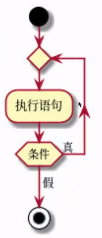
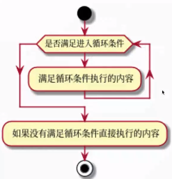

# 循环



- 循环语句允许我们执行一个语句或语句组多次

- python提供了for循环和while循环

# 循环的作用

- 封装重复操作

- Python最重要的基础语法之一

# for-in循环

- 使用场景：

    明确的知道循环执行的次数或者要对一个容器进行迭代（后面会讲到）

```python
# 使用for 循环遍历列表中的元素
for i in [1, 2, 3]:
    print(i)
```

结果：

```
1
2
3
```

- range 函数

    - 当range只传入一个参数的时候，传入的是结束数值，遵循前闭后开原则

        > range(101)可以产生一个0到100的整数序列。

    - 当range传入两个参数的时候，range（开始数值，结束数值）

        > range(1, 100)可以产生一个1到99的整数序列。

    - 当range传入三个参数的时候，range（开始数值，结束数值，步长）

        > range(1, 100, 2)可以产生一个1到99的奇数序列，其中的2是步长。

```python
# for 循环结合 range函数
for i in range(1, 10, 2):
  print(i)
```

结果

```
1
3
5
7
9
```

# while 循环



- 满足条件，进入循环

- **需要设定好循环结束条件**

```python
count = 0
# while循环条件，满足条件执行循环体内代码
while count < 5:
    # count 变量+1，否则会进入死循环
    count += 1
    print(count)
```

结果：

```
1
2
3
4
5
```

# break-跳出整个循环体

### 1

```python
# while循环
count = 0
# while循环条件，满足条件执行循环体内代码
while count < 5:
    # count 变量+1，否则会进入死循环
    count += 1
    if count == 3:
        break
    print(count)
```

结果：

```
1
2
```

### 2

```python
list_demo = [1, 2, 3, 4, 5, 6]
# 循环遍历裂变
for i in list_demo:
    # 如果i 等于三，那么跳出整个for循环
    # 不再打印后面的4、5、6
    print(i)
    if i == 3:
        break
    print(i)
```

结果：

```
1
1
2
2
3
```

# continue:跳出当前轮次循环

continue 语句用来告诉Python跳过当前循环的剩余语句，然后继续进行下一轮循环。

## continue+while循环

```python
# while循环
count = 0
# while循环条件，满足条件执行循环体内代码
while count < 5:
    # count 变量+1，否则会进入死循环
    print(count)
    if count == 3:
        # 为了与3区分，如果==3的情况下count = count+1.5
        count += 1.5
        continue
    count += 1
```

结果：

```
0
1
2
3
4.5
```

## continue+for循环

```python
list_demo = [1, 2, 3, 4, 5, 6]
# 循环遍历裂变
for i in list_demo:
    # 如果i 等于三，那么跳出整个if循环,不再打印3
    if i == 3:
        continue
    print(i)
```

结果：

```
1
2
4
5
6
```

# pass

- 没有实质性含义，通常占位使用
- 不影响代码的执行逻辑

```python
print("a")
pass
print("b")
```

结果：

```
a
b
```

# 例子

## 1：求1\~100的偶数的和

### 使用分支结构

```python
# 使用分支结构求1~100的和
sum = 0
for i in range(1, 101):
    # 对i取余，如果余数为0，证明i是偶数
    if i % 2 == 0:
        sum += i
        print(sum)
```

结果：

```
2
6
12
···
2550
```

### 不使用分支结构

```python
sum = 0
for i in range(1, 101, 2):
    sum += i + 1
    print(sum)
```

结果：

```
2
6
12
···
2550
```

## 2：猜数字游戏

计算机出一个1\~100之间的随机数由人来猜。计算机根据人猜的数字分别给出提示大一点/小一点/猜对了，直到猜对为止

```python
# random()是不能直接访问的，需要导入 random 模块，然后通过 random 静态对象调用该方法。
import random

# 计算机出一个1~100之间的随机数由人来猜。计算机根据人猜的数字分别给出提示大一点/小一点/猜对了
# random.randint()随机生一个整数int类型，可以指定这个整数的范围，同样有上限和下限值
a = random.randint(0, 101)
b = int()
print(a)
while a != b:
    b = int(input("请输入一个数："))
    if b > a:
        print("小一点")
    elif b < a:
        print("大一点")
    else:
        print("猜对了")
```

结果：

```
27
请输入一个数：33
小一点
请输入一个数：30
小一点
请输入一个数：28
小一点
请输入一个数：27
猜对了
```

其实写循环条件应该写：while True: 代表永远会进入循环

## 3：求1\~100奇数和

### while循环

```python
# 使用while语句实现1~100之间的奇数求和
sum = 0
a = 1
while a < 101:
    sum += a
    a += 2
    print(sum)
```

结果：

```
1
4
9
16
···
2500
```

### 不使用分支结构求和

```python
# 不使用分支结构实现1~100之间的奇数求和
sum = 0
for a in range(1, 101, 2):
    sum += a
    print(sum)
```

结果：

```
1
4
9
16
···
2500
```

