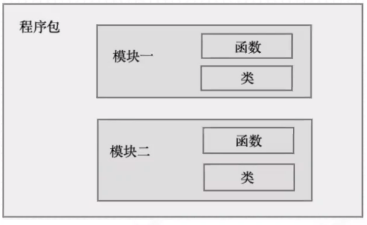
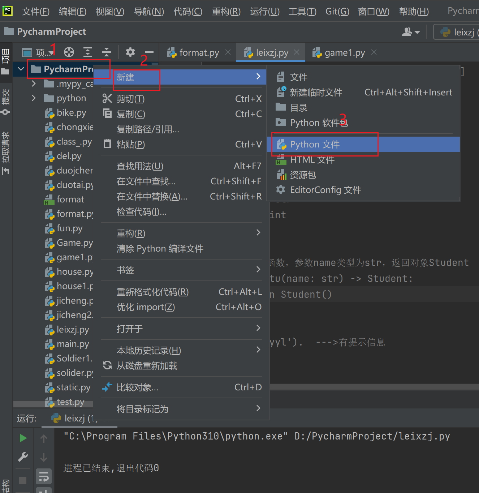
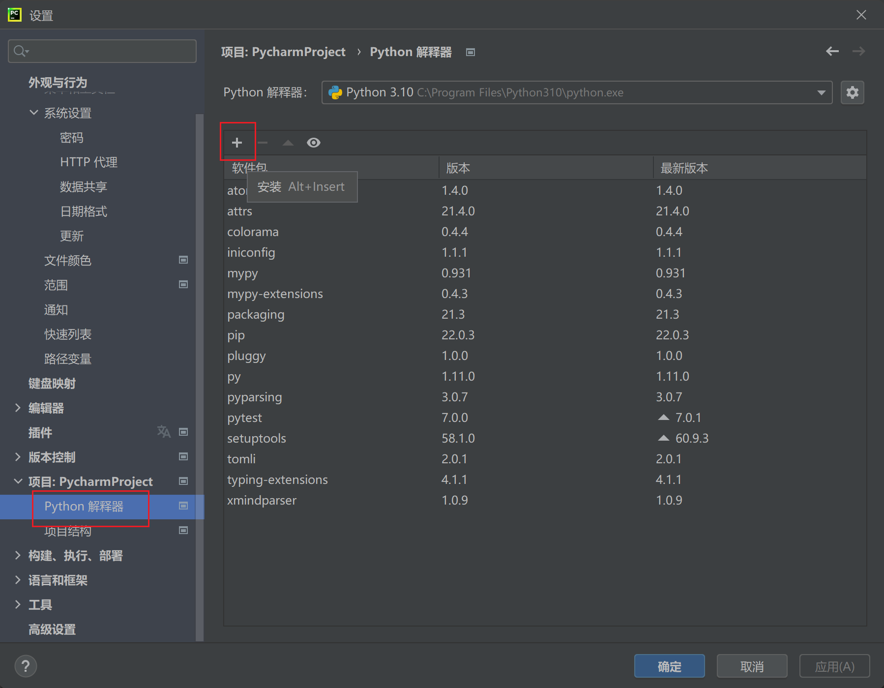
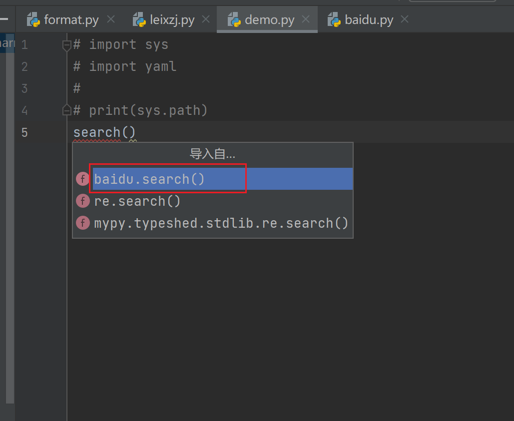

# 1 项目目录结构

## python的程序结构：



## 组成

- `package`包
- `modele`模块
- `function`方法

# 2 模块定义

## 模块

- 包含`Python`定义和语句的文件
- `.py`文件
- 作为脚本运行

## 模块分类

- 系统内置模块
- 第三方的开源模块
- 自定义模块

## 如何使用模块

- ### 系统内置模块

    - Python安装好之后自带的一些非常有用的模块（sys, os, time, json 模块等）

        

        ```python
        import sys
        print(sys.path)
        ```

        结果：

        ```python
        ['D:\\PycharmProject', 'D:\\PycharmProject', 'C:\\Program Files\\Python310\\python310.zip', 'C:\\Program Files\\Python310\\DLLs', 'C:\\Program Files\\Python310\\lib', 'C:\\Program Files\\Python310', 'C:\\Users\\yilin.yang\\AppData\\Roaming\\Python\\Python310\\site-packages', 'C:\\Program Files\\Python310\\lib\\site-packages']
        ```

    - ### 第三方开源模块

        - 是通过包管理工具`pip`完成的

            - 需要通过 `pip install 模块名` 安装

        - 也通过可以Python解释器找到一些第三方库

            

    - ### 自定义模块

        - 自定义模块是自己写的模块，对某段逻辑或某些函数进行封装后供其他函
            数调用。

        比如先定义一个模块`baidu.py`，输入代码：

        ```python
        def search():
            print('这是一个搜索方法')
        ```

        然后在另一个模块`demo.py`导入，注意导入时的选择：

        

        ```python
        from baidu import search
        search()
        ```

        或者写：

        ```python
        import baidu
        baidu.search()
        ```

        一个是直接导入`baidu`模块的`search`方法，另一个是只导入`baidu`模块，在模块内调用`search`方法。

        > 如果要导入一个模块的很多类或者方法，可以写 `from 模块名 import *`

# 3 文件引用

## 模块导入

- `import 模块名`
- `from <模块名> import <方法 | 变量 | 类>`
- `from < 模块名 > import*`

> 注意：
>
> - 同一个模块写多次只被导入一次
> - `import`应该放在代码的顶端

## 常用方法

- `dir()` 找出当前模块定义的对象
- `dir(sys)`找出参数模块定义的对象

## **搜索路径**

`print(sys.path)` ，记得先导入`sys`模块

- Python解析器对模块位置的搜索顺序是
    - 包含输入脚本的目录（如果未指定文件，则为当前目录）
    - PYTHONPATH（目录名称列表，语法与shell变量相同PATH）
    - 安装的默认路径

## 使用模块的总结

- 代码的可维护性
- 提升编码效率
- 函数名可重复（起名避免与系统重复）
