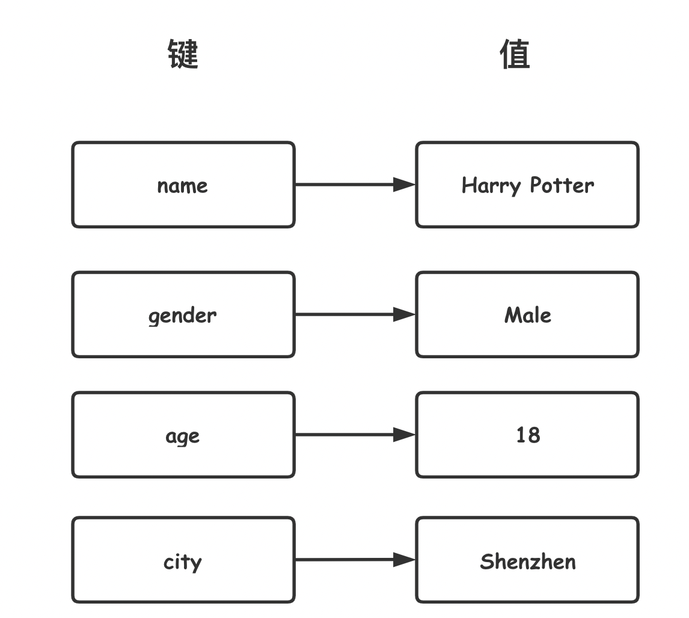

# 字典定义与使用

## 字典定义



- 字典是无序的键值对集合
- 字典用大括号`{}`包围
- 每个键/值对之间用一个逗号`,`分隔
- 各个键与值之间用一个冒号`:`分隔
- 字典是动态的
- 字典的键是惟一的，是不可变的对象，比如字符串，数值等；值可以是任意python对象，如元组，也可以是另一个字典

## 字典使用

### 创建

- 创建字典

    - 使用大括号填充键值对

        ```python
        dc = {'name': 'Harry Potter', 'age': 18}
        print(type(dc), dc)
        ```

        结果：

        ```python
        <class 'dict'> {'name': 'Harry Potter', 'age': 18}
        ```

    - 通过构造方法 dict()

        ```python
        dc1 = dict()  # 空字典
        print(dc1)
        dc2 = dict(name="Harry Potter", age=18)  # 关键字参数赋值
        print(type(dc2), dc2)
        # 利用构造方法传入一个由元组组成的列表
        dc3 = dict([("name", "Harry Potter"), ("age", 18)])
        print(type(dc3), dc3)
        ```

        结果：

        ```python
        {}
        <class 'dict'> {'name': 'Harry Potter', 'age': 18}
        <class 'dict'> {'name': 'Harry Potter', 'age': 18}
        ```

    - 使用字典推导式

        ```python
        # k取值列表—元组第一个元素，v取值列表—元组第二个元素
        dc4 = {k: v for k, v in [("name", "Harry Potter"), ("age", 18)]}
        print(type(dc4), dc4)
        ```

        结果：

        ```python
        <class 'dict'> {'name': 'Harry Potter', 'age': 18}
        ```

### 访问元素

- 访问元素

    - 与字典也支持中括号记法**`[key]`**。

    - 字典使用键来访问其关联的值。

    - 访问时对应的 key 必须要存在

        ```python
        dc = {"name": "Harry Potter", "age": 18}
        # 1、访问存在的key
        print(dc["name"])
        print(dc["age"])
        ```

        结果：

        ```python
        Harry Potter
        18
        ```

### 操作元素

- 语法：dict[key] = value

- 添加元素

    - 键不存在

        ```python
        dc = {"name": "Harry Potter", "age": 18}
        dc['hobby'] = 'Magic'
        print(dc)
        ```

        结果：

        ```python
        {'name': 'Harry Potter', 'age': 18, 'hobby': 'Magic'}
        ```

- 修改元素

    - 键已经存在

        ```python
        dc['age'] = 20
        print(dc)
        ```

        结果：

        ```python
        {'name': 'Harry Potter', 'age': 20, 'hobby': 'Magic'}
        ```

### 嵌套字典

- 嵌套字典

- 字典的值可以是字典对象

    ```python
    dc = {"name": "Harry Potter", "age": 18, "course": {"magic": 90, "python": 80}}
    # 1、获取课程Magic的值
    print(dc['course']['magic'])
    
    # 2、把python分数改成100分
    dc['course']['python'] = 100
    print(dc)
    ```

    结果：

    ```python
    90
    {'name': 'Harry Potter', 'age': 18, 'course': {'magic': 90, 'python': 100}}
    ```

# 字典常用方法

## keys()

- `keys()`

- 返回由字典键组成的一个新视图对象。

    > 视图对象：1。视图对象提供字典条目的动态视图，字典项发生改变时，视图也会相应改变；
    > 2.字典视图可以被迭代，以产生对应的数据。 并支持成员检测in ， not in
    >
    > 3.keys(),values(),items()方法返回的对象都是视图对象

- 入参：无

- 返回：

    ```python
    dc = {"name": "Harry Potter", "age": 18}
    keys = dc.keys()
    print(type(keys), keys)
    
    # 1、遍历查看所有的键
    for key in keys:
        print(key)
    
    # 2、将视图对象转成列表
    print(list(keys))
    ```

    结果：

    ```python
    <class 'dict_keys'> dict_keys(['name', 'age'])
    name
    age
    ['name', 'age']
    ```

## values()

- `values()`

- 返回由字典值组成的一个新**视图对象**。

    ```python
    dc = {"name": "Harry Potter", "age": 18}
    values = dc.values()
    print(type(values), values)
    
    # 遍历查看所有的键——
    for value in values:
        print(value)
    
    # 将视图对象转成列表
    print(list(values))
    ```

    结果：

    ```python
    <class 'dict_values'> dict_values(['Harry Potter', 18])
    Harry Potter
    18
    ['Harry Potter', 18]
    ```

## items()

- `items()`

- 返回由字典项 ((键, 值) 对) 组成的一个新视图对象。

    ```python
    dc = {"name": "Harry Potter", "age": 18}
    items = dc.items()
    print(type(items), items)
    
    # 1、遍历查看所有的键
    for item in items:
        print(item)
    
    # 2、将视图对象转成字典
    print(list(items))
    ```

    结果：

    ```python
    <class 'dict_items'> dict_items([('name', 'Harry Potter'), ('age', 18)])
    ('name', 'Harry Potter')
    ('age', 18)
    [('name', 'Harry Potter'), ('age', 18)]
    ```

## get()

- `get(key)`

- 获取指定 key 关联的 value 值。

- 入参：

    - key：字典的键，必传。

- 返回：

    - 如果 key 存在于字典中，返回 key 关联的 value 值。
    - 如果 key 不存在，则返回 None。

- 此方法的好处是无需担心 key 是否存在，永远都不会引发 KeyError 错误。

    ```python
    dc = {"name": "Harry Potter", "age": 18}
    
    # 1、访问存在的key
    name = dc['name']
    print(name)
    
    # 2、访问不存在的key
    hobby = dc.get('hobby')
    print(hobby)
    ```

    结果：

    ```python
    Harry Potter
    None
    ```

## update()

- `update(dict)`

- 使用来自 dict 的键/值对更新字典，覆盖原有的键和值。

- 入参：

    - dc：字典对象，必传

- 返回：None

    ```python
    dc = {"name": "Harry Potter", "age": 18}
    dc.update({"age": 20, "hobby": "magic"})
    print(dc)
    ```

    结果：

    ```python
    {'name': 'Harry Potter', 'age': 20, 'hobby': 'magic'}
    
    ```

## pop()

- `pop(key)`

- 删除指定 key 的键值对，并返回对应 value 值。

- 入参：

    - key：必传

- 返回：

    - 如果 key 存在于字典中，则将其移除并返回 value 值

    - 如果 key 不存在于字典中，则会引发 KeyError

        ```python
        dc = {"name": "Harry Potter", "age": 18}
        
        # 1、弹出
        item = dc.pop("age")
        print(dc, item)
        
        # 2、删除不存在的key
        dc.pop("hobby")  # 报错keyError
        ```

        结果：

        ```python
        {'name': 'Harry Potter'} 18
        ```

# 字典推导式

- 字典推导式：可以从任何以键值对作为元素的可迭代对象中构建出字典。

- 实例：给定一个字典对象`{'a': 1, 'b': 2, 'c': 3}`，找出其中所有大于 1 的键值对，同时 value 值进行平方运算。

    ```python
    # 未使用字典推导式的写法
    dc = {'a': 1, 'b': 2, 'c': 3}
    d_old = dict()
    for k, v in dc.items():
        if v > 1:
            d_old[k] = v ** 2
    print(d_old)
    
    # 使用字典推导式
    d_new = {k: v ** 2 for k, v in dc.items() if v > 1}
    print(d_new)
    ```

    结果：

    ```python
    {'b': 4, 'c': 9}
    {'b': 4, 'c': 9}
    ```

# 实例

给定一个字典对象，请使用字典推导式，将它的key和value分别进行交换。也就是key变成值，值变成key。

输入: {'a': 1, 'b': 2, 'c': 3}
输出: {1: 'a', 2: 'b', 3: 'c'}

```python
dict1 = {'a': 1, 'b': 2, 'c': 3}
dict2 = {v: k for k, v in dict1.items()}
print(dict2)
```

结果：

```python
{1: 'a', 2: 'b', 3: 'c'}
```

