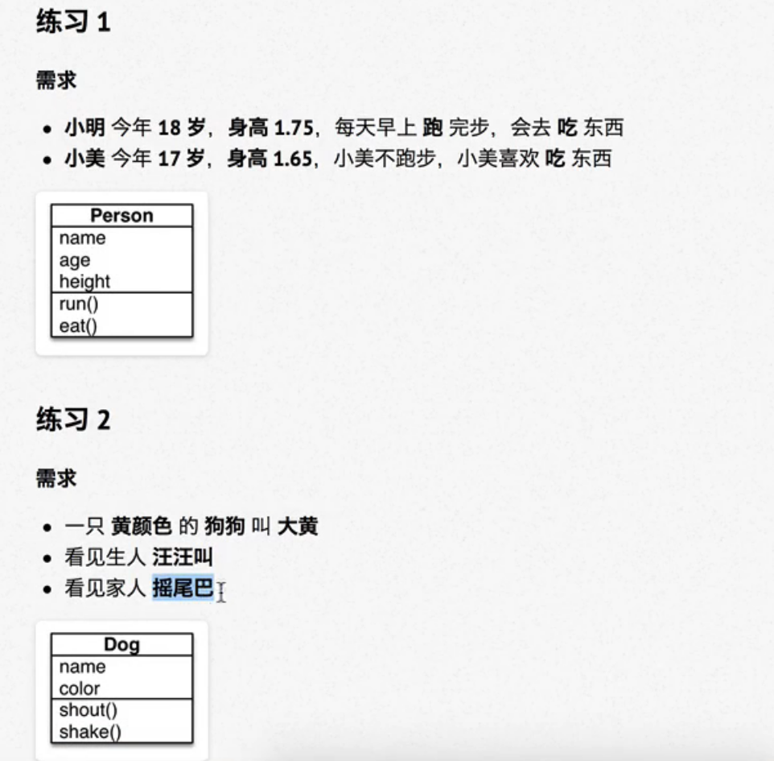

# 两种编程思想

## 1 面向过程

- 一种以过程为中心的编程思想
- 简单的事情

## 2 面向对象

- 一种更符合我们人类思维习惯的编程思想
- 面向对象开发就是不断的创建对象，使用对象，操作对象做事情
- 复杂的事情

# 什么是面向对象

语言层面，封装代码和数据规格层面，对象是一系列可被使用的公共接口从概念层面，对象是某种拥有责任的抽象

## 面向对象程序设计规则

- 首先分析有哪些类
- 每个类有哪些属性和行为
- 类与类之间存在的关系

# 类和对象

## 类

- 类（Class）是对一群具有相同特征或者行为的事物的一个统称，是**抽象**的，**不能直接使用**。
    。**特征**被称为**属性**
    。**行为**被称为**方法**
- 类就相当于制造飞机时的图纸，是一个模板，是**负责创建对象**的

## 对象

- 对象是由**类创建出来的一个具体存在，**可以**直接使用**
- 由**哪一个类**创建出来的**对象**，就拥有在**哪一个类**中定义的：
    - 属性
    - 方法
- 对象就相当于用图纸制造的飞机
- 在程序开发中，应该**先有类，再有对象**

## 类和对象的关系

- **类是模板**，对象是根据类这个模板创建出来的，应该先**有类，再有对象**
- **类**只有**一个**，而**对象**可以有**很多个**
    - **不同的对象**之间**属性**可能会各不相同
- **类**中定义了什么**属性和方法**，**对**象中就有什么**属性和方法**，**不可能多，也不可能少**

## 类的设计

- 在使用面相对象开发前，应该首先分析需求。确定一下，程序中需要包含哪些类
- 在程序开发中，要设计一个类，通常需要满足一下三个要素：
    1. 类名   这类事物的名字，满足**大驼蜂命名法**
    2. 属性   这类事物具有什么样的特征
    3. 方法   这类事物具有什么样的行为

### 大驼峰命名法（CapWords）

​	1.**每**一个单词的**首字母大写**
​	2.单词与单词之间**没有**下划线

## 类名的确定

​	**名词提炼法**——分析整个业务流程，出现的**名词**，通常就是找到的类

## 属性和方法的确定

- 对**对象的特征描述**，通常可以定义成**属性**
- **对象具有的行为**（动词），通常可以定义成方法

> 提示：需求中没有涉及的属性或者方法在设计类时，不需要考虑



# 面向对象基础语法

## 1. dir内置函数（了解）

在`Python`中**对象几乎是无所不在**的。我们之前学习的变量、数据、函数都是对象在`Python`中可以使用以下两个方法验证：
1.在**标识符/数据**后输入一个`.`，然后按下`TAB`键，`iPython`会提示该对象能够调用的方法列表
2.使用内置函数`dir`传入**标识符/数据**，可以查看对象内的**所有属性及方法**

```python
print(dir(对象名))
```

> 提示:`__方法名__`格式的方法是`python`提供的内**置方法/属性**，稍后会介绍一些常用的内置方法/属性

|  方法名   | 类型 |                      作用                      |
| :-------: | :--: | :--------------------------------------------: |
| `__new__` | 方法 |          **创建对象**时，会被自动调用          |
| `__init_` | 方法 |      **对象被初始化**时，会被**自动**调用      |
| `__del_`  | 方法 | **对象**被从**内存中销毁**前，会被**自动**调用 |
| `__str__` | 方法 | 返回**对象的描述信息**，**print函数**输出使用  |

## 2.定义简单的类

> 面向对象是更大的封装，在一个类中封装多个方法，这样通过这个类创建出来的对
> 象，就可以直接调用这些方法了

### 定义只包含方法的类

在python中要定义一个只包含方法的类，语法格式如下：

```python
class 类名:
	def 方法1(self, 参数列表):
		pass
	def 方法2(self, 参数列表):
		pass
```

- 方法的定义格式和之前学习过的函数几乎一样
- 区别在于第一个参数必须是`self`，大家暂时先记住，稍后介绍`self`

> 注意：类名的命名规则要符合大驼峰命名法

### 创建对象

​	当一个类定义完成之后，要是用这个类来创建对象，语法格式如下：

```python
对象变量 = 类名()
```

### 第一个面向对象程序

需求：小猫爱吃鱼，小猫要喝水

分析：

1. 定义一个猫类`cat`
2. 定义两个方法`eat`和`drink`
3. 按照需求——不需要定义属性

```python
class Cat:
    """这是一个猫类"""

    def eat(self):
        print("小猫爱吃鱼")

    def drink(self):
        print("小猫爱喝水")


# 创建猫对象
# 对象= 实例化 = 起名
tom = Cat()
tom.eat()
tom.drink()
```

结果：

```python
小猫爱吃鱼
小猫爱喝水
```

### 引用

在面向对象开发中，**引用**的概念是同样适用的。

- 在`Python`中使用类创建对象之后，`tom`变量中仍然记录的是对象在内存中的地址

- 也就是`tom`变量引用了新建的猫对象

- 使用`print`输出对象变量，默认情况下，是能够输出这个变量引用的对象是由哪一个类创建的对象，以及在内存中的地址（十六进制表示）

    ```python
    print(tom)
    ```

    结果：

    ```python
    <__main__.Cat object at 0x00000229EA076CE0>
    ```

> 提示：在计算机中，通常使用十六进制表示内存地址
>
> - 十进制和十六进制都是用来表达数字的，只是表示的方式不一样
> - 十进制和十六进制的数字之间可以来回转换

- `%d`可以以10进制输出数字
- `%x`可以以16进制输出数字

## 3.方法中的`self`参数

### 3.1 案例改造——给对象增加属性

在`Pythor`中，要给**对象设置属性**，非常的容易，但是**不推荐使用**

- 因为：对象属性的封装应该封装在类的内部
- 只需要在**类的外部的代码**中直接通过`.`设置一个属性即可

> 注意：这种方式虽然简单，但是不推荐使用！

在上面的实例代码13行后添加

```python
tom.name = "tom"
print(tom.name)
```

结果：

```python
tom
```

### 3.2 使用`self`在方法内部输出每一只猫的名字

- 由**哪一个对象**调用的方法，方法内的`self`就是**哪一个对象的引用**
- 在类封装的方法内部，`self`就表示**当前调用方法的对象自己**
- **调用方法时**，程序员不需要传递`self`参数
- **在方法内部**
    - 可以通过`self.`**访问对象的属性**
    - 也可以通过`self.`**调用其他的对象方法**
- 在**类的外部**，通过`变量名.`，访问对象的**属性和方法**
- 在**类封装的方法中**，通过`self.`访问对象的**属性和方法**

> **`self`指的是类实例对象本身(注意：不是类本身)**

改造代码如下：

```python
class Cat:  
    def eat(self):
        print("%s爱吃鱼" % self.name)

    def drink(self):
        print("小猫爱喝水")


tom = Cat()
tom.name = "tom"
tom.eat()
tom.drink()

lucy = Cat()
lucy.name = 'lucy'
lucy.eat()
lucy.drink()
```

结果：

```python
tom爱吃鱼
小猫爱喝水
lucy爱吃鱼
小猫爱喝水
```

## 4. 初始化方法

### 4.1 之前代码存在的问题——在类的外部给对象增加属性

先调用方法，在设置属性

```python
tom = Cat()
tom.eat()
tom.drink()
tom.name = "tom"
```

结果：程序报错

```python
AttributeError: 'Cat' object has no attribute 'name'
```

提示

- 在日常开发中，不推荐在**类的外部**给对象增加属性
- 如果在运行时，**没有找到属性，程序会报错**
- 对象应该包含有哪些属性，应该**封装在类的内部**

### 4.2 初始化方法

当使用`类名()`创建对象时，会自动执行以下操作：

1. 为对象在内存中**分配空间**——创建对象
2. 为对象的属性**设置初始值**——初始化方法（`init`）

这个初始化方法就是`_init_`方法，`_init_`是对象的**内置方法**

> _`_init_`_方法是**专门**用来定义一个类**具有哪些属性的方法**

在Cat中增加`_init_`方法，验证该方法在创建对象时会被**自动调用**

```python
class Cat:

    def __init__(self):
        print('初始化方法')
        
tom = Cat()
```

结果：

```python
初始化方法
```

### 4.3 在初始化方法内部定义属性

在`_init_`方法内部使用`self.属性名 =属性的初始值`就可以**定义属性**

定义属性之后，再使用`Cat`类创建的对象，都会**拥有该属性** 

```python
class Cat:

    def __init__(self):
        print('初始化方法')
        self.name = 'lili'

    def eat(self):
        print("%s爱吃鱼" % self.name)

cat = Cat()
print(cat.name)
```

结果：

```python
初始化方法
lili
```

### 4.4 改造初始化方法——初始化的同时设置初始值

在开发中，如果希望在**创建对象的同时，就设置对象的属性**，可以对`_init_`方法进行改造

1. 把希望设置的属性值，定义成`_init_`方法的参数
2. 在**方法内部**使用`self.属性 = 形参`接收外部传递的参数
3. 在**创建对象**时，使用`类名(属性1, 属性2...)`调用

```python
class Cat:
    # self 就是类的实例，代表当前被引用的对象 self = tom/lucy···
    def __init__(self, new_name):
        print('初始化方法')
        self.name = new_name

    def eat(self):
        print("%s爱吃鱼" % self.name)

cat = Cat('lili')
print(cat.name)
cat.eat()
```

结果：

```python
初始化方法
lili
lili爱吃鱼
```

## 5.内置方法和属性

| 方法名  | 类型 |                    作用                     |
| :-----: | :--: | :-----------------------------------------: |
| `_del_` | 方法 |  **对象被从内存中销毁**前，会**自动**调用   |
| `_str_` | 方法 | 返回**对象的描述信息**，`print`函数输出使用 |

### 5.1 `_del_`方法（了解）

在`Python`中

- 当使用`类名()`创建对象时，为对象分配完空间后，自动调用`_init_`方法
- 当一个**对象被从内存中销毁前**，会自动调用`_del_`方法

应用场景

- `_init_`改造初始化方法，可以让创建对象更加灵活
- `_del_`如果希望在对象呗销毁前，再做一些事情，可以考虑一下`_del_`方法

生命周期

- 一个对象从调用`类名()`创建，生命周期开始
- 一个对象的`_del_`方法一旦被调用，生命周期结束
- 在对象的生命周期内，可以访问对象属性，或者让对象调用方法

```python
class Cat:

    def __init__(self, name):
        self.name = name
        print("%s 来了" % self.name)

    def __del__(self):
        print("%s 走了" % self.name)

tom = Cat('tom')
print('_' * 50)
```

结果：

```python
tom 来了
__________________________________________________
tom 走了
```

如果在10行后添加:

```python
del tom
```

结果:

```python
tom 来了
tom 走了
__________________________________________________
```

### 5.2 `_str_`方法

- 在`Python`中，使用`print`输出**对象变量**，默认情况下，会输出这个变量**引用的对象**是由哪一个类创建的对象，以及在**内存中的地址**（十六进制表示）
- 如果在开发中，希望使用`print`输出**对象变量**时，能够打印**自定义的内容**，就可以利用`str`一这个内置方法了

> 注意：`_str_`方法必须返回一个字符串

```python
class Cat:

    def __init__(self, name):
        self.name = name
        print("%s 来了" % self.name)

    def __del__(self):
        print("%s 走了" % self.name)

    def __str__(self):
       return '我是小猫%s' % self.name


tom = Cat('tom')
print(tom)
```

结果：

```python
tom 来了
我是小猫tom
tom 走了
```

不加`__str__`方法输出则是

```python
tom 来了
<__main__.Cat object at 0x0000013DC3EA6E60>
tom 走了
```

