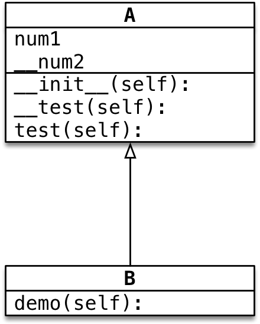

---
1
title: 14.7 Python三大特性
date: 2022-02-21 14:30:57
categories: 测试学习
tags: [python编程语言]
---


# 为什么要面向对象

- 一种编程思想
- 解决了系统的可维护性，可扩展性，可重用性。

# 面向对象三大特性：

1. **封装** 根据 **职责** 将 **属性** 和 **方法** **封装** 到一个抽象的 **类** 中
2. **继承** **实现代码的重用**，相同的代码不需要重复的编写
3. **多态** 不同的对象调用相同的方法，产生不同的执行结果，**增加代码的灵活度**

## 封装

1. 封装是面向对象编程的一大特点

2. 面向时象编程的**第一步**——将**属性**和**方法** **封装**到一个抽象的类中

3. **外界**使用**类**创建**对象**，然后让**对象调用方法**

4. **对象方法的细节**都被**封装**在**类的内部**

    > 一个对象的**属性**可以是**另外一个类创建的对象**

### 例1

需求：

- 小明体重75.0公斤

- 小明每次跑步会减肥0.5公斤

- 小明每次吃东西体重增加1公斤

    

```python
class Human:

    def __init__(self, name, weight):
        self.name = name
        self.wight = weight

    def __str__(self):
        # return '我的名字是%s，体重是%.1f公斤' % (self.name, self.wight)
        return '我的名字是{}，体重是{}公斤'.format(self.name, str(self.wight))

    def run(self):
        self.wight -= 0.5
        print(f'经过跑步后', self.name, '的体重是:', self.wight)

    def eat(self):
        self.wight += 1
        print(f'经过吃饭后', self.name, '的体重是:', self.wight)


xm = Human('小明', 75)
xm.run()
xm.eat()
print(xm)
```

结果：

```python
经过跑步后 小明 的体重是: 74.5
经过吃饭后 小明 的体重是: 75.5
我的名字是小明，体重是75.5公斤
```

### 例2（例1扩展）

需求

1. 小明和小美都爱跑步

2. 小明体重75.0公斤

3. 小美体重45.0公斤

4. 每次跑步都会减少0.5公斤

5. 每次吃东西都会增加1公斤

    

> 提示：
>
> 1. 在**对象的方法内部**，是可以**直接访问对象的属性**的
> 2. **同一个类**创建的**多个对象**之间，**属性**互不干扰！

```python
class Human:

    def __init__(self, name, weight):
        self.name = name
        self.wight = weight

    def __str__(self):
        # return '我的名字是%s，体重是%.1f公斤' % (self.name, self.wight)
        return '我的名字是{}，体重是{}公斤'.format(self.name, str(self.wight))

    def run(self):
        self.wight -= 0.5
        print(f'经过跑步后', self.name, '的体重是:', self.wight)

    def eat(self):
        self.wight += 1
        print(f'经过吃饭后', self.name, '的体重是:', self.wight)


xm = Human('小明', 75)
xm.run()
xm.eat()
print(xm)

xme = Human('小美', 45)
xme.run()
xme.eat()
print(xme)
```

结果：

```python
经过跑步后 小明 的体重是: 74.5
经过吃饭后 小明 的体重是: 75.5
我的名字是小明，体重是75.5公斤
经过跑步后 小美 的体重是: 44.5
经过吃饭后 小美 的体重是: 45.5
我的名字是小美，体重是45.5公斤
```

### 例3

需求

1. **房子**（House）有**户型**、**总面积**和**家具名称列表**

    新房子没有任何的家具

2. **家具**（Houseltem）有**名字**和**占地面积**，其中

    席梦思（bed）占地4平米

    衣柜（chest）占地2平米

    餐桌（table）占地1.5平米

3. 将以上三件**家具**添加到**房子**中

4. 打印房子时，要求输出：**户型**、**总面积**、**剩余面积**、**家具名称列表**


**剩余面积**

1. 在创建房子对象时，定义一个**剩余面积**的属性，**初始值和总面积相等**
2. 当调用`additem`方法，向房间**添加家具**时，让**剩余面积 -= 家具面积**

**思考**：应该先开发哪一个类？

​	答案一一**家具类**

1. 家具简单
2. 房子要使用到家具，被使用的类，通常应该先开发

```python
class HouseItem:

    def __init__(self, name, area):
        self.name = name
        self.area = area

    def __str__(self):
        return '家具：%s，占地：%.1f平米' % (self.name, self.area)


class House:

    def __init__(self, house_type, area):
        self.area = area
        self.house_type = house_type
        # 剩余面积
        self.free_area = area
        # 家具列表
        self.item_list = []

    # # Python能够自动的将一对括号内部的代码连接在一起
    def __str__(self):
        return ('房子的类型是：%s，总面积%.1f平米，剩余面积%.1f平米，家具名称列表%s'
                % (self.house_type, self.area, self.free_area, self.item_list))

    def add_item(self, item):
        print("要添加 %s" % item)
        # 判断家具的面积
        """
		对于item.name和item.area，他只有运行的时候才知道你传的参数是什么类型，然后再去判断该方法是否支持当前类型，如果支持，就计算，如果不支持，就报错
        就是把bed（一个 HouseItem的实例化对象）作为参数传入house的add_item方法做参数（item），但是bed本身有两个属性，name和area，所以写的时候就直接调用了方法bed.area（）
        """
        if item.area > self.free_area:
            print("%s面积太大了无法添加" % item.name)
            return
        # 将家具的名称添加到列表
        self.item_list.append(item.name)
        # 计算剩余面积
        self.free_area -= item.area


bed = HouseItem('席梦思', 7)
chest = HouseItem('衣柜', 4)
table = HouseItem('餐桌', 1.5)

house = House('两居室', 10)
house.add_item(bed)
house.add_item(chest)
house.add_item(table)

print(house)
```

结果：

```python
要添加 家具：席梦思，占地：7.0平米
要添加 家具：衣柜，占地：4.0平米
衣柜面积太大了无法添加
要添加 家具：餐桌，占地：1.5平米
房子的类型是：两居室，总面积10.0平米，剩余面积1.5平米，家具名称列表['席梦思', '餐桌']
```

### 例4

**目标**

- 士兵突击案例

需求

1. 士兵许三多有一把AK47
2. 士兵可以开火
3. 枪能够发射子弹
4. 枪装填装填子弹一一增加子弹数量


#### 1.1 开发枪类

**`shoot` 方法需求**

-  判断是否有子弹，没有子弹无法射击
-  使用 `print` 提示射击，并且输出子弹数量

#### 1.2 开发士兵类

> 假设：每一个新兵 都 **没有枪**

**定义没有初始值的属性**

在定义属性时，如果 **不知道设置什么初始值**，可以设置为 `None`

- `None` **关键字** 表示 **什么都没有**
- 表示一个 **空对象**，**没有方法和属性，是一个特殊的常量**
- 可以将 `None` 赋值给任何一个变量

**`fire` 方法需求**

- 判断是否有枪，没有枪没法冲锋
- 喊一声口号
- 装填子弹
-  射击

```python
class Gun:

    def __init__(self, model):
        self.model = model
        self.bullet_count = 0

    def add_bullet(self, count):
        self.bullet_count += count
        print('压入%d颗子弹' % count)

    def shoot(self):
        if self.bullet_count > 0:
            self.bullet_count -= 1
            print(self.model, '发射子弹1颗，剩余子弹%s' % self.bullet_count)
        else:
            print('枪中无子弹')


class Soldier:

    def __init__(self, name):
        self.name = name
        self.gun = None

    def fire(self):
        if self.gun is None:
            print('手里没有枪，撤退！')

        else:
            print('fire the hole!')
            print('士兵的名字是%s，手持%s' % (self.name, self.gun.model))
            self.gun.add_bullet(30)
            self.gun.shoot()
            self.gun.shoot()
            self.gun.shoot()


ak = Gun('AK47')

xsd = Soldier('许三多')
xsd.gun = ak
xsd.fire()
print(xsd)
```

结果：

```python
fire the hole!
士兵的名字是许三多，手持AK47
压入30颗子弹
AK47 发射子弹1颗，剩余子弹29
AK47 发射子弹1颗，剩余子弹28
AK47 发射子弹1颗，剩余子弹27
```

注释掉第41行，输出：

```python
手里没有枪，撤退！
```


## 继承

### 1.  单继承

#### 1.1 继承的概念、语法和特点

**继承的概念**：**子类** 拥有 **父类** 的所有 **方法** 和 **属性**


##### 1) 继承的语法

```python
class 类名(父类名):

    pass
```

- **子类** 继承自 **父类**，可以直接 **享受** 父类中已经封装好的方法，不需要再次开发
- **子类** 中应该根据 **职责**，封装 **子类特有的** **属性和方法**

##### 2) 专业术语

- `Dog` 类是 `Animal` 类的**子类**，`Animal` 类是 `Dog` 类的**父类**，`Dog` 类从 `Animal` 类**继承**
- `Dog` 类是 `Animal` 类的**派生类**，`Animal` 类是 `Dog` 类的**基类**，`Dog` 类从 `Animal` 类**派生**

##### 3) 继承的传递性

- `C` 类从 `B` 类继承，`B` 类又从 `A` 类继承

- 那么 `C` 类就具有 `B` 类和 `A` 类的所有属性和方法

    > **子类** 拥有 **父类** 以及 **父类的父类** 中封装的所有 **属性** 和 **方法**

**提问**

​	**哮天犬** 能够调用 `Cat` 类中定义的 `catch` 方法吗？

**答案**

​	**不能**，因为 **哮天犬** 和 `Cat` 之间没有 **继承** 关系

```python
class Animal:

    def eat(self):
        print("吃")

    def drink(self):
        print('喝')

    def run(self):
        print('跑')

    def sleep(self):
        print('睡')


class Dog(Animal):

    def bark(self):
        print('叫')


class XiaoTianQuan(Dog):

    def fly(self):
        print('飞')


class Cat(Animal):

    def catch(self):
        print('抓老鼠')


xiaotianquan = XiaoTianQuan()
xiaotianquan.drink()
xiaotianquan.eat()
xiaotianquan.run()
xiaotianquan.sleep()
xiaotianquan.fly()
xiaotianquan.bark()

miao = Cat()
miao.sleep()
miao.run()
miao.eat()
miao.drink()
miao.catch()
```

#### 1.2 方法的重写

- **子类** 拥有 **父类** 的所有 **方法** 和 **属性**
- **子类** 继承自 **父类**，可以直接 **享受** 父类中已经封装好的方法，不需要再次开发

**应用场景**

- 当 **父类** 的方法实现不能满足子类需求时，可以对方法进行 **重写(override)**


**重写** 父类方法有两种情况：

1. **覆盖** 父类的方法
2. 对父类方法进行 **扩展**

##### 1) 覆盖父类的方法

- 如果在开发中，**父类的方法实现** 和 **子类的方法实现**，**完全不同**
- 就可以使用 **覆盖** 的方式，**在子类中** **重新编写** 父类的方法实现

> 具体的实现方式，就相当于在 **子类中** 定义了一个 **和父类同名的方法并且实现**

重写之后，在运行时，**只会调用** 子类中重写的方法，而不再会调用 **父类封装的方法**

##### 2) 对父类方法进行 **扩展**

- 如果在开发中，**子类的方法实现** 中 **包含** **父类的方法实现**
    - **父类原本封装的方法实现** 是 **子类方法的一部分**
- 就可以使用 **扩展** 的方式
    1. **在子类中** **重写** 父类的方法
    2. 在需要的位置使用 `super().父类方法` 来调用父类方法的执行
    3. 代码其他的位置针对子类的需求，编写 **子类特有的代码实现**

##### 关于 `super`

- 在 `Python` 中 `super` 是一个 **特殊的类**
- `super()` 就是使用 `super` 类创建出来的对象
- **最常** 使用的场景就是在 **重写父类方法时**，调用 **在父类中封装的方法实现**

##### 调用父类方法的另外一种方式（知道）

> 在 `Python 2.x` 时，如果需要调用父类的方法，还可以使用以下方式：

```
父类名.方法(self)
```

- 这种方式，目前在 `Python 3.x` 还支持这种方式
- 这种方法 **不推荐使用**，因为一旦 **父类发生变化**，方法调用位置的 **类名** 同样需要修改

> **提示**
>
> - 在开发时，`父类名` 和 `super()` 两种方式不要混用
> - 如果使用 **当前子类名** 调用方法，会形成递归调用，**出现死循环**

```python
class Animal:

    def eat(self):
        print("吃")

    def drink(self):
        print('喝')

    def run(self):
        print('跑')

    def sleep(self):
        print('睡')


class Dog(Animal):

    def bark(self):
        print('叫')


class XiaoTianQuan(Dog):

    def fly(self):
        print('飞')

    def bark(self):
        print('嗷呜')

        super().bark()
        # python2 写法
        Dog.bark(self)
        # 递归调用自己——死循环
        # XiaoTianQuan.bark(self)


xtq = XiaoTianQuan()
xtq.bark()
```

结果：

```python
嗷呜
叫
叫
```

#### 1.3 父类的 私有属性 和 私有方法

1. **子类对象** **不能** 在自己的方法内部，**直接** 访问 父类的 **私有属性** 或 **私有方法**
2. **子类对象** 可以通过 **父类** 的 **公有方法** **间接** 访问到 **私有属性** 或 **私有方法**

> - **私有属性、方法** 是对象的隐私，不对外公开，**外界** 以及 **子类** 都不能直接访问
> - **私有属性、方法** 通常用于做一些内部的事情

**示例**



- `B` 的对象不能直接访问 `__num2` 属性
- `B` 的对象不能在 `demo` 方法内访问 `__num2` 属性
- `B` 的对象可以在 `demo` 方法内，调用父类的 `test` 方法
- 父类的 `test` 方法内部，能够访问 `__num2` 属性和 `__test` 方法

```python
class A:

    def __init__(self):
        self.num1 = 100

    # 父类的公有方法
    def test(self):
        # 父类的公有属性
        print('父类的公有属性')


class B(A):

    def demo(self):
        self.test()
        print(self.num1)


# 子类可以在自己的方法内部访问父类的公有属性和公有方法
b = B()
b.demo()
# 子类可以在外部直接访问父类的公有属性和公有方法
b.test()
print(b.num1)
```

```python
class A:

    def __init__(self):
        self.__num2 = 200

    # 父类的私有属性
    def __test(self):
        print('父类的私有方法')

    def test(self):
        self.__test()
        print(self.__num2)


class B(A):

    def demo(self):
        self.test()


# 子类可以在父类的公有方法调用到父类的私有属性和私有方法,但不能在自己的方法内访问父类私有属性
b = B()
b.demo()
```

### 2. 多继承

**概念**

- **子类** 可以拥有 **多个父类**，并且具有 **所有父类** 的 **属性** 和 **方法**

- **语法**

    ```python
    class 子类名(父类名1, 父类名2...)
        pass
    ```

- 例如：**孩子** 会继承自己 **父亲** 和 **母亲** 的 **特性**


```python
class A:

    def test(self):
        print('--------A---------')


class B:

    def demo(self):
        print('--------B---------')


class C(A, B):
    pass


c = C()
c.test()
c.demo()
```

结果：

```python
--------A---------
--------B---------
```

#### 2.1 多继承的使用注意事项

**问题的提出**

- 如果 **不同的父类** 中存在 **同名的方法**，**子类对象** 在调用方法时，会调用 **哪一个父类中**的方法呢？

> 提示：**开发时，应该尽量避免这种容易产生混淆的情况！** —— 如果 **父类之间** 存在 **同名的属性或者方法**，应该 **尽量避免** 使用多继承


```python
class A:

    def test(self):
        print('--------A---------')

    def demo(self):
        print('--------A---------')

class B:

    def test(self):
        print('--------B---------')

    def demo(self):
        print('--------B---------')


class C(A, B):
    pass


c = C()
c.test()
c.demo()
```

结果：

```python
--------A---------
--------A---------
```

如果18行改为：`class C(B, A):`

则结果变成：

```python
--------B---------
--------B---------
```

##### Python 中的 MRO —— 方法搜索顺序（知道）

- `Python` 中针对 **类** 提供了一个 **内置属性** `__mro__` 可以查看 **方法** 搜索顺序
- MRO 是 `method resolution order`，主要用于 **在多继承时判断 方法、属性 的调用 路径**

```python
print(C.__mro__)
```

对于原来的代码，输出结果：

```python
(<class '__main__.C'>, <class '__main__.A'>, <class '__main__.B'>, <class 'object'>)
```

- 在搜索方法时，是按照 `__mro__` 的输出结果 **从左至右** 的顺序查找的
- 如果在当前类中 **找到方法，就直接执行，不再搜索**
- 如果 **没有找到，就查找下一个类** 中是否有对应的方法，**如果找到，就直接执行，不再搜索**
- 如果找到最后一个类，还没有找到方法，程序报错

#### 2.2 新式类与旧式（经典）类

> `object` 是 `Python` 为所有对象提供的 **基类**，提供有一些内置的属性和方法，可以使用 `dir` 函数查看

- **新式类**：以 `object` 为基类的类，**推荐使用**
- **经典类**：不以 `object` 为基类的类，**不推荐使用**
- 在 `Python 3.x` 中定义类时，如果没有指定父类，会 **默认使用** `object` 作为该类的 **基类** —— `Python 3.x` 中定义的类都是 **新式类**
- 在 `Python 2.x` 中定义类时，如果没有指定父类，则不会以 `object` 作为 **基类**

> **新式类** 和 **经典类** 在多继承时 —— **会影响到方法的搜索顺序**

为了保证编写的代码能够同时在 `Python 2.x` 和 `Python 3.x` 运行！ 今后在定义类时，**如果没有父类，建议统一继承自 `object`**

```python
class 类名(object):
    pass
```

查看一个类的所有方法：

```python
print(c.__dir__())
```

得到`object`的所有方法：


## 多态

### 目标

- 多态

**面向对象三大特性**

1. **封装** 根据 **职责** 将 **属性** 和 **方法** **封装** 到一个抽象的 **类** 中

    - 定义类的准则

2. **继承** **实现代码的重用**，相同的代码不需要重复的编写

    - 设计类的技巧
    - 子类针对自己特有的需求，编写特定的代码

3. **多态** 不同的 **子类对象** 调用相同的 **父类方法**，产生不同的执行结果

    - **多态** 可以 **增加代码的灵活度**
    - 以 **继承** 和 **重写父类方法** 为前提
    - 是调用方法的技巧，**不会影响到类的内部设计**

    

### 多态案例演练

**需求**

1. 在`Dog`类中封装方法`game`
    - 普通狗只是简单的玩耍
2. 定义`XiaoTianDog`继承自`Dog`，并且重写`game`方法
    - 哮天犬需要在天上玩耍
3. 定义`Person`类，并且封装一个和狗玩的方法
    - 在方法内部，直接让 **狗对象** 调用 `game` 方法


**案例小结**

`Person`类中只需要让狗对象调用`game`方法，而不关心具体是什么狗

- `game` 方法是在 `Dog` 父类中定义的

在程序执行时，传入不同的 **狗对象** 实参，就会产生不同的执行效果

> **多态** 更容易编写出出通用的代码，做出通用的编程，以适应需求的不断变化！


```python
class Dog:

    def __init__(self, name):
        self.name = name

    def game(self):
        print('%s快快乐乐的玩耍' % self.name)


class XiaoTian:

    def __init__(self, name):
        self.name = name

    def game(self):
        print('%s在天上玩耍' % self.name)


class Person:

    def __init__(self, name):
        self.name = name

    def game_with_dog(self, dog):
        print('%s 和 %s 在一起玩耍' % (self.name, dog.name))
        dog.game()


dog = Dog('旺财')
xm = Person('小明')
xm.game_with_dog(dog)
```

结果：

```python
小明 和 旺财 在一起玩耍
旺财快快乐乐的玩耍
```

如果修改实例化及调用代码

```python
xt = XiaoTian('飞天旺财')

xm = Person('小明')
xm.game_with_dog(xt)
```

结果：

```python
小明 和 飞天旺财 在一起玩耍
飞天旺财在天上玩耍
```

# 私有属性和私有方法

## 1.  应用场景及定义方式

**应用场景**

- 在实际开发中，**对象** 的 **某些属性或方法** 可能只希望 **在对象的内部被使用**，而 **不希望在外部被访问到**
- **私有属性** 就是 **对象** 不希望公开的 **属性**
- **私有方法** 就是 **对象** 不希望公开的 **方法**

**定义方式**

1. 通常我们约定，两个下划线开头的属性是私有的（private）。其他为公共的（public）；
2. 类内部可以访问私有属性（方法）；
3. 类外部不能直接访问私有属性（方法）；
4. 类外部可以通过 `_类名__私有属性（方法）` 访问私有属性（方法）

例子：


```python
class Women:

    def __init__(self, name):
        self.name = name
        self.__age = 18

    def __secret(self, weight):
        print(f'我的名字是{self.name}，体重是{weight}，年龄是{self.__age}')


women = Women('小芳')
women._Women__secret(100)
print(women._Women__age)
```

## 2.  伪私有属性和私有方法（科普）

> 提示：在日常开发中，**不要使用这种方式**，**访问对象的 私有属性 或 私有方法**

`Python` 中，并没有 **真正意义** 的 **私有**

- 在给 **属性**、**方法** 命名时，实际是对 **名称** 做了一些特殊处理，使得外界无法访问到
- **处理方式**：在 **名称** 前面加上 `_类名` => `_类名__名称`

