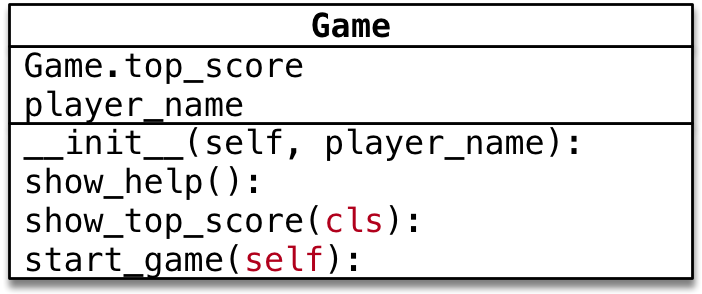

# 类属性和类方法

## 目标

- 类的结构
- 类属性和实例属性
- 类方法和静态方法

## 1. 类的结构

### 1.1 术语 —— 实例

1. 使用面向对象开发，**第 1 步** 是设计 **类**

2. 使用`类名()`创建对象，**创建对象**的动作有两步：

    1. 在内存中为对象 **分配空间**
    2. 调用初始化方法 `__init__` 为 **对象初始化**

3. 对象创建后，**内存** 中就有了一个对象的 **实实在在** 的存在 —— **实例**

    

    因此，通常也会把：

    1. 创建出来的 **对象** 叫做 **类** 的 **实例**
    2. 创建对象的 **动作** 叫做 **实例化**
    3. **对象的属性** 叫做 **实例属性**
    4. **对象调用的方法** 叫做 **实例方法**

    在程序执行时：

    1. 对象各自拥有自己的 **实例属性**
    2. 调用对象方法，可以通过 `self.`
        - 访问自己的属性
        - 调用自己的方法

    **结论**

    - **每一个对象** 都有自己 **独立的内存空间**，**保存各自不同的属性**
    - **多个对象的方法**，**在内存中只有一份**，在调用方法时，**需要把对象的引用**(self) 传递到方法内部

### 1.2 类是一个特殊的对象

> `Python` 中 **一切皆对象**：
>
> - `class AAA:` 定义的类属于 **类对象**
> - `obj1 = AAA()` 属于 **实例对象**

- 在程序运行时，**类** 同样 **会被加载到内存**
- 在 `Python` 中，**类** 是一个特殊的对象 —— **类对象**
- 在程序运行时，**类对象** 在内存中 **只有一份**，使用 **一个类** 可以创建出 **很多个对象实例**
- 除了封装**实例**的**属性**和方法外，**类对象**还可以拥有自己的**属性**和**方法**
    1. **类属性**
    2. **类方法**
- 通过 **类名.** 的方式可以 **访问类的属性** 或者 **调用类的方法**

​	

## 2. 类属性和实例属性

### 2.1 概念和使用

- **类属性** 就是给 **类对象** 中定义的 **属性**
- 通常用来记录 **与这个类相关** 的特征
- **类属性** **不会用于**记录 **具体对象的特征**

**示例需求**

- 定义一个 **工具类**
- 每件工具都有自己的 `name`
- **需求** —— 知道使用这个类，创建了多少个工具对象？


```python
class Tool:
    count = 0

    def __init__(self, name):
        print('工具的名称是：%s' % name)
        Tool.count += 1


tool1 = Tool('斧子')
tool2 = Tool('锤子')
tool3 = Tool('锯子')
print(f'工具类一共有{Tool.count}个')
```

结果：

```python
工具的名称是：斧子
工具的名称是：锤子
工具的名称是：锯子
工具类一共有3个
```

如果打印输出改为：`print(f'工具类一共有{tool3.count}个')`，则结果仍然不变。

### 2.2 属性的获取机制（科普）

- 在 `Python` 中 **属性的获取** 存在一个 **向上查找机制**

    

    - 因此，要访问类属性有两种方式：
        1. **类名.类属性**
        2. **对象.类属性** （不推荐）

    **注意**

    - 如果使用 `对象.类属性 = 值` 赋值语句，只会 **给对象添加一个属性**，而不会影响到 **类属性的值**

    对于上文的例子，如果添加：`tool3.count = 99`，则输出结果变为：`工具类一共有99个`，而类属性的`count`仍然为3。

## 3. 类方法和静态方法

### 3.1 类方法

- **类属性**就是针对**类对象**定义的属性
    - 使用 **赋值语句** 在 `class` 关键字下方可以定义 **类属性**
    - **类属性** 用于记录 **与这个类相关** 的特征
- **类方法**就是针对**类对象**定义的方法
    - 在 **类方法** 内部可以直接访问 **类属性** 或者调用其他的 **类方法**

**语法如下**

```python
@classmethod
def 类方法名(cls):
    pass
```

- 类方法需要用 **修饰器** `@classmethod` 来标识，**告诉解释器这是一个类方法**

- **类方法**的**第一个参数**应该是`cls`

    - 由 **哪一个类** 调用的方法，方法内的 `cls` 就是 **哪一个类的引用**
    - 这个参数和 **实例方法** 的第一个参数是 `self` 类似
    - **提示** 使用其他名称也可以，不过习惯使用 `cls`

- 通过 **类名.** 调用 **类方法**，**调用方法时**，不需要传递 `cls` 参数

- 在方法内部

    - 可以通过 `cls.` **访问类的属性**
    - 也可以通过 `cls.` **调用其他的类方法**
    - **类方法内**，不可以直接调用**实例方法**及**实例变量**
- 在调用时，**类**和实例都可以直接调用**类方法**

**示例需求**

- 定义一个 **工具类**

- 每件工具都有自己的 `name`

- **需求** —— 在 **类** 封装一个 `show_tool_count` 的类方法，输出使用当前这个类，创建的对象个数

    

```python
class Tool:
    count = 0

    @classmethod
    def show_tool_count(cls):
        print('工具类的个数是：%d个' % cls.count)

    def __init__(self, name):
        print('工具的名称是：%s' % name)
        Tool.count += 1


tool1 = Tool('斧子')
tool2 = Tool('锤子')
tool3 = Tool('锯子')
Tool.show_tool_count()
```

结果：

```
工具的名称是：斧子
工具的名称是：锤子
工具的名称是：锯子
工具类的个数是：3个
```

> 在类方法内部，可以直接使用 `cls` 访问 **类属性** 或者 **调用类方法**

### 3.2 静态方法

- 在开发时，如果需要在 **类** 中封装一个方法，这个方法：
    - 既 **不需要** 访问 **实例属性** 或者调用 **实例方法**
    - 也 **不需要** 访问 **类属性** 或者调用 **类方法**
- 这个时候，可以把这个方法封装成一个 **静态方法**

**语法如下**

```python
@staticmethod
def 静态方法名():
    pass
```

- **静态方法** 需要用 **修饰器** `@staticmethod` 来标识，**告诉解释器这是一个静态方法**
- 通过 **`类名.`** 调用 **静态方法**（或者通过**`实例.方法名`**进行调用）
- 不需要**实例化**即可进行**调用静态方法**

```python
class Dog:

    @staticmethod
    def run():
        print('跑跑跳跳')


Dog.run()
```

结果：

```python
跑跑跳跳
```

### 3.3 方法综合案例

**需求**

- 设计一个 `Game` 类
- 属性：
    - 定义一个 **类属性** `top_score` 记录游戏的 **历史最高分**
    - 定义一个 **实例属性** `player_name` 记录 **当前游戏的玩家姓名**
- 方法：
    - **静态方法** `show_help` 显示游戏帮助信息
    - **类方法** `show_top_score` 显示历史最高分
    - **实例方法** `start_game` 开始当前玩家的游戏
- 主程序步骤
    - 查看帮助信息
    - 查看历史最高分
    - 创建游戏对象，开始游戏



```python
class Game:
    top_score = 1000

    def __init__(self, player_name):
        self.player_name = player_name

    @staticmethod
    def show_help():
        print('本游戏很好玩，欢迎来玩')

    @classmethod
    def show_top_score(cls):
        print(f'历史最高分是：{cls.top_score}！')

    def start_game(self):
        print(f'玩家：{self.player_name}，现在要开始游戏了哦~')


Game.show_help()
Game.show_top_score()
xm = Game('小明')
xm.start_game()
```

结果：

```python
本游戏很好玩，欢迎来玩
历史最高分是：1000！
玩家：小明，现在要开始游戏了哦~
```

#### 案例小结

1. 实例方法—— 方法内部需要访问**实例属性**
    - **实例方法** 内部可以使用 **类名.** 访问类属性
2. **类方法** —— 方法内部 **只** 需要访问 **类属性**
3. **静态方法** —— 方法内部，不需要访问 **实例属性** 和 **类属性**

**提问**

如果方法内部 即需要访问 **实例属性**，又需要访问 **类属性**，应该定义成什么方法？

**答案**

- 应该定义 **实例方法**
- 因为，**类只有一个**，在 **实例方法** 内部可以使用 **类名.** 访问类属性

# 普通方法、类方法、静态方法对比

|   名称   |          定义          |                 调用                 |    关键字     |                  使用场景                  |                          代表                          |
| :------: | :--------------------: | :----------------------------------: | :-----------: | :----------------------------------------: | :----------------------------------------------------: |
| 普通方法 | 至少需要一个参数`self` |          `实例名.方法名()`           |      无       |      方法内部涉及到实例对象属性的操作      |   第一个参数需要是`self`，它表示一个具体的实例本身。   |
|  类方法  | 至少需要一个`cls`参数  | `类名.方法名()`或者`实例名.方法名()` | @classmethod  | 如果需要对类属性，即静态变量进行限制性操作 |        它的第一个参数是`cls`，它表示这个类本身         |
| 静态方法 |       无默认参数       | `类名.方法名()`或者`实例名.方法名()` | @staticmethod |              无需类或实例参与              | 可以无视这个`self`，而将这个方法当成一个普通的函数使用 |

例1：

```python
class DateFormat:

    def __init__(self, year, month, day):
        self.year = year
        self.month = month
        self.day = day

    def out_date(self):
        print(f"输入的时间为{self.year}年，{self.month}月，{self.day}日")

    @classmethod
    def json_format(cls, js_data):
        """
        输入一个字典格式的数据信息，返回一个对象
        """
        # 使用[key]访问键对应的值
        # result储存键对应的值，result是元组类型的
        result = js_data['year'], js_data['month'], js_data['day']
        print(type(result))
        return cls(result[0], result[1], result[2])


json_data = {'year': 2021, 'month': 12, 'day': 7}
# 使用json格式化，生成想要的日期格式，返回一个DataFormat的实例
demo = DateFormat.json_format(json_data)
# <class '__main__.DateFormat'> ---->  指的是类DateFormat的一个实例
print(type(demo))
demo.out_date()
```

结果：

```python
<class 'tuple'>
<class '__main__.DateFormat'>
输入的时间为2021年，12月，7日
```

自己改写：因为我想试试用列表返回值（路走远了）

```python
class DateFormat:

    def __init__(self, year, month, day):
        self.year = year
        self.month = month
        self.day = day

    def out_date(self):
        print(f"输入的时间为{self.year}年，{self.month}月，{self.day}日")

    @classmethod
    def json_format(cls, js_data):
        """
        输入一个字典格式的数据信息，返回一个d'x
        """
        # 使用[key]访问键对应的值
        year, month, day = js_data['year'], js_data['month'], js_data['day']
        # 把得到的year, month, day组合成列表
        result = [year, month, day]
        print(result)
        print(type(result))
        # 列表索引值的0，1，2位分别对应year, month, day
        return cls(result[0], result[1], result[2])


json_data = {'year': 2021, 'month': 12, 'day': 7}
# 使用json格式化，生成想要的日期格式，返回一个DataFormat的实例
demo = DateFormat.json_format(json_data)
# <class '__main__.DateFormat'> ---->  指的是类DateFormat的一个实例
print(type(demo))
demo.out_date()
```

结果：

```python
[2021, 12, 7]
<class 'list'>
<class '__main__.DateFormat'>
输入的时间为2021年，12月，7日
```

