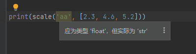
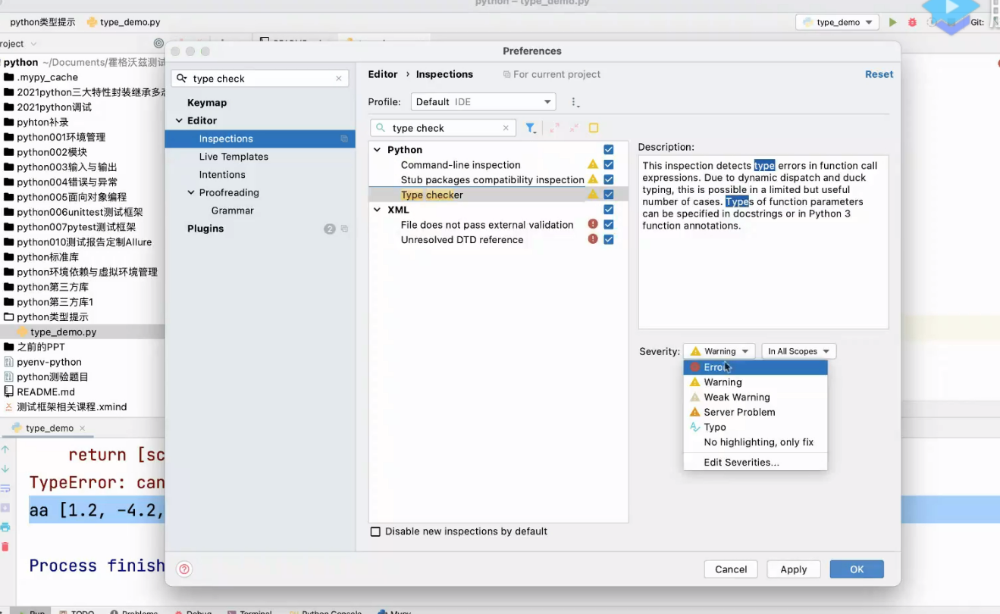
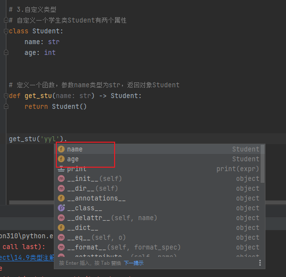
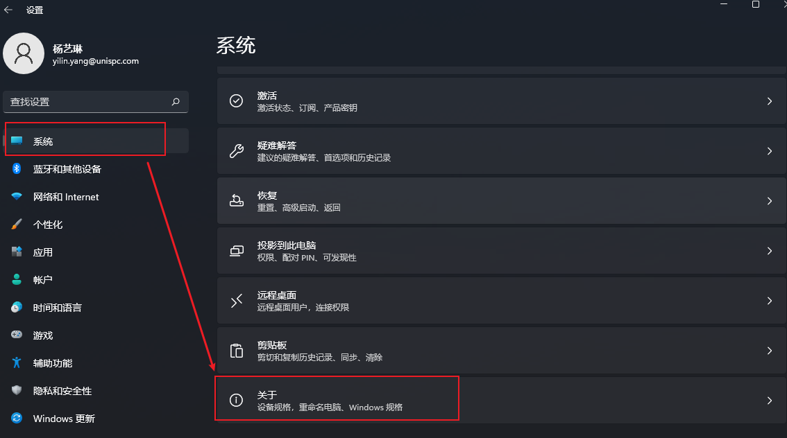
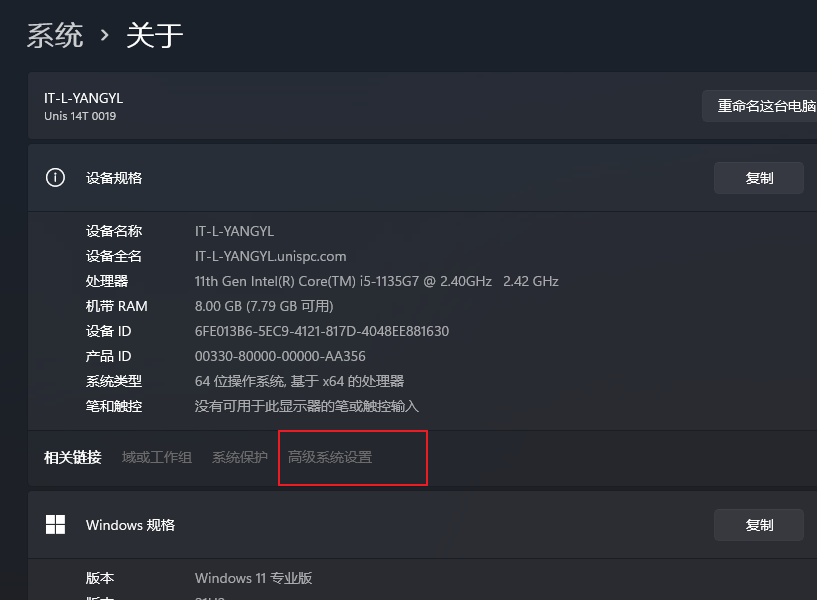
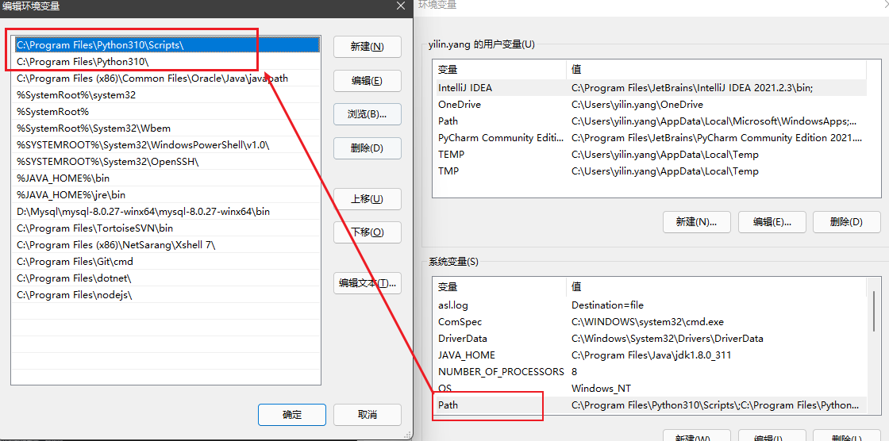
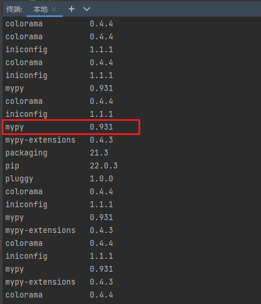
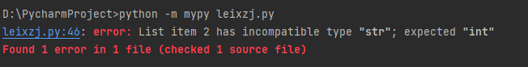
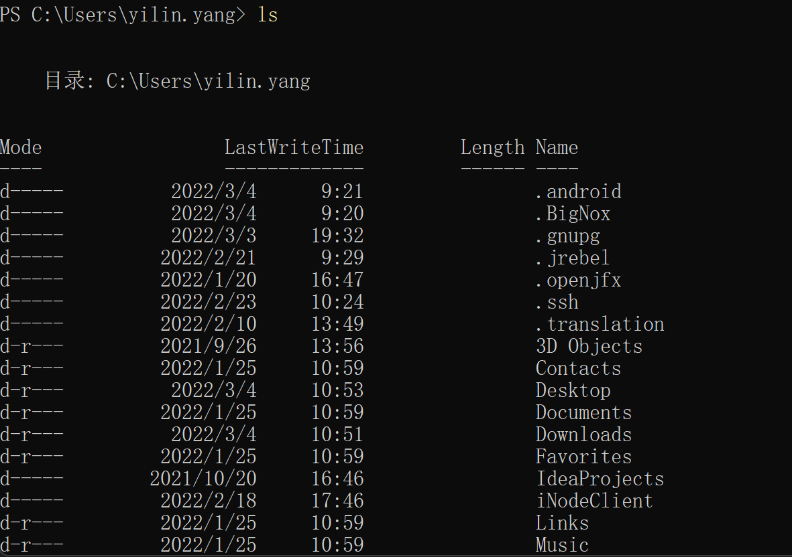
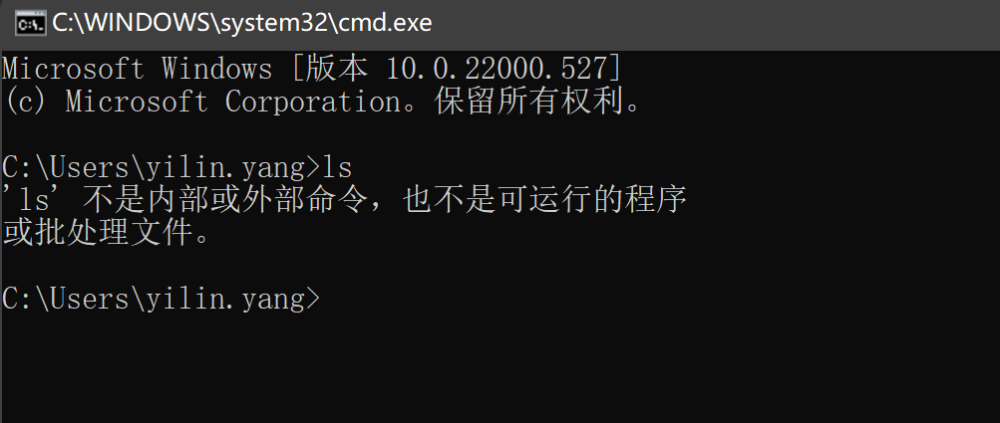

---


title: 14.9 类型注解
date: 2022-03-03 15:43:51
categories: 测试学习
tags: [python编程语言]

---

# 1 类型提示

python类型支持提示：https://docs.python.org/zh-cn/3/library/typing.html

例子：

```python
# 定义一个函数，参数name的类型是字符串string，函数返回结果类型也是string
def greeting(name: str) -> str:
    # name的类型是str所以name可以调用字符串的方法split(),分割后返回字符串列表
    print(name.split(','))
    # 取分割后第三个元素加上'Hello'
    return 'Hello' + name.split(',')[2]


print(greeting(' python, java, C++'))
```

结果：

```python
[' python', ' java', ' C++']
Hello C++
```

**类型提示的好处：**

- 增强代码可读性
- ide中代码提示
- 静态代码检查

# 2 IDE中代码提示功能

## 2.1 类型别名：

例子：

```python
from typing import List

# List列表需要导入
Vector = List[float]


# 函数scale有两个参数：float型的scalar和自己定义的类型Vector的参数vector(列表中每个元素都是float型的)，返回值也是类型Vector
def scale(scalar: float, vector: Vector) -> Vector:
    # 返回scalar乘以vector中每个元素，返回一个列表
    return [scalar * num for num in vector]


print(scale(1.2, [2.3, 4.6, 5.2]))
```

结果：

```python
[2.76, 5.52, 6.24]
```

如果输入参数错误，会有提示：



也可以设置提示类型为`ERROR`



## 2.2 自定义类型

例子：

```python
class Student:
    name: str
    age: int


# 定义一个函数，参数name类型为str，返回对象Student
def get_stu(name: str) -> Student:
    return Student()


get_stu('yyl').  --->有提示信息
```

可以看到有提示信息：可以调用类的属性



# 3 静态代码检查功能

**首先需要安装mypy：**

step1：查看环境变量







step2：在`pycharm`终端输入`pip install mypy`进行安装

step3：`pip list`查看是否有`mypy`



输入代码：

```python
from typing import List

a: List[int] = []
a = [1, 2, '1']
```

step4：在终端输入：`python -m mypy 文件名.py`后，终端打印出错误提示信息：



说明在文件`leixzj.py`中第46行出现错误：列表项2（List[2]）的类型“str”不兼容；应为“int”

# 4 补充：终端区别

cmd是和powershell都可以做命令行交互，批处理和powershell脚本功能也相当。

## 4.1 PowerShell

powershell是执行linux的，gitbash也是，带$的也是。比如输入`ls`命令，在powershell可以执行。但是在cmd里不能，cmd是windows的终端，他没有ls命令。



## 4.2 CMD

cmd是windows的终端。输入ls命令：


