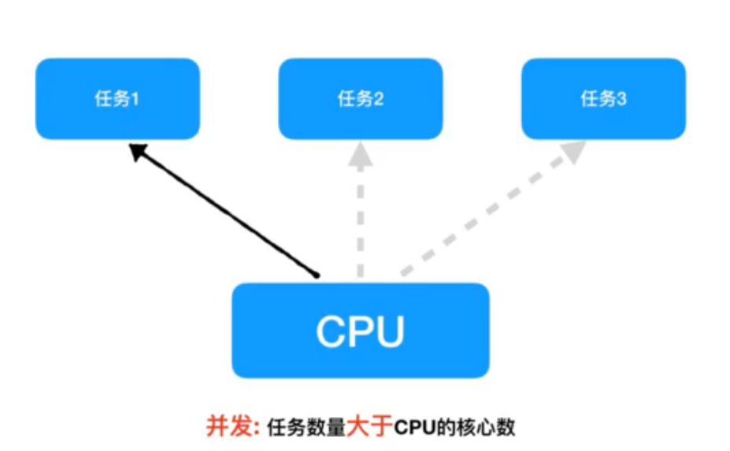
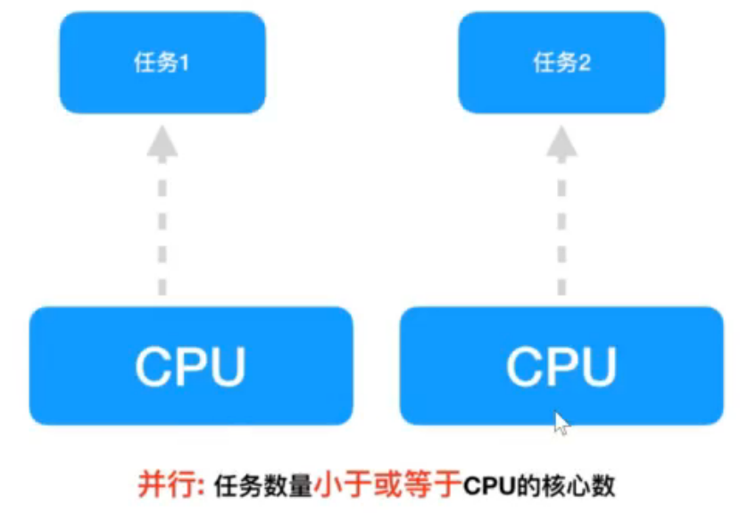
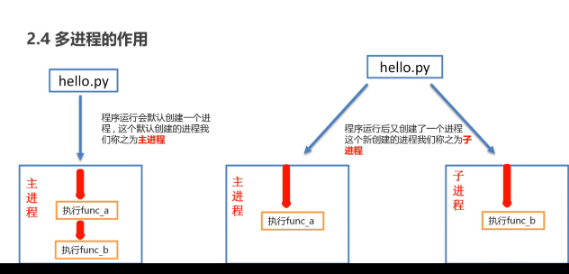
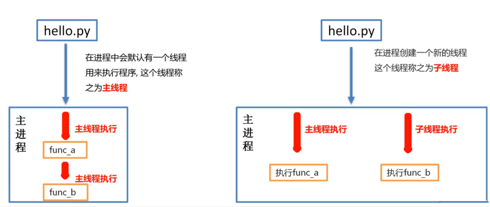

多线程

## 1 多任务

多任务的最大好处是充分利用CPU资源，提高程序的执行效率。

### 1.1多任务的概念

多任务是指在同一时间内执行多个任务。

### 1.2多任务的两种表现形式

- 并发（在一段时间内交替去执行多个任务）
- 并行（在一段时间内真正的同时一起执行多个任务）

#### 1.2.1 并发

在一段时间内交替去执行多个任务。



例子：
对于单核cu处理多任务，操作系统**轮流**让各个任务交替执行。

#### 1.2.2 并行

在一段时间内真正的同时一起执行多个任务。



例子：
对于多核CPU处理多任务，操作系统会给CPU的每个内核安排一个执行的任务，多个内核是真正的**一起同时执行多个任务**。这里需要注意多核CPU是并行的执行多任务，始终有多个任务一起执行。

## 2 进程

### 2.1 程序中实现多任务的方式

在Python中，想要实现多任务可以使用多进程来完成。

### 2.2 进程的概念

进程（Process）是**资源分配的最小单位**，它是**操作系统进行资源分配和调度运行的基本单位**，通俗理解：一个**正在运行**的程序就是一个进程。例如：正在运行的QQ，微信等他们都是一个进程。

> 注意：
> 一个程序运行后至少有一个进程。

### 2.3 进程的作用

对于`hello.py`文件：

```python
def fun_a():
    print('a')    
def fun_b():
    print('b')

fun_a()
fun_b()
```

这是是一个非常简单的程序，一旦运行`hello.py`这个程序，按照代码的执行顺序，`fun_a`函数执行完毕后才能执行`fun_b`函数。如果可以让`fun_a`和`fun_b`同时运行，显然执行`hello.py`这个程序的效率会大大提升。



## 3 多进程完成多任务

### 3.1 进程的创建步骤

1. 导入进程包

    `import multiprocessing`

2. 通过进程类创建进程对象

    `进程对象 = multiprocessing.Process()`

3. 启动进程执行任务

    `进程对象.start()`

### 3.2 通过进程类创建进程对象

`进程对象 = multiprocessing.Process(target = 任务名)`

| 参数名 | 说明                                       |
| ------ | ------------------------------------------ |
| target | 执行的目标任务名，这里指的是函数名(方法名) |
| name   | 进程名，一半不用设置                       |
| group  | 进程组，目前只能使用None                   |

### 3.3 进程创建与启动的代码

如果有一个程序：

```python
import time


def sing():
    for i in range(3):
        print('唱歌')
        time.sleep(0.5)


def dance():
    for i in range(3):
        print('跳舞')
        time.sleep(0.5)

if __name__ == '__main__':
    sing()
    dance()
```

结果：

```
唱歌
唱歌
唱歌
跳舞
跳舞
跳舞
```

这个程序需要执行6次，花费3秒时间。现在对程序进行改写，让其1.5秒内执行完毕。

对`main`函数进行修改，并导入：`import multiprocessing `

```python
if __name__ == '__main__':
    # 创建子进程
    sing_process = multiprocessing.Process(target=sing)
    dance_process = multiprocessing.Process(target=dance)
    # 启动进程
    sing_process.start()
    dance_process.start()
```

程序只执行三次，每一次都是唱歌和跳舞同时执行，用时1.5秒。

```
跳舞
唱歌
跳舞
唱歌
跳舞
唱歌
```

## 4 进程执行带有参数的任务

### 4.1 参数

| 参数名   | 说明                       |
| -------- | -------------------------- |
| `args`   | 以元组的方式给执行任务传参 |
| `kwargs` | 以字典方式给执行任务传参   |

### 4.2 `args`参数的使用

元组方式传参：元组方式传参一定要和参数的顺序保持一致。

### 4.3 kwargs参数的使用

字典方式传参：字典方式传参字典中的`key`一定要和参数名保持一致。

改写例子：

```python
import multiprocessing
import time


def sing(num):
    for i in range(num):
        print('唱歌')
        time.sleep(0.5)


def dance(num):
    for i in range(num):
        print('跳舞')
        time.sleep(0.5)


if __name__ == '__main__':
    # 创建子进程
    # args:表示以元组的方式给函数传参,元组的元素顺序必须和函数参数的顺序一致
    sing_process = multiprocessing.Process(target=sing, args=(3,))
    # kwargs:表示以字典的方式给函数传参，字典的键对应函数的形参，值对应实参
    dance_process = multiprocessing.Process(target=dance, kwargs={'num': 2})
    # 启动进程
    sing_process.start()
    dance_process.start()
```

结果：

```
唱歌
跳舞
唱歌
跳舞
唱歌
```

## 5 获取进程编号

进程编号的作用：当程序中进程的数量越来越多时，如果没有办法区分主进程和子进程还有不同的子进程，那么就无法进行有效的进程管理，为了方便管理实际上每个进程都是有自己编号的。

### 5.1 获取进程编号的两种方式

`import os`

1. 获取当前进程编号

    `os.getpid()`

2. 获取当前父进程编号

    `os.getppid()`

```python
import multiprocessing
import time
import os


def sing(num):
    print('唱歌进程的pid：', os.getpid())
    print('唱歌进程的ppid：', os.getppid())
    for i in range(num):
        print('唱歌')
        time.sleep(0.5)


def dance(num):
    print('跳舞进程的pid：', os.getpid())
    print('跳舞进程的ppid：', os.getppid())
    for i in range(num):
        print('跳舞')
        time.sleep(0.5)

# 主进程，也是两个子进程（唱歌、跳舞）的父进程
if __name__ == '__main__':
    print('主进程的pid为：', os.getpid())
    # 创建子进程对象并指定执行的任务名：函数名
    sing_process = multiprocessing.Process(target=sing, args=(3,))
    dance_process = multiprocessing.Process(target=dance, kwargs={'num': 2})
    # 启动子进程并执行任务
    sing_process.start()
    dance_process.start()
```

结果：

```
主进程的pid为： 12988
唱歌进程的pid： 16980
跳舞进程的pid： 12912
唱歌进程的ppid： 12988
跳舞进程的ppid： 12988
跳舞
唱歌
跳舞
唱歌
唱歌
```

## 6 进程的注意点

### 6.1 主进程会等待所有的子进程执行结束再结束

```python
import multiprocessing
import time


def work():
    # 子进程会工作2秒
    for i in range(10):
        print("工作中···········")
        time.sleep(0.2)


if __name__ == '__main__':
    # 创建子进程
    work_process = multiprocessing.Process(target=work)
    work_process.start()
    # 让主进程等待一秒钟
    time.sleep(1)
    print('主进程执行完毕')
    # 主进程会等待所有的子进程执行完成之后程序再退出
```

输出：

```
工作中···········
工作中···········
工作中···········
工作中···········
工作中···········
主进程执行完毕
工作中···········
工作中···········
工作中···········
工作中···········
工作中···········
```

但是结果并不是所有的子进程结束之后才会执行主进程，因此需要进行更改。

### 6.2 设置守护主进程

改写上面的代码：在15行子进程启动前加入以下代码：

```python
# 子进程会去守护主进程——主进程结束，子进程自动销毁，不再执行子进程代码
work_process.daemon = True
```

再次执行，输出：

```
工作中···········
工作中···········
工作中···········
工作中···········
工作中···········
主进程执行完毕
```

### 6.3 知识要点

为了保证子进程能够正常的运行，主进程会等所有的子进程执行完成以后再销毁，设置守护主进程的目的是主**进程退出子进程销毁**，不让主进程再等待子进程去执行。

设置守护主进程方式：`子进程对象.daemon = True`

## 7 线程

### 7.1 实现多任务的另一种形式

在Python中，想要实现多任务还可以使用多线程来完成。

### 7.2 为什么使用多线程？

进程是**分配资源的最小单位**，一旦创建一个进程就会分配一定的资源，就像跟两个人聊QQ就需要打开两个QQ软件一样是比较浪费资源的。
线程是**程序执行的最小单位**，实际上进程只负责分配资源，而利用这些资源执行程序的是线程，也就说**进程是线程的容器**，一个进程中最少有一个线程来负责执行程序。同时线程自己不拥有系统资源，只需要一点儿在运行中必不可少的资源，但它可与**同属一个进程的其它线程共享进程所拥有的全部资源**。这就像通过一个QQ软件（一个进程）打开两个窗口（两个线程）跟两个人聊天一样，实现多任务的同时也节省了资源。

### 7.3 多线程的作用



## 8 多线程完成多任务

### 8.1 线程的创建步骤

1. 导入线程包

    `import threading`

2. 通过线程类创建进程对象

    `线程对象 = threading.Thread(target = 任务名)`

3. 启动线程执行任务

    `线程对象.start()`

### 8.2 通过线程类创建线程对象

| 参数名 | 说明                                         |
| ------ | -------------------------------------------- |
| target | 执行的目标任务名，这里指的是函数名（方法名） |
| name   | 线程名，一般不用设置                         |
| group  | 线程组，目前只能使用None                     |

### 8.3 线程创建与启动的代码

```python
import threading
import time


def sing():
    for i in range(3):
        print('唱歌')
        time.sleep(1)


def dance():
    for i in range(3):
        print('跳舞')
        time.sleep(1)

if __name__ == '__main__':

    # 创建子线程
    sing_thread = threading.Thread(target=sing)
    dance_thread = threading.Thread(target=dance)
    # 启动线程
    sing_thread.start()
    dance_thread.start()
```

结果：

```
唱歌
跳舞
跳舞
唱歌
跳舞
唱歌
```

程序只执行三次，每一次都是唱歌和跳舞同时执行。

## 9 线程执行带有参数的任务

### 9.1 参数

| 参数名   | 说明                       |
| -------- | -------------------------- |
| `args`   | 以元组的方式给执行任务传参 |
| `kwargs` | 以字典方式给执行任务传参   |

### 9.2 `args`参数的使用

元组方式传参：元组方式传参一定要和参数的顺序保持一致。

### 9.3 kwargs参数的使用

字典方式传参：字典方式传参字典中的`key`一定要和参数名保持一致。

## 10 主线程和子线程的结束顺序

对比进程：主线程会等待所有的子线程执行结束后主线程再结束。

### 10.1 设置守护主线程

要想主线程不等待子线程执行完成可以设置守护主线程。

```python
import threading
import time


def work():
    for i in range(10):
        print('工作············')
        time.sleep(0.2)


if __name__ == '__main__':

    # 创建子线程
    work_thread = threading.Thread(target=work, daemon=True)
    # 启动线程
    work_thread.start()
    # 主线程等待一秒后，结束
    time.sleep(1)
    print('主线程结束了')
```

结果：

```
工作············
工作············
工作············
工作············
工作············
主线程结束了
```

## 11 线程间的执行顺序

线程之间执行是无序的，是由**CPU调度决定某个线程先执行**的。

```python
import threading
import time


def work():
    time.sleep(1)
    # current_thread()：获取当前线程的线程对象
    thread = threading.current_thread()
    print(thread)


if __name__ == '__main__':
    for i in range(5):
        sub_thread = threading.Thread(target=work)
        sub_thread.start()
```

结果：

```
<Thread(Thread-5 (work), started 24344)><Thread(Thread-2 (work), started 1452)>
<Thread(Thread-3 (work), started 19044)>
<Thread(Thread-4 (work), started 19784)>

<Thread(Thread-1 (work), started 5236)>
```

## 12 进程和线程对比

### 12.1 关系对比

- 线程是依附在进程里面的，没有进程就没有线程
- 一个进程默认提供一条线程，进程可以创建多个线程

### 12.2 区别对此

- 创建进程的资源开销要比创建线程的资源开销要大
- 进程是操作系统资源分配的基本单位，线程是CPU调度的基本单位
- 线程不能够独立执行，必须依存在进程中

### 12.3 优缺点对比

- 进程优缺点：
    - 优点：可以用多核
    - 缺点：资源开销大
- 线程优缺点：
    - 优点：资源开销小
    - 缺点：不可用多核
