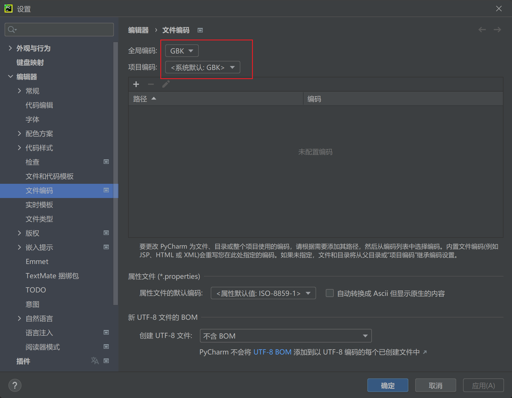

# 1 内置库os

## 1.1 os概述

- os: Operating System
- os 模块的常用功能
- 跨平台的差异

## 1.2 os 使用

- 导入 os 模块
- 查看 os 模块使用文档
    - help(os)
    - dir(os)

```python
import os

# 查看os模块说明文档
help(os)

# 查看os模块的属性和方法
print(dir(os))
```

## 1.3 os常用方法

### 1.3.1 系统相关

```python
# os.name：获取系统名称 nt代表window，posix代表linux
print(os.name)

# os.environ：获取系统环境变量信息
print(os.environ)

# os.getenv()：获取指定名称的环境变量信息
print(os.getenv('PATH'))

# os.system()：执行系统指令
os.system('pwd')  # linux系统
print(os.system('dir'))  # windows系统
```


> 执行 `print(os.system('dir'))`时，显示当前文件夹以及所有文件，如果出现乱码，需要手动将编码格式改为`GBK`
>
> 


### 1.3.2 操作目录

```python
# os.getcwd()：获取当前目录
print(os.getcwd())

# os.chdir()：切换目录
os.chdir('..')

# os.listdir()：列出当前目录内容
print(os.listdir())

# os.mkdir()：创建空目录
os.mkdir('new')

# os.makedirs()：递归创建多级目录
os.makedirs('a/b/c')

# os.rmdir()：删除空目录
os.rmdir('new')

# os.rename()：重命名目录
os.rename('a', 'a1')

# os.remove()：删除文件
os.remove('demo.txt')
```


### 1.3.3 操作路径

```python
os.path.abspath(path)	#返回绝对路径
os.path.basename(path)	#返回文件名
os.path.dirname(path)	#返回文件路径
os.path.split(path)	#分割路径
os.path.join(path)	#拼接路径
os.path.exists(path)	#判断路径是否存在
os.path.isdir(path)	#判断是否是目录
os.path.isfile(path)	#判断是否是文件
os.path.getsize(path)	#获取文件大小
```

