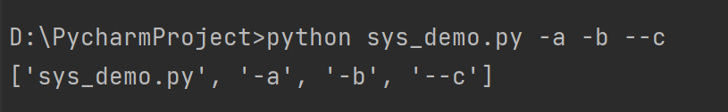
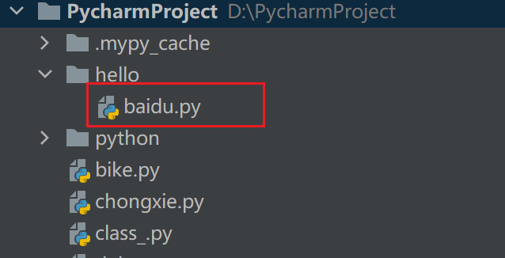

# 1 内置库sys 

## 1.1 sys概述

- 是 Python 自带的内置模块
- 是与 Python 解释器交互的桥梁

## 1.2 sys使用

```python
# coding=gbk
# 导入sys模块
import sys

# 查看sys模块帮助文档
help(sys)

# 查看sys模块的属性和方法
print(dir(sys))
```

> 文件首行要进行定义：`# coding=gbk`，不然会报错：`SyntaxError: Non-UTF-8 code starting with '\xb5' in file D:\PycharmProject\sys_demo.py on line 3, but no encoding declared; see https://python.org/dev/peps/pep-0263/ for details`

### 常用属性

```python
sys.version    # 返回 Python 解释器版本
sys.platform    # 返回操作系统平台名称
sys.argv    # 返回外部向程序传递的参数——
sys.modules    # 返回已导入的模块信息
sys.path    # 返回导包的搜索路径列表
```

> 1.`argv`可以动态收集命令行传递给参数的列表：
>
> 
>
> 2.`sys.modules`返回的模块信息是**字典**格式的，可以通过字典的`keys()`方法，返回一个模块名称组成的一个新视图对象。
>
> 3.`sys.path`展示导包的搜罗路径，返回一个**列表**，因此可以手动添加路径，利用列表的`append()`方法。`PycharProject`下有一个`hello`文件夹内有`baidu.py`，而现在的`.py`文件位于`PycharProject`下，因此在`.py`文件要引用`baidu.py`中的方法时，如果想要手动添加路径，需要做以下处理：
>
> 
>
> ```python
> my_dir = os.path.dirname(os.path.abspath(__file__)) + "/hello"
> sys.path.append(my_dir)
> from baidu import search
> search()
> ```
>
> 输入`print(sys.path)`，可以找到刚才手动添加的搜索路径。
>
> PS：手动添加路径只有在代码运行时生效，脚本结束后不会生效。

### 常用方法

```python
# 获取系统当前编码——python3为 UTF-8
sys.getdefaultencoding()

# 运行时退出
sys.exit()
```

> 用一个例子来说明`sys.exit()`
>
> ```python
> import time
> 
> for i in range(10):
>     if i == 6:
>         print("exiting.......")
>         sys.exit("退出")
>     print(f"running：{i}")
>     time.sleep(1)
> ```
>
> 输出结果：
>
> ```python
> running：0
> running：1
> running：2
> running：3
> running：4
> running：5
> exiting.......
> 退出
> ```

