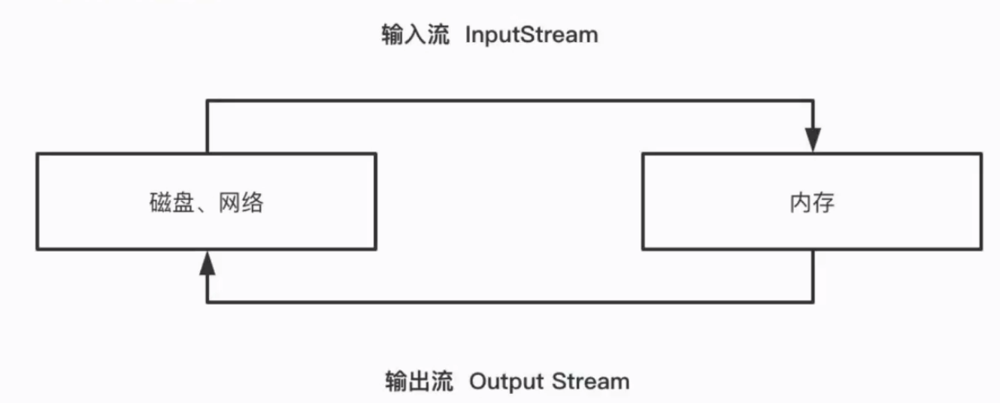

# 1 IO操作




# 2 文件操作步骤

1. 打开文件

2. 操作文件

    读/写内容

3. 关闭文件
    （读写完成，要及时的关闭）

## 2.1 `open`方法

```python
# file参数必填
def open(file, mode='r', buffering=None, encoding=None,errors=None, newline=None, closefd=True):
```

如有一个`test.txt`文件如下：

```
1234
testtesttesttesttest
```

## 2.2 文件读写方式

| 文件打开模式 | 描述                                                         |
| :----------: | ------------------------------------------------------------ |
|     `r`      | 以只读模式打开文件，并将文件指针指向文件头；如果文件不存在会报错 |
|     `w`      | 以只写模式打开文件，并将文件指针指向文件头；如果文件存在则将其内容清空，如果文件不存在则创建 |
|     `a`      | 以只追加可写模式打开文件，并将文件指针指向文件尾部；如果文件不存在则创建 |
|     `r+`     | 在`r`的基础上增加了可写功能                                  |
|     `w+`     | 在`w`的基础上增加了可读功能                                  |
|     `a+`     | 在a的基础上增加了可读功能                                    |
|     `b`      | 读写二进制文件（默认是`t`，表示文本），需要与上面几种模式搭配使用，如`ab`，`wb`，`ab+`（`POSIX`系统，包括`Linux`都会忽略该字符） |

## 2.3 读操作

| 方法          | 描述                                                         |
| ------------- | ------------------------------------------------------------ |
| `read()`      | 一次读取文件所有内容，返回一个`str`                          |
| `read(size)`  | 每次最多读取指定长度的内容，返回一个`str`；在`Python2`中`size`指定的是**字节**长度，在`Python3`中`size`指定的是**字符**长度 |
| `readlines()` | 一次读取文件所有内容，按行返回一个`list`                     |
| `readline()`  | 每次只读取一行内容                                           |

例子：

```python
f = open('python/test.txt', 'r', encoding='utf-8')

# 读取10位字符，换行符也算一个字符
print(f.read(10))
# 光标移动到读取十位字符后位置，接下来读取剩下的全部内容
print(f.readlines())

f.close()
```

输出：

```
1234
testt
['esttesttesttest']
```

> 读完一次之后，再次读取文件，内容将不是完整的，需要重新设置游标位置，使用`f.seek(0)`

在第5行后添加代码：`f.seek(0)`，再次运行代码，输出：

```
1234
testt
['1234\n', 'testtesttesttesttest']
```

输入：

```python
print(f.readline())
print(f.readline())
```

得到：

```
1234

testtesttesttesttest
```

> 由于文件本身在第一行后就有一个换行符，且`print()`自带一个换行符所以在`readline()`两次时，输出的内容之间有一行空行。

## 2.4 忘记关闭文件的危害

- 打开文件达到一定数量，将会导致打开失败
- 占用系统空间，非常浪费资源
- 会导致系统自动回收资源，从而丢失数据

## 2.5 `with`用法

`with` 可以自动完成关闭文件的操作，建议使用。

```python
with open('python/test.txt', 'r', encoding='utf-8') as f:
    print(f.read())
# 查看文件关闭状态
print(f.closed)
```

输出：

```
1234
testtesttesttesttest
True
```

## 2.6 写操作

- mode = `w+`，读写权限，清空内容再写入，如果没有文件，会新建文件
- mode = `r+`，读写权限，替换原来的内容
- mode = `a+`，读写权限，追加内容，不会清空原来的内容

### 1. `w+`

```python
with open('python/test.txt', 'w+', encoding='utf-8') as f:
    print(f.write('yyly\n'))
```

结果：

```
yyly

```

### 2. `r+`

```python
with open('python/test.txt', 'r+', encoding='utf-8') as f:
    print(f.write('yyly\n'))
```

结果：

```
yyly
testtesttesttesttest
```

### 3. `a+`

```python
with open('python/test.txt', 'a+', encoding='utf-8') as f:
    print(f.write('yyly\n'))
```

结果：

```
1234
testtesttesttesttestyyly
yyly
```

# 总结

1. 使用`with`方法，会**自动完成关闭操作**
2. 通过`python`封装的API，可以实现读、写、追加操作
3. 文件打开要使用的`utf-8`的编码格式（避免中文出现乱码）
