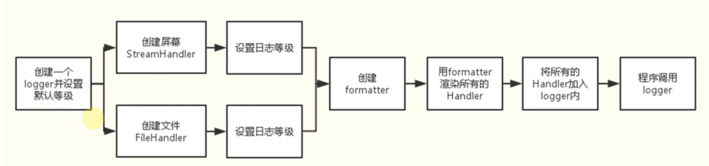
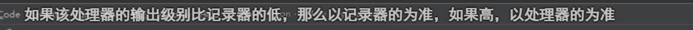
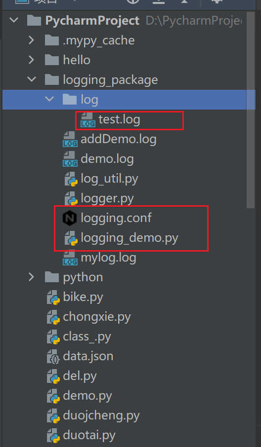

# logging进阶

| 组件         | 说明                                                         | 作用     |
| ------------ | ------------------------------------------------------------ | -------- |
| `loggers`    | 提供应用程序代码直接使用的接口                               | 记录器   |
| `handlers`   | 用于将日志记录发送到指定的目的位置                           | 处理器   |
| `filters`    | 提供更细粒度的日志过滤功能，用于决定哪些日志记录将会被输出（其他的日志记录将会被忽略） | 过滤器   |
| `formatters` | 用于控制日志信息的最终输出格式                               | 格式化器 |

- 日志器（logger）需要通过处理器（handler）将日志信息输出到目标位置，如：文件、sys.stdout、网络等；
- 不同的处理器（handler）可以将日志输出到不同的位置；
- 日志器（logger）可以设置多个处理器（handler）将同一条日志记录输出到不同的位置；
- 每个处理器（handler）都可以设置自己的过滤器（filter）实现日志过滤，从而只保留感兴趣的日志；
- 每个处理器（handler）都可以设置自己的格式器（formatter）实现同一条日志以不同的格式输出到不同的地方。

简单点说就是：日志器（logger）是入口，真正干活儿的是处理器（handler），处理器（handler）还可以通过过滤器（filter）和格式器（formatter）对要输出的日志内容做过滤和格式化等处理操作。

## 1. 日志记录的流程



### 1.1 loggers记录器

`Logger`是一个树形层级结构，在使用接口`debug`，`info`，`warn`，`error`，`critical`之前必须创建`Logger`实例，即创建一个记录器，如果没有显式的进行创建，则默认创建一个`root logger`，并应用默认的日志级别`WARNING`，处理器`Handler`(`StreamHandler`，即将日志信息打印输出在标准输出上)，和格式化器`Formatter`(默认的格式即为第一个简单使用程序中输出的格式)。

1.提供应用程序的调用接口

```python
logger = logging.getLogger(__name__)
```

> `logger`是单例的

2.决定日志记录的级别



```python
logger.setLevel(logging.ERROR)
```

3.将日志内容传递到相关联的`handlers`中

```python
logger.addHandler()
logger.removeHandler()
```

### 1.2 Handlers处理器

它们将日志分发到不同的目的地，可以是文件、标准输出、邮件，或者通过`socke`、`http`等协议发送到任何地方。

1.`StreamHandler`

标准输出`stout`（如显示器）分发器。

创建方法：

```python
sh = logging.StreamHandler(strem = None)
```

2.`FileHandler`

将日志保存到磁盘文件的处理器

创建方法：

```python
fh = logging.FileHandler(filename, mode = 'a', encoding = None, delay = False)
```

`setFormatter()`：设置当前`handler`对象使用的消息格式。

其他的Handler：

- `BaseRotatingHandler`
- `Rotating Filehandler`
    滚动的多日志输出，按照时间/其他方式去生成多个日志
- `TimedRotatingfilehandler`

以下的使用较少：

- `Sockethandler`
- `Dataaramhandler`
- `Smtphandler`
- `Sysloghandler`
- `Nteventloghandler`
- `Httphandler`
- `WatchedFilehandler`
- `Qutelehandler`
- `Nullhandler`

## Formatters格式

`Formatter()`对象用来最终设置日志信息的顺序、结构和内容。
其构造方法为

```python
ft = logging.Formatter(fmt = None, datefmt = None, style = ' %')
```

`datefmt`默认是`%Y-%m-%d  %H:%M:%S`样式的
`style`参数默认为百分符`%`，这表示`%(<dictionary key>:)s`格式的字符串。

同上一节*1.2.2 logging模块定义的格式字符串字段*


例子：在一个python文件中设置日志。

```python
import logging

# 记录器
import os

logger = logging.getLogger('applog')
logger.setLevel(logging.DEBUG)
# 必须设置为两个handler中级别更低的

# 处理器handler
consoleHandler = logging.StreamHandler()
consoleHandler.setLevel(logging.DEBUG)

# 没有给handler指定日志级别，将使用logger的级别
fileHandler = logging.FileHandler(filename='addDemo.log')
consoleHandler.setLevel(logging.INFO)

# formatter格式
formatter = logging.Formatter('%(asctime)s - %(name)s - %(levelname)s - %(message)s')
# 里面的8，10实现了占位对齐

# 给处理器设置格式
consoleHandler.setFormatter(formatter)
fileHandler.setFormatter(formatter)

# 记录器要设置处理器
logger.addHandler(consoleHandler)
logger.addHandler(fileHandler)

# 定义一个过滤器
flt = logging.Filter("applog")


# 关联过滤器
logger.addFilter(flt)
fileHandler.addFilter(flt)
name = 'yyl'
age = 30
# 打印日志的代码
# logging.debug()#不能使用这个了！！！会使用WARNING的版本，不会用之前的记录器
logger.debug('name:%s,age:%s' % (name, age))
```

`addDemo.log`文件中：

```c
2022-03-14 10:32:48,631 - applog - DEBUG - name:yyl,age:30
```

但是如果多个文件都需要设置日志，可以采用封装的方法。

## 封装日志公共模块

定义获取 logger 的公共方法：

```python
def get_logger():
    # create logger
    logger = logging.getLogger(os.path.basename(__file__))
    logger.setLevel(logging.DEBUG)
    # create console handler and set level to debug
    ch = logging.FileHandler(filename='mylog.log', encoding="utf-8")
    ch.setLevel(logging.DEBUG)
    # create formatter
    formatter = logging.Formatter('%(asctime)s - %(name)s - %(levelname)s - %(message)s')
    # add formatter to ch
    ch.setFormatter(formatter)
    # add ch to logger
    logger.addHandler(ch)
    return  logger
```

在需要日志的文件中导入这个方法即可。

##  日志配置文件

或者可以使用日志配置，更方便简洁。

- 创建log_util.py 文件
- 使用的地方导入 logger对象，调用对应的日志输出方法

```python
import logging
import os

from logging.handlers import RotatingFileHandler

# 绑定绑定句柄到logger对象
logger = logging.getLogger(__name__)
# 获取当前工具文件所在的路径
root_path = os.path.dirname(os.path.abspath(__file__))
# 拼接当前要输出日志的路径
log_dir_path = os.sep.join([root_path, f'/logs'])
if not os.path.isdir(log_dir_path):
    os.mkdir(log_dir_path)
# 创建日志记录器，指明日志保存路径,每个日志的大小，保存日志的上限
file_log_handler = RotatingFileHandler(os.sep.join([log_dir_path, 'log.log']), maxBytes=1024 * 1024, backupCount=10)
# 设置日志的格式
date_string = '%Y-%m-%d %H:%M:%S'
formatter = logging.Formatter(
    '[%(asctime)s] [%(levelname)s] [%(filename)s]/[line: %(lineno)d]/[%(funcName)s] %(message)s ', date_string)
# 日志输出到控制台的句柄
stream_handler = logging.StreamHandler()
# 将日志记录器指定日志的格式
file_log_handler.setFormatter(formatter)
stream_handler.setFormatter(formatter)
# 为全局的日志工具对象添加日志记录器
# 绑定绑定句柄到logger对象
logger.addHandler(stream_handler)
logger.addHandler(file_log_handler)
# 设置日志输出级别
logger.setLevel(level=logging.INFO)
```

配置文件 `logging.conf`

```c++
[loggers] # loggers 对象列表
        keys=root,main

[handlers] # handlers 对象列表
        keys=consoleHandlers,fileHandlers

[formatters] # formatters 列表
        keys=fmt

[logger_root]
        level=DEBUG
        handlers=consoleHandlers,fileHandlers

[logger_main] # main logger
        level = DEBUG
        handlers = fileHandlers
        qualname=main
        propagate=0

[handler_consoleHandlers] # consoleHandlers 指定控制器的输出方向、级别、输出格式、参数
        class = StreamHandler
        level = DEBUG
        formatter = fmt
        args = (sys.stdout,)

[handler_fileHandlers] # 循环日志文件 以文件大小来 分割# 每隔 1000 Byte 划分一个日志文件，备份文件为 3 个
        class = logging.handlers.RotatingFileHandler
        level = DEBUG
        formatter = fmt
        args = ('./log/test.log', 'a', 10000, 3, 'UTF-8')

[formatter_fmt] # fmt 格式
        format=%(asctime)s - %(name)s - %(levelname)s - %(message)s
        datefmt=
```

 python文件 `logging_demo.py`

```python
import logging.config
# 读取配置文件 # 采用配置文件
logging.config.fileConfig("logging.conf")
# 创建logger
logger = logging.getLogger('main')
# 日志生成
logger.debug(' Hello tom')
```

文件目录如下：



