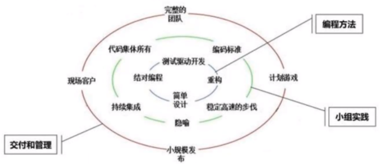
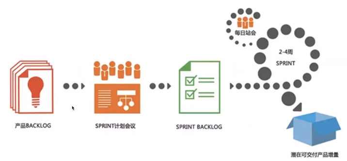

# 2-1 软件开发流程

## 软件

​		与计算机系统操作有关的计算机程序、可能有的文件、文档及数据。

## 软件开发流程的演变

## 瀑布模型

1. 软件开发的各项活动严格按照线性方式进行
2. 当前活动接受上一项活动的工作结果
3. 当前活动的工作结果需要进行验证

​	**优点**

- 开发的各个阶段比较清晰

- 强调早期计划及需求调查

- 适合需求稳定的产品开发

​	**缺点**

- 由于开发模型是线性的，增加了开发的风险
- 早期的错误可能要等到开发后期的阶段才能发现

## 敏捷开发模型

XP

编程方法：从简单设计开始，顺时针开始
小组实践：从代码集体所有开始，顺时针开始
交付和管理：从小规模发布开始，逆时针进行

SCEUM

sprint冲刺（迭代周期)
产品BACKLOG：产品需求列表
SPRINT计划会议：按优先级进行
​SPRINT BACKLOG：周期内要去实现的需求

敏捷模型总结

- 增量迭代

- 小步快跑

## DevOps

可以把DevOps看作开发（[软件工程](https://baike.baidu.com/item/软件工程/25279)）、技术运营和质量保障（QA）三者的交集。

- DevOps生命周期

    - 持续开发

    - 持续测试

    - 持续集成

    - 持续部署

    - 持续监控 

- DevOps对发布的影响

    - 减少变更范围

    - 加强发布协调

    - 自动化

- CI/CD

    - 持续集成（Continuous integration，缩写为CI）是一种软件开发实践，即团队开发成员经常集成他们的工作，通常每个成员每天至少集成一次，也就意味着每天可能会发生多次集成，每次集成都通过自动化的构建（包括编译，发布，自动化测试）来验证，根据测试结果，我们可以确定新代码和原有代码能否正确地集成在一起。

    - 持续交付（Continuous delivery，缩写为CD），是一种软件工程手法，让软件产品的产出过程在一个短周期内完成，以保证软件可以稳定、持续的保持在随时可以发布的状况。它的目标在于让软件的构建、测试与发布变得更快以及更频繁。这种方式可以减少软件开发的成本与时间，减少风险。

- CD与DevOps的关系

    - DevOps的范围更广，是软件交付过程所涉及的多个团队之间的合作，并且将软件交付的过程自动化。

    - 持续交付是一种自动化交付的手段，关注点在于将不同的过程集中起来，并且更快、更频繁地执行这些过程。

    - DevOps可以是持续交付下的一个产物，持续交付的成果直接汇入DevOps模型。

    ## 重点

    - 敏捷开发模型

    - DevOps

    ## 难点

    - DevOps

## 笔记总结

- 现在的公司大多是进行自动化测试。
