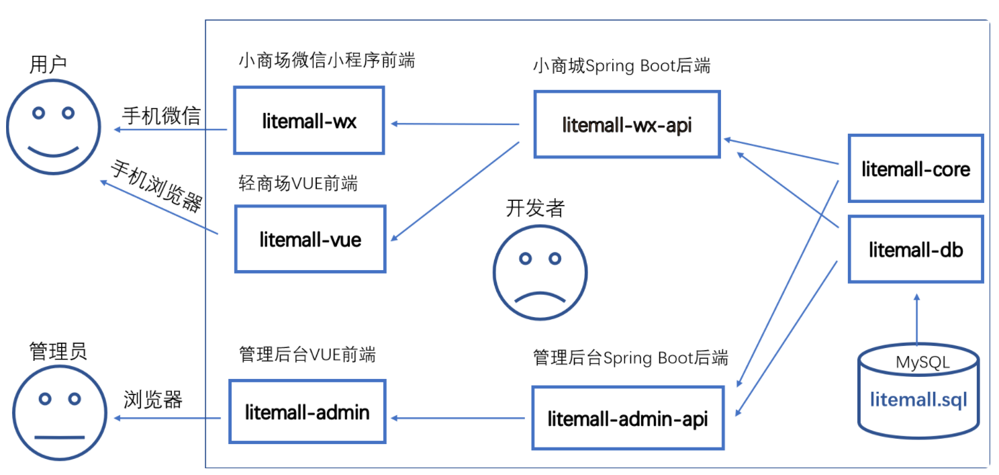
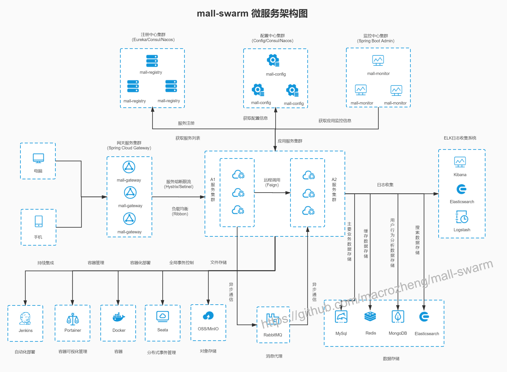
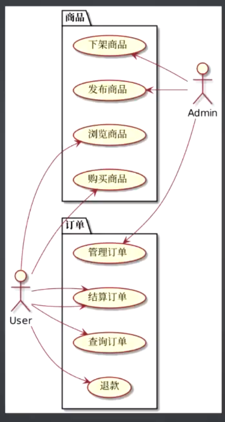
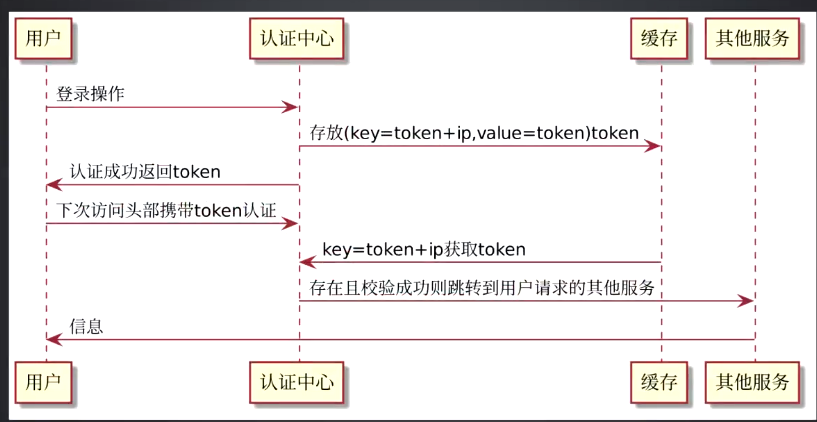
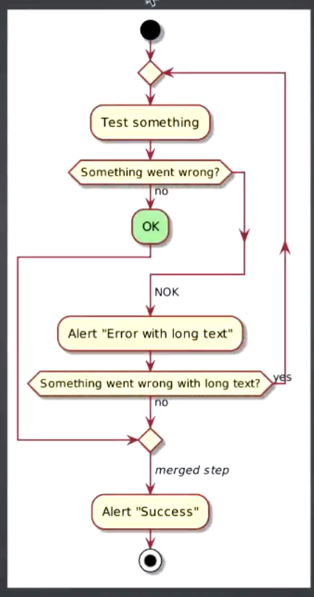

# 开源项目Litemall系统架构

https://linlinjava.gitbook.io/litemall/

- 角色与数据

- 用户产品

- 前端技术栈

- 后端技术栈

- 数据存储

# 开源项目Mall的系统架构

https://gitee.com/macrozheng/mall

- 角色与数据

- 用户产品

- 前端技术栈

- 后端技术栈

- 服务治理技术栈

- 监控技术栈

- 大数据处理技术栈

- 数据存储

- 持续集成/持续交付/DevOps

# 如何快速了解一家公司的架构

- 业务流程：

    - 商业模式

    - 业务数据：角色、资源、数据

    - 业务流程：角色、行为、数据的集成关系

- 系统架构：

    - 架构角色与技术栈：

        - 网关：apache/nginx/f5/

        - 应用开发：spring boot/spring cloud/

        - 通讯协议：dubbo/http/pb 

        - 数据处理：hadoop/spark/flink 

        - 数据存储：redis/mysql/oracle/redis/es

        - 文档存储：mongodb/hbase/neo4j

    - 部署架构：架构角色的集成关系

# 统一建模语言UML

- 用例图：商业模式、业务角色

- 时序图：业务流程、调用关系

- 部署图：系统架构与集成关系

- 活动图：业务逻辑分析

# 推荐工具

- plantuml

- yed

- [draw.io](http://draw.io/)

- processon

- visio

# 梳理业务流程

# 用例图

- 使用思维导图分析功能点

    - 业务流程

    - 数据分类

- 使用时序图分析数据流

    

- 使用活动图分析测试用例

    

# 重点

- UML

# 笔记总结

- 测试用例分析总结

    - 使用用例图分析角色与资源

    - 使用思维导图分析功能点

    - 使用时序图分析数据流

    - 使用活动图分析业务逻辑
