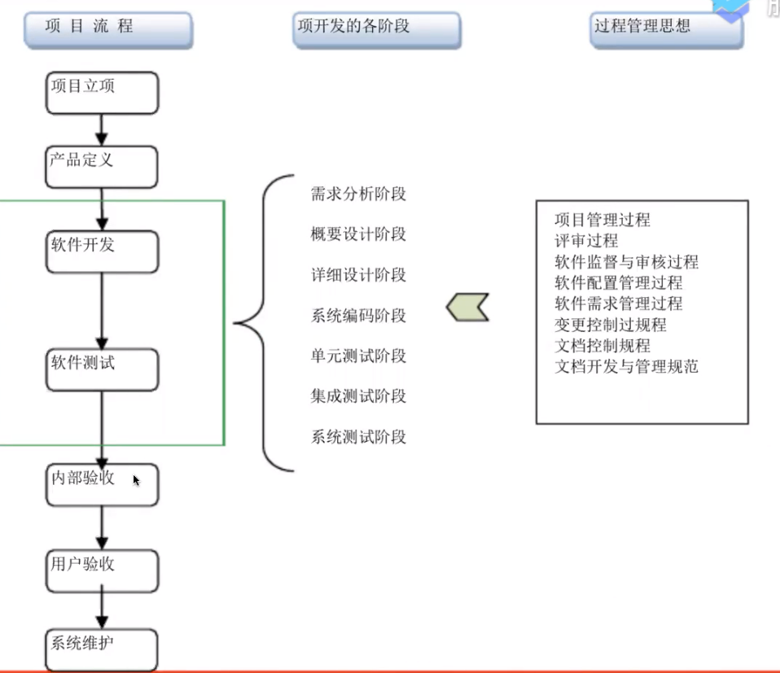
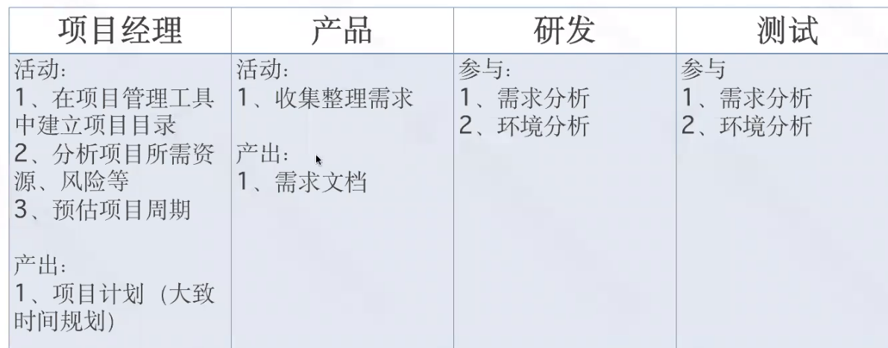
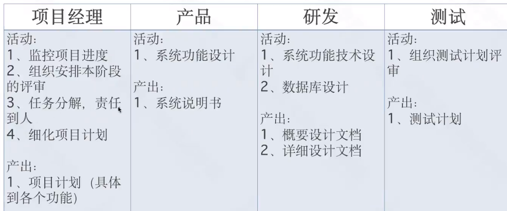
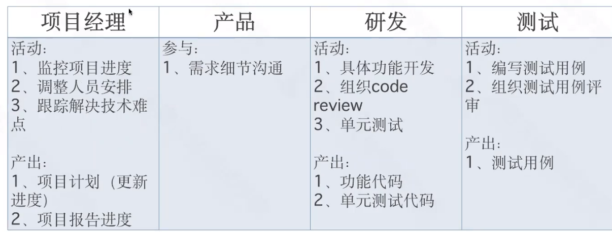
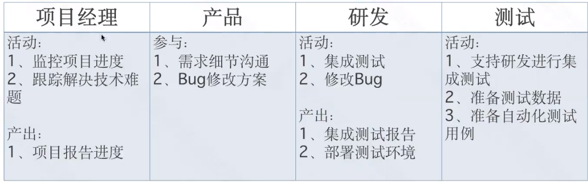
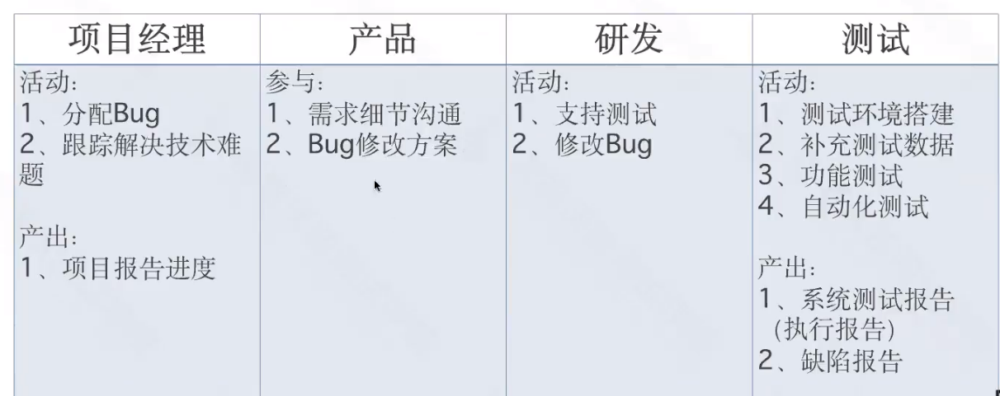
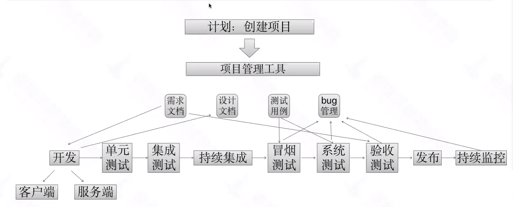

# 项目管理

## 需求阶段

## 设计阶段

## 开发阶段

## 集成测试阶段

## 系统测试阶段

## 软件项目管理的方法

- 制定项目计划
- 执行该计划并监控跟踪管理
- 项目风险应对与问题解决
- 项目收尾

# 跨部门沟通协作

- 与产品沟通

    - 需求评审会

    - 在分析需求阶段

    - 在测试用例编写阶段

    - 在测试过程中

- 与开发沟通

    - 在分析需求阶段

    - 在测试用例编写阶段

    - 在测试过程中

    - 在线上监控发现bug时

- 上下游配合测试

    - 测试计划沟通

    - 环境对接

    - 熟悉业务

# 项目实例

集成测试：也叫联调
