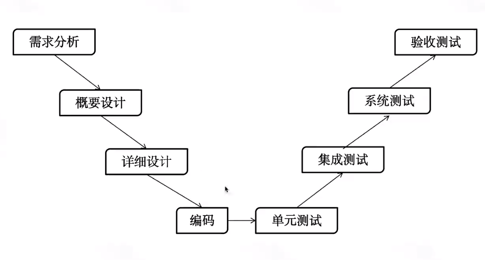
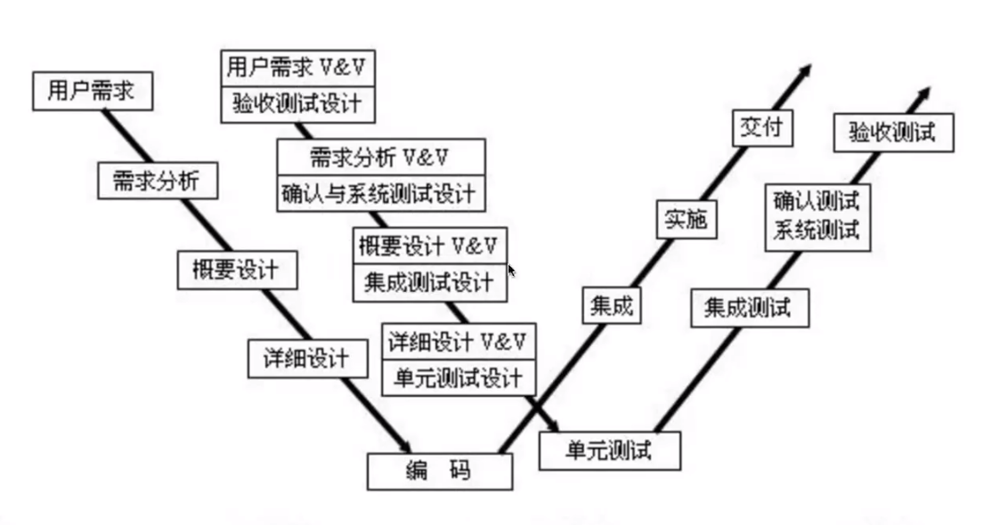
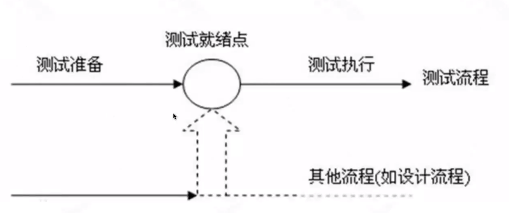
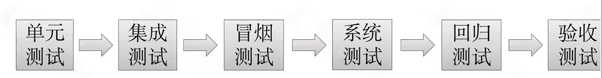
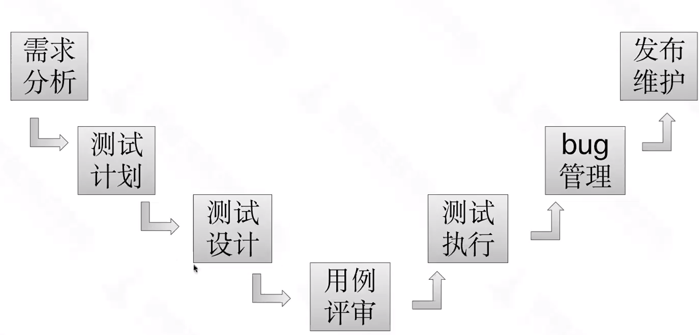
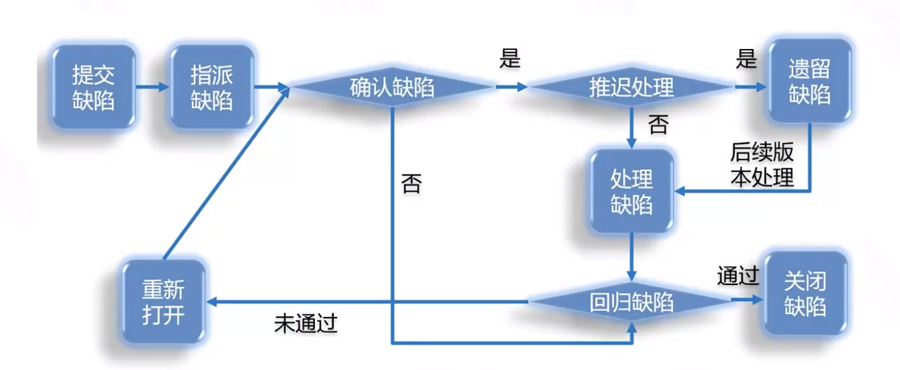

# 软件测试基本概念

软件测试

- 通过手工或者工具对"被测对象"进行测试

- 验证实际结果与预期结果之间是否存在差异

软件测试作用

- 通过测试工作可以发现并修复软件当中存在的缺陷，从而提高用户对产品的使用信心。

- 测试可以降低同类型产品开发遇到问题的风险。

软件缺陷

- 软件缺陷被测试工程师和开发工程师们称作bug

- 软件缺陷会导致软件不能正常运行，它的存在会在一定程度上导致软件不能满足用户的需求，甚至有可能破坏或泄漏用户的重要数据

软件测试原则

- 测试显示缺陷的存在

- 穷尽测试是不可能的

- 测试尽早介入

- 缺陷集群性（2/8原则）

- 杀虫剂悖论

- 测试活动依赖于测试内容

- 没有错误是好是谬论

软件测试对象

- 需求分析阶段：需求文档、接口文档

- 编码实现阶段：源代码

- 系统功能使用：软件程序

测试用例

- 为特定的目的而设计的一组测试输入、执行步骤和预期的结果，以便测试产品否满足某个特定需求的文档

# 软件测试模型

## V模型

集成测试主要测试接口，系统测试前期测试功能，后期性能、兼容性做测试。

- V模型是瀑布模型的一种改进

- V模型标明了测试过程中的不同阶段

- V模型的优缺点

- 优点

    - 既有底层测试又有高层测试。
    - 将开发阶段清楚的表现出来，便于控制开发的过程。

- 缺点

    - 容易让人误解为测试是在开发完成之后的一个阶段。
    - 由于它的顺序性，当编码完成之后，正式进入测试时，这时发现的一些bug可能不容易找到其根源，并且代码修改起来很困难。
    - 如果需求变更较大，导致要重复变更需求、设计、编码、测试。返工量大。

## W模型

- W模型明确表示出了测试与开发的并行关系。

- W模型中测试伴随着整个软件开发周期，并且测试的对象不仅仅是程序，需求和设计同样要测试。

- 优点

    - 将测试贯穿到整个软件的生命周期中，且除了代码要测试，需求、设计等都要测试。
    - 更早的介入到软件开发中，能尽早的发现缺陷进行修复。
    - 测试与开发独立起来，并与开发并行。

- 缺点

    - 无法支持迭代的开发模型
    - 对有些项目，开发过程中根本没有文档产生，故W模型无法使用。
    - 对于需求和设计的测试技术要求很高，实践起来很困难。

## H模型

软件开发中需求、设计、编码等活动被分阶段执行、但是实践中，他们并不是完全串行的，它们之间更多时候是交叉进行的，更多的是迭代执行。

把测试活动完全独立出来，形成一个完全独立的流程，将测试准备活动和测试执行活动清晰地体现出来。

- 优点

    - 软件测试完全独立，贯穿整个生命周期，且与其他流程并发进行
    - 软件测试活动可以尽早准备、尽早执行，具有很强的灵活性

- 缺点

    - 测试就绪点分析困难

    - 对于整个项目组的人员要求非常高

# 软件测试工作流程

#### 传统测试流程

冒烟测试：最基本的功能测试 

回归测试：新功能上线后需要对以前的功能也进行测试

#### 系统测试流程

#### bug管理流程

# 测试左移

- 左移是往测试之前的开发阶段移

- 测试团队在软件开发周期早期就开始介入

- 对代码进行测试

- 从发现bug 到预防bug

- 测试左移-质量保障手段

    - 代码评审（code review）
    - 代码审计（自动化工具）
    - 单元测试
    - 自动化冒烟测试
    - 研发自测

# 测试右移

- 右移是往发布之后移

- 产品上线后进行线上监控

- 测试右移-线上监控

    - 闭环的线上问题反馈-检查-解决-更新流程

    - 更便捷的日志查看、回传服务

    - 丰富有效的log，便于问题的快速定位丰富的监控指标（例如业务异常点指标）

    - 业务监控（例如短信发送等）

    - 关键指标每日监控（服务器指标）

    - 生产数据监控（警报）

