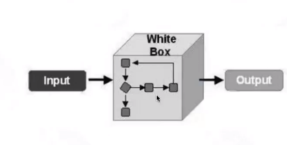
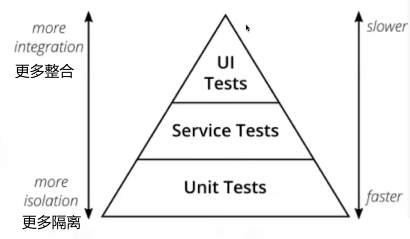
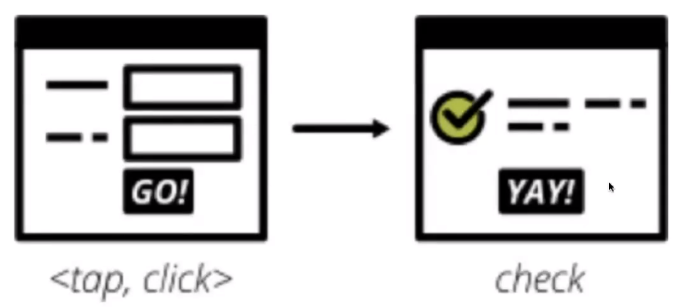

#  软件测试分类

- 按开发阶段分类

    - 集成测试

    - 系统测试

        - 功能测试

        - 兼容性测试

        - 性能测试

        - 安全测试

    - 验收测试

        - α测试

            内侧、公司内部人员在开发环境下模拟用户进行测试

        - β测试

            公测、实际环境下让用户使用

- 按是否查看代码

    - 白盒测试：看源代码

        

- 研究产品内部的源代码和程序结构
- 单元测试就是白盒测试的一种

- 黑盒测试：不看源代码、从用户角度考虑软件使用情况

    - 又称数据驱动测试
    - 完全不考虑程序内部结构和内部特性
    - 注重于测试软件的功能需求
    - 只关心软件的输入数据和输出数据
    - 灰盒测试：只看一部分源代码但是又不像黑盒测试那样看得仔细

- 按测试执行方式

    - 静态测试

        没有运行程序，静态检查文件或代码

    - 动态测试

        运行程序后进行测试，实际检查输出结果与预期结果是否一致

    - 按是否手工执行划分

        - 手工测试

        - 自动化测试

            使用编码方式运行测试程序

- 其它分类

    - 冒烟测试

        在正式测试开始之前，对软件基本功能完成快速的验证

    - 回归测试

        开发更改代码之后，重新进行测试；产品验收之前，对老功能重新进行测试

    - 随机测试

        所有测试操作都是随机生成的，一般放在测试最后进行

    - **探索性测试**

        随机测试升级版，应当掌握，什么功能会出问题之类的

# 分层体系内容

自动化分层测试体系

- 10%用户界面测试（页面测试）

    - UI测试

        

    - 手工方法：人工查看、操作

    - 自动化方法

        - web：selenium
        - apр：appium

- 20%服务测试（接口测试）

    - 接口测试

        - 接口全称Application Programming Interface，一般称作<u>API</u>
        - 是针对软件对外提供服务的接口的输入输出进行测试
        - 检查接口参数传递的正确性，接口功能实现的正确性，输出结果的正确性，以及对各种异常情况的容错处理的完整性和合理性

    - 使用方法及工具

        - Charles, Fiddler（接口数据抓包）

        - postman（流行）

        - Jmeter

            > 开源、接口功能性验证和性能验证

        - loadRunner

            > 商业性工具

        - python: Requests, HttpRunner

        - Java: HttpClient, RestAssured

- 70%单元测试
    - 单元测试框架

        - Java

            - JUnit

            - TestNG

        - Python

            - unittest

            - pytest

