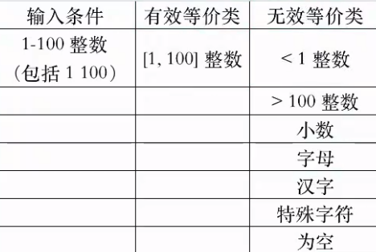
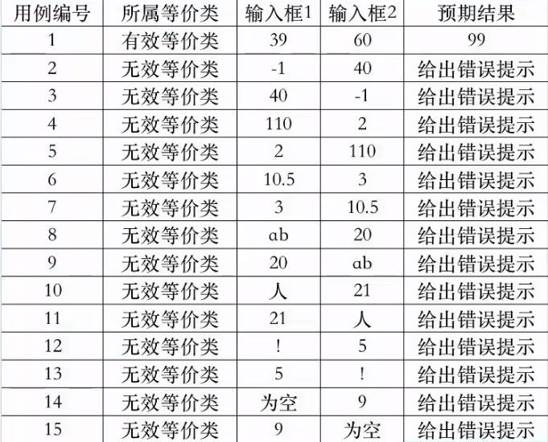

# 等价类划分法

- 等价类划分是一种重要的、常用的黑盒测试方法

- 不需要考虑程序的内部结构，只需要考虑程序的输入规格即可

- 它将不能穷举的测试过程进行合理分类，从而保证设计出来的测试用例具有完整性和代表性

- 用户所有可能输入的数据，划分成了若干个子集，然后从每一个子集当中选取少数具有代表性的数据作为测试用例

- 在有限的测试资源的情况下，用少量有代表性的数据得到比较好的测试效果

# 等价类划分

- 有效等价类：指符合《需求文档》，输入合理的数据集合

- 无效等价类：指不符合《需求文档》，输入不合理的数据集合

# 等价类划分原则

- 规定输入的取值范围或个数时，划分一个有效和两个无效

- 规定了输入的集合或规则必须要遵循的条件，则划分一个有效和一个无效

- 输入条件是一个布尔值，则划分为一个有效和一个无效

- 输入条件是一组数据，并且每一个输入的值做不同的处理，则划分若干个有效和一个无效

- 输入条件规定了必须要遵循的某些规则下，则划分为一个有效和若干个无效

- 不是所有的等价类都有无效等价类

# 等价类设计步骤

- 先划分等价类：找出所有可能的分类

- 确定有效等价类：需求中的条件

- 确定无效等价类：与条件相反的情况，再找到特殊情况

- 从各个分类中挑选测试用例数据

# 等价类划分方法

等价类表一个测试用例要涵盖尽可能多的有效等价类，而每个无效等价类都需要一个测试用例。

在确立了等价类之后，可按上表的形式列出所有划分出的等价类表。

- 例子：输入1\~100所有整数的和

测试用例覆盖无效等价类时，另一个必须是有效等价类，便于定位到错误位置

- 测试用例

# 等价类总结

- 长度

- 类型

- 组成规则

- 是否为空

- 是否重复

- 是否去除空格

# 重点

等价类设计步骤

等价类划分方法---等价类表

# 难点

等价类划分原则
