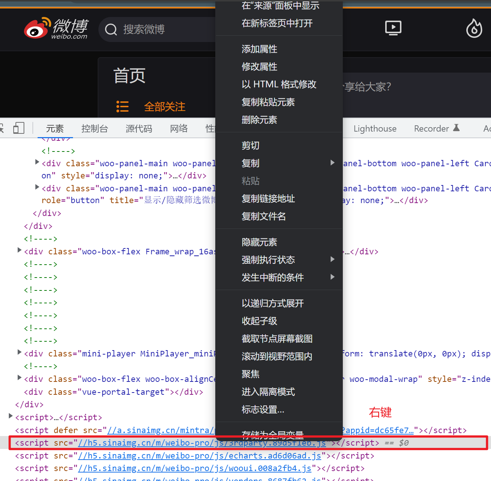
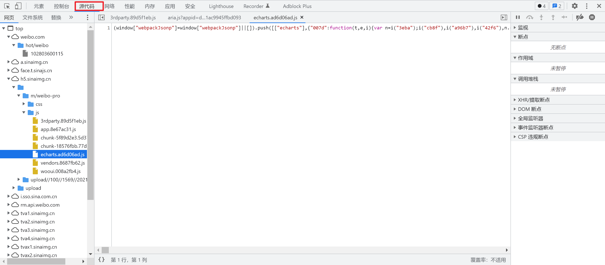
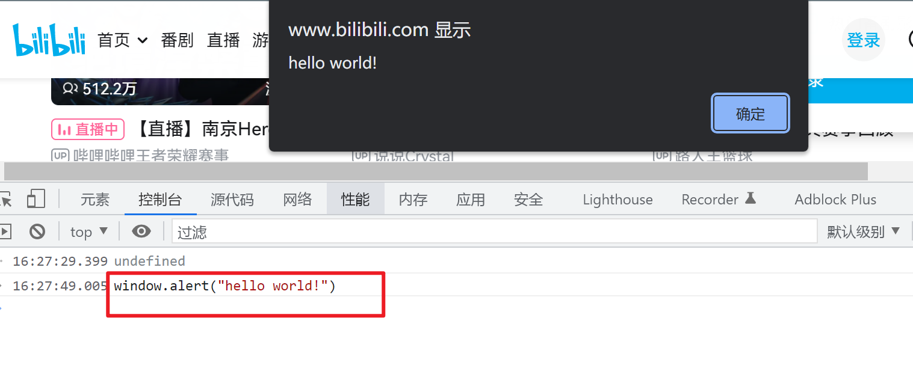
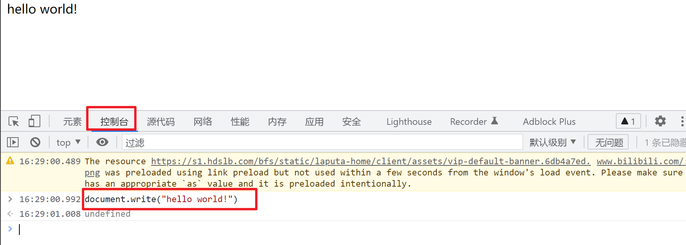
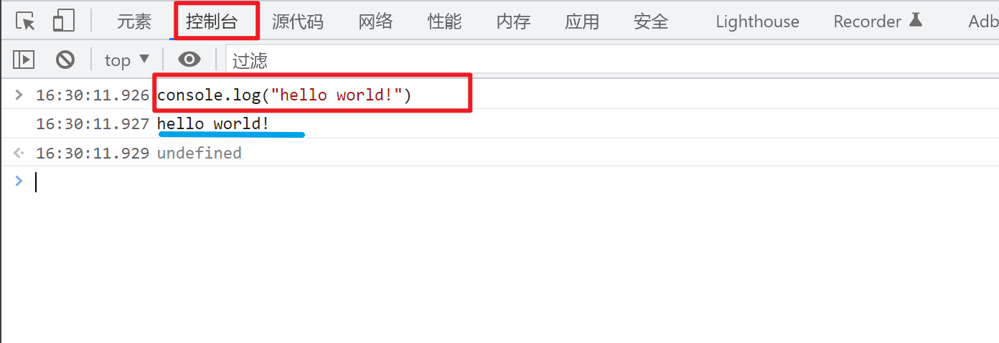
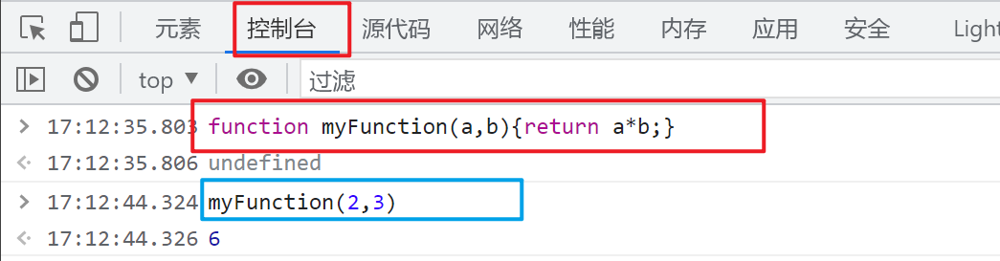
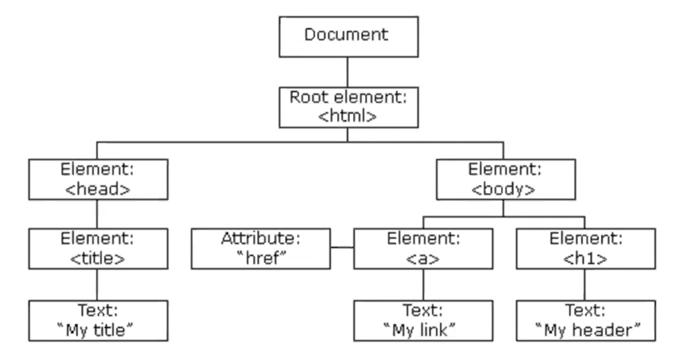
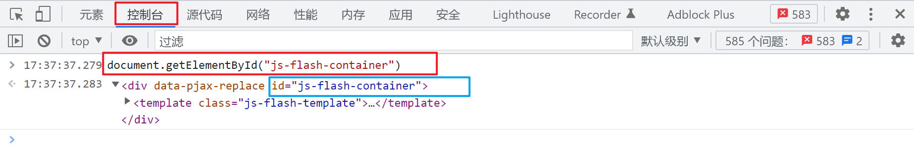

# 1. 简介

- JavaScript是脚本语言
    - 一种轻量级的编程语言
    - 是可插入HTML页面的编程代码
    - 插入HTML页面后，可由所有的现代浏览器执行
- 作用：
    - 直接写入HTML输出流
    - 对事件的反应
    - 改变HTML内容
    - 改变HTML图像
    - 改变HTML样式
    - 验证输入

# 2. 用法

## 2.1 位置

- 脚本必须位于`<script></script>`标签之间
- 可被放置在HTML页面的`<body>`和`<head>`部分中

## 2.2 引用方式

- 内部：

    ```html
    <script>alert("我的第一个JavaScript");</script>
    ```

- 外部：

    ```html
    <script src="myScript.js'"></script>
    ```

> 外部的js脚本是不能包含<script>标签的





# 3. 输出

### 3.1 显示数据

- 弹出警告框：`window.alert()`

    

- 将内容写到HTML文档中：`document.write()`

    

- 写入到浏览器的控制台：`console.log()`

    

# 4. 基础语法

### 4.1 字面量

- 数字：整数、小数、科学计数（e）
- 字符串：单引号、双引号
- 数组：[ ]
- 对象：{ }
- 函数：function

## 4.2 变量

- 声明变量：var
- 赋值：=

## 4.3 操作符

- 算术运算符：=    +    -    *    /
- 赋值运算符：=    +=    -=
- 比较运算符：<    >    ==    ===    !=

## 4.4 函数

- 关键字：function

- `function myFunction(a,b){return a*b;}`

    


# 5. 操作HTML DOM

## 5.1HTML DOM

HTML DOM：文档对象模型（Document Object Model）



## 5.2 查找HTML元素

- 通过id：`var x=document.getElementByld("xx");`

    

- 通过标签名：`var y=document.getElementsByTagName("p");`

- 通过类名：`var x=document.getElementsByClassName("xx");`

## 5.3 改变HTML

- 内容：`document.getElementById(id).innerHTML=新的 HTML`
- 属性：`document.getElementById(id).attribute=新属性值`

## 5.4 Coojie

读取：`var x=document.cookie;`

## 5.5 使用事件

- 当用户点击鼠标时：onclick=JavaScript
- 当网页已加载时：onload=JavaScript
- 当图像已加载时：onunload=JavaScript
- 当鼠标移动到元素上时：onmouseover=JavaScript
- 当输入字段被改变时：onchange=JavaScript
- 当用户触发按键时：onmousedown=JavaScript

# 6. 操作浏览器BOM

## 6.1 浏览器对象模型

- Window 对象
- 所有浏览器都支持`window`对象。它表示浏览器窗口
- 所有JavaScript全局对象、函数以及变量均自动成为`window`对象的成员
- HTML DOM 的`document`是`window` 对象的属性之一

## 6.2浏览器窗口

- 获取浏览器窗口尺寸：
    - `window.innerHeight`-浏览器窗口的内部高度（包括滚动条）
    - `window.innerWidth`-浏览器窗口的内部宽度（包括滚动条）
- 打开新窗口：`window.open()`
- 关闭当前窗口：`window.close()`

## 6.3 用户屏幕

- 可用的屏幕宽度：`screen.availWidth`
- 可用的屏幕高度：`screen.availHeight`

## 6.4 当前页面的地址

- 返回wep主机的域名：`location.hostname`
- 返回当前页面的路径和文件名：`location.pathname`
- 返回所使用的web 协议：`location.protocol`

## 6.5 浏览器的历史

- 与在浏览器点击后退按钮相同：`history.back()`
- 与在浏览器中点击向前按钮相同：`history.forward()`
