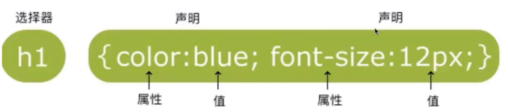
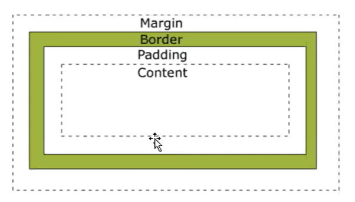
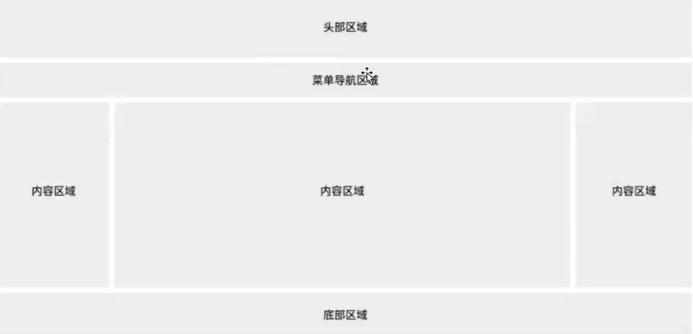

# 1. 基础入门

## 1.1 什么是CSS

- CSS指层叠样式表（Cascading Style Sheets）
- 样式通常存储在样式表中

## 1.2 为什么要使用CSS

- 样式定义如何显示HTML元素
- 为了解决内容与表现分离的问题
- 主要目的：可以让相同的一个页面在不同的浏览器当中呈现相同的样式

# 2. 基础语法

## 2.1 css组成



## 2.2 CSS选择器

- 
    id选择器：`#id{}`
- class选择器：`.className{}`
- 元素选择器：`tag`
- 属性选择器：`[属性]{}`

## 2.2 css创建

- 外部样式表：

    ```html
    <link rel="stylesheet" type="text/css" href="mystyle.css">
    ```

- 内部样式表：

- ```html
    <style>
        hr{color:sienna;}
        p{margin-left:20px;}
    </style>
    ```

- 内联样式：

    ```html
    <p style="color:sienna;margin-left:20px">这是一个段落。</p>
    ```

## 2.3 css样式

### 2.3.1 背景

- background：简写属性，可以跟下面的所有值
- background-color：设置元素的背景颜色
- background-image：把图像设置为背景
- background-position：设置背景图像的起始位置
- background-repeat：设置背景图像是否及如何重复

### 2.3.2 字体

- font：在一个声明中设置所有的字体属性
- font-family：指定文本的字体系列
- font-size：指定文本的字体大小
- font-style：指定文本的字体样式
- font-weight：指定字体的粗细

### 2.3.3 列表

- list-style：把所有用于列表的属性设置在一个声明中
- list-style-image：将图像设置为列表项标志
- list-style-type：设置列表项标值的类型

### 2.3.4 表格

- border：设置表格边框
- border-collapse：设置表格的边框是否被折叠成一个单一的边框或者隔开
- width：定义表格的宽度
- text-align：表格中的文本对齐
- padding：设置表格中的填充

### 2.3.5 定位

- static：没有定位，遵循正常的文档流对象
- relative：相对定位，元素的定位是相对其正常位置
- fixed：元素的位置相对于浏览器窗口是固定位置
- absolute：绝对定位，元素的位置相对于最近的已定位父元素
- sticky：粘性定位，基于用户的滚动位置来定位

### 2.3.5 盒子模型

- Margin（外边距）：清除边框外的区域，外边距是透明的。

- Border（边框）：围绕在内边距和内容外的边框。

- Padding（内边距）：清除内容周围的区域，内边距是透明的。

- Content（内容）：盒子的内容，显示文本和图像

    

### 2.3.6 网页布局


