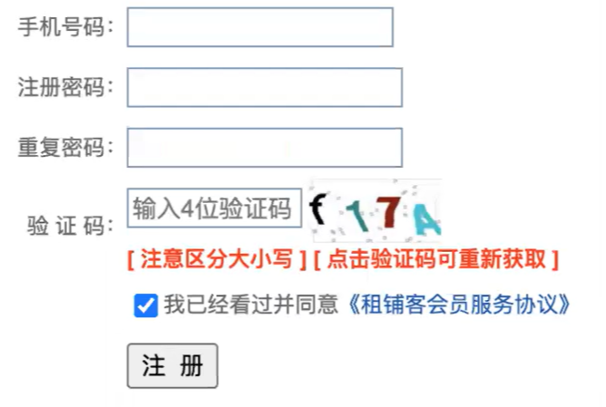
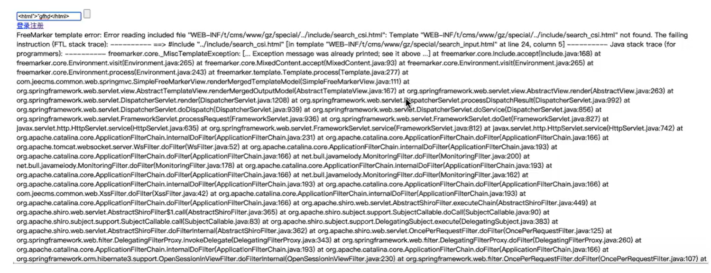
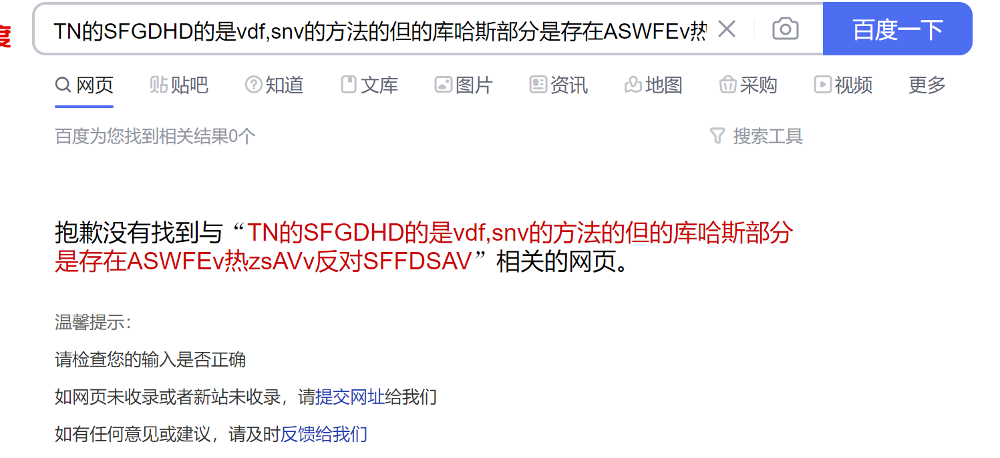
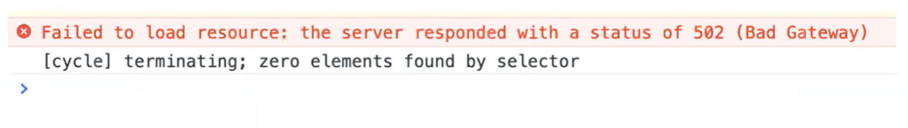

# 1. 页面布局方面

## 1.1 页面一行内容超长展示错乱

## 1.2 更换设备布局错乱

# 2. 页面元素方面

## 2.1 输入域提示信息不明确

## 2.2 输入框包含html字符时出现异常

# 3.  功能方面

## 3.1 功能不符合需求

## 3.2 提示信息错误

## 3.3 JS报错

## 3.4 更改不同步

登录后打开多个页面。在一个页面中操作修改内容，在另一个页面中查看，已经修改过的内容在另一个页面上没有体现。

## 3.5 登录状态不同步

打开多个页面。其中一个页面登录成功，另一个页面刷新，没有同步为登录状态。

# 4. 其他

## 4.1 页面请求失败

## 4.2 加载时间太长

