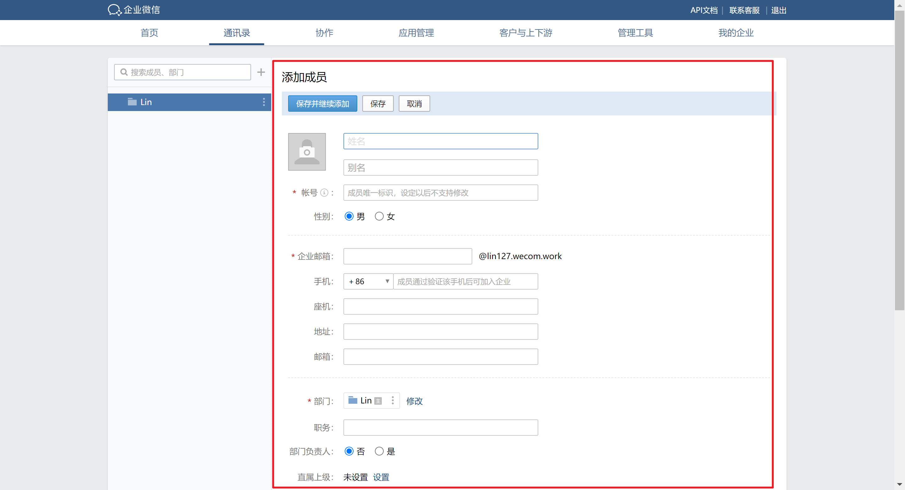
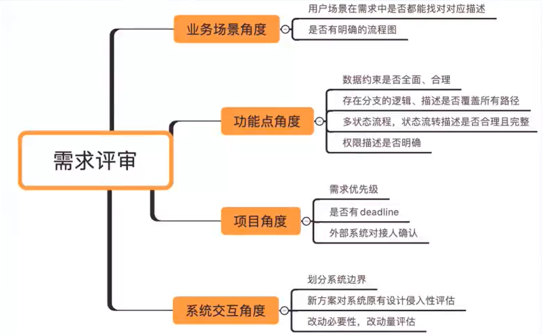
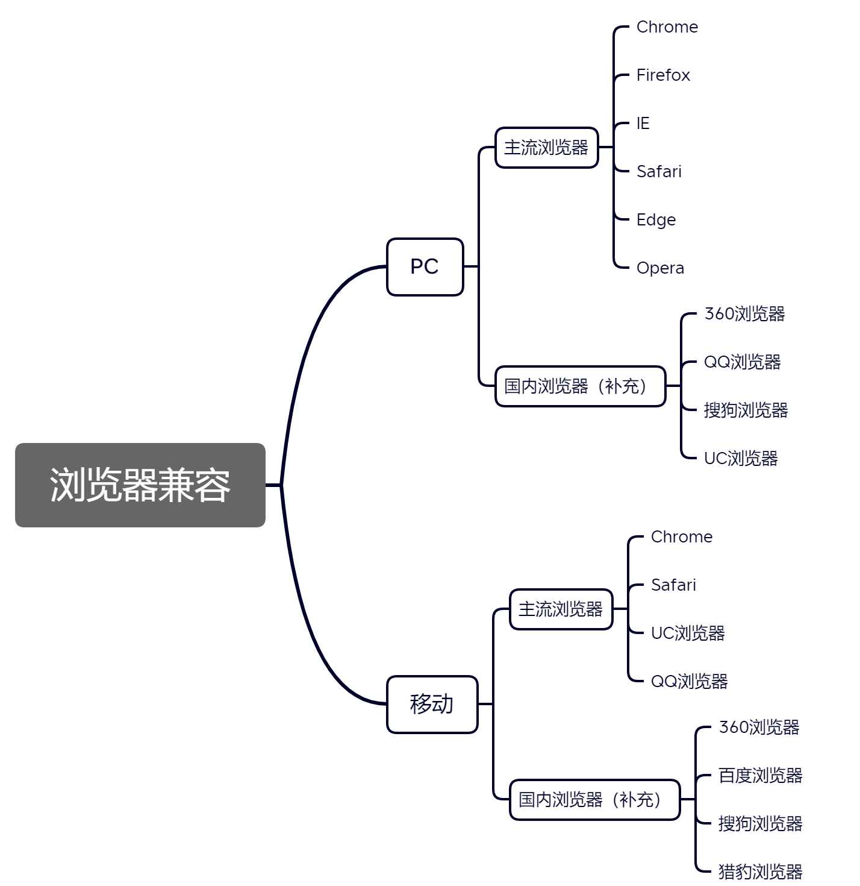
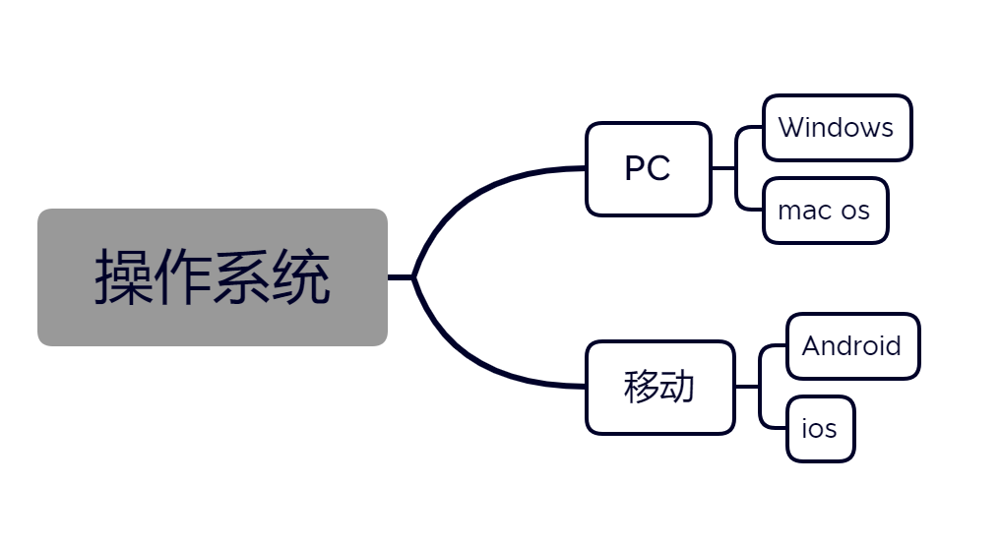
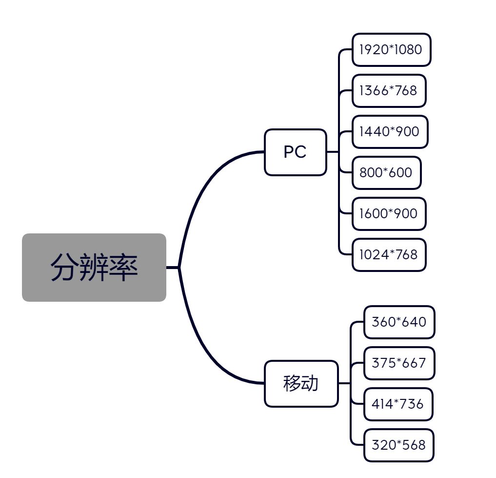
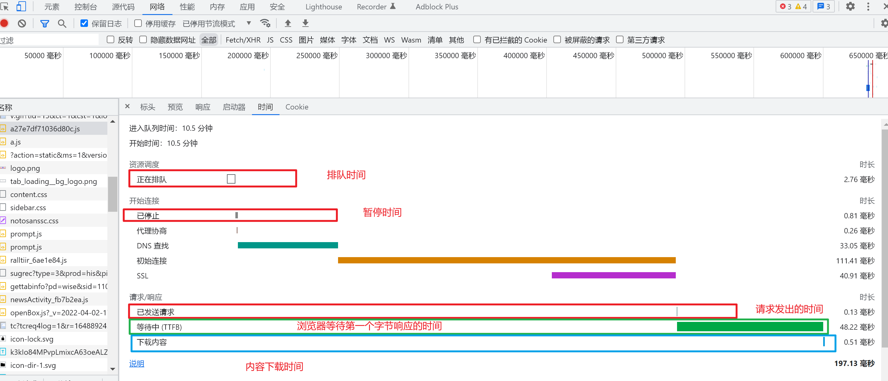

# 手动测试实战

## 1. 项目背景

企业微信web端：https://work.weixin.qq.com/

## 2. 项目流程

Web测试流程：

1. 需求分析
2. 测试计划编写
3. 测试用例编写
4. 用例执行
5. 回归测试
6. 兼容性测试
7. 安全测试
8. 走查验收（UI、产品）
9. 测试总结报告

## 3. 需求分析

### 需求分析步骤

1. 明确测试范围
2. 明确功能点
3. 明确业务流程
4. 明确输出结果
5. 分析异常流程
6. 预估测试需要的时间和资源

## 4. 测试计划编写

### 4.1 测试计划作用

- 方便宏观调控，进行相应资源配置
- 方便了解整个项目测试情况以及项目测试不同阶段的所要进行的工作

### 4.2 测试计划编写要点

**5W+H 原则**

- why：为什么要进行这些测试
- what：测试哪些方面，不同阶段的工作内容
- when：测试不同阶段的起止时间
- where：相应文档，缺陷的存放位置，测试环境等
- who：项目有关人员组成，安排哪些测试人员进行测试
- how：如何去做，使用哪些测试工具以及测试方法进行测试

## 5. 测试设计

### 测试用例设计步骤

1. 划分功能模块
2. 正向功能验证
3. 单个功能项验证
4. 功能之间交互验证
5. 隐形需求

测试用例评审

- 测试用例的本身的描述是否清晰，是否存在歧义
- 测试用例内容是否正确，是否与需求目标相一致
- 测试用例的期望结果是否确定、唯一
- 测试用例是否覆盖了所有的需求
- 测试用例是否具有可执行性
- 是否从用户层面来设计用户使用场景和业务流程的测试用例
- 场景测试用例是否覆盖最复杂的业务流程
- ·用例设计是否包含了正面、反面的用例

## 6. 测试执行

### 6.1 提测

web提测方式：开发提供测试环境地址
测试地址：https://work.weixin.qq.com/wework_admin/frame#contacts

### 6.2 bug定位

- 前端错误：查看前端源码
- 通过分析网络数据
    - 响应数据错误，服务端问题
    - 响应数据正确，但是前端展示错误，前端问题
    - 响应数据与自己操作不一致，查询数据库确认
- 服务端错误：根据后台日志分析定位

### 6.3 兼容性测试

####  （1）浏览器兼容

#### （2） 操作系统兼容

#### （3）分辨率兼容

### 6.4 兼容测试工具

- IETester：可以方便的解决IE浏览器的兼容问题

- Browsershots：一个在线测试工具，支持很多浏览器

- 开发者工具：Toggle device toolbar

    - 模拟移动设备界面
    - 自定义设备
    - 旋转屏幕
    - 生成页面快照
    - 显示标尺
    - 缩放视图
    - 限制网络流量和CPU占用率

    

### 6.5 性能测试

- web页面响应时间

- 负载测试：测量Web系统在某一负载级

    别上的性能，以保证Web系统在需求范

    围内能正常工作

- 压力测试：测试Web应用系统会不会崩

    溃，在什么情况下会崩溃

- 测试方法：

    - 开发者工具-NetWork
    - JMeter

### 6.6 安全测试

- SQL注入：将SQL语句添加到输入参数中，传递到服务端解析并执行的一种攻击手法
- XSS跨站攻击：恶意攻击者往web页面插入恶意脚本代码

## 7. 测试总结

**总结要点**

- 人力投入
- 用例覆盖情况
- Bug的分类及数量统计
- 遗留Bug情况
- 测试风险
- 测试结论

