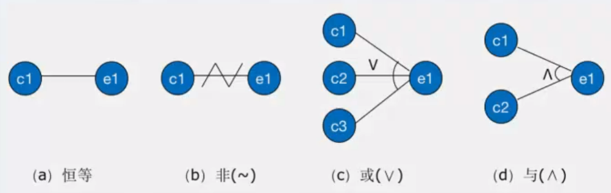
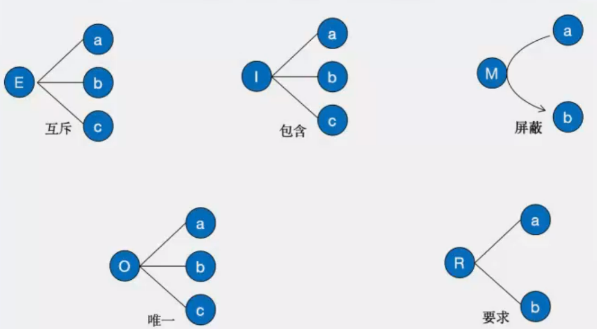
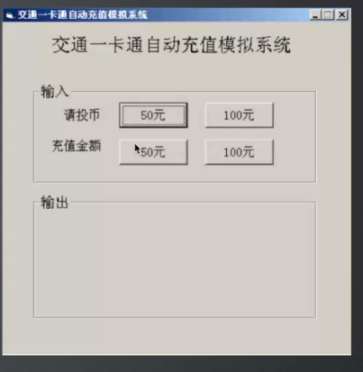
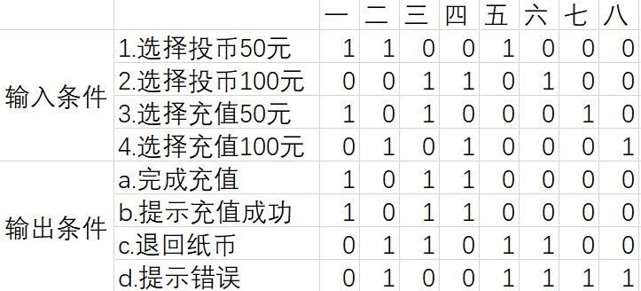
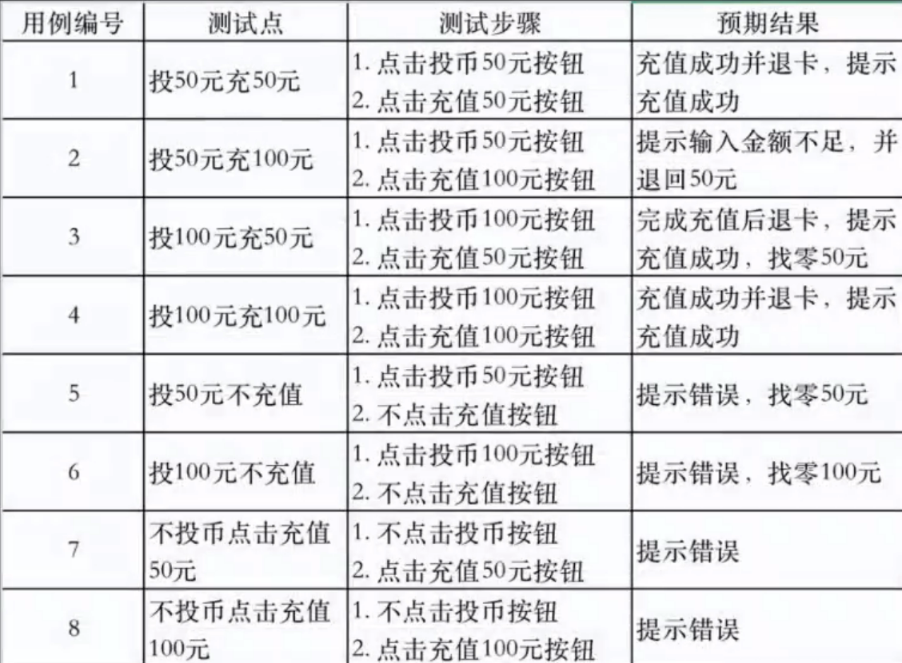

# 因果图定义

因果图法是一种利用图解法分析输入的各种组合情况，从而设计测试用例的方法它适合于检查程序输入条件的各种组合情况

- "因"一一输入条件

- "果"一一输出结果

# 因果图使用场景

- 描述多种条件的组合

- 产生多个动作

# 因果图中的基本符号

- 恒等：若原因出现，则结果出现；若原因不出现，则结果也不出现

- 非：若原因出现，则结果不出现；若原因不出现，则结果出现

- 或：有多个原因。若几个原因中有一个出现，则结果出现；若几个原因都不出现，则结果不出现

- 与：有多个原因。若几个原因都出现，则结果才出现；若其中一个原因不出现，则结果不出现

# 因果图中的约束条件

- 互斥E：a、b、c只能有一个成立，但是可以都不成立

- 包含I：a、b、c中至少有一个成立

- 唯一O：a、b、c有且仅有一个成立

- 要求R：如果a成立，则要求b必须也成立，其他的不约束

- 屏蔽M：如果a成立的时候，强制b不成立，其他的不约束

# 因果图法基本步骤

1. 找出所有的输入条件（因）

2. 找出所有的输出条件（果）

3. 明确所有输入条件之间的制约关系以及组合关系

4. 明确所有输出条件之间的制约关系以及组合关系

5. 找出什么样的输入条件组合会产生哪种输出结果

6. 把因果图转换成判定表

7. 为判定表中的每一列表示的情况设计测试用例

**例子：交通一卡通自动充值软件系统**

需求解释：

- 系统只接收50或100元纸币，一次只能使用一张纸币，一次充值金额只能为50元或100元

- 在请投币的后面按50元按钮，代表投入50元纸币；按100元按钮，代表投入100元纸币

- 若按50元按钮，并选择充值50元，完成充值，提示充值成功

- 若按50元按钮，并选择充值100元，提示输入金额不足，退回50元

- 若按100元按钮，并选择充值50元，完成充值，提示充值成功，退回50元

- 若按100元按钮，并选择充值100元，完成充值，提示充值成功

- 若按投币按钮后在规定时间内不选择充值按钮，提示错误，退回投入纸币

- 若选择充值按钮后不按投币按钮，提示错误

找到所有输入条件编号：

- 1.选择投币50元
- 2.选择投币100元
- 3.选择充值50元
- 4.选择充值100元

找到所有输出条件编号

- a.完成充值

- b.提示充值成功

- c.退回纸币

- d.提示错误

步骤：

1. 画图分析输入和输出的关系，此处转化为表格形式

    

2. 转化为测试用例

# 难点

寻找因果图中的约束关系
