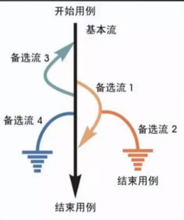

# 场景法概述

场景法就是模拟用户操作软件时的场景，主要用于测试系统的业务流程。

- 基本流：按照正确的业务流程来实现的一条操作路径

- 备选流：导致程序出现错误的操作流程

# 场景法用例设计步骤

- 根据需求规格说明，画出功能模块流程图

- 根据流程图，蒞述出程序的基本流及备选流

- 根据基本流和备选流生成不同的场景，构造场景列表

- 对每一个场景生成相应的测试用例

- 对生成的所有测试用例重新复审，去掉多余的测试用例

- 测试用例确定后，为每一个测试用例确定测试数据值

# 例子：淘宝购物车

- 基本流

    - 进入淘宝首页

    - 浏览商品

    - 进入单品页

    - 选择商品规格和数量

    - 加入购物车

    - 前往购物车

    - 选择商品

    - 结算，进入确认订单页

    - 提交订单

    - 付款成功

    - 等待收货

    - 确认收货

- 备选流：

    - 备选流1：加入购物车时，不选择商品规格和型号，返回基本流第4步

    - 备选流2：加入购物车时，商品库存不足，返回基本流第4步

    - 备选流3：加入购物车时，未登录，登录后返回基本流第3步

    - 备选流4：加入购物车后，继续选购，返回基本流第4步

    - 备选流5：加入购物车，未选择商品，结算，返回基本流第7步

    - 备选流6：支付失败，返回基本流第8步

    - 备选流7：未选择商品加入购物车，退出购物，结束

- 构造场景

    - 场景1：登录后成功购物（基本流）

    - 场景2：未选择商品规格和型号就添加购物车（基本流+备选1）

    - 场景3：选择的商品库存不足（基本流+备选流2）

    - 场景4：未登录添加购物车（基本流+备选流3）

    - 场景5：商品添加购物车后继续购物（基本流+备选流4）

    - 场景6：进入购物车，未选择商品直接结算（基本流+备选流5）

    - 场景7：支付过程出错（基本流+备选流6）

    - 场景8：没有添加商品到购物车（基本流+备选流7）

- 测试用例（部分）：

    

    > 写测试步骤要每一步都写清楚，每一步最好前面都加上序号，描述程度：不了解产品的也能看懂文档

- 好处：有业务流程适合业务场景

- 坏处：单个功能点的测试没有做到，需要用等价类、边界值、判定表、因果图等方法去验证，再进一步通过场景法对业务流程进行验证
