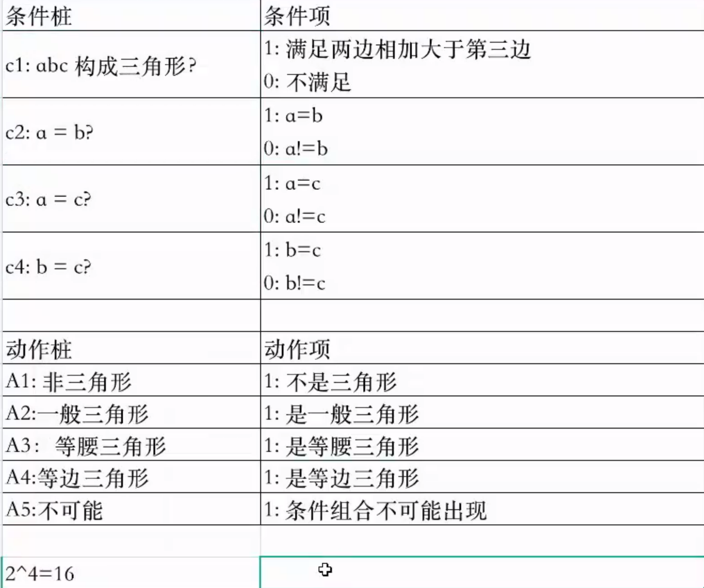
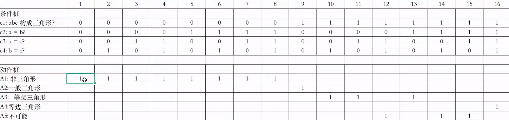
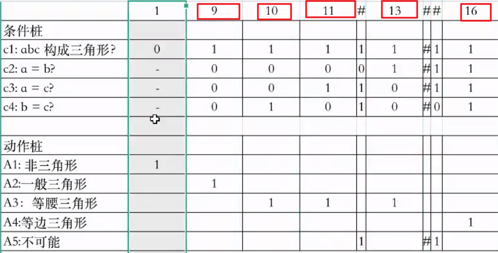
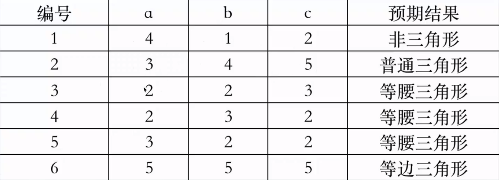

# 判定表法

因果图只是一种辅助工具，通过分析最终得到判定表，再通过判定表编写测试用例

画因果图非常麻烦，影响测试效率，可以直接写判定表，进而编写测试用例

## 判定表的组成

- 条件桩：问题的所有条件

- 动作桩：问题的所有输出

- 条件项：针对条件桩的取值

- 动作项：条件项的各种取值情况下的输出结果

## 判定表设计步骤

1.列出所有的条件桩和动作桩

2.确定规则数：条件取值个数\^条件数（指数）

3.填入条件项

4.填入动作项。得到初始判定表

5.简化判定表

## 判定表例子：

- 判断三角形

- 输入三个正整数a、b、c，分别作为三角形的三条边

- 判断三条边是否能构成三角形

- 如果能构成三角形，判断三角形的类型（等边三角形、等腰三角形、一般三角形）

- 确定条件桩

    - C1：a，b，c构成三角形？a\<b+c、b\<a+c、c\<a+b

    - C2：a=b？

    - C3：a=c？

    - C4：b=c？

- 确定动作桩

    - A1：非三角形

    - A2：不等边三角形

    - A3：等腰三角形

    - A4：等边三角形

    - A5：不可能

- 判定表

- 简化判定表

> 简化之后，5条测试用例

- 设计测试用例

# 重点

判定表的测试用例是一半一半分的

# 难点

确定规则数
