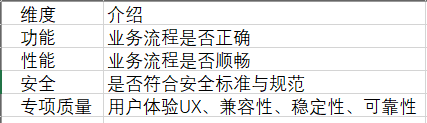
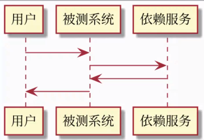
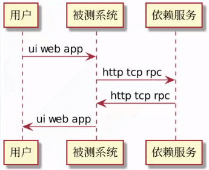

# 常见Bug分类

# 为什么需要掌握bug定位

- 提交bug时候追加更多有用信息，方便研发更快的解决问题

- 分析bug形成原因，进行溯源并建立特征进行批量追踪

# bug展现层

条件：测试数据

过程：测试步骤

结果：测试结果

# 技术架构层次

- 视图层 View

    - web UI html css

    - app activity view

- 控制器层Controller

    - web：chrome，devtool

    - app：dalvik art objectc-runtime

- 模型层Model

    - 模型的传递方式 http tcp rpc串口

    - 模型的形式 json xml binary

    - 模型定义 schema

- MVC三层分析方法

    - View层：运行平台、应用调试机制、链路分析

    - Controller层：运行平台、应用调试机制、链路分析

    - Model层：运行平台、应用调试机制、链路分析

        - View层常用分析方法

            - UI 人工测试 自动化测试

            - UE 人工测试 自动化测试

            - UI Diff 自动化分析

        - controller层常用分析方法

            - 运行平台日志：log

            - 应用调试日志：debug trace hook profile

        - model层常用分析方法

            - 运行平台 log

            - app 调试机制

            - 链路分析：代理抓包、嗅探抓包

# 笔记总结

- 明确bug问题的现象与复现步骤

- 分层分析关键过程的数据与问题特征

- 积累bug特征与问题根源特征，丰富测试经验，提高bug发现的能力
