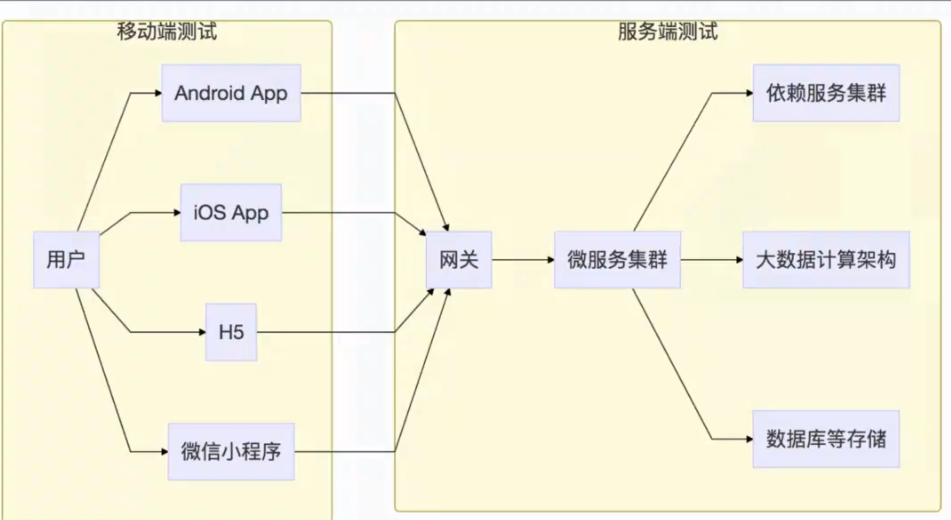
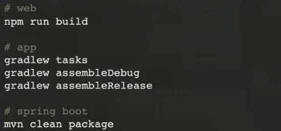

# 被测系统AUT（Application Under Test)

# 常见的被测系统类型

- Ul：Web App IOT

- Service：

    - RESTful：sprint boot

    - webservice

    - rpc：dubbo pb

- code：SDK lib

# 部署方法

- 打包部署：apk app ipa jar war

- Android：gradle

- ios：xcode xcodebuild

- 自动化构建工具

- Web：nodejs npm

- Service：maven gradle

- 打包命令

- 脚本部署：自动化脚本与自动化平台

    - 自动化脚本部署

        - 通过bash python等脚本实现自动化的构建与部署

        - 通过持续集成平台比如jenkins完成流程管理

- 容器部署：基于容器镜像 docker k8s

    - 自动化构建 bash

    - 容器构建 docker

    - 容器编排 k8s

    - 持续集成 jenkins
