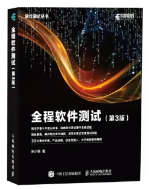
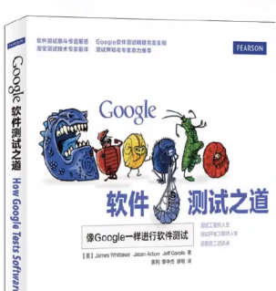
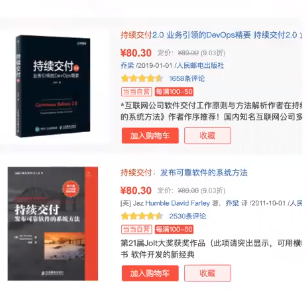
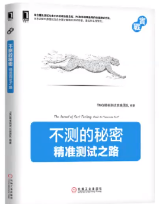

## 全程软件测试

- 测试行业的经典书籍

- 测试方法

- 测试策略

- 领域测试

- 主流测试技术

- 涵盖了软件测试的流程与方法体系

## 探索式测试

- 探索式测试的经典代表性书籍

- 探索式测试是业务测试和手工

- 测试实践中的一个方法论

## Google测试之道

- 高级测试工程师与架构师必读

- 讲解google的测试策略与方法

- 以及google对软件开发与测试的理解

## 持续交付

- 持续交付的经典书籍

- 现代化软件研发与测试的启蒙

- 持续交付1.0

- 持续交付2.0

## 不测的秘密

- 腾讯TMQ出品

- 精准化测试代表性书籍
