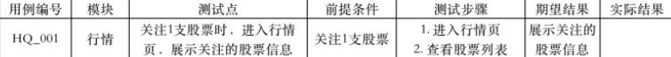
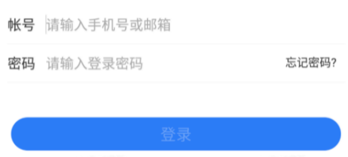

# 测试用例基础

## 测试用例概念

- 测试用例（Test Case）是为特定的目的而设计的一组测试输入、执行条件和预期的结果

- 通过大量的测试用例来检验软件的运行效果

- 它是指导测试工作进行的依据

## 测试用例的组成

- 用例编号

- 模块

- 测试点（测试标题）

- 优先级

- 前提条件

- 测试步骤

- 期望结果（预期结果）

- 实际结果

## 测试用例的优先级

> 测试用例根据重要性分成一定的等级

- P0：核心功能（冒烟）

- P1：高优先级、基本功能测试、重要的错误、边界

- P2：中优先级、异常测试、边界、中断、网络、UI、容错性

- P3：低优先级、性能、压力、兼容性、安全、可用性

## 测试用例设计工具

- 思维导图

- excel

## 表格形式

## *测试方法的选择

- 需要输入数据的地方，考虑采用等价类划分法，将无限测试变成有限测试

- 在任何情况下都必须采用边界值分析法

- 关注它的主要功能和业务流程、业务逻辑是否正确实现，考虑使用场景法

- 如果含有输入条件的组合情况，考虑选用因果图和判定表法

- 采用错误推断法再追加测试用例

## 测试用例的粒度 

- 测试用例可以写的很简单，也可以写的很复杂

- 最简单的测试用例是测试的纲要，仅仅指出要测试的内容

- 测试用例写的过于简单，则可能失去了测试用例的意义

- 测试用例写得过于复杂或详细，会带来两个问题：

    - 效率问题

    - 维护成本问题

- 测试用例的作用

    - 指导测试的实施

    - 规划测试数据的准备

    - 编写测试脚本的\"设计规格说明书\"

    - 评估测试结果的度量基准

    - 分析缺陷的标准

# 测试用例设计实战

## 登录测试用例设计

- 登录需求讲解

    - 帐号是手机号或者邮箱

    - 手机号仅限制为国内常用的号段

    - 密码必须为 数字+英文 的形式，字段为 8-12 个字符

    - 点击登录按钮，发起登录请求

    - 请求成功，跳转到首页

    - 点击忘记密码跳转到找回密码页

- 测试用例编写步骤

    - 划分功能模块

    - 正向功能验证（冒烟）

    - 单个功能项验证

    - 功能之间交互验证

    - 隐形需求

- 输入项设计要点

    - 数据长度验证

    - 数据类型验证

    - 是否必填验证

    - 限制约束验证

- 需求分析

    - 业务规则

    - 主流程

    - 异常处理

    - 数据约束

# 面试测试用例设计思路

- 思路

    - 需求分析

        - 向面试官询问细节

    - 界面

        - UI图一致

        - 页面文案正确

    - 功能

        - 正向功能验证

        - 单个功能---正常/异常

        - 功能之间交互

        - 接口验证

            - 请求发送实际正确

            - 请求参数正确

            - 响应数据的正确处理

    - 易用性

        - 操作是否简单

        - 页面布局是否美观

        - 提示信息是否容易理解

        - web：tab切换

    - 兼容性

        - APP

            > 页面展示正确，主功能异常

            - 平台
            - 厂商
            - 系统版本
            - 分辨率
            - 高低版本的兼容

            - WEB

                - 浏览器
                - 分辨率
                - 操作系统

        - 性能

            - 服务端
            - APP性能

        - 安全性

            - 注入
            - 加密
            - 权限
            - 特殊场景：语音或视频通话/发送语音文件时，是否会生成录音文件，这个需要检查一下

        - APP

            - 网络

                - 不同运营商
                - 不同网络环境
                - 弱网
                - 断网

            - 中断

                - 前后台切换
                - 锁屏
                - 断网重连
                - app切换
                - 来电话，来短信

            - 系统权限

                - 是否授权

        - WEB

            - 链接
            - 多个浏览器同时访问，数据，权限问题

# 测试用例---雪球账号

- 需求分析

    - 账号类型

        - 手机号

    - 测试范围

        - 不考虑其他测试方式

        - 不考虑忘记密码

    - UI设计稿
        - 按照展示的UI

    - 输入规则

        - 密码的长度和类型有要求

- 界面

    - 界面布局和UI图一致

    - 页面文案展示正确

- 功能

    - 正向功能验证

    - 单个功能---正常/异常

    - 补充场景

    - 接口验证

        - 接口请求的时机正确

        - 接口请求参数正确

        - 界面对于接口响应的展示正确

- 易用性

    - 功能操作是否简便---支付复制粘贴

    - 页面布局是否合理

    - 提示信息是否容易理解

    - web：tab切换

- 兼容性

    - APP页面

        > 展示正确，主功能无异常

        - 平台

            - Andriod
            - ios
            - 鸿蒙

            - 厂商

                - 苹果
                - 华为
                - 小米
                - OPPO
                - 一加
                - vivo

- 系统版本

    - 不同平台的不同版本

    - 分辨率

    - 高低版本的兼容

- 性能

    - CPU

    - 内存

    - 耗电量

    - 流量

    - 响应时间

    - 压力测试

- 安全性

    - 注入攻击

        - SQL注入

        - XSS攻击

    - 加密

        - 账号密码传输过程中加密

        - 本地缓存文件加密

    - 密码

        - 不支持复制

        - 密码展示是否为密文

        - 密码有效期

    - 登陆限制

        - 允许登录失败的次数

        - 登录超时

        - 登录互斥

- APP

    - 网络

        - 不同运营商

        - 不同网络环境

            - WiFi

            - 3G

            - 4G

            - 5G
        - 弱网

            - 延时

            - 丢包

            - 页面提示

        - 断网

            - 提示信息

            - 是都有缓存

    - 中断

        - 前后台切换

        - 锁屏

        - 断网重连

        - app切换

        - 来电话，来短信

    - 系统权限

        - 短信验证码自动授权填充

        - 位置权限

        - 保存账号密码权限（iOS刷脸登录）

# 重点

面试测试用例重点
