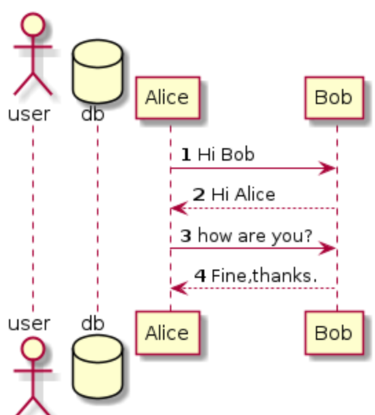

# plantuml

- UML：统一建模语言

- plantuml：第三方插件工具

- plantuml官网：<https://plantuml.com/zh/>

- plantuml中文文档：<https://ceshiren.com/t/topic/4530>

- plantuml在线绘图地址：[https://plantuml.ceshiren.com](https://plantuml.ceshiren.com/)

# 时序图

例子1：


```startuml
@startuml
Bob -> Alice : hello      冒号加空格
@enduml
```

例子2：


> ```startuml
> @startuml
> Alice -> Bob : Hi Bob
> Bob --> Alice : Hi Alice
> Alice -> Bob : how are you?
> Bob --> Alice : Fine,thanks.
> （Alice <-- Bob·······）
> @enduml
> ```

# 时序图常用关键字

- 声明对象：actor 、database


```startuml
@startuml
actor user
database db
Alice -> Bob : Hi Bob
Bob --> Alice : Hi Alice
Alice -> Bob : how are you?
Bob --> Alice : Fine,thanks.
@enduml
```

- 消息数字序号：autonumber



```startuml
@startuml
autonumber
actor user
database db
Alice -> Bob : Hi Bob
Bob --> Alice : Hi Alice
Alice -> Bob : how are you?
Bob --> Alice : Fine,thanks.
@enduml
```

- 消息分组：alt/else/end


```startuml
@startuml
autonumber
Alice -> Bob : 认证请求
alt 成功情况
Bob --> Alice : 认证接受
else 失败情况
Bob --> Alice : 认证失败
else 其他情况
Bob --> Alice : 请重复
end
@enduml
```

# 用例图

例1


```startuml
@startuml
left to right direction
> 从左到右去展示
skinparam packagestyle rectangle
> 整个形状是长方形
actor customer
actor clerk
> 两个角色customer和clerk
rectangle checkout {
> 长方形里包括
    customer -- (checkout)
    > 具体的用例写在小括号中，--是实线
    (checkout) .> (payment) : include
    > .>是虚线
    (help) .> (checkout) : extends
    (checkout) -- clerk
}
@enduml
```

# 活动图


例1：

> 新语法

```startuml
@startuml
start
repeat
> 循环用repeat
    :read data;
    > 每一个步骤 ：开头 ; 结束
:generate diagrams;
repeat while (more data?)
> 循环结尾repeat while 加上对应的条件，小括号内
stop
@enduml
```

plantuml还支持思维导图

例1：


```startuml
@startmindmap
* 根节点
    * 第一级子节点1
        * 第二级子节点1
        * 第二级子节点2
    * 第一级子节点2
@endmindmap
```

