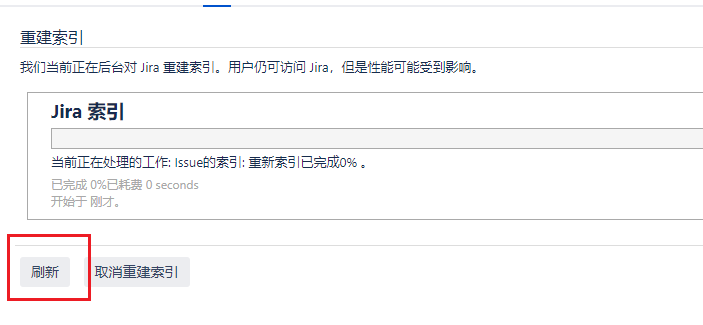

# 测试用例管理

## step1新建项目

## step2新建问题类型——**系统设置**

## step3问题同项目关联

## step4新建工作流

### 设置工作流

> 可以点击编辑工作流，但是选择新建工作流更简单------系统设置，新建的工作流要勾选"显示转换标签"

### 工作流关联项目

> 快捷返回项目

## step5设置测试用例界面

### 新建界面——系统设置

先添加系统级的字段，添加完成后返回界面设置，对需要的界面进行编辑，编辑时选择自己设置好的界面，选择好后点击更新，更新后再操作"把问题操作与屏幕关联"，都设置好后快捷返回项目，再次创建问题，需要的内容都是已经设计好的。

### 新建测试用例特有字段——系统设置

选择"自定义字段"，选择字段类型后，进行相关配置，之后进行**关联**到相关页面并**更新**，再设置字段配置，添加字段配置；之后对字段进行设置，不需要的隐藏，必须的就设置为必填。接下来设置字段配置方案：进行添加域配置方案，添加后要对**默认问题类型进行设置，**编辑**域配置**为刚设置的字段配置。配置好后返回项目。在项目设置的域设置**更新域配置方案**，在**操作**中配置方案并**关联**。配置完成后选择**重建索引**。重建索引后返回项目，在**问题类型**中发现所有的工作流、界面以及域已经与项目关联。

### 创建问题，修改顺序

新建问题已经是自己设置的需要填写的讯息了，但是顺序还是不太准确的，需要对内容顺序进行调整。在测试用例中，在"域"中调整问题页面的顺序。现在问题的顺序已经进行了调整。点击新建问题后现在项目中共有两个问题。

# 笔记总结

- 新建问题类型

- 把问题类型添加到项目中

- 新建工作流

- 把工作流与问题类型关联

- 新建界面

- 界面与问题类型关联

- 新建字段

- 把字段添加到界面中

- 新建字段配置方案

- 配置域，并且添加到域配置方案中

- 关联域配置方案和问题类型

