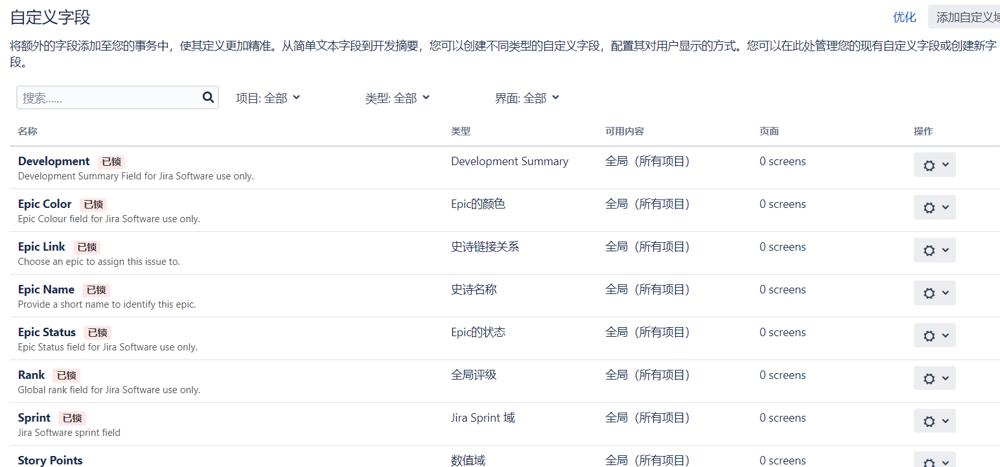
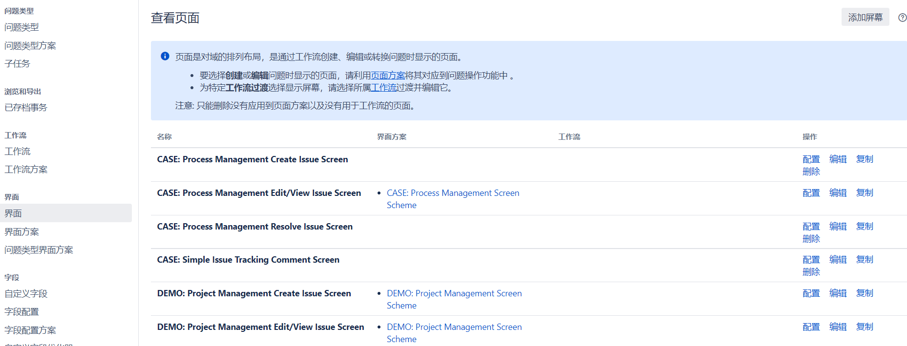

# 5.3 测试流程管理jira系统——测试用例管理

## Jira使用者

- 管理者

- 项目经理

- 产品

- 开发

- 测试

## Jira中的基本概念

- Project项目

    - 问题的容器

- Issue问题

    > 每一个问题都是一个测试用例

    - 管理各种事务

    - 问题类型<https://jira.ceshiren.com/secure/ShowConstantsHelp.jspa?decorator=popup#IssueTypes>

- Field字段/域

    

- Workflow工作流

    描述问题的状态以及状态之间的转化

- Screen界面/屏幕

    - 展示字段的容器

