# 1. Linux 系统与 Shell 环境准备测试

## 1.1 Unix

- Linux前身
- 应用程序
- 工具软件
- 网络协议

## 1.2 Linux内核

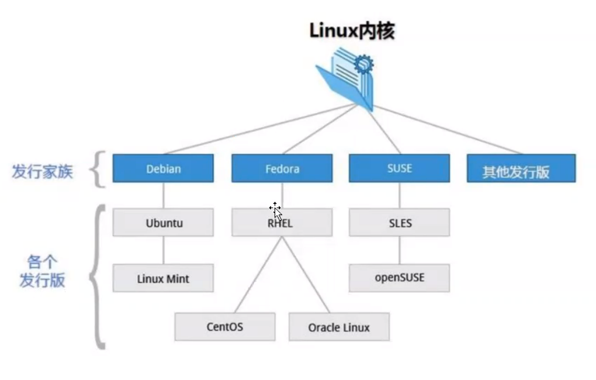

### [1] linux与windows比较:

|   比较   |                           Windows                            |                         Linux                          |
| :------: | :----------------------------------------------------------: | :----------------------------------------------------: |
|   界面   | 界面统一，外壳程序固定所有Windows程序菜单几乎一致，快捷键也几乎相同 |      图形界面风格依发布版不同而不同，可能互不兼容      |
| 驱动程序 |           驱动程序丰富，版本更新频繁。硬件厂商提供           | 由志愿者开发，很多硬件厂商基于版权考虑并未提供驱动程序 |
|   使用   |                      使用比较简单，容易                      |               图形界面使用简单，容易入门               |
|   软件   |  每一种特定功能可能都需要商业软件的支持，需要购买相应的授权  |    大部分软件都可以自由获取，同样功能的软件选择较少    |

### [2] linux系统文件结构

### [3] linux基本指令

- ls: 列出目录
- cd：切换目录
- pwd：显示目前的目录
- mkdir：创建一个新的目录
- rmdir：删除一个空的目录
- cp: 复制文件或目录
- rm: 移除文件或目录
- mv: 移动文件与目录，或修改文件与目录的名称

### [4] Shell基础

Shell 是一个应用程序，它连接了用户和 Linux 内核，让用户能够更加高效、安全、低成本地使用 Linux 内核，这就是 Shell 的本质。

**常见的shell:**

- Bourne Shell（/usr/bin/sh或/bin/sh）
- Bourne Again Shell（/bin/bash）
- C Shell（/usr/bin/csh）
- K Shell（/usr/bin/ksh）
- Shell for Root（/sbin/sh）

**运行shell:**

- chmod +x ./test.sh #使脚本具有执行权限
- ./test.sh #执行脚本
- /bin/sh test.sh

# 2. Linux进程与线程

## 2.1 进程

- 可执行程序的运行态
- 操作系统调度的基本单位
- 线程容器
- 进程本身包含指令、数据等资源

## 2.2 线程

- 进程中被执行的最小单元
- cpu调度的基本单位
- 线程带有指令、数据等资源

## 2.3 进程的生命周期

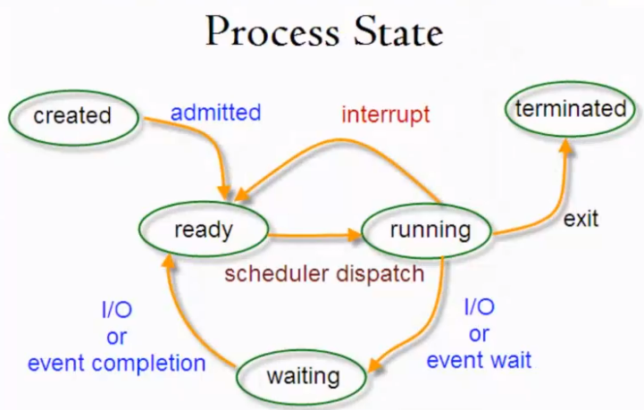

- created sleep 100./demo.py
- ready
- running
- wating
- terminated kill killall

## 2.4 常用进程管理命令

- ps  进程列表快照
- top  交互式进程观测
- kill killall  结束进程
- fg  进程切换到前台
- bg  进程切换到后台
- ctrl z  挂起进程

### [1] ps命令

​	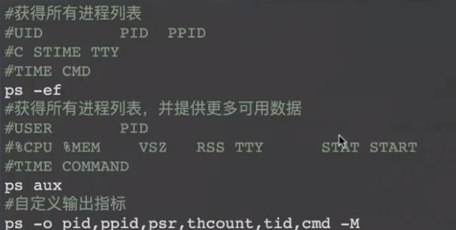

> -M/-m 看到所有的线程

- unⅸ  风格参数 ps  -ef
- bsd  风格参数 ps  aux
- gnu  风格参数  ps  --pid pidlist

### [2] linux进程运行情况

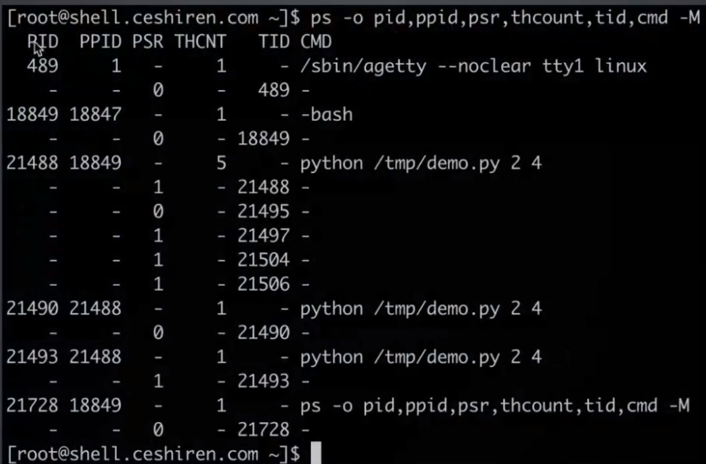

### [3] 进程状态

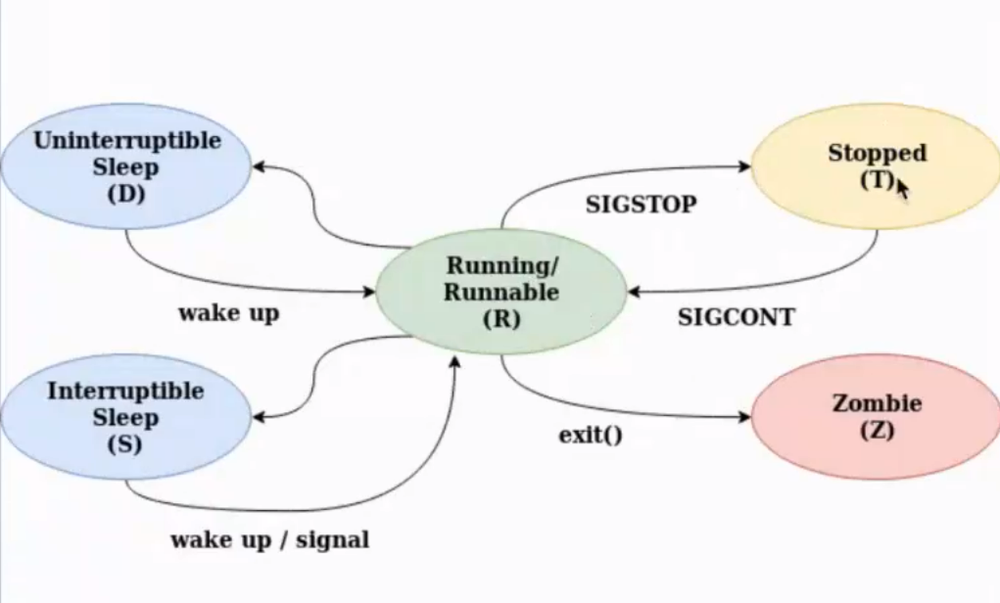

- D uninterruptible sleep（usually IO）

    ​	不间断睡眠（通常为IO）

- R running or runnable （on run queue）

    ​	正在运行或可运行（运行队列上）

- S interruptible sleep（waiting for an event to complete）

    ​	可中断睡眠（等待事件完成）

- T stopped by job control signal

    ​	被作业控制信号停止

- t stopped by debugger during the tracing

    ​	在跟踪过程中被调试器停止

- W paging（not valid since the 2.6.xx kernel）

    ​	分页（自2.6.xx内核以来无效）

- X dead （should never be seen）

    ​	死亡（永远不会被看到）

- Z defunct （"zombie"）process,terminated but not reaped by its parent

    ​	失效（“僵尸”）进程，终止但未被其父进程收获

# 3. Linux常用命令之文件处理

## 3.1 连接服务器

- mac/linux系统，在终端执行命令
    - 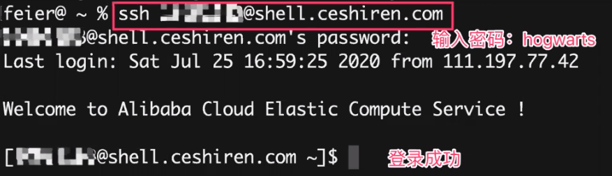
    - ssh -p22 username@host
    - 密码输入时看不到内容
- Windows系统，利用xshell执行

## 3.2 文件

### [1] 查看帮助

- --help

    ​	ls --help

- man

    ​	man ls

### [2] 文件管理

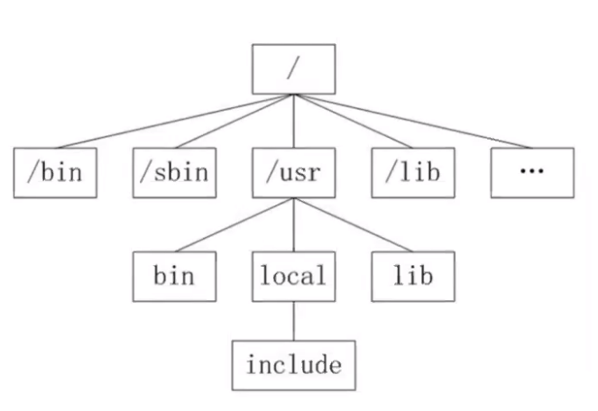

#### 1.查看文件信息：`ls`

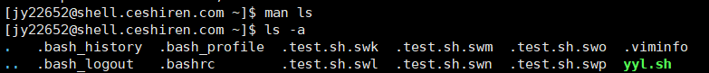

- `ls -a`：查看路径下所有文件包括隐藏文件
- `ls -l`（`ll`)：把目录和文件详细信息显示 命令也可以组合使用
- `ls -al`就是查看所有文件及详细信息 
- `.`      当前目录 
- `..`     上一级目录

#### 2. 切换工作目录：`cd`

- cd后可以跟绝对路径（从根目录写起）或相对路径（不是从根目录写起：`cd ./file`）
- `cd`回到根目录
- `cd ..` 返回上一级

#### 3. 显示当前目录路径：`pwd`

- 绝对路径

#### 4. 创建新目录：`mkdir`

- mkdir: cannot create directory : No such file or directory，解决方法：后面加-p

#### 5. 创建空文件：`touch`

#### 6. 删除文件或目录：`rm`

- 删除文件：`rm +文件名`
- 删除目录，返回上一级目录：`cd .. `  ，再删除目录`rm -r +目录`
- `rm -rf `：删除不要轻易使用
- `rf -ri`：删除前询问（加参数i）

#### 7. 拷贝：`cp`

##### 拷贝文件

​	`cp ./1 ./feier`

> 先写原路径，在写拷贝路径

##### 拷贝目录，加参数-a

​	`cp -a ./a ././b`

##### 移动/重命名：mv

- 重命名同一级文件

    `mv 1 f`	

    > 先写原名在写新名

- 移动

    `mv f ./a`	

    > 先写文件在写移动路径

- 移动并改名

    `mv f ../m`

    > 原先上级目录无m文件

#### 8. 建立链接文件：`ln`

##### 软链接

删除文件后链接不可用软链接文件的源文件必须写成绝对路径，而不能写成相对路径（硬链接没有这样的要求，否则软链接文件会报错。

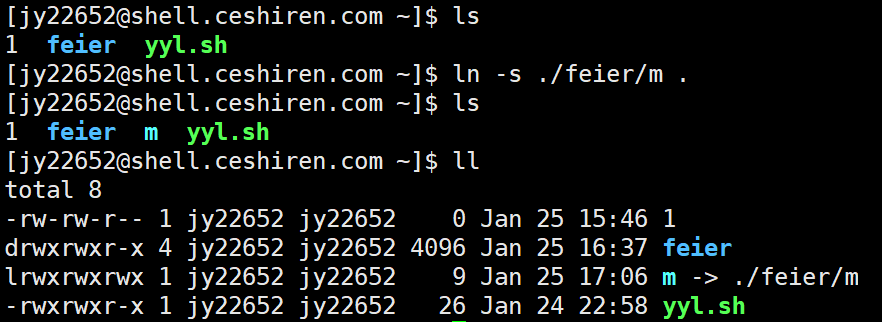

- ln -s target source
- ln -s：表示创建一个软连接；如果不加 "-s" 选项，则建立硬链接文件。
- target：表示目标文件（夹）【即被指向的文件（夹）】
- source：表示当前目录的软连接名。【源文件（夹）】

##### 硬链接

删除后链接可用

#### 9. 查找文件：find

- 精准查找文件名
    - 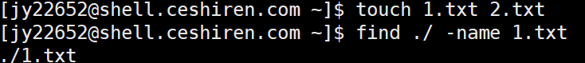
- 模糊查找
    - 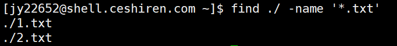

#### 10. 查看文件内容

- cat
- less（分屏展示）
- more（分屏展示、进度）
- head（默认前十行，可自定义head -n 3 +文件名展示前三行）
- tail

#### 11. 打包压缩：tar

> 先打包再压缩

`tar [必要参数] [选择参数] [文件] `

**必要参数有如下：**

- -A 新增压缩文件到已存在的压缩
- -B 设置区块大小
- -c 建立新的压缩文件
- -d 记录文件的差别
- -r 添加文件到已经压缩的文件
- -u 添加改变了和现有的文件到已经存在的压缩文件
- -x 从压缩的文件中提取文件
- -t 显示压缩文件的内容
- -z 支持gzip解压文件
- -j 支持bzip2解压文件
- -Z 支持compress解压文件
- -v 显示操作过程
- -l 文件系统边界设置
- -k 保留原有文件不覆盖
- -m 保留文件不被覆盖
- -W 确认压缩文件的正确性

**可选参数如下：**

- -b 设置区块数目
- -C 切换到指定目录
- -f 指定压缩文件

**例子：**

- tar -cvf log.tar log2012.log    仅打包，不压缩！ 
- tar -zcvf log.tar.gz log2012.log   打包后，以 gzip 压缩
- tar -zcvf log.tar.bz2 log2012.log  打包后，以 bzip2 压缩
- tar -xf f.tar.gz   解压缩，f.tar，压缩格式gzip

> - 在参数 `f` 之后的文件档名是自己取的，习惯上都用 `.tar` 来作为辨识。 如果加 `z` 参数，则以 `.tar.gz` 或 `.tgz` 来代表 gzip 压缩过的 tar 包； 如果加 `j` 参数，则以 `.tar.bz2` 来作为tar包名。
> - 自动补全，输入文件的首字母，按下Tab键补全名称
> - 通过上下键切换历史命令

## 3.3 文本处理

### [1] 文本编辑：`vi/vim`

-  vi 是老式的字处理器，不过功能已经很齐全了，但是还是有可以进步的地方
- vim 具有程序编辑的能力，可以主动的以字体颜色辨别语法的正确性，方便程序设计。Vim是从 vi 发展出来的一个文本编辑器。代码补完、编译及错误跳转等方便编程的功能特别丰富，在程序员中被广泛使用。vim 则可以说是程序开发者的一项很好用的工具。
- vim加文件名，输入i进入编辑页面，输入完成后点击esc退出输入状态，输入:wq保存并退出，:q!强制退出不保存
- 在文件编辑页面，gg跳至第一行行首，shift+g跳至最后一行行首；shift+4($)键跳至行尾，shift+6(^)跳至行首

### [2] 屏幕输出：echo

### [3] 输出重定向：>

## 3.4 文件属性

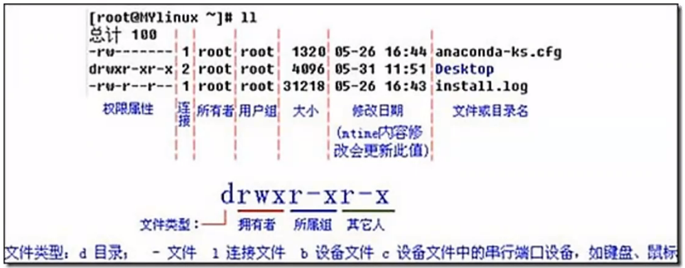

> `ll`指令后输出结果解释，`r`-读，`w`-写，`x`-执行，`-`代表无权限

**修改文件权限:**

- r：读权限read——4
- w：写权限write——2
- x：操作权限execute——1
- -：无权限——0
- chmod 777文件（三组人都拥有最高权限）
- 例图：rwx=r(4)+w(2)+x(1)=7,r-x=4+1=5

## 3.5 网络

### [1] 查看网卡信息：ifconfig

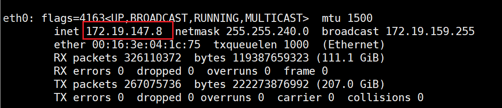

> eth0：本地网卡信息，红框：本地IP地址

### [2] 测试远程主机联通性ping命令

`-c`：ping的次数

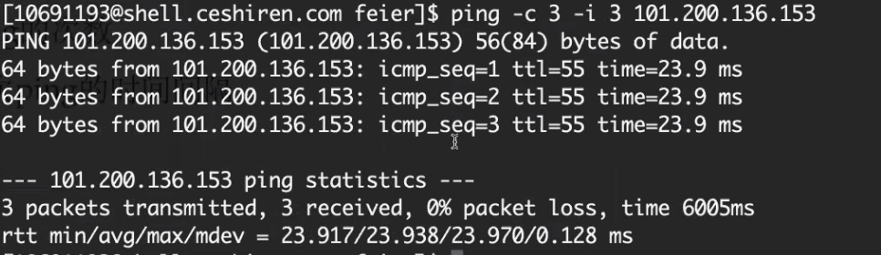

`-I`：每次ping的时间间隔

### [3] 打印Linux网络系统的状态信息

netstat

- `-t`：列出所有tcp
- `-n`：以数字形式显示地址和端口号

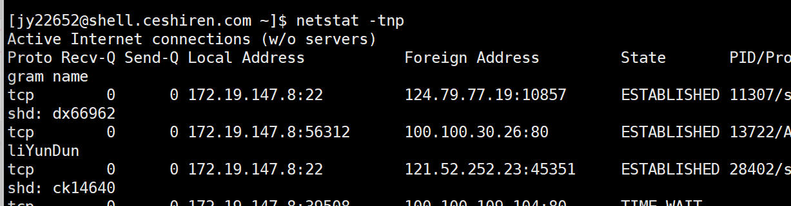

- `-p`：显示进程的pid和名字

### [4] 退出linux系统

`exit`

# 4. Linux性能统计

## 4.1 性能统计知识

- 系统级性能数据分析
- 进程级别性能数据分析

## 4.2 常用性能指标

- cp：代表算法的高效性
- mem：代表数据结构的使用合理性
- net io：等更多指标
- net io的不合理使用同样会在cpu和mem上体现出影响，所以我们今天重点介绍3个指标，cpu，mem与net

## 4.3 统计方法

- 临时性分析命令交互
- 系统性分析 promethus  grafana

## 4.4 CPU使用统计

### [1] CPU信息：`/proc/cpuinfo`

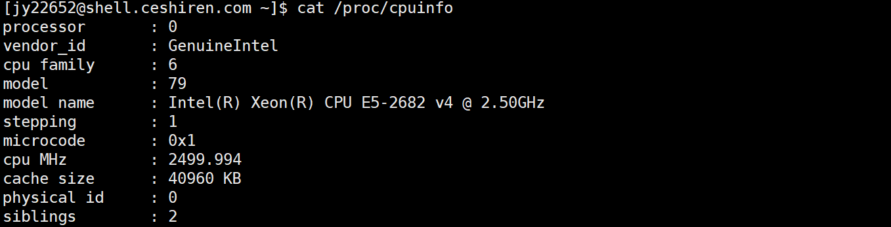

> 了解cpu性能：cat /proc/cpuinfo

### [2] 系统负载与进程cpu占用：`top`

监测cpu的关键指标

> 运行top命令后默认显示：第一部分是前5行，是系统整体的统计信息。第二部分是第8行开始的进程信息。

- cpu利用率：进程的cpu利用情况（第三行）
- ps命令的cpu是平均cpu利用率，不适合做性能分析

#### load average

系统负载情况

> <1：空闲，=1：正在工作，>1：跟cpu核数有关，等待

#### `top`命令

- top命令的格式为：top [选项]
- top命令常用的选项参数有：
    - `-d`	指定每两次屏幕信息刷新之间的时间间隔，如希望每秒刷新一次，则使用：`top -d 1`
    - `-p`	通过指定PID来仅仅监控某个进程的状态（`PID—进程id`）
    - `-S`	指定累计模式
    - `-s`	使top命令在安全模式中运行。这将去除交互命令所带来的潜在危险
    - `-i`	使top不显示任何闲置或者僵死的进程
    - `-c`	显示整个命令行而不只是显示命令名

## 4.5 内存（MEM）占用统计

### [1] 常用命令

#### free

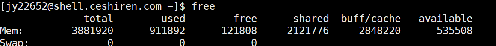

- 命令格式：`free [参数]`
- 命令功能：free 命令显示系统使用和空闲的内存情况，包括物理内存、交互区内存(swap)和内核缓冲区内存。共享内存将被忽略。
- 命令参数：
    - `-b` 　以Byte为单位显示内存使用情况。 
    - `-k` 　以KB为单位显示内存使用情况。 
    - `-m` 　以MB为单位显示内存使用情况。
    - `-g`   以GB为单位显示内存使用情况。 
    - `-o` 　不显示缓冲区调节列。 
    - `-s<间隔秒数>` 　持续观察内存使用状况。 
    - `-t` 　显示内存总和列。 
    - `-V` 　显示版本信息。 

- 内存

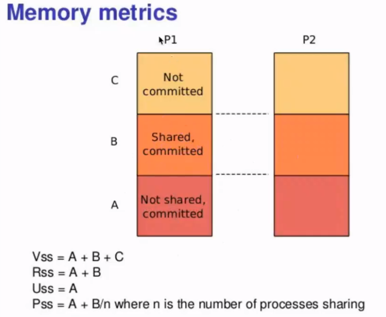

#### meminfo

比free命令更细致

> cat /proc/meninfo 保存了更多的内存使用数据

#### 进程级别的内存分析

- `ps aux |less`

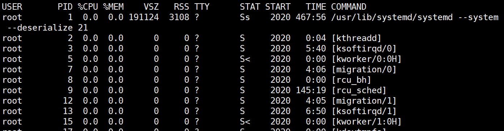

- `ps -o`

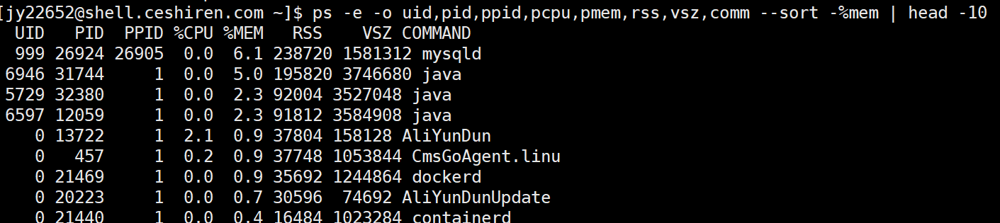

- `ps`
- `top`

## 4.6 网络连接（Net）统计

### [1] 查看网络连接netstat

- 参数
    - `-a` (all)   显示所有选项，默认不显示LISTEN相关。
    - `-t` (tcp)   仅显示tcp相关选项。
    - `-u` (udp)   仅显示udp相关选项。
    - `-n`   拒绝显示别名，能显示数字的全部转化成数字。
    - `-l`    仅列出有在 Listen (监听) 的服务状态。
    - `-p`    显示建立相关链接的程序名
    - `-r`    显示路由信息，路由表
    - `-e`    显示扩展信息，例如uid等
    - `-s`    按各个协议进行统计
    - `-c`    每隔一个固定时间，执行该netstat命令。
- 网络状态
    - LISTEN：侦听来自远方的TCP端口的连接请求
    - SYN-SENT：再发送连接请求后等待匹配的连接请求（如果有大量这样的状态包，检查是否中招了）
    - SYN-RECEIVED：再收到和发送一个连接请求后等待对方对连接请求的确认（如有大量此状态，估计被flood攻击了）
    - ESTABLISHED：成功连接。代表一个打开的连接
    - FIN-WAIT-1：等待远程TCP连接中断请求，或先前的连接中断请求的确认
    - FIN-WAIT-2：从远程TCP等待连接中断请求
    - CLOSE-WAIT：被动关闭。等待从本地用户发来的连接中断请求
    - CLOSING：等待远程TCP对连接中断的确认
    - LAST-ACK：等待原来的发向远程TCP的连接中断请求的确认（不是什么好东西，此项出现，检查是否被攻击）
    - TIME-WAIT：主动关闭。等待足够的时间以确保远程TCP接收到连接中断请求的确认
    - CLOSED：没有任何连接状态

- 当前系统监听的网络端口

## 4.7 数据统计

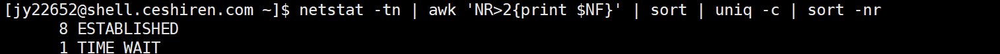

# 5. Linux 常用统计命令

## 5.1 排序：`sort`

sort常用参数：

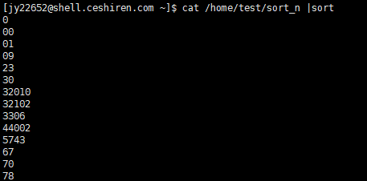

> 把乱序排列，按每个字符去排列

- -b：忽略开头的空白字符

- -f：将小写字母看作为大写字母

- -h：根据存储容量排序（KB、MB、GB）

    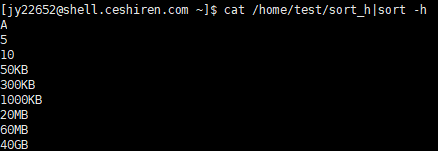

- -n：按数字排序

    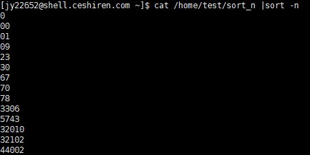

- -o：把结果写入文件

- -r：以相反的顺序来排序

    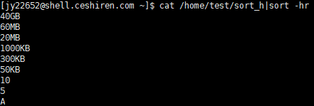

- -t：指定分隔符。默认为空格

    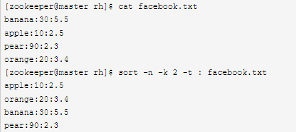

    > 这个文件有三列，以冒号隔开。指定了间隔符之后，就可以用`-k`来指定列数了。我们使用冒号作为间隔符，并针对第二列来进行数值升序排序。

- -V：按照数字版本排序

    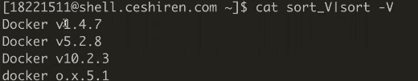

- -k：指定排序的关键字，与t参数配合使用

- 参考：https://wangchujiang.com/linux-command/c/sort.html

## 5.2 去除重复：`uniq`

uniq常用参数（只检查上下行是否重复）：

- -c：统计重复出现的次数

- -d：所有邻近的重复行只被打印一次。重复次数要>=2次

- -D：所有邻近的重复行将全部打印

- -f：跳过对前n个列的比较

    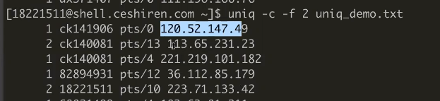

    > 越过1,2列只对比前三列的内容

- -s：跳过对前n个字符的比较

- -w：只对每行前n个字符进行比较

## 5.3 字符统计：`wc`

wc常用参数：

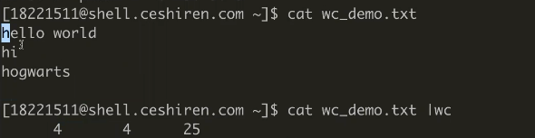

> 每行结尾的换行符也算一个字符,空格也算一个字符

- -c：统计字节数：chars

- -l：统计行数

- -w：统计单词数

- -L：打印最长行的长度

    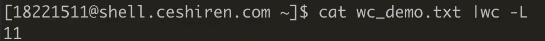

