2title: Pytest测试框架与Allure2测试报告
date: 2022-03-17 13:51:37
tags:


# 1. Pytest安装

官网：https://docs.pytest.org/en/7.1.x/

cmd执行`pip install pytest`，如果已经安装过需要更新，则输入`pip install -U pytest`

## 1.1 pytest插件安装

- pytest 
- pytest-html（生成html格式的自动化测试报告）
- pytest-xdist    测试用例分布式执行。多CPU分发。
- pytest-ordering    用于改变测试用例的执行顺序
- pytest-rerunfailures    用例失败后重跑
- allure-pytest    用于生成美观的测试报告。

放到`requirements.txt`中，通过`pip install -r requirements.txt`安装

# 2. Pytest命名规则

- 测试文件以`test`_开头（以`test`结尾也可以）
- 测试类以`Test`开头，并且不能带有 `init` 方法
- 测试函数以`test_`开头
- 断言使用基本的`assert`即可
    - `assert`：
        - Python assert（断言）用于判断一个表达式，在表达式条件为 false 的时候触发异常。
        - 断言可以在条件不满足程序运行的情况下直接返回错误，而不必等待程序运行后出现崩溃的情况。

# 3. Pycharm配置与界面化运行

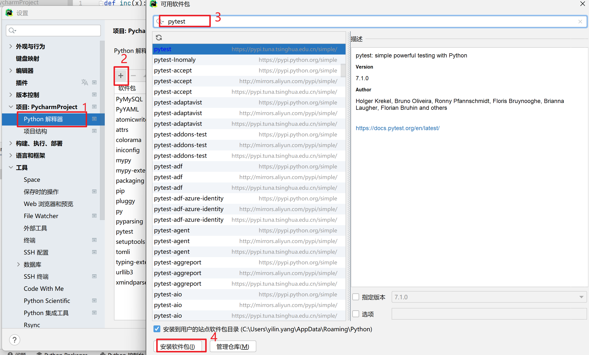

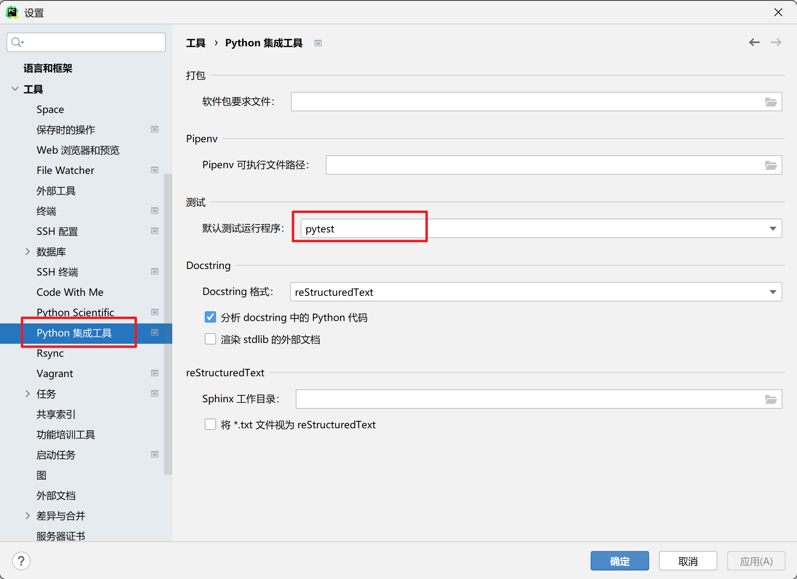

# 4. Pytest运行用例

## 4.1 运行多条用例方式

- 执行包下所有的用例：`pytest/py.test[包名]`
- 执行单独一个`pytest`模块：`pytest 文件名.py`
- 运行某个模块里面某个类：`pytest 文件名.py::类名`
- 运行某个模块里面某个类里面的方法：`pytest 文件名.py::类名::方法名:`

> tips:可以直接打开文件所在目录的终端
>
> 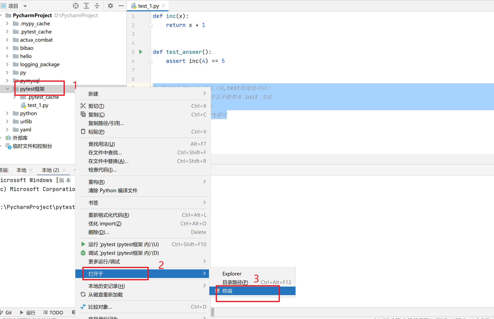

运行结果分析：

- 常用的：fail/error/pass
- 特殊的结果：warning/deselect（后面会讲）

# 5 Pytest测试框架结构

## 5.1 setup/teardown方法

| 类型                                     | 规则                                 |
| ---------------------------------------- | ------------------------------------ |
| `setup_module()`/`teardown_module()`     | 全局模块级，只被调用一次             |
| `setup_class()`/`teardown_class()`       | 类级，只在类中前后运行一次           |
| `setup_function()`/`teardown_function()` | 函数级，在类外                       |
| `setup_method()`/`teardown_method()`     | 方法级，类中的每个方法执行前后       |
| `setup()`/`teardown()`                   | 在类中，运行在调用方法的前后（重点） |

## 5.2 fixture函数

### 5.2.1 **fixture概念**

`fixture`是 pytest 用于将测试前后进行预备、清理工作的代码处理机制。

与`python`自带的`unitest`测试框架中的`setup`、`teardown`类似，pytest提供了`fixture`函数用以在测试执行前和执行后进行必要的准备和清理工作。但是相对来说又比`setup`、`teardown`好用。

> fixture实现**部分用例**的前后置

### 5.2.2 **fixture优势**

fixture相对于`unittest`中的setup和teardown来说有以下几点优势:

- fixure命名更加灵活，不局限于setup和teardown这几个命名
- conftest.py 配置里面可以实现数据共享，不需要import就能自动找到一些配置；
- scope="session"可以实现多个.py跨文件使用一个session来完成多个用例。
- scope="module" 可以实现多个.py跨文件共享前置, 每一个.py文件调用一次

### 5.2.3 fixture语法

语法如下：

```python
fixture(callable_or_scope=None, *args, scope="function", params="", autouse=True, ids="", name="")
```

- scope：fixture的作用域，默认为`function`，控制范围的排序为：session > module > class > function

    - | 取值     | 范围   | 说明                                                         |
        | -------- | ------ | ------------------------------------------------------------ |
        | function | 函数级 | 每一个函数或方法都会调用                                     |
        | class    | 类级别 | 每个测试类只运行一次                                         |
        | module   | 模块级 | 每一个.py文件调用一次                                        |
        | session  | 会话级 | 每次会话只需要运行一次，会话内所有方法及类，模块都共享这个方法 |

- params：参数化，支持：列表[]，元组()，字典列表[{},{},{}]，字典元组({},{},{})

- autouse：默认：False，需要用例手动调用该fixture；如果是True，所有作用域内的测试用例都会自动调用该fixture;

- ids：当使用params参数化时，给每一个值设置一个变量名。意义不大。

- name：装饰器的名称给表示的是被`@pytest.fixture`标记的方法取一个别名。同一模块的fixture相互调用建议写不同的name**。取了别名之后，原来的名称不可以再使用。**

### 5.2.4 定义fixture

定义fixture，在函数上添加`@pytest.fixture`即可。

### 5.2.5 如何区分前后置

在pytest中，用`yield`区分前后置，即`yield`前面代码为前置，后面代码为后置。

```python
import pytest


# params是参数名
@pytest.fixture(scope='function', params=['猪猪', '牛牛', '兔兔'], name='all_in')
def my_fixture(request):
    # 固定写法
    print('all前置')
    # request.param的param是属性
    yield request.param
    print('all后置')
```

如果没有params可以写

```python
import pytest


@pytest.fixture(scope='function', name='all_in')
def my_fixture(request):
    print('前置')
    yield
    # yield和return不可以一起用
    print('后置')
```


### 5.2.6 fixture调用

调用fixture的三种方式。

#### [1] 在测试用例中直接调用

将`fixture`名称作为参数传入测试用例，如果`fixture`有返回值，那么测试用例将会接收返回值。

```python
class TestManage:

    def test_01(self, all_in):
        print('11111111111')
        print('----------' + str(all_in))
```

#### [2] **pytest装饰器调用fixture**

在测试用例或测试类上方加上`@pytest.mark.usefixtures("fixture名称")`。

```python
import pytest

@pytest.fixture(scope='function', params=['aa', 'b1', 'c2c'])
def my_fixture(request):
    print('前置')
    yield
    print('后置')
    return request.param

class TestFixture:
    
    def test_01(self):
        print('test111111111')
      
    @pytest.mark.usefixtures("my_fixture")
    def test_02(self):
        print('test222222222222')
        print('----------' + str(my_fixture))
```

#### [3] autouse调用fixture

fixture有个参数autouse，默认为`False`。

autouse为`True`时，同一个作用域的所有测试用例都会调用这个fixture。

autouse为False时，需要手动调用fixture。

```python
import pytest

@pytest.fixture(autouse=True)
def fixture_auto():
    print("这是fixture_auto")

def test_demo01():
    print("运行test_demo01")

def test_demo02():
    print("运行test_demo02")
```

### 5.2.7 通过`conftest.py`和`@pytest.fixture()`结合实现全局的前置应用

比如：项目的全局登录、模块的全局处理

[pytest](https://pytest.org/)支持在测试的路径下，存在conftest.py文件，进行全局配置。

```
test_pytest
├── conftest.py
├── test_01.py
├── test_02.py
└── sub
    ├── conftest.py
    └── test_03.py
conftest.py
```

在以上目录结构下，顶层的conftest.py里的配置，可以给3个测试module使用。 而test_pytest下面的conftest.py，可以给test01，test_02使用，sub下面的conftest.py，只能给sub下面的test_03使用。 如果两个conftest.py中定义了名称相同的fixture，则可以被覆盖； 也就是说，在sub下面的module，使用的是sub下的conftest.py里的定义同名fixture。

1. `conftest.py`文件是单独存放的一个夹具配置文件，名称是不能更改。
2. 用处可以在不同的py文件中使用同一个fixture函数。
3. **原则上**`conftest.py需`要和运行的用例放到统一层。并且不需要做任何的imprt导入的操作。

`conftest.py`怎么写：

```python
import pytest


@pytest.fixture()
def my_fixture(request):
    print('前置')
    yield
    print('后置')
```


# 6. 命令行参数

- `--help`
- `-X`    用例一旦失败（fail/error），就立刻停止执行
- `--maxfail=num`     允许失败最大个数
- `-m`    标记用例
- `-k`    执行包含某个关键字的测试用例`pytest -vs./testcase -k ao"`
- `-v`    打印详细日志
- `-s`     打印输出日志一般 -vs 一块儿使用）
- `--collect-only`（测试平台，pytest自动导入功能）
- `-n`   支持多线程或者分布式运行测试用例
    - 如：`pytest -vs ./testcase/test_login.py -n 2`

- `--reruns num`    指定失败重跑次数

## 6.1 Pytest标记测试用例

- 场景：只执行符合要求的某一部分用例，可以把一个wb项目划分多个模块，然后指定模块名称执行。
    - 解决：在测试用例方法上加`@pytest.mark.标签名`
    - 执行：`-m` 执行自定义标记的相关用例
        - pytest -s test_mark_zi_09.py -m=webtest
        - pytest -vs -m "usermanage or smoke"
        - pytest -s test_mark_zi_09.py -m apptest
        - pytest -s test_mark_zi_09.py -m "not ios"

# 7. Pytest 设置跳过、预期失败用例

这是pytest的内置标签，可以处理一些特殊的测试用例，不能成功的测试用例

- skip-始终跳过该测试用例

- skipif-遇到特定情况跳过该测试用例
- xfail-遇到特定情况，产生一个“期望失败”输出

## 7.1 skip/skipif使用场景

- 调试时不想运行这个用例
- 标记无法在某些平台上运行的测试功能
- 在某些版本中执行，其他版本中跳过
- 比如：当前的外部资源不可用时跳过
    - 如果测试数据是从数据库中取到的
    - 连接数据库的功能如果返回结果未成功就跳过，因为执行也都报错
- 解决1：添加装饰器
    - `@pytest.mark.skip(reason="xxx")`
    - `@pytest.mark.skipif(age>=18, reason="xxx")`
- 解决2：代码中添加跳过代码
    - `pytest.skip(reason)`

## 7.2 xfail使用场景

- 与skip类似，预期结果为fail，标记用例为fail
- 用法：添加装饰器`@pytest.mark.xfail`

# 8. Pytest 参数化用例


参数化设计方法就是将模型中的定量信息变量化，使之成为任意调整的参数。
对于变量化参数赋予不同数值，就可得到不同大小和形状的零件模型。

## 8.1 `@pytest.mark.parametrize`: 参数化测试函数

用法：

`@pytest.mark.parametrize(argnames，argvalues，indirect = False，ids = None，scope = None，*，_param_mark = None)`

参数：

- **argnames**  – 参数化名字，以逗号分隔的**字符串**，表示一个或多个参数名称，或参数字符串的<font color='red'>列表 / 元组</font>。
- **argvalues**  –参数化的值， 如果只指定了一个 argname，则 argvalues 是一个值**列表**。如果指定了 N 个 argnames，则 argvalues 必须是 N 个元组的**列表**<font color='red'> [ ( ) , ( ) , ( ) ]</font>（其实 <font color='red'>[ [ ] , [ ] , [ ] ]</font>也是可以的…）其中每个元组元素为其各自的 argname 指定一个值。**有多少个值，用例就会执行多少次。**
- **indirect **– 参数名称列表（argnames 的子集）或布尔值。如果为 True，则列表包含 argnames 中的所有名称。与此列表中的 argname 对应的每个 argvalue 将作为 request.param 传递给其各自的 argname 夹具函数，以便它可以在测试的设置阶段而不是在收集时执行。
- **ids** – 参数别名（**ids的个数==传递的数据个数**）

返回类型：无

> 注意：参数化的名字，要与方法中的参数名，一一对应，

- 单参数

    ```python
    import pytest
    search_list = [3, 4, 5, 7, 8]
    
    
    @pytest.mark.parametrize("yy", [3, 4, 5, 2])
    def test_eval(yy):
        assert yy in search_list
    ```

    > eval () 函数用来执行一个字符串表达式，并返回表达式的值。
    >
    > eval('2 + 2') =4

    结果：

    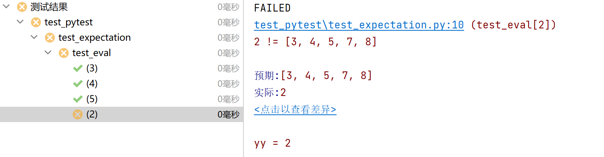

- 多参数

    ```python
    import pytest
    
    @pytest.mark.parametrize("test_input,expected", [("3+5", 8), ("2+4", 6), ("6*9", 42)])
    def test_eval(test_input, expected):
        assert eval(test_input) == expected
    ```

    结果：

    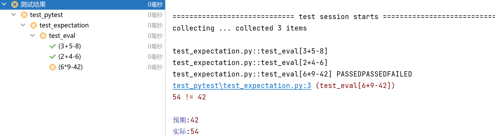

    

- 笛卡尔积

    ```python
    import pytest
    
    @pytest.mark.parametrize('wd', ['appium', 'selenium', 'pytest'])
    @pytest.mark.parametrize('code', ['utf-8', 'gbk', 'gb2312'])
    def test_dkej(wd, code):
        print(f'wd:{wd}, code:{code}')
    ```
    
    结果：
    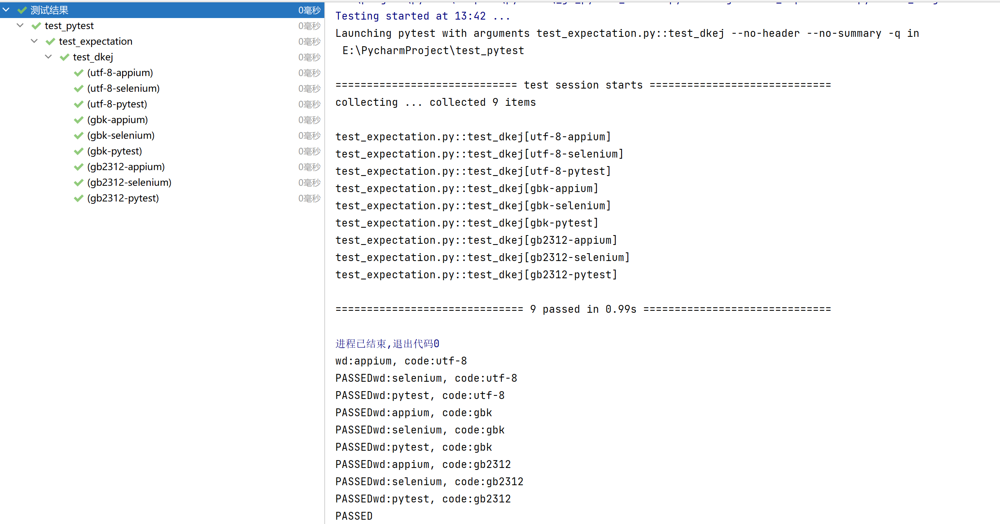

# 9. pytest 测试用例调度与运行

## 9.1 命令行参数—使用缓存状态

- `--lf(--last-failed)`    只重新运行故障
- `--ff(--failed-first)`    先运行故障然后再运行其余的测试

# 10. Python 执行 pytest

- 使用`main`函数

    - 运行所有

        - `pytest.main()`，执行所有测试用例

            > 不管main函数写在哪都能执行所有模块的测试用例

        - `pytesy.main(['-vs'])`，执行所有测试用例，表示输出条件信息，包括print信息，并打印详细日志，包括用例的类名和方法名

            > 参数pytest也是同样作用

    - 指定模块

        - `pytesy.main(['test_11.py','-vs'])`，只执行`test_11.py`文件，输出条件信息，包括print信息，并打印详细日志，包括用例的类名和方法名
    
    - 指定目录
        - `pytest.main(['相对路径/包名','-vs])`，只执行报名下的所有模块的测试用例，输出条件信息，包括print信息，并打印详细日志，包括用例的类名和方法名
        - `pytest.main (['-vs','./testcase','-n=2'])`指定2个线程同时运行
    
    
    - 通过`nodeid`指定用例运行
        - nodeid由模块名，分隔符，类名，方法名/函数名组成
        - `pytest.main(['-vs','相对路径/包名/模块名::类名::方法名'])`

- pytest命令行模式 (4.1)

    - 运行所有
        - `pytest`
    - 指定模块
        - `Pytest -vs 测试用例文件`
    - 指定目录
        - `pytest -vs 相对路径/包名`
    - 使用`python -m pytest`调用`pytest`（`jenkins`持续集成用到）

- 通过读取`pytest.ini`配置文件运行

    - `pytest.ini`这个文件它是`pytest`单元测试框架的核心配置文件。

    - 位置：一股放在项目的根目录

    - 编码：必须是`ANSI`，可以使用`notpad++`修改编码格式

    - 作用：改变`pytest`默认的行为（默认命名规范）

    - 运行的规则：不管是主函数的模式运行，命令行模式运行，都会去读取这个配置文件

    - `pytest.ini`

        ```ini
        [pytest]
        
        addopts = -vs --html ./report/report.html -x -p no:warnings
        testpaths =./pytest_frame
        python_files=test*.py
        python classes = Test*
        python functions=test
        markers =
        	smoke:冒烟命令
        	usermanage:用户管理模块
        	productmanage:商品管理模块
        ```

        > - addopts    命令行的参数，用空格分隔，`--html ./report/report.html`表示生成html测试报告，`-p no:warnings`表示执行Pytest时忽略warnings
        > - testpaths    测试用例的路径
        > - python_files    模块名的规则
        > - python classes    类名的规则
        > - python functions    方法名的规则

改变执行顺序：`@pytest.mark.run(order=1)`

# 11. Pytest 异常处理

常用的异常处理方法

- `try…except`

- `pytest.raise()`

    - 可以捕获特定的异常

    - 获取捕获的异常的细节（异常类型，异常信息）

    - 发生异常，后面的代码将不会被执行

    
    ```python
    import pytest
    
    
    def test_raise():
        with pytest.raises(ZeroDivisionError, match='division by zero'):
            raise ZeroDivisionError('division by zero')
    
    
    def test_raise1():
        with pytest.raises(ValueError) as exc_info:
            raise ValueError('Value must be 42')
        assert exc_info.type is ValueError
        assert exc_info.value.args[0] == 'Value must be 42'
    ```
    
    

# 12. Pytest 结合数据驱动

**数据驱动**就是数据的改变从而驱动自动化测试的执行，最终引起测试结果的改变。简单来说，就是参数化的应用。数据量小的测试用例可以使用代码的参数化来实现数据驱动，数据量大的情况下建议大家使用一种结构化的文件（例如yaml，json等）来对数据进行存储，然后在测试用例中读取这些数据。

## 12.1 应用场景

- App、Web、接口自动化测试
    - 测试步骤的数据驱动中
    - 测试数据的数据驱动
    - 配置的数据驱动

```python
import pytest
import yaml


class TestDemo:
    @pytest.mark.parametrize('env', yaml.safe_load(open('../env.yml')))
    def test_demo(self, env):
        if 'test' in env:
            print("test")
            print(env)
        elif 'dev' in env:
            print('dev')
```

yaml文件：

```yml
-
    test: 127.0.0.1
```

结果：

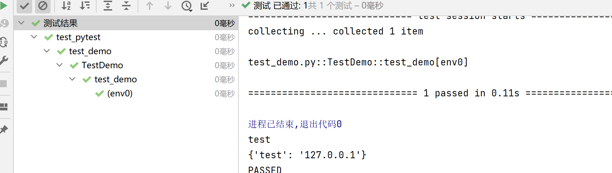

## 12.2 读取 Excel 文件

- 第三方库
    - xlrd
    - xlwings
    - pandas
- openpyxl
    - 官方文档：https://openpyxl.readthedocs.io/en/stable/
    - 安装： `pip install openpyxl`
    - 导入：`import openpyxl`

## 12.3 openpyxl 库的操作

- 读取工作簿

    使用`openpyxl.load_workbook()`打开现有工作簿，需要先导入load_workbook方法

    ```python
    from openpyxl import load_workbook
    
    book = load_workbook('test.xlsx')
    print(book.sheetnames)
    >>>['表1']
    ```

- 读取工作表

    工作簿始终至少创建一个工作表。你可以通过使用工作簿获得它。

    ```python
    worksheet = Workbook.active
    ```

- 读取单元格

    - 读取单个单元格

        - 单元格存在，直接获取单元格的值

        ```python
         cell = worksheet['A4']
        ```

        - 如果单元格不存在，创建单元格并赋值

        ```python
        worksheet['A4'] = 4
        ```

        - `Worksheet.cell()`方法。

        这提供了对使用行和列表示法的单元格的访问：

        ```python
        d = worksheet.cell(row=4, column=2, value=10)
        ```

    - 读取多个单元格

        - 切片访问单元格范围

            ```python
             cell_range = worksheet['A1':'C2']
            ```

        - 访问行和列的范围

            ```python
            colC = worksheet['C']
            col_range = worksheet['C:D']
            row10 = worksheet[10]
            row_range = worksheet[5:10]
            ```

        - **Worksheet.iter_rows()**，返回一个可迭代的generator，对其进行迭代得到单元格的值

            ```python
            >>>for row in worksheet.iter_rows(min_row=1, max_col=3, max_row=2):
            ...    for cell in row:
            ...        print(cell)
            <Cell Sheet1.A1>
            <Cell Sheet1.B1>
            <Cell Sheet1.C1>
            <Cell Sheet1.A2>
            <Cell Sheet1.B2>
            <Cell Sheet1.C2>
            ```

        - 同样，**Worksheet.iter_cols()**，返回一个可迭代的generator，对其进行迭代得到单元格的值 

            ```python
            >>> for col in worksheet.iter_cols(min_row=1, max_col=3, max_row=2):
            ...     for cell in col:
            ...         print(cell)
            <Cell Sheet1.A1>
            <Cell Sheet1.A2>
            <Cell Sheet1.B1>
            <Cell Sheet1.B2>
            <Cell Sheet1.C1>
            <Cell Sheet1.C2>	
            ```

            > - `Worksheet.iter_cols()`方法在只读模式下不可用。
            >
            > - 两者`Worksheet.iter_rows()`和`Worksheet.iter_cols()`都可以使用`values_only`参数来仅返回单元格的值
            >
            >     比如上面的Worksheet.iter_rows()设置values_only=True(默认为False)，结果为：
            >
            >     ```
            >     1
            >     2
            >     3
            >     6
            >     100
            >     200
            >     ```

        - 遍历文件的所有行或列，则可以改用以下 `Worksheet.rows`属性或者`Worksheet.columns`属性，返回一个可迭代的generator，对其进行迭代得到单元格的值 

            ```python
            r = sheet.rows
            print(r)
            for cell in r:
                print(cell)
            >>>
            <generator object Worksheet._cells_by_row at 0x000001FD04B62490>
            (<Cell 'Sheet1'.A1>, <Cell 'Sheet1'.B1>, <Cell 'Sheet1'.C1>)
            (<Cell 'Sheet1'.A2>, <Cell 'Sheet1'.B2>, <Cell 'Sheet1'.C2>)
            (<Cell 'Sheet1'.A3>, <Cell 'Sheet1'.B3>, <Cell 'Sheet1'.C3>)
            ```

            或者利用tuple对其进行格式设置：

            ```python
            r = sheet.rows
            # 创建并返回一个新对象
            cl = tuple(r)
            print(cl)
            >>>
            ((<Cell 'Sheet1'.A1>, <Cell 'Sheet1'.B1>, <Cell 'Sheet1'.C1>), (<Cell 'Sheet1'.A2>, <Cell 'Sheet1'.B2>, <Cell 'Sheet1'.C2>), (<Cell 'Sheet1'.A3>, <Cell 'Sheet1'.B3>, <Cell 'Sheet1'.C3>))
            ```

- 仅读取值

    如果只想要工作表中的值，则可以使用`Worksheet.values`属性。这会遍历工作表中的所有行，但只返回单元格值

    ```python
    all_s = sheet.values
    print(all_s)
    for row in all_s:
        for cell in row :
            print(cell)
    >>><generator object Worksheet.values at 0x000001BC4AB32490>
    1
    2
    3
    3
    6
    9
    100
    200
    300
    ```

测试数据：

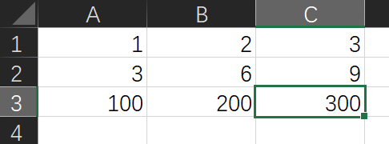

## 12.4 Pytest结合数据驱动 csv

1. **安装csv**

​	`pip install pytest-csv`

2. **csv文件介绍**

- csv：逗号分隔值
- 是Comma-Separated Values的缩写
- 以纯文本形式存储数字和文本
- 文件由任意数目的记录组成
- 每行记录由多个字段组成，使用换行符换行

3. **csv文件使用**

- 读取数据
    - 内置函数：`open()`
    - 内置模块：csv
- 方法：`csv.reader(iterable)`
    - 参数：iterable，文件或列表对象
    - 返回：迭代器，每次迭代会返回1行数据

demo.csv文件：

```csv
Linux从入门到高级,linux,￥5000
web自动化测试进阶,python,￥3000
app自动化测试进阶,python,￥6000
Docker容器化技术,linux,￥5000
测试平台开发与实战,python,￥8000
```

get_csv.py文件

```python
# coding=utf-8
# 读取csv文件内容
import csv

def get_csv():
    with open('../data/demo.csv', 'r') as file:
        csv_file = csv.reader(file)
        print(type(csv_file), csv_file)
        for row in csv_file:
            print(row)

if __name__ == '__main__':
    get_csv()
```

结果：

```c
<class '_csv.reader'> <_csv.reader object at 0x0000016166B0A0E0>
['Linux从入门到高级', 'linux', '￥5000']
['web自动化测试进阶', 'python', '￥3000']
['app自动化测试进阶', 'python', '￥6000']
['Docker容器化技术', 'linux', '￥5000']
['测试平台开发与实战', 'python', '￥8000']
```

例子：

目录结构：

```
————
  |_ data
    |_ params.csv
  |_ func
    |_ get_add.py
    |_ get_csv.py
  |_ test_pytest
    |_ test_csv.py
```

params.csv：

```
1,1,2
3,6,9
100,200,300
```

get_add.py：

```python
def fun_add(x, y):
    result = x+y
    return result
```

get_csv.py：

```python
# 读取csv文件内容
import csv


def get_csv():
    with open('../data/params.csv', 'r') as file:
        csv_file = csv.reader(file)
        data_list = []
        for row in csv_file:
            tu_row = tuple(row)
            # print(tu_row)
            data_list.append(tu_row)
        print(data_list)
    return data_list


if __name__ == '__main__':
    get_csv()
```

test_csv.py：

```python
import pytest

from func.get_add import fun_add
from func.get_csv import get_csv


class TestGetCsv:
    @pytest.mark.parametrize('x, y, expected', get_csv())
    def test_add(self, x, y, expected):
        assert fun_add(int(x), int(y)) == int(expected)
```

测试结果：
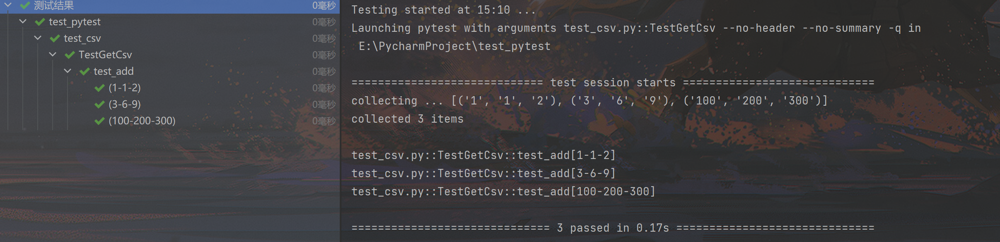

## 12.5 Pytest结合数据驱动 json

json文件使用：

- 查看json文件
    - pycharm
    - txt 记事本
- 读取json文件
    - 内置函数`open()`
    - 内置库 json
        - 方法：`json.loads()`
        - 方法：`json.dumps()`

**例子1：获取并转换json文件**

demo.json：

```json
{
  "name": "yyl",
  "detail": {
    "course": "python",
    "city": "北京"
  },
  "remark": [1000, 666, 888]
}
```

get_json.py：

```python
# 读取json文件内容
import json


def get_json():
    with open('../data/demo.json', 'r') as file:
        # read():一次读取文件所有内容，返回一个str
        f = file.read()
        print(type(f), f)
        data = json.loads(f)
        print(type(data), data)


if __name__ == '__main__':
    get_json()
```

输出：

```c
<class 'str'> {
  "name": "yyl",
  "detail": {
    "course": "python",
    "city": "北京"
  },
  "remark": [1000, 666, 888]
}
<class 'dict'> {'name': 'yyl', 'detail': {'course': 'python', 'city': '北京'}, 'remark': [1000, 666, 888]}
```

**例子2：测试json文件中的数据，对其进行加法运算**

项目目录：

```
|———— data
	|———— params.json
|———— func
	|———— get_json.py
	|———— get_add.py
|———— test_pytest
	|———— test_json.py
```

params.json

```json
{
  "case1": [1,1,2],
  "case2": [3,6,9],
  "case3": [100,200,300]
}
```

get_add.py：

```python
def fun_add(x, y):
    result = x+y
    return result
```

get_json.py：

```python
import json

def get_json():
    """
    [[1, 1, 2], [3, 6, 9], [100, 200, 300]]
    :return:
    """
    with open('../data/params.json', 'r') as file:
        # read():一次读取文件所有内容，返回一个str
        f = file.read()
        # json.loads()：将json实例转化为python对象，返回一个字典
        data = json.loads(f)
        # 获取字典的值，返回新视图对象
        data_values = data.values()
        # 将视图对象转成列表
        print(list(data_values))
    return list(data_values)

if __name__ == '__main__':
    get_json()
```

test_json.py：

```python
import pytest

from func.get_add import fun_add
from func.get_json import get_json


class TestGetJson:
    @pytest.mark.parametrize('x, y, expected', get_json())
    def test_json(self, x, y, expected):
        assert fun_add(int(x), int(y)) == int(expected)
```

测试结果：

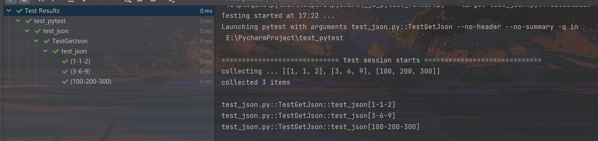


# 14. allure

- Allure：是一个轻量级，灵活的，支持多语言的测试报告工具
- 多平台的，奢华的report框架
- 可以为dev/qa提供详尽的的测试报告、测试步骤、log
- 也可以为管理理层提供high level统计报告
- Java语言开发的，支持pytest，JaveScript，PHP，ruby等
- 可以集成到 Jenkins

##  14.1 pytest结合allure-pytest插件生成allure测试报告

下载：https://repo1.maven.org/maven2/io/qameta/allure/allure-commandline/

Github：https://github.com/allure-framework/allure2/releases

官网：https://docs.qameta.io/allure/#_pytest_

**allure使用前置工作：**

- step1：安装Java（推荐1.8版本），需要配置环境变量

- step2：安装Allure

    - 把下载的zip文件进行解压，把bin的目录添加到PATH路径（F:\软件\allure-2.17.3\allure-2.17.3\bin）。

    - 验证：`allure --version`（cmd）

        问题：cmd可以验证但是pycharm不可以验证——重启pycharm（因为配置了环境变量）

- step3：生成json格式的临时报告

    在pytest.ini中

    ```ini
    [pytest]
    
    addopts = -vs --html ./report/report.html -x -p no:warnings --alluredir ./temp
    ```

- step3：生成allure报告

    在main函数中输出：

    ```python
    os.system('allure generate ./temp -o ./report --clean')
    ```

    > `allure generate`    命令，固定的
    > `./temp`    临时的json格式报告的路径
    >
    > `-o`    输出的output
    > `./report`    生成的allure报告的路径
    > `--clean`    清空./report目录原来的报告


## 14.2 Allure报告中添加用例描述

### [1] pytest 执行测试文件

执行所有测试文件

要启用 Allure 在测试执行期间收集结果，只需添加`--alluredir`选项并提供应存储结果（json格式的临时报告）的文件夹的路径（../allure）

` pytest --alluredir=../allure --clean-alluredir`

> `--clean-alluredi`r： 如果 --alluredir指定目录存在的话，清除存储结果。

如果执行单个文件——进入到py文件所在目录下，存储结果放在（./result）

`pytest test_allure_title.py --alluredir  ./result1` 

### [2] 查看生成的 allure 测试报告

要在测试完成后查看实际报告，需要使用 Allure 命令行使程序从结果中生成报告（ ./result 是存储测试结果的目录）

`allure serve --allure ./result`

此命令将在默认浏览器中显示生成的报告。

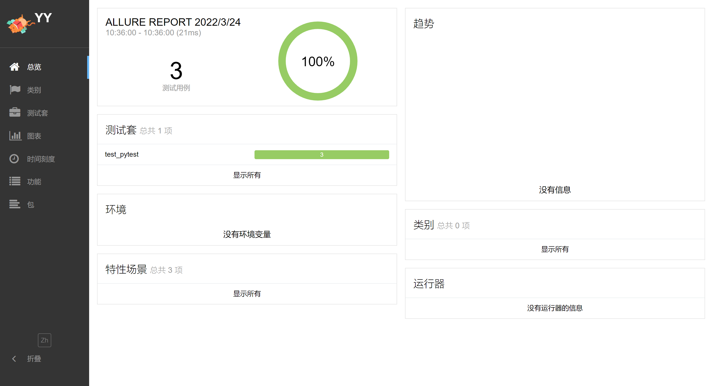

### [3] allure自定义测试报告

| 使用方法                | 参数值       | 参数说明                                     |
| ----------------------- | ------------ | -------------------------------------------- |
| `@allure.epic()`        | epic描述     | 定义项目、当有多个项目时使用。往下是 feature |
| `@allure.feature()`     | 模块名称     | 用例按照模块区分，有多个模块时给每个起名字   |
| `@allure.story()`       | 用例名称     | 用例的描述                                   |
| `@allure.title()`       | 用例标题     | 用例标题                                     |
| `@allure.teatcase()`    | 用例相关链接 | 自动化用例对应的功能用例存放系统的地址       |
| `@allure.issue()`       | 缺陷地址     | 对应缺陷管理系统里边的缺陷地址               |
| `@allure.description()` | 用例描述     | 对测试用例的详细描述                         |
| `@allure.step()`        | 操作步骤     | 测试用例的操作步骤                           |
| `@allure.severity()`    | 用例等级     | blocker、critical、normal、minor、trivial    |
| `@allure.link()`        | 定义连接     | 用于定义一个需要在测试报告中展示的连接       |
| `@allure.attachment()`  | 附件         | 添加测试报告附件                             |

#### 1. `@allure.title()`

例子：

test_allure_title.py测试文件

```python
class TestSearch:
    @allure.title("搜索词为android")
    def test_case1(self):
        print("case1")

    @allure.title("搜索词为ios")
    def test_case2(self):
        print("case2")

    @allure.title("搜索词为Honmony")
    def test_case3(self):
        print("case3")
```

allure报告：

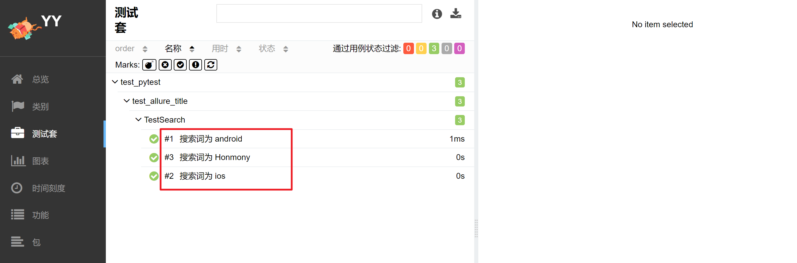

#### 2. `@allure.epic()`、`@allure.feature `、 `@allure.story()`

- 场景

    - 希望在报告中看到测试功能，子功能或场景

- 解决：

    -  `@allure.feature `和 `@allure.story()`

- 步骤：

    - `import allure`
    - 功能上加`@allure.feature('功能名称')`
    - 子功能上加`@allure.story('子功能名称')`

- 运行：

    - 执行整个测试文件

        - `pytest XXX.py --alluredir .\result1 --clean-alluredir`

    - 执行指定测试用例

        - 可以使用以下命令行选项指定不同的测试集，以通过逗号分隔的值列表执行测试

            - `--allure-epics`
            - `--allure-features`
            - `--allure-stories`

        - 比如对于例子：`pytest test_allure_feature.py --alluredir .\result --clean-alluredir --allure-features 父1 --allure-stories 子b,子c `

            得到：父1中的所有（子1、子2、子3）和子b、子c

            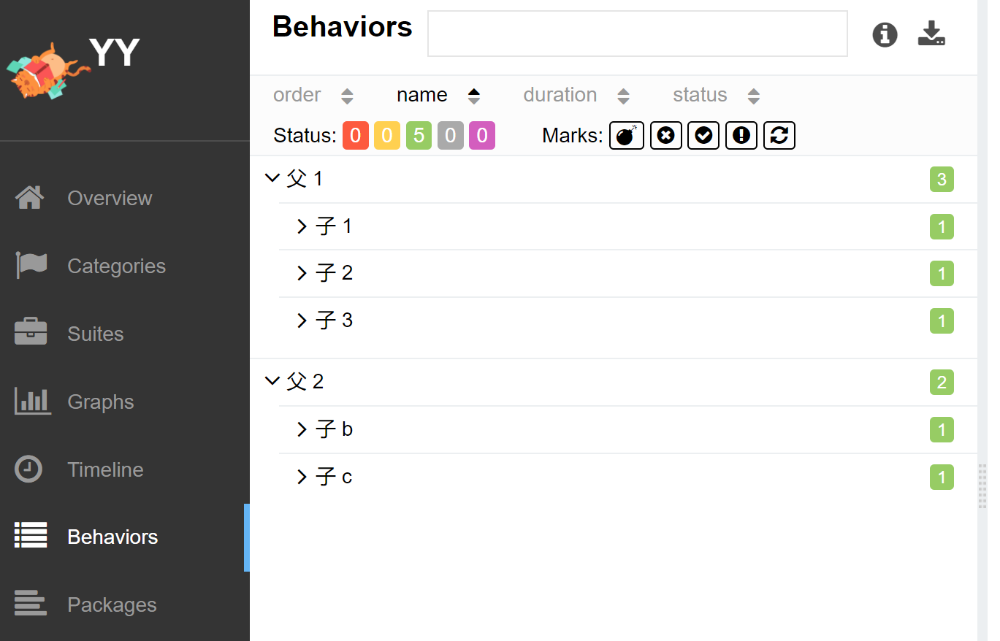

> feature & story 的关系
>
> - feature相当于一个功能，一个大的模块，相当于testsuite
> - story相当于对应这个功能或者模块下的不同场景，分支功能
> - feature与story类似于父子关系

例子：

test_allure_feature.py：

```python
@allure.feature("父1")
class TestFeatureStory1:
    @allure.story('子1')
    def test_case1(self):
        print("case1")

    @allure.story('子2')
    def test_case2(self):
        print("case2")

    @allure.story('子3')
    def test_case3(self):
        print("case3")


@allure.feature("父2")
class TestFeatureStory2:
    @allure.story('子a')
    def test_casea(self):
        print("casea")

    @allure.story('子b')
    def test_caseb(self):
        print("caseb")

    @allure.story('子c')
    def test_casec(self):
        print("casec")
```

allure测试报告：

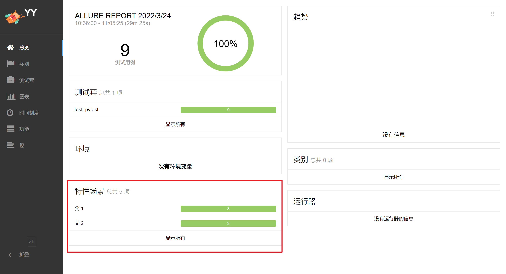

点击显示所有：

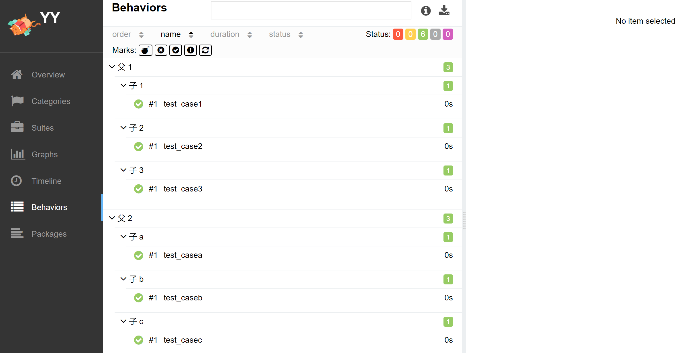

#### 3. `@allure.step()`

- 场景：

    - 测试过程中每个步骤，一般放在具体逻辑方法中，可以放在关键步骤中，

    在报告中显示

    - 在app，web自动测试当中，建议每切换到一个新的页面当做一个step

- 解决：

    -  `with allure.step("step:步骤")` ：这种方式代码可读性更好一点，但不会带上函数里面的传参和对应的值，可以放在测试用例方法里面，但测试步骤的代码需要被该语句包含
    -  `@allure.step("step:步骤")`： 这种方式会带上函数的传参和对应的值。

例子：

```python
import allure
import pytest

@pytest.mark.parametrize('user, key', [[1, 'something'], [2, None], [3, 'anything']])
@allure.step('@allure.step:进行登录， 用户名: {user}, 密码: {key}')
def test_steps(user, key):
    with allure.step('with allure.step:进行登录， 用户名: {user}, 密码: {key}'):
        print('Step测试用例')
    step_with_title_placeholders(3, 'anything')
```

allure测试报告：

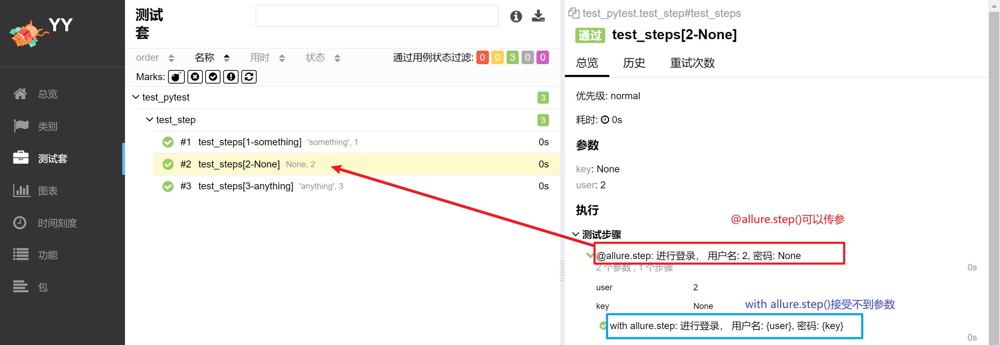


#### 4. `@allure.testcase`、`@allure.issue`、`@allure.link`

- 场景：
    - 测试报告中，添加用例的链接，bug链接地址，相关的链接地址
- 解决：
    - `@allure.testcase`、`@allure.issue`、`@allure.link`
    - 主要是为了将 allure 报告和测试管理系统集成（用例管理/bug管理），可以更快速的跳转到公司内部地址。

例子：

test_link.py：

```python
import allure

TEST_CASE_LINK = 'https://github.com/qameta/allure-integrations/issues/8#issuecomment-268313637'


@allure.link('https://www.youtube.com/watch?v=4YYzUTYZRMU')
def test_with_link():
    pass


@allure.link('https://www.youtube.com/watch?v=Su5p2TqZxKU', name='Click me')
def test_with_named_link():
    pass

# '140'算是个BUg号可以直接链接到地址，实际使用时需要自己配置链接地址
@allure.issue('140', 'Pytest-flaky test retries shows like test steps')
# 链接地址为：http://192.168.115.69:53055/140
def test_with_issue_link():
    pass


@allure.testcase(TEST_CASE_LINK, 'Test case title')
def test_with_testcase_link():
    pass
```

allure测试报告——链接都可以点击跳转

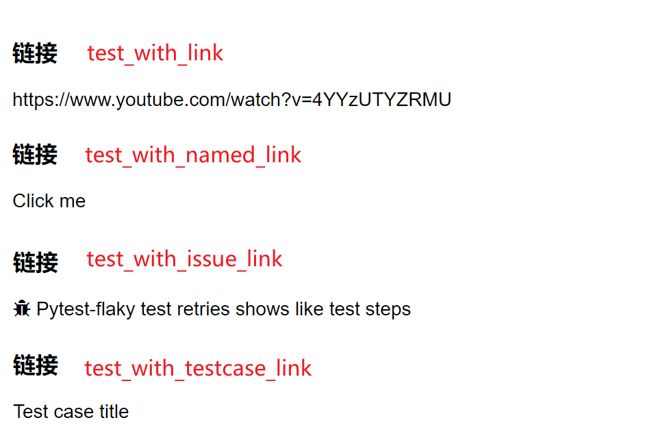

> `@allure.issue`将提供一个带有小错误图标的链接。此描述符将测试用例 id 作为输入参数，以将其与提供的链接模板一起用于问题链接类型。链接模板在 `--allure-link-pattern`的配置选项中指定。必须使用**冒号**指定链接模板和类型。
>
> ```bash
> pytest XXX.py --alluredir=./result --allure-link-pattern=issue:http://www.mytesttracker.com/issue/{}
> ```
>
> 更改后@allure.issue链接地址为：http://www.mytesttracker.com/issue/140

### 5. `@allure.severity()`

- 五种级别：

    - BLOCKER（"blocker"），阻塞缺陷（功能未实现，无法下一步）

    - CRITICAL（"critical"），严重缺陷（功能点缺失）

    - NORMAL（"normal"），一般缺陷（边界情况，格式错误）

    - MINOR（"minor"），次要缺陷（界面错误与 UI 需求不符）

    - TRIVIAL（"trivial"）；轻微缺陷（必须项无提示，或者提示不规范）

        > 如果没指定等级，默认为 NORMAL 级别

- 场景

    - 通常测试有P0、冒烟测试、验证上线测试。
    - 按重要性级别来分别执行的，比如上线要把主流程和重要模块都跑一遍

- 解决

    - 也可以通过`@allure.severity`来附加标记

- 实例

    - 在方法，函数和类上面加`@allure.severity(allure.severity_level.TRIVIAL)`

- 运行

    - 运行级别为：normal，critical的测试用例

    - ```bash
        pytest -s-v XXX.py --allure-severities normal,critical--alluredir=./result
        ```

例子：

test_severity.py——执行该模块下的所有测试（任意严重性）

```python
# coding=utf-8
import allure


def test_with_no_severity_label():
    pass


@allure.severity(allure.severity_level.TRIVIAL)
def test_with_trivial_severity():
    pass


@allure.severity(allure.severity_level.NORMAL)
def test_with_normal_severity():
    pass


@allure.severity(allure.severity_level.NORMAL)
class TestClassWithNormalSeverity(object):

    def test_inside_the_normal_severity_test_class(self):
        pass

    @allure.severity(allure.severity_level.CRITICAL)
    def test_inside_the_normal_severity_test_class_with_overriding_critical_severity(self):
        pass
```

allure测试报告：

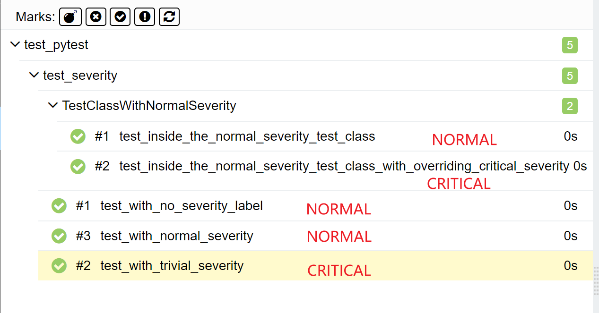

如果想要只执行**指定严重性**的测试用例，通过使用`--allure-severities`带有逗号分隔严重性级别列表的命令行选项来进行：

```bash
pytest xxx.py --allure-severities normal,critical
```


## 14.3 allure测试报告中添加附件

- 场景
    - 希望在报告中看到测试用例的详细内容展示
    - 比如在用例中添加附件信息，可以是数据，文本，图片，视频，网页

- 解决
    - `allure.attach`显示许多不同类型的提供的附件，可以补充测试，步骤或测试结果

- 用法
    - `allure.attach(body, name, attachment_type, extension)：`
        - 参数说明：
            - `body`— 要写入文件的原始内容。
            - `name`— 带有文件名的字符串
            - `attachment_type`-`allure.attachment_type` —值
            - `extension`—— 提供将用作创建文件的扩展名
    - `allure.attach.file(source, name, attachment_type, extension)`
        - 参数说明：
            - `source`- 包含文件路径的字符串
            - 其他参数相同

    > attachment_type格式有：
    >
    > ```python
    > TEXT = ("text/plain", "txt")
    > CSV = ("text/csv", "csv")
    > TSV = ("text/tab-separated-values", "tsv")
    > URI_LIST = ("text/uri-list", "uri")
    > 
    > HTML = ("text/html", "html")
    > XML = ("application/xml", "xml")
    > JSON = ("application/json", "json")
    > YAML = ("application/yaml", "yaml")
    > PCAP = ("application/vnd.tcpdump.pcap", "pcap")
    > 
    > PNG = ("image/png", "png")
    > JPG = ("image/jpg", "jpg")
    > SVG = ("image/svg-xml", "svg")
    > GIF = ("image/gif", "gif")
    > BMP = ("image/bmp", "bmp")
    > TIFF = ("image/tiff", "tiff")
    > 
    > MP4 = ("video/mp4", "mp4")
    > OGG = ("video/ogg", "ogg")
    > WEBM = ("video/webm", "webm")
    > 
    > PDF = ("application/pdf", "pdf")
    > ```

例子：

test_allure_attach.py：

```python
import allure

class Test1:
    def test_case1(self):
        allure.attach('11111', 'case1')
        print("case1")
        print("case11111111111")

    def test_case2(self):
        allure.attach.file('../pic/偷懒.png', '222222', 'case2')
        print("case2")
        print("case22222222222222")
```

allure测试报告：

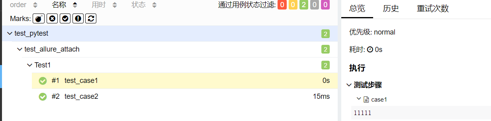

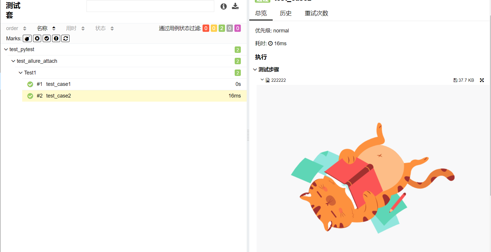

- Allure总结
    - 支持多平台
    - Java语言开发的，支持多语言 pytest，JaveScript，PHP，ruby 等
    - 可以为 dev/qa 提供详尽的的测试报告、测试步骤、log、标题、优先级、附件等等
    - 也可以为管理理层提供high level统计报告
    - 可以集成到Jenkins，展示项目的趋势图

## 14.4 allure生成测试报告

### [1] allure生成测试报告流程

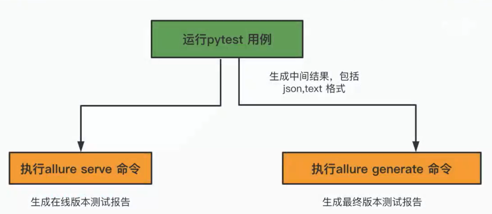

### [2] 使用Allure2生成精美报告

allure详细命令：

```bash
allure [options] [command] [command options]
```

**[options]**

| [options] 选项 | 含义           | 默认值 |
| -------------- | -------------- | ------ |
| --help         | 打印命令行帮助 |        |
| -q, --quiet    | 切换至安静模式 | false  |
| -v, --verbose  | 打开详细模式   | false  |
| --version      | 打印命令行版本 | false  |

**[command]**

| [command] 命令 | 含义           | 用法                                                         | [options] 选项                                    | 含义                                                         | 默认值                       |
| -------------- | -------------- | ------------------------------------------------------------ | ------------------------------------------------- | ------------------------------------------------------------ | ---------------------------- |
| generate       | 生成报告       | 生成 [options] 具有allure结果的目录（allure 结果目录就是运行 pytest 命令时--alluredir 跟的那个目录） | <font color=red>-c</font>, --clean                | 在生成新报告之前清理 Allure 报告目录                         | false                        |
|                |                |                                                              | --config                                          | Allure 命令行配置路径。如果指定覆盖值 --profile 和 --configDirectory |                              |
|                |                |                                                              | --configDirectory                                 | Allure 命令行配置目录                                        | 使用ALLURE_HOME 目录         |
|                |                |                                                              | --profile                                         | Allure 命令行配置文件                                        |                              |
|                |                |                                                              | <font color=red>-o</font>, --report-dir, --output | 生成 Allure 报告的目录                                       | allure-report                |
| serve          | 提供报告       | 提供[options] 具有allure结果的目录（allure 结果目录就是运行 pytest 命令时--alluredir 跟的那个目录） | --config                                          | Allure 命令行配置路径。如果指定覆盖值 --profile 和 --configDirectory |                              |
|                |                |                                                              | --configDirectory                                 | Allure 命令行配置目录                                        | 使用ALLURE_HOME 目录         |
|                |                |                                                              | -h, --host                                        | 此主机将用于启动报告的 Web 服务器                            |                              |
|                |                |                                                              | -p, --port                                        | 此端口将用于启动报告的 Web 服务器                            | 0                            |
|                |                |                                                              | --profile                                         | Allure 命令行配置文件                                        |                              |
| open           | 打开生成的报告 | 打开[options] 报告目录（打开 generate 命令生成的报告，allure报告目录就是运行 allure generate 命令时-o 跟的那个目录） | -h, --host                                        | 此主机将用于启动报告的 Web 服务器                            |                              |
|                |                |                                                              | -p, --port                                        | 此端口将用于启动报告的 Web 服务器                            | 0                            |
| plugin         | 插件生成报告   | plugin [options]                                             | --config                                          | Allure 命令行配置路径。如果指定覆盖值 --profile 和 --configDirectory |                              |
|                |                |                                                              | --configDirectory                                 | Allure 命令行配置目录                                        | 使用        ALLURE_HOME 目录 |
|                |                |                                                              | --profile                                         | Allure 命令行配置文件                                        |                              |

## 浏览器打开 allure 报告的两种方式

### ① allure serve

```bash
# 执行 pytest，指定 allure 结果目录
pytest -vs xxx.py --alluredir=./allure --clean-alluredir

# 打开 allure 报告
allure serve ./allure
```

### ② allure generate + allure open

这是一个启动tomcat的服务，需要两个步骤：生成报告、打开报告

```bash
# 执行 pytest，指定 allure 结果目录
pytest -vs --alluredir=./allure --clean-alluredir

# 生成 allure 的 html 报告 (覆盖路径加--clean)
allure generate ./allure -c -o ./allure-report --clean

# 打开 allure 报告
allure open -h 127.0.0.1 -p 8883 ./allure-report
```

### 两种方式的区别：

**①第一种方式是将allure测试报告的原始数据（xml/json/text/attach等文件）直接在浏览器打开allure测试报告；而不在本地生成任何文件。**

**②第二种方式是首先在本地生成allure测试报告。然后在使用命令在浏览器打开allure测试报告。【此时allure测试报告原始数据仍然存在，而且会生成一个生成后的allure测试报告目录】**

第二种方式支持直接在pycharm中选择浏览器打开 **index.html** 同样可以看到allure测试报告。【第一种方式不生成 index.html ，只能通过 allure server 打开测试报告】

但是如果在使用generate的方式生成allure测试报告之后，需要将此报告展示给其他人观看，同样需要 allure open ./allure-report 开启一个web服务供其他主机查看。

# 实战——测试计算器的加法运算

test_data.yml——测试数据

```yaml
---
test_normal:
  Ca_add_001:
    num1: 1
    num2: 1
    excepted: 2
  Ca_add_002:
    num1: -0.01
    num2: 0.02
    excepted: 0.01
  Ca_add_003:
    num1: 10
    num2: 0.02
    excepted: 10.02
  Ca_add_004:
    num1: 98.99
    num2: 99
    excepted: 197.99
  Ca_add_005:
    num1: 99
    num2: 98.99
    excepted: 197.99
  Ca_add_006:
    num1: -98.99
    num2: -99
    excepted: -197.99
  Ca_add_007:
    num1: 99
    num2: 98.99
    excepted: 197.99
test_error:
  Ca_add_012:
    numa: 文
    numb: 9.3
    resulted: TypeError
  Ca_Add_013:
    numa: 4
    numb: 字
    resulted: TypeError
```

calculator.py——计算器逻辑

```python
class Calculator:

    def add(self, a, b):
        if a > 99 or a < -99 or b > 99 or b < -99:
            print("请输入范围为【-99, 99】的整数或浮点数")
            return -9999

        return a + b

    def div(self, a, b):
        if a > 99 or a < -99 or b > 99 or b < -99:
            print("请输入范围为【-99, 99】的整数或浮点数")
            return -9999

        return a / b
```

get_yml.py——获取yaml文件

```python
# coding=utf-8
import yaml


class GetYaml:

    def __init__(self):
        self.li_e = []
        self.li_n = []
        self.list_key = []
        self.list_test_normal_key = []
        self.list_test_error_key = []

    def get_yaml(self):
        # 读取yaml文件
        with open('../data/test_data.yml', 'r', encoding="utf-8") as file:
            # 一次读取文件所有内容，返回一个`str`
            yaml_file = file.read()
        # 将读取到的str转化为字典格式
        deal_file = yaml.safe_load(yaml_file)
        # 开始拆分数据
        """
        {'test_normal': 
            {'Ca_add_001': 
                {'num1': 1, 'num2': 1, 'excepted': 2}
            }
        }
        """
        # 首先获取两种测试类型
        key = deal_file.keys()
        self.list_key = list(key)
        # print(self.list_key)
        """
        ['test_normal', 'test_error']
        """
        # 在获取测试用例的名字
        value = deal_file.values()
        list_value = list(value)
        li1 = list_value[0]
        li2 = list_value[1]
        test_normal_key = li1.keys()
        self.list_test_normal_key = list(test_normal_key)
        test_error_key = li2.keys()
        self.list_test_error_key = list(test_error_key)
        # 在获取测试用例的值
        test_normal_value = li1.values()
        list_normal_value = list(test_normal_value)
        test_error_value = li2.values()
        list_error_value = list(test_error_value)
        """
        [{'numa': '文', 'numb': 9.3, 'resulted': 'TypeError'}]
        """

        for i in range(7):
            normal_value = list_normal_value[i].values()
            list_normal = list(normal_value)
            self.li_n.append(list_normal)
        # print(self.li_n)
        for i in range(1):
            error_value = list_error_value[i].values()
            list_error = list(error_value)
            self.li_e.append(list_error)
        # print(self.li_e)
        return self.list_key, self.list_test_normal_key, self.list_test_error_key, self.li_n, self.li_e
```

test_calculator.py——测试文件

```python
# coding=utf-8
import pytest

# 处理前后置输出结果
from func.calculator import Calculator
from func.get_yaml import get_errvalue, get_ekeys
from func.get_yml import GetYaml


@pytest.fixture(scope="function", autouse=True)
def def_fixture():
    print('开始计算')
    yield
    print('结束计算')


@pytest.fixture(scope="module", autouse=True)
def module_fixture():
    yield
    print('结束测试')


class TestCalculator:
    # 测试加法运算

    yml = GetYaml()
    # a, b, c, d, e = yml.get_yaml()
    yml.get_yaml()
    print(yml.li_n, yml.list_test_normal_key)

    @pytest.mark.parametrize("num1,num2,expected", yml.li_n, ids=yml.list_test_normal_key)
    def test_add(self, num1, num2, expected):
        calc1 = Calculator()
        result = calc1.add(num1, num2)
        assert result == expected

    @pytest.mark.parametrize("numa,numb,conclusion", get_errvalue(), ids=get_ekeys())
    def test_add_error(self, numa, numb, conclusion):
        print(numa, numb, conclusion, type(conclusion), eval(conclusion))
        # 定义一个对象calc
        calc = Calculator()
        # eval：把字符串转化为相应对象
        # with pytest.raises（异常类型）:raises 可以捕获到指定异常，并继续下面断言代码，如果异常类型不对，则断言不会执行
        with pytest.raises(eval(conclusion)) as e:
            add_result = calc.add(numa, numb)
            print(add_result)
            assert e.typename == conclusion
```


## 为什么要学习单测框架？

- 测试发现：从多个文件中找到测试用例
- 测试执行：按照一定的顺序和规则去执行用例，并生成结果
- 测试判断：通过断言判断预期结果和实际结果的差异
- 测试条件：给定一些前置和后置的条件
- 测试报告：统计测试进度、耗时、通过率，生成测试报告


