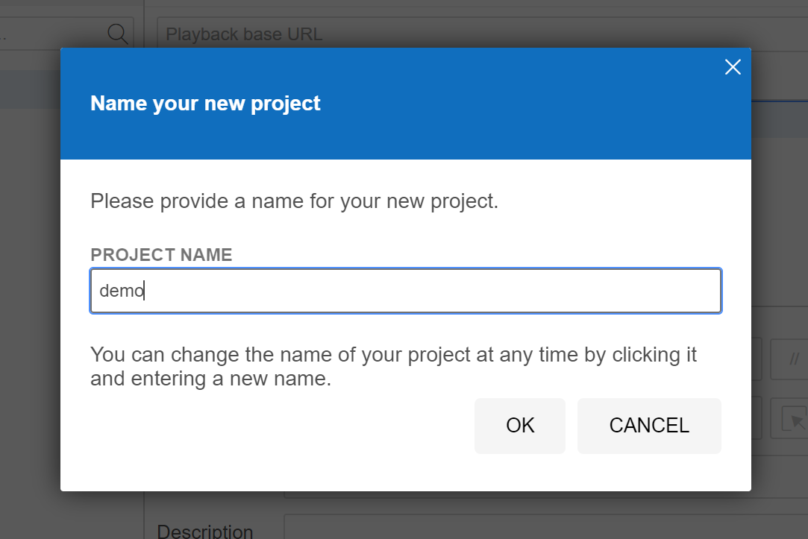
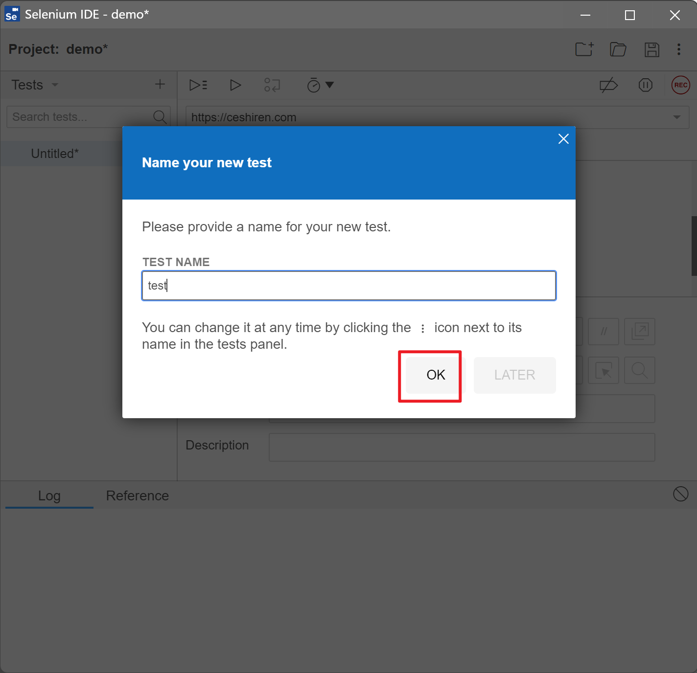
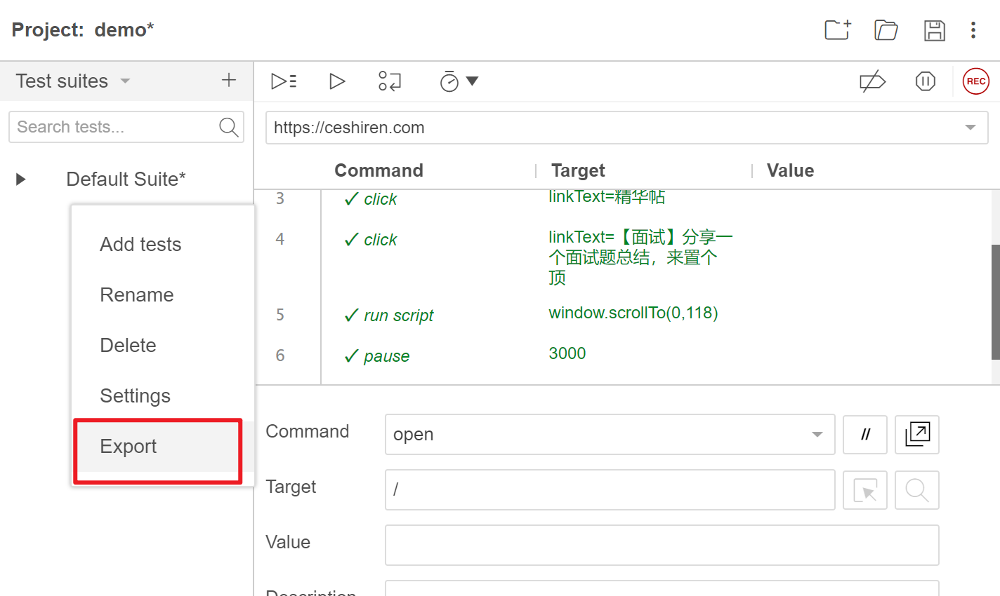
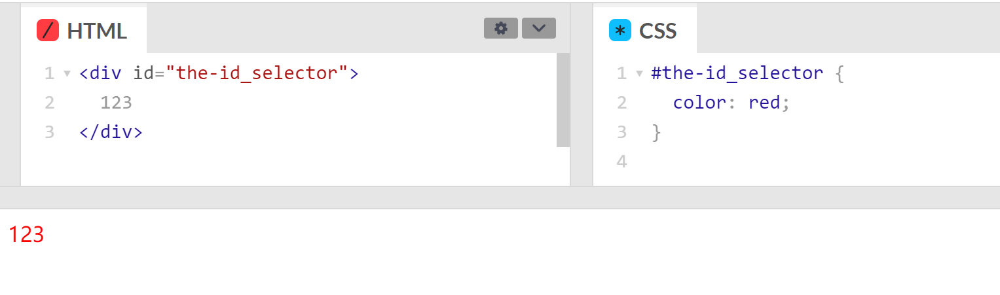
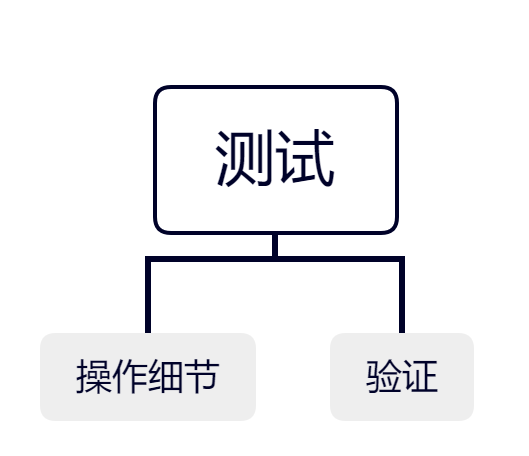

# 1. Selenium的安装

## 1.1 Selenium的简介

- 官方网站：
    https://www.selenium.dev/
- 简介
    - 用于web浏览器测试的工具
    - 支持的浏览器包括IE，Firefox，Safari，Chrome，Edge等
    - 使用简单，可使用Java，Python等多种语言编写用例脚本
    - 主要由三个工具构成：WebDriver、IDE、Grid

## 1.2 Selenium架构


## 1.3 Selenium环境配置步骤

1. 准备好python环境配置
2. 准备好selenium环境
3. 下载浏览器对应的driver版本
4. driver配置环境变量
5. 在python中import对应的依赖

## 1.4  Selenium的安装

- 前提

    - 配置好python环境
    - 配置好pip工具

- 安装

    ```c
    pip --default-timeout=100 install selenium==3.141.0 -i http://pypi.douban.com/simple/ --trusted-host pypi.douban.com
    ```

- 检查是否安装

    - `pip show selenium`

        

## 1.5 Driver的配置

- Driver的介绍

    - https://www.selenium.dev/documentation/en/webdriver/driver_requirements/

- Chrome Driver的下载

    - 淘宝镜像：https://npm.taobao.org/mirrors/chromedriver/
    - 官方网站：https://chromedriver.storage.googleapis.com/index.html

- FireFox Driver的下载

    - https://github.com/mozilla/geckodriver/releases

- Driver的安装

    - 先找和自己浏览器版本适配的driver版本

        - 首先查看自己的浏览器版本(Google)

            

            

        - 在去淘宝镜像找到符合浏览器版本的driver进行下载

            

            

        

    - 导入到环境变量中(Mac || windows)

        - Windows

            - 先找到刚下载的driver解压后地址

                

            - 再将该地址添加到环境变量 `path` 中

            - 验证是否配置成功

                - 在cmd中，输入 `chromedriver --version`

                

        - MAC

            - `vim ~/.bash_profile export PATH=$PATH:[chromedriver所在路径]`

## 1.6 selenium在python中如何使用

- 导入selenium

- 实例化driver

- 打开网址

- 关闭driver

    ```python
    # 导入Selenium包
    from selenium import webdriver
    
    
    def test_selenium():
        # 创建一个Chromedriver的实例。Chrome()会从环境变量中寻找浏览器
        driver = webdriver.Chrome()
        # driver=webdriver.Ie()    #打开IE浏览器
        # driver=webdriver.Firefox()     #打开Firefox浏览器
    
        # 打开网址
        driver.get("https://www.baidu.com/")
        # 关闭driver
        driver.quit()
    ```

# 2. SeleniumIDE的用例录制

## 2.1 SeleniumlDE用例录制使用场景

- 刚开始入门UI自动化测试
- 团队代码基础较差
- 技术成长之后学习价值不高

## 2.2 SeleniumIDE的下载及安装

- 官网：https://www.selenium.dev/

- Chrome插件：https://chrome.google.com/webstore/detail/selenium-ide/mooikfkahbdckldjjndioackbalphokd

- Firefox:https://addons.mozilla.org/en-US/firefox/addon/selenium-ide/

- github release:https://github.com/SeleniumHQ/selenium-ide/releases

- 其它版本：https://addons.mozilla.org/en-GB/firefox/addon/selenium-ide/versions/

    > 注意：Chrome插件在国内无法下载，Firefox可以直接下载。

## 2.3 启动

- 安装完成后，通过在浏览器的菜单栏中点击它的图标来启动它：
- 如果没看到图标，首先确保是否安装了Selenium IDE 扩展插件
- 通过以下链接访问所有插件
- Chrome：chrome://extensions
- Firefox：about:addons

## 2.4 SeleniumIDE常用功能


1. 新建、保存、打开
2. 开始和停止录制
3. 运行8中的所有的实例
4. 运行单个实例
5. 调试模式
6. 调整案例的运行速度
7. 要录制的网址
8. 实例列表
9. 动作、目标、值
10. 对单条命令的解释
11. 运行日志

## 2.5 使用SeleniumIDE

### step1：创建项目




### step2：开始录制

点击开始录制


填入测试的URL，点击开始录制


在录制时，浏览器右下角会出现正在录制的标志


### step3：结束录制

点击”结束录制“按钮


给测试用例起个名字



### step4：回放

点击”回放按钮“会进行回放操作


也可以进行新建命令


### step5：新建测试


接下来仍然是通过录制的方式获取测试

获取到测试后，可以选择批量执行


### step5：创建测试集


回放操作和测试的完全一致

### step6：导出




# 3. Selenium测试用例编写

## 3.1 测试用例的核心要素

- 一条测试用例的最终结果只有一个：成功或者失败，
- 三大核心要素为：标题、步骤、断言
    - 标题：是对测试用例的描述
    - 步骤：对测试执行过程进行描述
    - 断言：实际结果与预期结果对比


## 3.2 Selenium中如何编写测试用例

- 步骤：
    - 打开页面 https://www.baidu.com/
    - 输入框输入搜索内容[霍格沃兹测试学院]
    - 点击搜索按钮
    - 找到结果并断言

```python
# Generated by Selenium IDE

from selenium import webdriver
from selenium.webdriver.common.by import By


def test_search():
    driver = webdriver.Chrome()
    driver.implicitly_wait(5)
    # 打开页面：https:/www.baidu.com
    driver.get("https://www.baidu.com")
    # 输入框输入搜索内容[霍格沃兹测试学院]
    driver.find_element(By.CSS_SELECTOR, "#kw").send_keys("霍格沃兹测试学院")
    # 点击搜索按钮
    driver.find_element(By.CSS_SELECTOR, "#su").click()
    # 找到要查找的内容
    result = driver.find_element(By.CSS_SELECTOR, ".result:nth-child(2)>h3>a>em").text
    assert "霍格沃兹测试学院" in result
```

# 4. Selenium三种等待方式

## 4.1 直接等待

强制等待，线程休眠一定时间

```python
time.sleep(3)
```

## 4.2 隐式等待

设置一个等待时间，轮询查找(默认0.5秒)元素是否出现，如果没出现就抛出
异常

```python
self.driver.implicitly_wait(3)
```

缺点：隐式等待是**全局的设置**，不一定能使每个操作都恰好合适

## 4.3 显式等待

- 在代码中定义等待条件，当条件发生时才继续执行代码
- `WebDriverWait`配合`until()`和`until not()`方法，根据判断条件进行等待
- 程序每隔一段时间(默认为0.5秒)进行条件判断，如果条件成立，则执行下一步，否则继续等待，直到超过设置的最长时间

例子：

```python
# coding=utf-8
from selenium import webdriver
from selenium.webdriver.common.by import By
from selenium.webdriver.support import expected_conditions
from selenium.webdriver.support.wait import WebDriverWait


class TestWait:
    def setup(self):
        self.driver = webdriver.Chrome()
        self.driver.get("https://ceshiren.com/")
        self.driver.implicitly_wait(3)

    def test_wait(self):
        self.driver.find_element(By.ID, 'ember33').click()
        self.driver.find_element(By.CSS_SELECTOR, "[title~='原创精华文章,有100元奖金']").click()
        print("hello")
        """
        until(self, method, message='')
        until方法需要传入一个method作为参数，method需要接受一个参数，所以wait_show也需要有一个参数
        """
        # 方法1
        def wait_show(x):
            # 定位一组元素用find_elements，elements都是复数
            return len(self.driver.find_elements(By.CSS_SELECTOR, "[title~='招聘内推']")) >= 1
        WebDriverWait(self.driver, 10).until(wait_show)
        # 方法2
        # WebDriverWait(self.driver, 10).until(expected_conditions.element_to_be_clickable((By.CSS_SELECTOR, "[title~='招聘内推']")))
        self.driver.find_element(By.CSS_SELECTOR, "[title~='招聘内推']").click()
        print("WORLD")
```


# 5. web控件定位与常见操作

## 5.1 Selenium的点击和输入

**定义：**

- `find_element(By.ID, 'su').click()`
- `find_element(By.ID,'kw').send_keys("霍格沃兹测试学院")`

## 5.2 xpath

### (1) 定义

- 解析XML的一种语言(HTML其实是XML的子级)，**广泛用于解析HTML数据**
- 几乎所有语言都能使用XPath，比如Java和C语言
- 除了XPathi还有其他手段用于XML解析，比如：BeautifulSoup、Ixml、D0M、SAX、JSD0M、D0M4J、minixml等

> `xpath`既可以用于appium，也可以用于selenium。不过缺点是比`CSS.SELECTOR`要慢。因为`xpath`是从头到尾去遍历的。

### (2)XPath语法

XPath语法其实只有三大类：

- 层级：`/`直接子级、`//`跳级(多少级都可以)
- 属性：`@`属性访问
- 函数：`contains()`、`text()`等

#### 表达式

| 表达式   | 描述                                                         |
| :------- | :----------------------------------------------------------- |
| nodename | 选取此节点的所有子节点。                                     |
| /        | 从根节点选取(取子节点)。                                     |
| //       | 从匹配选择的当前节点选择文档中的节点，而不考虑它们的位置(取子孙节点)。 |
| .        | 选取当前节点。                                               |
| ..       | 选取当前节点的父节点。                                       |
| @        | 选取属性。                                                   |

#### 谓语(条件)

谓语用来查找某个特定的节点或者包含某个指定的值的节点。

谓语被嵌在方括号<font color='red'>`[]`</font>中。

在下面的表格中，我们列出了带有谓语的一些路径表达式，以及表达式的结果：

| 路径表达式                           | 结果                                                         |
| ------------------------------------ | ------------------------------------------------------------ |
| `/bookstore/book[1]`                 | 选取属于bookstore子元素的第一个book元素。                    |
| `/bookstore/book[last()]`            | 选取属于bookstore子元素的最后一个book元素。                  |
| `/bookstore/book[last()-1]`          | 选取属于bookstore子元素的倒数第二个book元素。                |
| `/bookstore/book[position(<3]`       | 选取最前面的两个属于bookstore元素的子元素的book元素。        |
| `//title[@lang='eng']`               | 选取所有title元素，且这些元素拥有值为eng的lang属性。         |
| `/bookstore/book[price>35.00]`       | 选取bookstore元素的所有book元素， 且其中的price元素的值须大于35.00. |
| `/bookstore/book[price>35.00]/title` | 选取bookstore元素中的book元素的所有title元素， 且其中的price元素的值须大于35.00。 |

## 5.3 Css Selector

> `css selector`既可以用于appium，也可以用于selenium。不过appium原生控件不支持css selector，当对手机中的网页定位，才可以用css selector。


### 1. id选择器 身份选择器

作用：选取带有id属性，并且id属性值为id-name的标签。

> id是唯一的，所以一个id只能可以套用到一个HTML元素上，而一个HTML元素也只能拥有一个id。
>
> 命名规则：id选择器的名称除了第一个字符必须为英文字母以外，后续字符可以是大小写字母和-或者_
>
> id选择器需要以 `#`开头 — `#id`



### 2. class选择器 类选择器

作用：选取所有带有class属性，并且id属性值为id-name的标签。

> class选择器可以用于多个元素，因为他不是唯一的。
>
> 与id选择器不同的是，一个class可以套用到多个HTML元素上，而一个HTML元素也可以拥有多个class。
>
> class选择器需要以 `.`开头 — `.class`


### 3. tag选择器 标签选择器

作用：选取所有tag标签。

> 在css中直接使用HTML标签(Tag)的名称，例如<h>、<p>、<div>等等。这种方式会将样式套用到所有对应的标签中。
>
> 如果在Tag名称后加上id选取器或class选取器，如div.bg{}，就代表bg这个class只能用于div上，用于别HTML的标签则不会生效。


### 4. 空格

作用：选取并修饰该A标签内的所有子A标签，不包括该标签本身。

> 比如：`.contain div`，即是选取拥有contain这个class的HTML元素里面的所有div。
>
> *但是并不包括contain本身。*


### 5. > 大于号

作用：选取该A标签内的所有第一层子A标签，不包括该标签本身。

> 比如：`.contain>div`，即是选取拥有containe这个class的HTML元素里面第一层的所有div。


### 6. + 加号

作用：选取所有某种标签下的第一个子标签元素。

> 比如：`.contain+div`，意思是选取拥有contain这个class的HTML元素与它身处同一层紧接着的div。
>
> *注意如果紧接着的并不是div，就不会选取到任何东西。*


### 7. ~ 波浪线

作用：选取所有某种元素之后所有同一层的所有某种元素

> 比如：`.contain ~ div`，意思是选取拥有contain这个class的HTML元素与它身处同一层之后的所有div。
>
> 尽管其中有其他HTML元素隔开，只要是与contain处于同一层都会套用得到。


### 8. * 星号

作用：代替具体的条件，表示所有。

> 如果只用一个星号的话即是选取所有HTML元素。


> 比如：`.contain ~ *`，会将contain class套用到contain之后的所有标签。


### 9. 属性选择器 attribute

作用：是透过HTML元素的属性去选取。`[attribute=value]`


还可以通过一些正则表达式去选取：

> 比如`^=`：选取匹配行首的元素
>
> `$=`：选取匹配行尾的元素


> `*=`则为包含关键词，无论头尾。


### 10. 伪类 pseudo class

作用：用于选择一般选择器无法表达的选择方式。

> 写法格式：以上九种形式加冒号加条件。

`a: hover{color:red}` ：鼠标悬停变红
`a: visited{color:cyan}` ：点击过该链接则为天蓝色

`div:nth-child(3n + 0){background: pink;}`：div的子元素中3的倍数的元素，底色变为粉色

> nth-chile()参数特别的有：odd(奇数)、even(双数)、3n+0(选取3倍数)、2n效果even 一样。


### 详细实例：

| 选择器                                                       | 示例                                    | 示例说明                                                   |
| :----------------------------------------------------------- | :-------------------------------------- | :--------------------------------------------------------- |
| [.*class*](https://www.runoob.com/cssref/sel-class.html)     | .intro                                  | 选择所有class="intro"的元素                                |
| [#*id*](https://www.runoob.com/cssref/sel-id.html)           | #firstname                              | 选择所有id="firstname"的元素                               |
| [*](https://www.runoob.com/cssref/sel-all.html)              | *                                       | 选择所有元素                                               |
| *[element](https://www.runoob.com/cssref/sel-element.html)*  | p                                       | 选择所有<p>元素                                            |
| *[element,element](https://www.runoob.com/cssref/sel-element-comma.html)* | div,p                                   | 选择所有<div>元素和<p>元素                                 |
| [*element* *element*](https://www.runoob.com/cssref/sel-element-element.html) | div p                                   | 选择<div>元素内的所有<p>元素                               |
| [*element*>*element*](https://www.runoob.com/cssref/sel-element-gt.html) | div>p                                   | 选择所有父级是 <div> 元素的 <p> 元素                       |
| [*element*+*element*](https://www.runoob.com/cssref/sel-element-pluss.html) | div+p                                   | 选择所有紧跟在 <div> 元素之后的第一个 <p> 元素             |
| [[*attribute*]](https://www.runoob.com/cssref/sel-attribute.html) | [target]                                | 选择所有带有target属性元素                                 |
| [[*attribute*=*value*]](https://www.runoob.com/cssref/sel-attribute-value.html) | [target=-blank]                         | 选择所有使用target="-blank"的元素                          |
| [[*attribute*~=*value*]](https://www.runoob.com/cssref/sel-attribute-value-contains.html) | [title~=flower]                         | 选择标题属性包含单词"flower"的所有元素                     |
| [[*attribute*\|=*language*]](https://www.runoob.com/cssref/sel-attribute-value-lang.html) | [lang\|=en]                             | 选择 lang 属性等于 **en**，或者以 **en-** 为开头的所有元素 |
| [:link](https://www.runoob.com/cssref/sel-link.html)         | a:link                                  | 选择所有未访问链接                                         |
| [:visited](https://www.runoob.com/cssref/sel-visited.html)   | a:visited                               | 选择所有访问过的链接                                       |
| [:active](https://www.runoob.com/cssref/sel-active.html)     | a:active                                | 选择活动链接                                               |
| [:hover](https://www.runoob.com/cssref/sel-hover.html)       | a:hover                                 | 选择鼠标在链接上面时                                       |
| [:focus](https://www.runoob.com/cssref/sel-focus.html)       | input:focus                             | 选择具有焦点的输入元素                                     |
| [:first-letter](https://www.runoob.com/cssref/sel-firstletter.html) | p:first-letter                          | 选择每一个<p>元素的第一个字母                              |
| [:first-line](https://www.runoob.com/cssref/sel-firstline.html) | p:first-line                            | 选择每一个<p>元素的第一行                                  |
| [:first-child](https://www.runoob.com/cssref/sel-firstchild.html) | p:first-child                           | 指定只有当<p>元素是其父级的第一个子级的样式。              |
| [:before](https://www.runoob.com/cssref/sel-before.html)     | p:before                                | 在每个<p>元素之前插入内容                                  |
| [:after](https://www.runoob.com/cssref/sel-after.html)       | p:after                                 | 在每个<p>元素之后插入内容                                  |
| [:lang(*language*)](https://www.runoob.com/cssref/sel-lang.html) | p:lang(it)                              | 选择一个lang属性的起始值="it"的所有<p>元素                 |
| [*element1*~*element2*](https://www.runoob.com/cssref/sel-gen-sibling.html) | p~ul                                    | 选择p元素之后的每一个ul元素                                |
| [[*attribute*^=*value*]](https://www.runoob.com/cssref/sel-attr-begin.html) | a[src^="https"]                         | 选择每一个src属性的值以"https"开头的元素                   |
| [[*attribute*$=*value*]](https://www.runoob.com/cssref/sel-attr-end.html) | a[src$=".pdf"] | 选择每一个src属性的值以".pdf"结尾的元素 |                                                            |
| [[*attribute**=*value*]](https://www.runoob.com/cssref/sel-attr-contain.html) | a[src*="runoob"]                        | 选择每一个src属性的值包含子字符串"runoob"的元素            |
| [:first-of-type](https://www.runoob.com/cssref/sel-first-of-type.html) | p:first-of-type                         | 选择每个p元素是其父级的第一个p元素                         |
| [:last-of-type](https://www.runoob.com/cssref/sel-last-of-type.html) | p:last-of-type                          | 选择每个p元素是其父级的最后一个p元素                       |
| [:only-of-type](https://www.runoob.com/cssref/sel-only-of-type.html) | p:only-of-type                          | 选择每个p元素是其父级的唯一p元素                           |
| [:only-child](https://www.runoob.com/cssref/sel-only-child.html) | p:only-child                            | 选择每个p元素是其父级的唯一子元素                          |
| [:nth-child(*n*)](https://www.runoob.com/cssref/sel-nth-child.html) | p:nth-child(2)                          | 选择每个p元素是其父级的第二个子元素                        |
| [:nth-last-child(*n*)](https://www.runoob.com/cssref/sel-nth-last-child.html) | p:nth-last-child(2)                     | 选择每个p元素的是其父级的第二个子元素，从最后一个子项计数  |
| [:nth-of-type(*n*)](https://www.runoob.com/cssref/sel-nth-of-type.html) | p:nth-of-type(2)                        | 选择每个p元素是其父级的第二个p元素                         |
| [:nth-last-of-type(*n*)](https://www.runoob.com/cssref/sel-nth-last-of-type.html) | p:nth-last-of-type(2)                   | 选择每个p元素的是其父级的第二个p元素，从最后一个子项计数   |
| [:last-child](https://www.runoob.com/cssref/sel-last-child.html) | p:last-child                            | 选择每个p元素是其父级的最后一个子级。                      |
| [:root](https://www.runoob.com/cssref/sel-root.html)         | :root                                   | 选择文档的根元素                                           |
| [:empty](https://www.runoob.com/cssref/sel-empty.html)       | p:empty                                 | 选择每个没有任何子级的p元素(包括文本节点)                  |
| [:target](https://www.runoob.com/cssref/sel-target.html)     | #news:target                            | 选择当前活动的#news元素(包含该锚名称的点击的URL)           |
| [:enabled](https://www.runoob.com/cssref/sel-enabled.html)   | input:enabled                           | 选择每一个已启用的输入元素                                 |
| [:disabled](https://www.runoob.com/cssref/sel-disabled.html) | input:disabled                          | 选择每一个禁用的输入元素                                   |
| [:checked](https://www.runoob.com/cssref/sel-checked.html)   | input:checked                           | 选择每个选中的输入元素                                     |
| [:not(*selector*)](https://www.runoob.com/cssref/sel-not.html) | :not(p)                                 | 选择每个并非p元素的元素                                    |
| [::selection](https://www.runoob.com/cssref/sel-selection.html) | ::selection                             | 匹配元素中被用户选中或处于高亮状态的部分                   |
| [:out-of-range](https://www.runoob.com/cssref/sel-out-of-range.html) | :out-of-range                           | 匹配值在指定区间之外的input元素                            |
| [:in-range](https://www.runoob.com/cssref/sel-in-range.html) | :in-range                               | 匹配值在指定区间之内的input元素                            |
| [:read-write](https://www.runoob.com/cssref/sel-read-write.html) | :read-write                             | 用于匹配可读及可写的元素                                   |
| [:read-only](https://www.runoob.com/cssref/sel-read-only.html) | :read-only                              | 用于匹配设置 "readonly"(只读) 属性的元素                   |
| [:optional](https://www.runoob.com/cssref/sel-optional.html) | :optional                               | 用于匹配可选的输入元素                                     |
| [:required](https://www.runoob.com/cssref/sel-required.html) | :required                               | 用于匹配设置了 "required" 属性的元素                       |
| [:valid](https://www.runoob.com/cssref/sel-valid.html)       | :valid                                  | 用于匹配输入值为合法的元素                                 |
| [:invalid](https://www.runoob.com/cssref/sel-invalid.html)   | :invalid                                | 用于匹配输入值为非法的元素                                 |

## 例子

```python
from selenium import webdriver
from selenium.webdriver.common.by import By


class TestGet:
    def setup(self):
        self.driver = webdriver.Chrome()
        self.driver.get("https://www.baidu.com/")

    # def test_get_xpath(self):
    #     self.driver.find_element(By.XPATH, '//input[@id="kw"]').send_keys("霍格沃兹测试学院")
    #     print('测试输入')
    #     self.driver.find_element(By.XPATH, '//input[@id="su"]').click()
    #     print('测试搜索')

    def test_css_selector(self):
        self.driver.find_element(By.CSS_SELECTOR, '#kw').send_keys("霍格沃兹测试学院")
        print('test print')
        self.driver.find_element(By.CSS_SELECTOR, '#su').click()
        print('test search')
```

# 6. web控件的交互进阶

常用的操作事件(右键点击，页面滑动，表单操作等)。

官方文档
https://selenium-python.readthedocs.io/api.html 

- ActionChains：执行PC端的鼠标点击，双击，右键，拖搜等事件
- TouchActions：模拟PC和移动端的点击，滑动，拖拽，多点触控等多种手势操作

## 6.1 ActionChains 动作链接

执行原理：调用ActionChains的方法时，<font color="red">不会立即执行</font>，而是将所有的操作，按顺序存放在一个队列里，当你调用`perform()`方法时，队列中的事件会依次执行。

### 6.1.1 基本用法

- 生成一个动作`action= ActionChains(driver)`
- 动作添加方法1 `action.方法1`
- 动作添加方法2 `action.方法2`
- 调用`perform()`方法执行`(action.perform())`

### 6.1.2 具体写法

- 链式写法
    - `ActionChains(driver).move_to_element(element).click(element).perform()`
- 分布写法
    - `actions = ActionChains(driver)`
    - `actions.move_to_element(element)`
    - `actions.click(element)`
    - `actions.perform()`

### 6.1.3 ActionChains 用法1

用法一：点击，右键，双击操作

- `action = ActionChains(driver)`
- `action.click(element)`
- `action.double_click(element)`
- `action.context_click(element)`
- `action.perform()`

测试案例

- 打开页面(http://sahitest.com/demo/clicks.htm)
- 分别对按钮'click me'，'dbl click me'， right click me'，执行点击，双击，右键操作
- 打印上面展示框中的内容

```python
# coding: utf-8
from time import sleep
from selenium import webdriver
from selenium.webdriver import ActionChains
from selenium.webdriver.common.by import By


class TestActionChains:

    def setup(self):
        self.driver = webdriver.Chrome()
        self.driver.implicitly_wait(5)

    def teardown(self):
        self.driver.quit()

    def test_click(self):
        self.driver.get("http://sahitest.com/demo/clicks.htm")
        element_click = self.driver.find_element(By.XPATH, "/html/body/form/input[3]")
        element_dblclick = self.driver.find_element(By.XPATH, "/html/body/form/input[2]")
        element_right_click = self.driver.find_element(By.XPATH, "/html/body/form/input[4]")
        action = ActionChains(self.driver)
        action.click(element_click)
        action.context_click(element_right_click)
        action.double_click(element_dblclick)
        sleep(3)
        action.perform()
        sleep(3)
```

### 6.1.4 ActionChains 用法2

用法二：鼠标移动到某个元素上

- `action = ActionChains(self.driver)`
- `action.move_to_element(element)`
- `action.perform()`

```python
def test_move_to_element(self):
    self.driver.get("https://www.baidu.com/?tn=44004473_13_oem_dg")
    move_to_element = self.driver.find_element(By.XPATH, '//*[@id="s-usersetting-top"]')
    action = ActionChains(self.driver)
    action.move_to_element(move_to_element)
    action.perform()
```

### 6.1.5 ActionChains 用法3

用法三：鼠标拖拽某个元素到另一元素上

```python
def test_dragdrop(self):
    self.driver.get("http://sahitest.com/demo/dragDropMooTools.htm")
    drag_element = self.driver.find_element(By.XPATH, '//*[@id="dragger"]')
    drop_element = self.driver.find_element(By.XPATH, '/html/body/div[2]')
    action = ActionChains(self.driver)
    # 方法1
    # action.drag_and_drop(drag_element, drop_element)
    # 方法2
    # action.click_and_hold(drag_element).release(drop_element)
    # 方法3
    action.click_and_hold(drag_element).move_to_element(drop_element).release()
    action.perform()
```

### 6.1.6 ActionChains 用法4

用法四：ActionChains模拟按键方法

模拟按键有多种方法，能用win32api来实现，能用SendKeys来实现，也可以用selenium的WebElement对象的send_keys()方法来实现，这里ActionChains类也提供了几个模拟按键的方法。

用法：

- `Action = ActionChains(driver)`
- `action.send_keys(Keys.BACK_SPACE)`
- 或者`action.key_down(Keys.CONTROL).send_keys('a').key_up(Keys.CONTROL)`
- `action.perform()`

打开网址：http://sahitest.com/demo/label.htm

```python
    def test_key(self):
        self.driver.get("http://sahitest.com/demo/label.htm")
        element = self.driver.find_element(By.XPATH, "/html/body/label[1]/input")
        element.click()
        action = ActionChains(self.driver)
        action.send_keys("username").pause(1)
        action.send_keys(Keys.SPACE).pause(1)
        action.send_keys("tom").pause(1)
        action.send_keys(Keys.BACK_SPACE).perform()
        sleep(3)
```

## 6.2 TouchActions

官网：https://www.selenium.dev/selenium/docs/api/py/webdriver/selenium.webdriver.common.touch_actions.html

类似于ActionChains。ActionChains只是针对PC端程序鼠标模拟的一系列操作，对H5页面操作是无效的，TouchAction可以对h5页面操作，通过TouchAction可以实现点击，滑动。拖拽，多点触控，以及模拟手势的各种操作。

手势控制

- tap：在指定元素上敲击
- double_tap：在指定元素上双敲击
- tap_and_hold：在指定元素上点击但不释放
- move：手势移动指定偏移（未释放）
- release：释放手势
- scroll：手势点击并滚动
- scroll_from_element：从某个元素位置开始手势点击并滚动（向下滑动为负数，向上滑动为正数）
- long_press：长按元素
- flick：手势滑动
- flick_element：从某个元素位置开始手势滑动（向上滑动为负数，向下滑动为正数）
- Perform：执行

### 6.2.1 TouchActions实例

- 打开Chrome
- 打开URL：http://www.baidu.com
- 向搜索框中输入“selenium测试”
- 通过TouchAction点击搜索框
- 滑动到底部，点击下一页
- 关闭Chrome

```python
class TestTouchAction:

    def setup(self):
        # 在创建 driver 对象时，添加浏览器的 option 选项 关闭 w3c 模式
        option = webdriver.ChromeOptions()
        option.add_experimental_option('w3c', False)
        self.driver = webdriver.Chrome(options=option)
        self.driver.implicitly_wait(5)

    def teardown(self):
        self.driver.quit()

    def test_touch_actions(self):
        self.driver.get("http://www.baidu.com")
        input_element = self.driver.find_element_by_id("kw")
        input_element.send_keys("selenium测试")
        search_element = self.driver.find_element_by_id("su")
        action = TouchActions(self.driver)
        action.tap(search_element)

        action.scroll_from_element(search_element, 0, 10000)
        action.perform()
        sleep(3)
```

## 6.3 表单操作

- 什么是表单？
    - 表单是一个包含表单元素的区域。
    - 表单元素是允许用户在表单中（比如：文本域、下拉列表、单选框、复选框等等）输入信息的元素。
    - 表单使用表单标签（<form>）定义。例如：<form><input/></form>
- 操作表单元素步骤：
    - 首先要定位到表单元素
    - 然后去操作元素（清空，输入或者点击等）

### 6.3.1 提交表单实例

测试用例步骤：

1. 打开testerhome登录地址：https://testerhome.com/account/sign_in
2. 输入用户名
3. 输入密码
4. 点击记住标签
5. 点击登录，提交表单

```python
class TestForm:

    def setup(self):
        self.driver = webdriver.Chrome()
        self.driver.implicitly_wait(5)

    def teardown(self):
        self.driver.quit()

    def test_form(self):
        self.driver.get("https://testerhome.com/account/sign_in")
        self.driver.find_element_by_id("user_login").send_keys("123")
        self.driver.find_element_by_id("user_password").send_keys("password")
        self.driver.find_element_by_xpath('//*[@id="new_user"]/div[3]/div/label').click()
        self.driver.find_element_by_xpath('//*[@id="new_user"]/div[4]/input')
        sleep(5)
```

# 7. 多窗口处理与网页frame

## 7.1 selenium里面如何处理多窗口场景

- 点击某些链接，会重新打开一个窗口，对于这种情况，想在新页面上操作，就

    得先切换窗口了。

- 获取窗口的唯一标识用句柄表示，所以只需要切换句柄，就可以在多个页面灵

    活操作了。

## 7.2 多个窗口识别

- 获取到当前的窗口句柄（`driver.current_window_handle`）
- 获取到所有的窗口句柄（`driver.window_handles`）

## 7.3 多个窗口之间切换

- 判断是否是想要操作的窗口，如果是，就可以对窗口进行操作，如果不是，跳转到另外一个窗口，对另一个窗口进行操作（`driver.switch_to_window`）

**多窗口切换案例**：

1. 打开百度页面
2. 点击登录，弹框中点击立即注册，输入用户名和帐号
3. 返回刚才的登录页，点击登录
4. 输入用户名和密码，点击登录

test_base.py：将setup/teardown方法进行封装

```python
class Base:
    def setup(self):
        self.driver = webdriver.Chrome()
        self.driver.implicitly_wait(5)
        self.driver.maximize_window()

    def teardown(self):
        self.driver.quit()
```

test_window.py

```python
class TestWindow(Base):

    def test_Window(self):
        self.driver.get("https://www.baidu.com/")
        self.driver.find_element_by_link_text("登录").click()
        self.driver.find_element_by_link_text("立即注册").click()
        print(self.driver.window_handles)
        # 所有的窗口输出是个列表
        windows = self.driver.window_handles
        self.driver.switch_to_window(windows[-1])
        self.driver.find_element_by_id("TANGRAM__PSP_4__userName").send_keys("123")
        self.driver.find_element_by_id("TANGRAM__PSP_4__phone").send_keys("13800000000")
        self.driver.find_element_by_id("TANGRAM__PSP_4__password").send_keys("123")
        sleep(3)
        self.driver.switch_to_window(windows[0])
        self.driver.find_element_by_id("TANGRAM__PSP_11__userName").send_keys("13800000000")
        self.driver.find_element_by_id("TANGRAM__PSP_11__password").send_keys("123")
        self.driver.find_element_by_id("TANGRAM__PSP_11__submit").click()
        sleep(3)
```

## 7.4 selenium里面如何处理frame

**frame**介绍

- 在web自动化中，如果一个元素定位不到，那么很大可能是在`iframe`中。

- 什么是frame？

    - frame是html中的框架，在html中，所谓的框架就是可以在同一个浏览器中显示不止一个页面。
    - 基于html的框架，又分为垂直框架和水平框架（`cols,rows`）

- Frame分类

    - frame标签包含frameset、frame、iframe三种。
    - frameset和普通的标签一样，不会影响正常的定位，可以使用index、id、name、webelement 任意种方式定位frame。
    - 而frame与iframe对selenium定位而言是一样的。selenium有一组方法对frame进行操作。

- 演示：https://www.w3school.com.cn/tiy/t.asp?f=html_frame_cols

    

## 7.5 多个frame识别


## 7.6 多个frame之间切换

- frame存在两种：

    - 一种是嵌套的

        - 对于嵌套的先进入到frame的父节点，再进到子节点，然后可以对子节点里面的对象进行处理和操作
        - `driver.switch_to.frame("父节点")`
        - `driver.switch_to.frame("子节点")`

    - 一种是未嵌套的

        - `driver.switch_to_frame("frame的id")`

        - `driver.switch_to_frame("frame-index")`

            frame无ID的时候依据索引来处理，索引从0开始`driver.switch_to_frame(0)`

- 切换frame

    - `driver.switch_to.frame()`：根据元素id或者index切换切换frame
    - `driver.switch_to.default_content()`：切换到默认frame
    - `driver.switch_to.parent_frame()`：切换到父级frame

**多frame切换案例：**

- 打开包含framel的web页面https://www.runoob.com/try/try.php?filename=jqueryui-api-droppable

- 打印“请拖拽我”元素的文本

- 打印“点击运行”元素的文本

    ```python
    class TestFrame(Base):
    
        def test_frame(self):
            self.driver.get("https://www.runoob.com/try/try.php?filename=jqueryui-api-droppable")
            self.driver.switch_to_frame("iframeResult")
            print(self.driver.find_element(By.ID, "draggable").text)
            # 切换到父frame
            self.driver.switch_to_default_content()
            # self.driver.switch_to.parent_frame()
            self.driver.find_element(By.ID, "submitBTN").click()
            self.driver.switch_to_frame("iframeResult")
            print(self.driver.find_element(By.ID, "droppable").text)
    ```

# 8. selenium多浏览器处理

- chrome，firefox，headless等浏览器的自动化支持
- 传不同参数来测试不同的浏览器，用来做浏览器兼容性测试

**例子：**

更新test_base.py

```python
# _*_ coding: utf-8 _*_
import os

from selenium import webdriver


class Base:
    def setup(self):
        browser = os.getenv("browser")
        if browser == 'firefox':
            self.driver = webdriver.Firefox()
        elif browser == 'headless':
            self.driver = webdriver.PhantomJS()
        else:
            self.driver = webdriver.Chrome()
        self.driver.implicitly_wait(5)
        self.driver.maximize_window()

    def teardown(self):
        self.driver.quit()
```

以test_frame.py为例，执行pytest（进入到py测试文件所在目录下）

- MAC命令

    ```bash
    browser=chrome pytest test_frame.py
    ```

- windows命令

    ```bash
    set browser=firefox
    pytest test_frame.py
    ```


## 9.1 JavaScript简介

- JavaScript ( JS ) 是一种具有函数优先的轻量级，解释型或即时编译型的编程语言

- 可以嵌入到HTML页面对浏览器事件做出响应

- 也可以基于Node.js技术进行服务器端编程

    > js推荐使用单引号`‘’`

**js的组成：**


**自动化测试中使用JavaSeript脚本:**

- 使用场景：部分元素使用selenium原生方法无法解决
- 执行dom相关的操作：
    - 点击事件
    - 滚动事件
    - 属性修改

## 9.2 JavaScript简单使用

- 修改元素属性值

    `document.querySelector("#kw").value = "霍格沃兹测试学院"`

- 按钮点击

    `document.querySelector("#su").click()`

- 页面滚动到底部

    `document.documentElement.scrollTop = 10000`

## 9.3 Selenium执行执行JavaScript

- Selenium执行js
    - `execute_script`：执行js
    - `return`：可以返回js的执行结果

## 9.4 JavaScript操作案例

### 9.4.1 案例1：滑动

案例一：滑动到浏览器底部

- 打开百度首页
- 输入搜索关键字-霍格沃兹测试学院
- 点击搜索跳转到搜索结果页
- 滑动到底部
- 点击下一页

```python
class TestJS1(Base):

    def test_js(self):
        self.driver.get("https://www.baidu.com/")
        self.driver.find_element(By.ID, "kw").send_keys("霍格沃兹测试学院")
        self.driver.find_element(By.ID, "su").click()
        sleep(2)
        self.driver.execute_script("document.documentElement.scrollTop = 10000")
        sleep(2)
        self.driver.find_element(By.XPATH, '//*[@id="page"]/div/a[10]').click()
        sleep(2)
```

### 9.4.2 案例2：展示下拉框

案例二：通过属性修改展示下拉框

- 打开淘宝首页：https://www.taobao.com/
- 修改下拉框属性

> 如何选择html下拉框的元素：
>
> - 先在*Chrome* 开发者工具的控制台输入以下代码：（窗口冻结）
>
> 
>
> - 再将鼠标悬停到某一元素上，等待3秒，选择相应元素进行查看：
>
> 


```python
    def test_js2(self):
        self.driver.get("https://www.taobao.com/")
        sleep(2)
        # querySelector()方法返回文档中匹配指定CSS选择器的一个元素。注意： querySelector()方法仅仅返回匹配指定选择器的第一个元素。.className表示修改class为XXX
        self.driver.execute_script('document.querySelector("#J_SiteNavMytaobao").className="site-nav-menu site-nav-mytaobao site-nav-multi-menu J_MultiMenu site-nav-menu-hover"')
        sleep(2)
```

### 9.4.3 案例3：时间控件

案例三：通过属性修改时间控件的值

- 打开12306网站：https://www.12306.cn/index/
- 修改时间控件值
- 打印出发日期

```python
    def test_js3(self):
        self.driver.get("https://www.12306.cn/index/")
        sleep(2)
        self.driver.execute_script('document.querySelector("#train_date").value="2022-12-22"')
        sleep(2)
        train_date = self.driver.execute_script('return document.querySelector("#train_date").value')
        print(train_date)
        sleep(2)
```

# 10. 文件上传、弹框处理

## 10.1 文件上传

- input标签可以直接使用`send_keys(文件地址)`上传文件
- 用法：
    - `el = driver.find_element_by_id('上传按钮id'）`
    - `el.send_keys("文件路径+文件名")`

### 10.1.1 文件上传实例

- 打开百度图片网址：https://image.Baidu.com
- 识别上传按钮
- 点击上传按钮
- 将本地的图片文件上传

```python
class TestFile(Base):

    def test_file(self):
        self.driver.get("https://image.baidu.com/")
        self.driver.find_element(By.XPATH, '//*[@id="sttb"]/img[1]').click()
        sleep(2)
        self.driver.find_element(By.ID, "uploadImg").send_keys("../../pic/偷懒.png")
        sleep(2)
```

## 10.2 弹框处理机制

- 在页面操作中有时会遇到 JavaScript 所生成的`alert`、`confirm`以及`prompt`弹框，可以使用`switch_to.alert()`方法定位到。然后使用`text/accept/dismiss/send_keys`等方法进行操作。
- 操作alert常用的方法：
    - `switch_to_alert()`：获取当前页面上的警告框。
    - `text`：返回alert/confirm/prompt 中的文字信息。
    - `accept()`：接受现有警告框。
    - `dismiss()`：解散现有警告框。
    - `send_keys(keysToSend)`：发送文本至警告框。keysToSend：将文本发送至警告框。

### 10.2.1 alert窗口处理案例

测试案例

- 打开网页https://www.runoob.com/try/try.php?filename=jqueryui-api-droppable
- 操作窗口右侧页面，将元素1拖拽到元素2
- 这时候会有一个alert弹框，点击弹框中的"确定"
- 然后再按"点击运行"
- 关闭网页

```python
class TestAlert(Base):

    def test_alert(self):
        self.driver.get("https://www.runoob.com/try/try.php?filename=jqueryui-api-droppable")
        sleep(1)
        self.driver.switch_to_frame("iframeResult")
        drag = self.driver.find_element(By.ID, "draggable")
        drop = self.driver.find_element(By.ID, "droppable")
        action = ActionChains(self.driver)
        action.drag_and_drop(drag, drop).perform()
        # action.perform()
        sleep(2)
        self.driver.switch_to_alert().accept()
        self.driver.switch_to_default_content()
        self.driver.find_element(By.ID, "submitBTN")
        sleep(2)
```

# 11. pageObject（PO）设计模式

也叫PageObjectModel（POM）



# 12. pageObject原则

## 12.1 pageObject六大原则

- The public methods represent the services that the page offers（公共方法表示页面提供的服务）

- Try not to expose the internals of the page（尽量不要暴露页面的内部内容）

- Generally don't make assertions（通常不做断言）

- Methods return other PageObjects（方法返回其他页面对象）

    如果页面A导航到页面B， Page A 应当return Page B

- Need not represent an entire page（不需要代表整个页面）

- Different results for the same action are modelled as different methods（同一动作的不同结果被建模为不同的方法）

**例子：**

Html_fun.py

```python
class Html_fun:
    def title(self):
        pass
    def get_text(self):
        pass
```

main.py

```python
from func.Html_fun import Html_fun
class Main:
    def send_keys(self):
        pass
    def click(self):
        pass
    def title(self):
        pass
    def click_first_link(self):
        pass
    	# main页面可以跳转到页面Html_fun，所以要返回该页面
        return Html_fun()
```

test_pageobject.py

```python
from func.main import Main
class TestPageObject:
    def setup(self):
        main = Main()
        # 可以调用main页面的方法click_first_link，但是main页面可以返回Html_fun，可以继续调用Html_fun页面的方法title
        main.click_first_link().title()
```

# 13. 企业微信的自动化登录

## 13.1 Web自动化测试之复用浏览器

### 13.1.1 为什么要学习复用浏览器

- 自动化测试过程中，存在人为介入场景
- 提高调试UI自动化测试脚本效率

### 13.1.2 复用已有浏览器—配置步骤

- 需要退出当前所有的谷歌浏览器（特别注意）

    > mac：图标右键退出谷歌浏览器
    >
    > Windows：退出后，还要在任务管理器关闭谷歌浏览器进程

- 输入启动命令，通过命令启动谷歌浏览器

- 找到chrome的启动路径

- 配置环境变量

- 验证是否启动成功

#### 【1】windows环境变量配置：

- 获取启动路径


- 配置环境变量

    

- 重启命令行 ( 包括谷歌，pycharm，cmd )

    ```bash
    chrome --remote-debugging-port=9222
    ```

- 验证是否启动成功

    在谷歌浏览器的网址输入`localhost:9222`，如果页面没有报错，那么说明调试模式的浏览器启动成功

#### 【2】Mac环境变量配置

- 获取启动路径（注意：使用tab键，不要手动输入）

    ```bash
    export PATH=$PATH:/Applications/Google\ Chrome.app/Contents/MacOS
    ```

- 将启动路径配置到环境变量中（举例）

    ```bash
    Google\ Chrome --remote-debugging-port=9222
    ```

- 验证是否启动成功

    在谷歌浏览器的网址输入`localhost:9222`，如果页面没有报错，那么说明调试模式的浏览器启动成功

### 13.1.3 复用已有浏览器—代码设置

```python
from selenium import webdriver
from selenium.webdriver.chrome.options import Options

# 定义配置的实例对象option
option = Options()
# 修改实例属性为 debug 模式启动的 ip + 端口
option.debugger_address = "localhost:9222"
# 实例化 driver 的时候，添加 option 配置
driver = webdriver.Chrome(options=option)
```

### 13.1.3 复用浏览器实战演示1

- 问题1：企业微信登录无法通过输入用户名密码的方式解决登录问题，后面所有的脚本都无法执行。
- 解决方案：通过remote复用浏览器人工登录企业微信。后面的脚本自动执行

```python
from time import sleep
from selenium import webdriver
from selenium.webdriver.chrome.options import Options
from selenium.webdriver.common.by import By


# 定义配置的实例对象option
option = Options()
# 修改实例属性为 debug 模式启动的 ip + 端口
option.debugger_address = "localhost:9222"
# 实例化 driver 的时候，添加 option 配置
driver = webdriver.Chrome(options=option)
driver.get("https://work.weixin.qq.com/wework_admin/frame")
sleep(2)
# 点击添加用户
driver.find_element(By.XPATH, '//*[@id="_hmt_click"]/div[1]/div[4]/div[2]/a[1]/div/span[2]').click()
sleep(2)
```

### 13.1.4 复用浏览器实战演示2

- 问题2：编写自动化测试脚本过程中，用例的某一步骤出现问题。调试时需要将此步骤前面所有的步骤执行完成之后再复现调试。
- 解决方案：使用复用浏览器的方式跳过前面的自动化执行步骤，轻松复现出问题的场景，只对问题行代码进行调试。

```python
from time import sleep
from selenium import webdriver
from selenium.webdriver.chrome.options import Options
from selenium.webdriver.common.by import By


# 定义配置的实例对象option
option = Options()
# 修改实例属性为 debug 模式启动的 ip + 端口
option.debugger_address = "localhost:9222"
# 实例化 driver 的时候，添加 option 配置
driver = webdriver.Chrome(options=option)
driver.get("https://work.weixin.qq.com/wework_admin/frame")
sleep(2)
# 点击添加用户
driver.find_element(By.XPATH, '//*[@id="_hmt_click"]/div[1]/div[4]/div[2]/a[1]/div/span[2]').click()
sleep(2)
# 输入姓名
driver.find_element_by_id("username").send_keys("yyl")
```

## 13.2 cookie

### 13.2.1 cookie是什么

Cookie 是一些数据，存储于你电脑上的文本文件中。当web服务器向浏览器发送web页面时，在连接关闭后，服务端不会记录用户的信息


### 13.2.2 为什么要使用Cookie自动化登录

- 复用浏览器仍然在每次用例开始都需要人为介入
- 若用例需要经常执行，复用浏览器则不是一个好的选择
- 大部分cookie的时效性都很长，扫一次可以使用多次


> 常见问题：
>
> - 企业微信cookie有互踢机制。在获取cookie成功之后。<font color='red'>不要再进行扫码操作</font>
> - 获取cookie的时候，即执行代码`get_cookies()`时，<font color='red'>一定要确保已经登录</font>
> - 植入cookie之后需要进入登录页面，刷新验证是否自动登录成功。

### 13.2.3 使用cookie登录

- 获取`cookie driver.get_cookies()`
- 添加 `cookie driver.add_cookie(cookie)`

### 13.2.4 实战之获取cookie

```python
from time import sleep
from test_pytest.test_base import Base

class TestGetCookie(Base):
    def test_get_cookie(self):
        # 访问企业微信登录页面
        self.driver.get("https://work.weixin.qq.com/wework_admin/frame")
        # 等待20秒人工扫码操作
        sleep(20)
        # 登录成功后，再去获取 cookie 信息
        cookie = self.driver.get_cookies()
        print(cookie)
```

输出：

```c
[{'domain': '.work.weixin.qq.com', 'httpOnly': True, 'name': 'wwrtx.logined', 'path': '/', 'secure': False, 'value': 'true'}, {'domain': '.work.weixin.qq.com', 'httpOnly': False, 'name': 'wwrtx.cs_ind', 'path': '/', 'secure': False, 'value': ''}, {'domain': '.work.weixin.qq.com', 'httpOnly': False, 'name': 'wxpay.vid', 'path': '/', 'secure': False, 'value': '1688854308330636'}, {'domain': '.work.weixin.qq.com', 'httpOnly': False, 'name': 'wxpay.corpid', 'path': '/', 'secure': False, 'value': '1970325697979342'}, {'domain': '.work.weixin.qq.com', 'httpOnly': False, 'name': 'wwrtx.vid', 'path': '/', 'secure': False, 'value': '1688854308330636'}, {'domain': '.work.weixin.qq.com', 'httpOnly': True, 'name': 'wwrtx.ref', 'path': '/', 'secure': False, 'value': 'direct'}, {'domain': '.work.weixin.qq.com', 'httpOnly': True, 'name': 'wwrtx.ltype', 'path': '/', 'secure': False, 'value': '1'}, {'domain': '.work.weixin.qq.com', 'httpOnly': True, 'name': 'wwrtx.refid', 'path': '/', 'secure': False, 'value': '1526602970601800'}, {'domain': '.work.weixin.qq.com', 'httpOnly': True, 'name': 'wwrtx.sid', 'path': '/', 'secure': False, 'value': 'Q_XlaVNHTvH73y0X-zLYL0FlLS1hveX8NB9YZtMP9eNAmuedzMqh3URVH9YP5Onm'}, {'domain': '.work.weixin.qq.com', 'expiry': 1680858600, 'httpOnly': False, 'name': 'wwrtx.c_gdpr', 'path': '/', 'secure': False, 'value': '0'}, {'domain': '.work.weixin.qq.com', 'httpOnly': False, 'name': 'wwrtx.d2st', 'path': '/', 'secure': False, 'value': 'a6767072'}, {'domain': '.work.weixin.qq.com', 'httpOnly': True, 'name': 'wwrtx.vst', 'path': '/', 'secure': False, 'value': 'tGvI3Uxd2lC3KNHn3IZ7bLWbZMgOFAu3ODuM2prpU2vc29i152lddB0jUq6mX_EfrMWpNOtNF53Mdm0x0Wp2by4XiMvHoC8dYVKGGL5Sa0DlftlhUkxQgIgRHZistXpGevoxq1cMovsg39mEnWk_7Wd8OVAt7dowoaHMDXgHwZjri6iFQFE6XsmVHuo-BxWTN7VG0g0svQxHGX8tj8c9iZdE2gCNKPaI4kT_66eZCk_VEn0bSujEKK8BvZKz0m4iGVHJimn2vNc9r1ckyCxqOg'}, {'domain': '.work.weixin.qq.com', 'expiry': 1651914612, 'httpOnly': False, 'name': 'wwrtx.i18n_lan', 'path': '/', 'secure': False, 'value': 'zh'}]
```

### 13.2.5  实战之cookie植入

```python
# coding=utf-8
from time import sleep
import yaml
from test_pytest.test_base import Base


class TestGetCookie(Base):

    def test_get_cookie(self):
        # 访问企业微信登录页面
        self.driver.get("https://work.weixin.qq.com/wework_admin/frame")
        # 等待10秒人工扫码操作
        sleep(10)
        # 登录成功后，再去获取 cookie 信息
        cookie = self.driver.get_cookies()
        # 将cookie存入一个可持久存储的地方，文件
        # 打开文件的时候添加写入权限
        with open('../data/cookie.yml', 'w+') as file:
            yaml.safe_dump(cookie, file)

    def test_add_cookie(self):
        # 访问企业微信主界面
        self.driver.get("https://work.weixin.qq.com/wework_admin/frame#contacts")
        # 定义cookies，cookie信息从已经写入的cookie文件中获取
        cookies = yaml.safe_load(open('../data/cookie.yml', mode='r'))
        sleep(2)
        # 植入cookies——cookie是单个的字典信息
        for c in cookies:
            self.driver.add_cookie(c)
        sleep(3)
        # 再次访问企业微信页面，发现无需扫码自动登录，而且可以多次使用
        self.driver.get("https://work.weixin.qq.com/wework_admin/frame#contacts")
```

# 14. 企业微信web端自动化测试实战

## ( 1 ) UI 自动化技术

- Web自动化测试（BS）：Selenium、Cypress、Airtest
- App自动化测试（CS）：Appium、ATX、Airtest

## ( 2 ) selenium3

官网：https://www.selenium.dev/documentation/

## ( 3 ) 自动化测试用例设计

UI自动化测试场景：


### 【1】传统UI代码

```python
# coding=utf-8
import time
from selenium import webdriver

def test_add_member():
    # 1.登录
    # 2，进入首页页面
    driver = webdriver.Chrome()
    driver.implicitly_wait(5)
    driver.maximize_window()
    driver.get("https://work.weixin.qq.com/wework_admin/frame#index")
    time.sleep(10)
    # 3，点击"添加成员"按钮
    driver.find_element_by_xpath('//*[@id="_hmt_click"]/div[1]/div[4]/div[2]/a[1]/div/span[2]').click()
    # 4.填写成员信息
    driver.find_element_by_id("username").send_keys("小花")
    driver.find_element_by_id("memberAdd_acctid").send_keys("001")
    driver.find_element_by_id("memberAdd_biz_mail").send_keys("xiaohua001")
    driver.find_element_by_id("memberAdd_phone").send_keys("18011112222")
    # 5.点击"保存"按钮
    # 6.进入通讯录页面
    driver.find_element_by_xpath('//*[@id="js_contacts52"]/div/div[2]/div/div[4]/div/form/div[1]/a[2]').click()
    # 7.验证=>断言
```

传统代码痛点：

- 大段重复代码
- 无法适应UI变化

### 【2】PO设计思想

官网：https://www.selenium.dev/zh-cn/documentation/test_practices/encouraged/page_object_models/

- 分工
- 页面 ==> 类
    - 属性（名词）：元素
    - 方法（动词）：功能

**PO原则解读：**

- 属性意义
    - 不要暴露页面内部的元素给外部
    - 不需要建模UI内的所有元素
- 方法意义
    - 用公共方法代表UI所提供的功能
    - 方法应该返回其他的PageObject或者返回用于断言的数据
    - 同样的行为不同的结果可以建模为不同的方法
    - 不要在方法内加断言

**PO模式下代码：**

（1）需求：

1. 登录
2. 进入【首页页面】
3. 点击【首页的】添加成员"按钮
4. 在【成员页面】填写成员信息
5. 点击【成员页面】的"保存"按钮
6. 进入【通讯录页面】
7. 断言

（2）PageObject：类

- 首页main_page

    ```python
    # coding=utf-8
    import time
    
    class MainPage:
        """
        首页
        """
        def __init__(self, driver):
            self.driver = driver
    
        def click_add_member_button(self):
            """
            点击”添加成员“按钮
            :return:
            """
            from web_test_actual_combat.page_object.member_page import MemberPage
            self.driver.find_element_by_xpath('//*[@id="_hmt_click"]/div[1]/div[4]/div[2]/a[1]/div/span[2]').click()
            time.sleep(1)
            return MemberPage(self.driver)
    ```

- 成员页面member_page

    ```python
    # coding=utf-8
    import time
    from selenium import webdriver
    
    
    class MemberPage:
        """
        添加成员页面
        """
    
        def __init__(self, driver):
            self.driver = driver
    
        def add_member_info(self, name, acctid, mail, phone):
            """
            添加成员信息，并保存
            :return:
            """
            from web_test_actual_combat.page_object.contact_page import ContactPage
            # 填写成员信息
            self.driver.find_element_by_id("username").send_keys(name)
            self.driver.find_element_by_id("memberAdd_acctid").send_keys(acctid)
            self.driver.find_element_by_id("memberAdd_biz_mail").send_keys(mail)
            self.driver.find_element_by_id("memberAdd_phone").send_keys(phone)
            time.sleep(1)
            self.driver.find_element_by_xpath('//*[@id="js_contacts76"]/div/div[2]/div/div[4]/div/form/div[1]/a[2]').click()
            return ContactPage(self.driver)
    ```

- 通讯录页面contact_page

    ```python
    # coding=utf-8
    
    class ContactPage:
        def __init__(self, driver):
            self.driver = driver
    
        def get_member_names(self):
            """
            获取通讯录成员
            :return:
            """
            # self.driver.find_element_by_xpath('//*[@id="member_list"]/tr[1]/td[2]')
            element = self.driver.find_elements_by_css_selector(".member_colRight_memberTable_td:nth-child(2)")
            name_list = [ele.get_attribute("title") for ele in element]
            return name_list
    ```

### 【3】企业微信PO建模


- 黄色的方块代表一个类
- 每条线代表这个页面提供的方法
- 箭头的始端为开始页面
- 箭头的末端为跳转页面或需要断言的数据

获取yam


