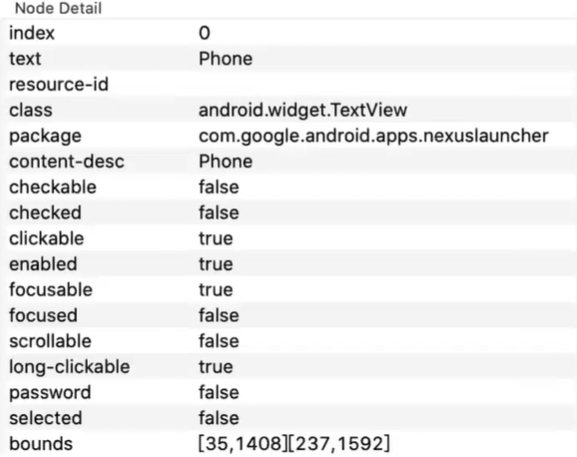
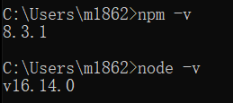

# 1. Android模拟器

## 1.1 emulator

### 1.1.1 emulator介绍

- Android Studio 自带模拟器

- 功能齐全

### 1.1.2 emulator安装：

[需要先搭建Android环境](https://ceshiren.com/t/topic/4001)，步骤如下：

#### step1.安装JDK

- 需要安装1.8版本的JDK，Linux系统通过apt/yum安装openjdk即可，Mac可以通过brew安装，win10的话，可以从学院提供的百度网盘中下载小于200版本的JDK1.8，因为达到200版本在WIn10安装的时候会有闪退的问题

- 安装过程全程默认即可，不需要更改

- 安装完毕后需要配置环境变量：首先是JAVA_HOME，是一个独立的环境变量

    

- 还有path环境变量中需要配置几项：

    ```
    %JAVA_HOME%
    %JAVA_HOME%\bin
    %JAVA_HOME%\jre\bin
    ```

#### step2.安装Android Studio

- [官网下载地址](https://developer.android.google.cn/studio/#downloads)
- 通过官网下载Android Studio对应版本后，直接安装即可
- 电脑配置比较低的同学可以参考下面的链接，只安装sdk。可以的话还是建议按照本帖，安装Android Studio [Appium环境配置（包括Mac 版本 、Windows版本）](https://ceshiren.com/t/topic/18)

**2022版本步骤：**

- 
- 
- 
- 
- 

#### step3.初始化Android环境、安装SDK

- 安装Android Studio之后初次启动的时候会需要进行环境的初始化，安装的时候使用标准安装即可。现在国内可以正常访问dl.google.com这个域名了，所以不用配置特殊手段也可以正常安装SDK等内容

#### SDK默认需要安装的部分

- 在AndroidStudio欢迎界面打开SDKmanager,在SDK Tools目录下按照如下选择进行安装

- 
- 
- 

#### step4.配置环境变量

##### Win

- 在系统变量中新建一个变量，名字为`ANDROID_HOME`，值为电脑SDK的根目录，一般默认安装的路径为`C:\Users\用户名\AppData\Local\Android\Sdk`（用户名为你电脑登录用户的用户名），可以去自己的文件夹下查看具体路径，不要写错
- 修改系统变量中的path变量，添加四条内容,因为可能会有其他软件也带有adb执行文件，未免出现问题，尽量将这四项配置到较靠前的位置

```
%ANDROID_HOME%\emulator
%ANDROID_HOME%\tools
%ANDROID_HOME%\tools\bin
%ANDROID_HOME%\platform-tools
```

##### Linux/Mac

- 在环境变量中配置`ANDROID_HOME`变量，值为SDK的根目录，之后将四个文件夹配置到path变量中，并使用source命令或者重启让配置生效

```
$ANDROID_HOME/emulator
$ANDROID_HOME/platform-tools
$ANDROID_HOME/tools
$ANDROID_HOME/tools/bin
```

#### step5.确认配置是否生效

- 在命令行执行`adb version`,确认没有报错，提示的adb位置是之前所安装的sdk目录下

    

- 在命令行执行`emulator -version`，确认没有报错，并且显示了Android emulator version信息

    

    > win10初次安装检查配置命令emulator -version 报：:ERROR:android/android-emu/android/qt/qt_setup.cpp:28:Qt library not found at …\emulator\lib64\qt\l …的时候在SDK manager卸载 Android Emulator 后重新安装可以解决。

### 1.1.3 [创建Android模拟器](https://ceshiren.com/t/topic/4012)

#### step1.创建模拟设备


#### step2.选择设备尺寸


#### step3.选择手机系统

选完手机尺寸就来到了手机系统选择页面

> 注意！！有的时候这个页面会加载不出来这么多手机系统版本，可以稍等一会，如果还没有出现的话，退出重新再进来，因为列表数据是外网读取的，有时候会有出错等情况。

不要在默认界面中选择系统，切换到X86列表中去选择，如果64位系统可以选择X86_64的镜像，不是的话选择X86即可，建议选择带有Google Apis的镜像，点击镜像名称后方蓝色的download链接下载系统镜像(较大，可能需要比较长的时间)，下载完毕之后就可以使用该镜像去创建虚拟机了。建议优先准备一个6.0版本的镜像

#### step4.设置模拟器

选好所用的镜像之后，就来到了模拟器设置页面，页面顶部AVD Name可以设置模拟器的名字，建议设置一个比较短但是能区别系统版本的名字，这样之后在命令行运行的时候可以比较简单了快捷的通过名字来启动对应的模拟器。除了名字之外，点击下方Show Advanced Settings，展开高级选项，可以配置SD卡的存储大小SD Card,可以将这个容量稍微设置大一些，以免之后安装app的时候容量不足（这些设置之后都可以随意修改，需要再改也可以）


这样就创建好了一个模拟器，模拟器可以通过AVD Manager界面来运行，也可以通过命令行直接运行(需要在环境变量path中配置SDK下的emulator目录)


#### step5.使用命令行启动模拟器

- `emulator @模拟器名字`使用此命令即可直接在命令行启动模拟器，无需打开Android Studio，例如模拟器名字为android6就是用命令`emulator @android6`

    

### 1.1.4 emulator使用


- 查看帮助：`emulator -help`
- 查看模拟器列表：`emulator -list-avds`
- 启动模拟器：`emulator @avd_name`

## 1.2 mumu模拟器

网易出品的Android模拟器，建议下载历史稳定版本。

### 1.2.1 [mumu切换横竖屏](https://ceshiren.com/t/topic/931)

原因：模拟器默认为横屏，只是打开应用时显示为竖屏，uiautomatorviewer识别时，根据分辨率，将app识别为横屏

解决办法：
1、点击mumu模拟器右上角的菜单


2、进入设置中心–>界面设置–>分辨率设置–>自定义
3、修改分辨率为竖屏，eg:宽：720，高：1280


4、保存关闭重启,识别为竖屏

## 1.3 Genymotion

下载地址：https://www.genymotion.com/download/，选择个人版本（暂不推荐）


# 2. app结构讲解


## 2.1 什么是apk

- apk是Android Package的缩写，即Android安装包
- apk文件其实是zip格式，但后缀名被修改为apk

## 2.2 apk包结构


- lib/

- res/
- assets/
- classes(n).dex
- resources.arsc 
- AndroidManifest.xml

## 2.3 app页面结构

### [1] 移动端app分类

- Native App：原生app手机应用程序
- Hybrid App：混合型app手机应用程序
- Web App：基于Web的app手机应用程序

### [2] Native App

- Activity
- Window
- View
- ViewGroup


[3] 查看界面元素

工具：uiautomatorviewer

进入SDK文件夹，在`tools/bin`下的`uiautomatorviewer.bat`，双击就行。本机目录是：*C:\Users\m1862\AppData\Local\Android\Sdk\tools\bin*

> 双击后会自动打开cmd命令运行窗口，使用过程中不要关。
>
> 

左边是通过命令打开的Android Studio窗口，右边是uiautomatorviewer。


整个界面分四个区域：
（1）工作栏区（上）

- 共有4个按钮。从左至右分别用于：打开已保存的布局，获取详细布局，获取简洁布局，保存布局。点击保存，将存储两个文件，一个是图片文件，一个是.uix文件（XML布局结构）。
- 第二按钮（Device Screenshoot uiautomator dump）与第三按钮（Device Screenshoot with Compressed Hierarchy uiautomator dump –compressed）的区别在于，第二按钮把全部布局呈现出来，而第三按钮只呈现有用的控件布局。比如某一Frame存在，但只有装饰功能，那么点击第三按钮时，可能不被呈现。

（2）截图区（左），显示当前屏幕显示的布局图片
（3）布局区（右上）,已XML树的形式，显示控件布局
（4）控件属性区（右下），当点击某一控件时，将显示控件属性

> 通过使用UI Automator Viewer，我们可以在没有代码的情况下，查看控件布局，并获取UI的ID，用于之后的脚本编写。

元素属性：



# 3. adb命令

## 3.1 Android 环境搭建

1. 安装jdk

2. 安装sdk

    > 建议直接安装Android Studio，里面有sdk全套东西。

## 3.2 adb 简介

- Android Debug Bridge（Android调试桥）简称adb
- Android sdk中提供的用于管理模拟器或真机状态的工具
- 命令行工具

### [1] adb组成

采用了客户端-服务器（C/S）模型，包括三个部分：

- 客户端 client
- 服务端 server
- 守护进程 daemon

### [2] 启用adb调试

- 模拟器：不需要手动设置
- 真机：
    - 通过USB连接设备与电脑
    - 安装android手机驱动
    - 设备启用usb调试（开发者选项）

## 3.3 adb 常用命令

### [1] adb命令格式

- `adb [-d|-e|-s <serialNumber>] <command>`
- -d：指定当前唯一通过USB连接的Android设备为命令目标
- -e：指定当前唯一运行的模拟器为命令目标
- -s：指定相应serialNumber号的设备/模拟器为命令目标

> []内命令可选，<>内命令必填

### [2] 查询设备

- 连接模拟器端口：`adb connect 127.0.0.1:xxxx`（xxxx为模拟器的端口）
- 列出已连接的设备：`adb devices`

### [3] 安装卸载应用

- 普通安装：`adb install <apk路径>`
- 覆盖安装：`adb install -r <apk路径>`
- 完全卸载：`adb uninstall <包名>`（包名是应用的唯一Id）
- 保留配置文件：`adb uninstall -k <包名>`

### [4] 设备与电脑传输文件

- 从电脑上传文件至设备：`adb push <电脑路径> <设备路径>`

- 从设备复制文件至电脑：`adb pull <设备路径> <电脑路径>`

### [5] adb shell 命令

- 登录设备shell
- 相当于远程登录了Android系统，可以执行Linux命令
- 直接发出adb shell 命令：
    - `adb [-s serial_number] shell command`
- 交互式shell：
    - `adb [-s serial_number] shell`
    - 要退出交互式shell，请按 `Ctrl + D` 键或输入exit

### [6] 设备截图/录屏

- 截图：`adb shell screencap <设备路径>`
- 录屏：`adb shell screenrecord <设备路径>`

### [7] 调用Activity管理器

Activity 管理器（am）工具发出命令以执行各种系统操作

- 应用：`adb shell am start -n <包名>/<Activity名>`
- 强制停止应用：`adb shell am force-stop <包名>`

### [8] 调用软件包管理器

软件包管理器（pm）工具发出命令，对设备上安装的应用软件包执行操作和查询。

- 显示所有应用：`adb shell pm list packages`
- 只显示系统应用：`adb shell pm list packages -s`
- 只显示第三方应用：`adb shell pm list packages -3`
- 列出所有测试软件包：`adb shell pm list instrumentation`
- 删除与软件包关联的所有数据：`adb shell pm clear <包名>`

### [9]adb shell dumpsys

调用dumpsys，获取在连接的设备上运行的所有系统服务的诊断输出

- 获取前台包名：`adb shell dumpsys activity | grep mFocusedActivity`(windows将grep替换为findstr)
- 检查输人诊断：`adb shell dumpsys input`
- 测试界面性能：`adb shell dumpsys gfxinfo <包名>`
- 检查电池诊断：`adb shell dumpsys batterystats --charged <包名>`
- 查看 CPU 信息：`adb shell dumpsys cpuinfo`
- 查看内存信息：`adb shell dumpsys meminfo`
- 获取内存占用情况统计信息：`adb shell dumpsys procstats --hours 3`

### [10] adb logcat

打印链接设备的log信息

- 屏幕输出日志：`adb logcat`
- 通过标签过滤：`adb logcat -s 标签`
- 显示时间：`adb logcat -v time`
- 输出所有信息：`adb logcat -v long`
- 输出日志到文件：`adb logcat -v time > log.txt`
- 清除旧日志信息：`adb logcat -c`

### [11] adb shell uiautomator

dump 出当前窗口的 UI 布局信息

- 前窗口的 UI 布局简化信息：`adb shell uiautomator dump --compressed`
- 指定输出文件：`adb shell uiautomator dump file <设备路径>`


# 4. app常见bug解析

## 4.1 功能bug

- 内容显示错误
- 功能错误
- 界面显示错乱
- 界面展示后台信息
- 推送信息错误
- 崩溃bug

## 4.2 崩溃bug

## 4.3 性能bug

加载速度慢：

- 应用程序第一次启动速度慢
- 进入到某一个界面加载速度慢
- 启动某一个有动画效果的界面，动画执行过程加载速度慢并且有卡顿
- 响应某一个用户事件时，长时间无响应（ANR）

其他：

- 太占用手机内存
- 太耗电和流量
- 在使用应用的过程中，点击某一个事件进入的页面出现白屏的闪动等


# 5. Appium架构介绍与环境安装

## 5.1 目前mobile自动化解决方案

| iOS                             | Android                         |
| ------------------------------- | ------------------------------- |
| calabash-ios                    | calabash-android                |
| Frank                           | MonkeyTalk                      |
| UIAutomation                    | Robotium                        |
| ios-driver                      | UiAutomator                     |
| KeepltFunctional                | selendroid                      |
| <font color='red'>appium</font> | <font color='red'>appium</font> |

### [1] 自动化工具选择：

|    工具名称     |   被测系统    | 测试 |         脚本语言         | 支持H5 | 跨应用 | 稳定性 |  SDK自带  |
| :-------------: | :-----------: | :--: | :----------------------: | :----: | :----: | :----: | :-------: |
|  MonkeyRunner   |    Android    | 功能 |          Python          |   √    |   ×    |  稳定  |     √     |
| Instrumentation | Android(<4.1) | 功能 |           Java           |   √    |   √    |  稳定  |     ×     |
|  Uiautomator2   | Android(≥4.1) | 功能 |           Java           |   √    |   √    |  稳定  |     √     |
|  Adb-For-Test   | Android(≥4.1) | 功能 |       Java/Python        |   √    |   √    |  稳定  |     ×     |
|     Monkey      |    Android    | 稳定 |           Java           |   ×    |   ×    |  稳定  |     √     |
|       CTS       |    Android    | 兼容 |           Java           |   √    |   √    |  稳定  |     ×     |
|  Uiautomation   |      ios      | 功能 |            JS            |   √    |   √    |  稳定  | xcode自带 |
|    Calabash     |  Android/ios  | 功能 |           Ruby           |   √    |   √    |  一般  |     ×     |
|     Appium      |  Android/ios  | 功能 | Java/Python/JS/C/C#/Perl |   √    |   √    |  一般  |     ×     |

- 单平台测试or多平台测试？
- 是否有多设备同时测试的场景？
- 不局限于测试环境，任何版本任何环境都可以测试？
- 最擅长哪种开发语言？
- 当前市面是否有满足项目需求的测试工具？是否需要二次开发？

## 5.2 appium介绍

- Appium是一个<font color='red'>移动端的自动化测试框架</font>，可用于测试原生应用，移动网页应用和混合应用，且是跨平台的。可用于iOS和Android操作系统。原生应用是指用android或iOS编写的应用，移动网页应用是指网页应用，类似于iOS中safari应用或者Chrome应用或者类似浏览器的应用。混合应用是指一种包裹webview的应用，原生应用网页内容交互性的应用。
- 重要的是Appium是跨平台的。何为跨平台，意思是可以针对不同平台用一套api来编写脚本。
- 推荐Appium
    - 跨语言：Java、Python、nodejs等
    - 跨平台
        - Andoid，iOS 
        - Windows，Mac
    - 底层多引擎可切换
    - 生态丰富，社区强大

## 5.3 appium框架介绍

### [1] Appium的设计理念

- webdriver是基于http协议的，第一连接会建立一个session会话，并通过post发送一个json告知服务端相关测试信息
- Client/Server设计模式
    - 客户端通过WebDriver json wire协议与服务端通讯
    - 多语言支持
- Server可以放在任何地方
- 服务端nodejs开发的HTTP服务
- appium 使用 appium-xcuitest-driver 来测试iPhone设备，其中需要安装facebook出的WDA（webdriver agent）来驱动iOS测试

### [2] Appium 工作引擎

对于Android、iOS底层使用了不同的工作引擎驱动实现自动化测试。

Appium引擎列表：

| Platform | Driver       | Platform Versions | Appium Version | Driver Version |
| -------- | ------------ | ----------------- | -------------- | -------------- |
| ios      | XCUITest     | 9.3+              | 1.6.0+         | All            |
|          | UIAutomation | 8.0 to 9.3        | All            | All            |
| Android  | Espresso     | ?+                | 1.9.0+         | All            |
|          | UiAutomator2 | ?+                | 1.6.0+         | All            |
|          | UiAutomator  | 4.3+              | All            | All            |
| Mac      | Mac          | ?+                | 1.6.4+         | All            |
| Windows  | Windows      | 10+               | 1.6.0+         | All            |

## 5.4 appium环境安装

### [1]Appium生态工具

- adb：android的控制工具，用于获取android的各种数据和控制
- Appium Desktop：内含appium server和inspector的综合工具
- Appium Server：appium的核心工具，命令行工具
- Appium client：各种语言的客户端封装库，用于连接appium server
    - python，java，ruby，robotframework-appium 
- AppCrawler：自动遍历工具

### [2] Appium安装——简化版

[步骤参考](https://ceshiren.com/t/topic/10552)

#### step1.环境安装

- Java 1.8版本（配置环境变量）
- Android SDK（配置环境变量）
- Appium Desktop
- Python3
- Appium python client

#### step2.安装jdk

#### step3.安装sdk

#### step4.Appium Desktop 安装与配置

安装appium desktop（appium server + appium inspector工具）

- 下载对应操作系统的安装包：https://github.com/appium/appium-desktop/releases

- 目前最新版本是1.22.x，推荐大家使用目前较稳定的1.19.1版本

- 最好不要使用太旧的版本，以免出现奇怪的环境问题

- 安装成功后，将Appium地址写127.0.0.1(意思就是要在本地进行访问)

- 端口号：4723

    - 这个值不是固定的，唯一的要求就是——不要冲突，你可以在cmd你查看目前占用的端口号，输入命令：
        - `netstat -ano`：查看所有端口占用；
        - `netstat -ano | findstr “4723”`：查看4723端口号被哪个程序占用

- 启动appium服务

    

- 服务不报错

    

- 在浏览器访问不报错

    

- 服务显示数据请求

    

#### step5.Python3

#### step6.Appium python client

在cmd中使用命令：`pip install appium-python-client`

#### 连接设备

- 先启动MuMu模拟器

- 列出已连接的设备：`adb devices`

    

    - 设备列表下面没有数据就是空的意思，发现并未连接设别。

    - 详细说明

        ​    Ⅰ、device 前面显示的一串字符，表示的我们PC连接上的手机设备的序列号；注意模拟器连接上显示有差别的。

        ​    Ⅱ、device 状态：这个状态表示的是真机或者模拟器已经连接到了adb服务器上，但是并不代表我们已经可以对他们进行操作。

        ​    Ⅲ、offline 状态：表示真机或者模拟器没有连接到adb 服务器 或者是没有响应。

        ​    Ⅳ、no device 状态：这个在我这里是没有显示的，直接是空。从字面就可以理解，没有找到有用的设备。

        >  有些模拟器或者真机在Windows系统下可能直接执行 `adb devices` 时并不能直接连接成功，这时就需要使用命令 **`adb connect 127.0.0.1:port`** 来连接。port根据使用的模拟器来填写。例如，连接mumu模拟器：`adb connect 127.0.0.1:7555`

    目录：C:\Program Files\MuMu\emulator\nemu\vmonitor\bin

    

- 再次运行`adb devices`

    

    【问题】程序报错：daemon not running; starting now at tcp:5037
    【原因】5037端口被占用
    【方法】找出5037端口占用的应用，关闭掉该应用进程
    【解决方案】打开[cmd](https://so.csdn.net/so/search?q=cmd&spm=1001.2101.3001.7020)命令窗口，首先找出占用的应用，则输入如下命令找出占用5037端口的应用
    `netstat -ano | findstr “5037”`

    

    这里是9284占用端口，然后输入`taskkill -f -pid 9284`，可以关闭掉该应用

    

    连接成功：

    

#### 运行测试用例

验证环境是否成功：

1. 首先打开appium desktop，点击start server（不报错）

2. 其次准备一个android设备，真机或者模拟器（推荐mumu模拟器）

3. 模拟器连接到电脑

4. adb devices查看设备是否连接

    如果未连接，先将adb连接到MuMu

    

5. 最后编写测试脚本，运行脚本，不报错

    demo.py

    ```python
    from appium import webdriver
    
    desired_caps = {}
    desired_caps['platformName'] = 'Android'
    desired_caps['platformVersion'] = '6.0'
    desired_caps['deviceName'] = 'emulator-5554'
    # com.android.settings/com.android.settings.Settings
    desired_caps['appPackage'] = 'com.android.settings'
    desired_caps['appActivity'] = 'com.android.settings.Settings'
    
    driver = webdriver.Remote('http://localhost:4723/wd/hub', desired_caps)
    print("启动【设置】应用")
    driver.quit()
    ```

### [3] Appium安装——服务版

- Appium Server 环境信赖

- Java 1.8版本

- Android sdk 

- <font color='red'>Node js（>=10版本），npm（>=6版本）（推荐下载 Node.js 12.x）</font>

    

- Appium Server 

    通过`npm install -g appium`安装appium，验证安装：`appium -v`

    检查appium安装环境问题：`npm install -g appium-doctor`，如果有问题，就在命令行执行：`appium-doctor`

- Python3

- Appium python client

#### 运行测试用例

验证环境是否成功：

1. 首先打开cmd，输入appium

    

2. 其次准备一个android设备，真机或者模拟器（推荐mumu模拟器）

3. 模拟器连接到电脑

4. adb devices检测是否连接

5. 最后编写测试脚本，运行脚本，不报错


# 6. appium用例录制

## 6.1 android 自动化前提依赖

- adb工具
- 模拟器or真机
    - 模拟器：网易mumu（Android 6.0) ，genimotion，或者sdk自带模拟器
    - 真机需要root权限
- Appium Desktop：入门学习工具

## 6.2 appium desktop功能介绍

- UI分析
- 录制用例
- 元素查找测试
- Attach已有的session
- 云测试

## 6.3 利用appium desktop生成用例模板

- 获取app的信息

    

- 配置待测应用的信息（desire capability）

- 导出python语言的用例

- 添加隐式等待增强用例稳定性

